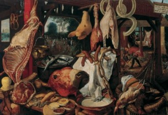

# 肉香

天还没亮，李老头就爬起了床，他看了看还迷糊睡着的老伴，哆哆嗦嗦的下了地，趿拉上鞋，挪到门口喘气，不大一会，儿子大柱也顺着墙根从西屋过来了，爷俩谁也没说话，坐在门口石台上歇息。

李老头看看天，低下头说：“大柱，熬不住了，把剩的那点肉拿出来吧，一会你和锁子把肉吃了，我听见他昨晚上喊饿了，吃了肉，有了力气，你就去东头喊老三过来，我上回和他说好了，快去吧，路上遇见人的话，谁也别搭理。”

大柱没说话，又顺着墙根回去自己屋了，不大一会，锁子便哭了起来：“爹，爹，我也要吃肉……”

李老头站起身，顺着墙根摸到西屋：“大柱，给孩子一些，你个当爹的咋和孩子抢吃的？”

锁子哀哀的哭：“我要吃肉……爹我要吃肉啊……娘……爹，我要娘……”

大柱烦躁的给锁子撕了一点肉：“吃吃吃，就你娘的知道吃，要你娘干啥？你娘去见毛主席了，不回来了。”

李老头咳嗽一声，看看往嘴里塞肉的锁子，又伸手摸了摸锁子的肚子：“乖娃儿，一会就有肉吃了。”

大柱吃完了肉，把手指挨个舔干净，肉可真香啊，大柱不住的回味着肉味，这下反而觉得肚子更饿了，他舀了一瓢水咕咚咕咚喝下去，迟疑地说：“爹，我娘……还睡着？”李老头没说话，往门外挥了挥手，大柱知道这是让他赶紧去东头寻老三。

大柱出了门，顺着街往东走，大街上一个人也没有，寻到老三家，大柱伸出手，在门上轻轻扣了三下，又拍了两把，不大一会，门开了一条缝，等大柱钻进去，门便又关上了。

大柱站在老三家院子里，屋里门窗都掩着，老三招呼大柱赶紧进屋，打开门，呛人的烟便钻了出来，一家人正在吃饭，老三关上门，来到里屋，撬开三块地砖，从里面拿出包好的菜刀，揣在怀里。

老三从里屋出来，大柱正盯着锅台看，从进门起，大柱的眼睛就没离开锅台，锅台破破烂烂的，锅早就没了，上面吊着的是口罐子，罐子里有肉，满屋都是肉香味，烟味再呛人都盖不住，香味飘飘乎乎的，不断的往大柱的鼻子里钻，钻进去揪住他的胃使劲揉捏搅动，大柱记起了自己刚刚吃过肉，他赶紧把手指放进嘴里，嗦吸着似乎还存在的肉香，和着口水使劲的咽，他要把肉的香味全都留下，半点不剩。

老三咳嗽一声，努努嘴，老三家的就放下碗，取过锅盖盖住罐子，把罐子端进了屋里，大柱只好迟疑着缩回手指，回过身来，领着老三出门，往自己家走。

街上还是没什么人，东天上露了点红云，太阳还没出来，俩人一前一后顺着街边走，来到李家的时候，李老头正蹲在门口等着。

老三走进院子，把菜刀从怀里掏出来掂在手上：“二叔，行情涨了。”老三伸出手，一反一正比划了一下：“10斤，不带骨头，我自己选。”

大柱凑上前来：“三哥，这……怎么就涨了呢？不是5斤吗？”老三把刀揣回怀里：“上次是上次，现在涨了，行的话我就干，不行的话就算了，还有两家等着呢。”

李老头缩回到屋门前，蹲下：“老三，咱上回不是说好了吗？你咋这么黑心？”

老三嗬嗬怪笑，他咧着嘴，把刀拽了出来：“二叔，已经抓了两个了，都枪毙了，告示就贴在乡上，叔，不是我老三黑心，我家里还有三个娃，我要是被枪毙了，娃儿们吃啥？”

李老头默默忖了一下：“老三，行咧，10斤就10斤，可有一样，下次就别再涨了，统共也没多少，再涨，我娃儿就熬不下去咧。”

东天上云彩红透了，太阳就要完全升起来了，老三已经走了，大柱撩开和老三家一样破烂的灶洞，吊上煮饭的罐子，把门窗都关紧，又检查了一遍烟囱，烟囱堵得好好的。李老汉在罐子里面放好了肉，添上水，往灶洞里丢了一把柴禾，红红的火苗就冒了出来，爷仨呛的直咳嗽，不大一会，罐子里就咕嘟嘟的开了泡，肉香渐渐飘了出来，四下溢散，香气里一点肉腥味都没有，只有甜丝丝的香味。

好香啊！爷仨被烟呛的眯着眼，使劲盯着罐子，不住的抽动鼻子，咽着口水，等着肉炖熟，炖烂，爷仨嗅着这香味，只觉得越来越香，好在门窗都关的严严的，这满屋的香气，都是他爷仨的，都是他一家人的，谁也抢不走，谁也抢不到。

(采编：张山骁；责编：王卜玄)

[【身后事】当我谈起自杀的时候，我在说什么](/archives/39930)——那是个春天，四月，阳光明媚，草长莺飞。我在院子里，躺在刚刚去世的爷爷的藤椅上。我眯着眼睛望着天空上缓缓移动着的白云，心想，今天真是一个适合自杀的好天气。 [【身后事】扫墓记](/archives/40007)——步入这种地方,几乎必然会想到死亡。死对每个人来说都是平等的吗?我不知道,我只知道墓园是分三六九等的。人活着的时候不平等,死了还是不一样。 [【身后事】死亡的隐退](/archives/40034)——就像电灯的发明驱逐了黑夜，使现代城市变成了不夜之城，医学和仪式的变迁也驱逐了死亡，使大城市恍若变成不死之城。
