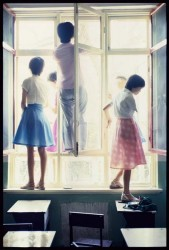
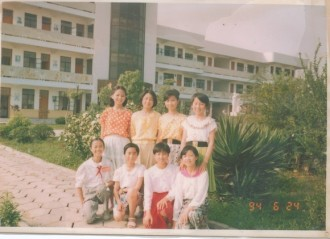

# 三女神

### 黄潇潇

黄潇潇同学打小是个招老师疼的好孩子。小学时她在隔壁班，我常听说她的事迹：冒雨到学校出黑板报，组织去敬老院打扫卫生，并悄悄把偷懒同学的名字记下来。周一的升旗仪式，黄潇潇同学数次登台并发表重要讲话，马尾一甩一甩，像只骄傲的小母鹅。我那时身子弱，每个月至少请一礼拜病假。一次惊动了少先队委，大队委员黄潇潇在一帮中队长小队长的簇拥下来我家慰问，给我补习功课。我不是虚荣么，故意请教黄女神一道奥数题。女神想了半天不会，于是我给她补课。

初中和黄潇潇同班。那时流行一种叫“踏脚裤”的紧身裤，女生一窝蜂地的穿。黄潇潇同学穿得最好看，大概是发育阶段的营养好。做完课间操回教室，男生们都喜欢跟在她身后上楼。我总觉得黑色的踏脚裤比红色的好看，红色的比豹纹好看。很多男生长大后迷恋黑丝，大概就出于踏脚裤情结。

每个男生心中，都有一个又骄傲又美丽的女同学吧。她们成绩优秀，风头出尽，是你妈揍你时的“看看人家”。她们时而楚楚可人，时而刁蛮无理，到处有男生谄媚讨好，偏偏一副谁也瞧不上的神情。青春期的男生，谁没被她告过状；谁没幸灾乐祸地看着她考砸了呜呜的哭；谁没偷瞄她做跳跃运动直到痴呆过去；谁没在课本上画下她的侧影，又匆匆涂抹掉；谁没当着她的面打过架，以炫耀“男人”的武功；谁没恶狠狠地想，以后再也不喜欢她了，第二天又故意在她面前卖弄才情？

青春期的男生最丑。变声，长痘痘，稚气的嘴唇生出小绒毛，爹妈还偏不让刮。最要命的是猥琐。每次看自己那时的照片，都有一头撞死的冲动。女生却个个像含苞欲放的花骨朵，豆蔻梢头二月初。黄潇潇这样的，简直是万千宠爱在一身，一颦一笑牵动无数少男的心。

中考后，黄潇潇进了省重点，继续做她的公主。女生纷纷怀春的季节，黄潇潇却一直情窦未开。或许是高处不胜寒，整个年级的男生都在议论她，却没有人敢表白。高二时，体育委员写了封似是而非的长信，当面对质时却极力否认。黄潇潇觉得很失望，“恋爱”远不如想象中那么美好。此前，她顶多偷偷看几眼红楼梦或张爱玲，憧憬着王子身旁羞涩的脸，爱情如晚霞般绚烂迷人却似乎远在天边。

进了大学，黄潇潇的情窦终于开了。开了也不热身，直奔天雷勾动地火的主题去。人生第一场恋爱便是网恋加异地恋加姐弟恋，不该赶的时髦全赶上了，轰轰烈烈谈了七年。对方很优秀，却是情场高手。刚学会小米加步枪的黄潇潇，迎面一场全方位高科技战争。不败才怪。

七年后，她身心俱疲，体无完肤。有情人终究没能全身而退，只收获了千疮百孔的记忆，以及十年怕井绳的毛病。昔日的满天星，都落进大海里。

前年冬天，黄潇潇同学结婚了，跟初中暗恋她的一个男同学。男同学不出众，对她很好。去年女儿诞生，取名叫子衿。青青子衿，悠悠我心。

### 蒋方方

和蒋方方同学算得上青梅竹马。我爸和他爸是发小，还是两条光棍的时候就曾醉醺醺地订下娃娃亲。小时候常有不怀好意的大人问，“讨方方当媳妇好不好？”我就红了脸，忙说不着急不着急。谁都看得出我很着急。

美好的时光总是转瞬即逝。有一回在她家看《蓝精灵》，争辩了几句阿兹猫是公是母，结果被一脚从床上踢下来。这是平生第一个把我踢下床的女人。

方方同学成绩好，外加擅长演讲和主持，一直深受老师们喜爱。她是个强势的小领导，执政风格强硬，经常和各种不服的男生单挑。眼看着言语管教无效，吩咐手下反锁了教室前后门，讲台前空出一块地，街头霸王一样的互殴。往往以男生哭着回家而告终。只有一次，方方同学败了，前额撞到了粉笔槽，血流了一脸，被送进医务室缝了四针。后来她告诉我，她没哭。

初一那年，方方领导了一场轰轰烈烈的群架。对阵双方都是青春期蠢蠢欲动的小女生。方方挥舞着皮带英勇地冲锋陷阵，仿佛油画中振臂一呼的自由女神，喽喽们也一拥而上，揪头发，扇耳光，扯裙子，把对面那伙女生揍到哭爹喊娘，让一帮观战的男生看傻了眼。

这事闹得挺大，方方为此写了检讨，并被剥夺市三好学生的资格。此后，方方在光荣榜中消失了。穿着一天比一天时髦，成绩一天比一天滑坡。烫头发，戴耳环，穿高跟鞋，还跟镇上一小混混谈上了恋爱。小混混正是当年唯一击败她的男生。每晚放学，混混倚着摩托在校门口等她，两人肆意嬉笑一番，绝尘而去。老师们一声叹息，这孩子废了。

初中毕业，我离开了小镇。方方没考上重点，留在小镇读高中。听说她退出了江湖，又跟小混混做了了断，重新用功读书。无奈拉下的功课太多，再怎么努力，也找不回昔日春风得意的蒋方方。

高考落榜后，方方换了一份又一份工作。几年前她眼光独到，开了小镇第一家婴儿用品店，生意红火，今年又在城里最繁华的地段开了第三家分店。那些断言她废了的老师纷纷说，“早就知道她会有出息。”

小学是她的花样年华，呼风唤雨，万千宠爱于一身；中学是她的草样年华，狠狠跌落在地，迎着一片刺人的眼神，低到尘埃里；走上社会，经历一番阵痛一番磨练，终于找回了自己的舞台，冲天飞去，那是她的鸟样年华。

再次见到方方是在她的婚礼上，多年不见，竟还是小女生的模样，婚纱掩饰不住的美丽。

### 杨花花

杨花花是村里的姑娘，五年级才转来隔壁班，跟黄潇潇同桌。镇上的小孩有着天生的优越感，某厂长家公子就曾教育我，“饿里（我们）街上囡，不跟村里囡一道白相（玩）。”

数学老师是上海女知青，火气很大，一发飙就骂，“侬哪能嘎港额啦？”然后作业本哗哗飞到头上。结果是不管街上囡或村里囡，个个会用上海话骂人。我曾在作文中形容这位女老师“三十如狼四十如虎”，我以为那是坏脾气的意思。然而她很喜欢我和花花，常给我俩开小灶。那应该是我对花花的最初印象。我记得她瘦瘦小小，不爱说话，穿着土气。一次在跟她争论“鸡兔同笼”，我说不过人家，于是愤愤地想，村里囡。

上了初中，依然不在一个班。一个百无聊赖的午后，我在楼梯拐角撞见了花花，才发现她长高了，皮肤也白了许多，却依然是“村里囡”式的害羞。红着脸一低头跑了。

那时我刚结束了人生的第五段暗恋。初恋是青梅竹马的蒋方方同学，直到那天在她家看《蓝精灵》，一言不合，被一脚从床上踢下来。之后有次在校门口被值勤的小姐姐拦住。小姐姐比我高半个头，小胸脯微微隆起，皱着眉问我为什么不戴红领巾，仿佛正义的化身。在她训斥我的时候，我有一种异样的感觉。以后只要是她值勤，我就不戴红领巾。后来她转学了，我只好去喜欢隔壁班的长发妹，一个很温柔很乖巧的女生。我一下课就跑去看她，上课铃响了三分钟才气喘吁吁地跑回自己的座位，异地恋真的很辛苦。一天放学，想着看一眼心上人再回家，结果发现长发妹正用拖把殴打男同学。第四位暗恋的姑娘迟迟不发育，座位从倒数第三排持续推进到正数第一排。第五任是文艺委员，会弹电子琴，还参加过全镇的朗诵比赛。直到一天她红着脸找我，打听另一个男生的生日。正当我一颗春心屡屡碰壁、无比烦恼时候，花花出现了，适时地填补了我的感情空白。

觉得自己差不多算情场老手了，于是乎我苦心制造着各种“巧遇”，没事往花花班里跑，由此还造成其他女青年的误会。有花花在场的时候，我总是十二分不自然，不是大声说着幼稚的笑话，就是和其它男生扭打成一团，仿佛发情的公盘羊。放学了，我背着小书包目送她骑车远去，觉得这样的生活真美好。

那是个暗恋的季节。嘴角刚长出绒毛的男孩子们，有的暗恋发育完善的学姐，有的暗恋年轻的实习女教师，有哥们暗恋圣斗士里的雅典娜，手臂上写着沙织小姐的名字，一下课就在走廊打天马流星拳。更多的，是喜欢一样青涩的情窦初开或未开的女孩。暗恋是和自己谈的恋爱，时而莫名欣喜，时而惊慌失措。我们小心呵护着心中女神的模样，乃至很多年后才明白，迷恋的不过是个完美的影子。这些影子陪伴我们，度过那些单纯寂寞的时光。

三年初中匆匆而过。中考后，花花考上省重点，我到上海读书。我以为会就此忘记她，就像忘记值勤小姐姐、长发妹和文艺委员。谁知破山中贼易，破心中贼难。那个村里囡，今天穿什么衣裳，功课忙不忙？

高考前，花花找我爸填志愿（我爸教高三多年）。我憋红了脸，打电话给我爸，支支吾吾地说，把她留在上海吧。电话那头是笑而不语。花花想学法律，我爸给她的第一志愿填了华东政法，哪晓得被她班主任改成西南政法，理由是上海的高校太热门，把握不大。分数公布，花花以高出华政60分的成绩远赴重庆，我仿佛看到两人从此渐行渐远，尽管最近的距离不过是隔壁班。纠结了一个暑假要不要向她表白，终究还是没说出口。

大学四年，我再也没有见到她。偶尔通一回电话，听她抱怨重庆的阴雨连绵，食堂炒个青菜都放辣子。我有一搭没一搭说着理工科很无聊，打篮球输了，或是又换了妹子。她笑我花心。事实上我找的每个妹子都有点像她，要么是发型，要么是背影。

毕业那晚，我躺在草坪上给她打电话。告诉她这些年的想念。我说这样吧，以后就不喜欢你了。手机那头是泣不成声。校园里弥漫着醉酒的味道，有人大声唱着离别的歌，露水打湿了我的头发。这是我的成人礼。

回想那些漫长的日子，像一场赌石。切开之前，永远不知道石头里藏的是石头还是翡翠。赌，押上最好的年华当筹码，却迟迟不开口，迟迟不肯动那一刀。

即使是一块普通的石头，也陪伴了你那么多年。

三年后，花花结婚了。每年她的生日，我会发条短信：生日快乐。绝不多说一个字。她会回：谢谢你还记得。

我当然记得。

（采编：刘铮；责编：刘铮）

[【过路人】硬派球迷](/archives/38340)——陈总有段时间特别爱找我说话，因为据她说，我是仅有的对她没有非分之想的男球友。 当时我义正言辞地说我身为一个科黑，这是我的信仰，与你共存尚且值得商榷，谈何交配？

[【过路人】鲸](/archives/38273)——一条发声的频率与同类不一样的鲸鱼，注定无法被听见，它一生都在拼命呼唤，期待回音，独自老去。而每个人都是这样一条鲸鱼，我们都没有遇到同类的幸运。

[【过路人】女船长的海](/archives/38422)——当然后来我和我的远房表妹结婚了，我们共同在陆地上生活了45年，从未出过海，并且很相爱。毕竟斐尔玛是大海的情人，而我从来都只是在岸上，我不属于她的国。

[【过路人】逆行的钟](/archives/38452)——这是一篇关于“注定”的文字，每一个生命诞生时都注定了死亡，每一段悲喜经历时都注定了遗忘，每一次爱情萌发时都注定了离散。时间呼啸着穿过我们的身体，我们握不住任何东西。
