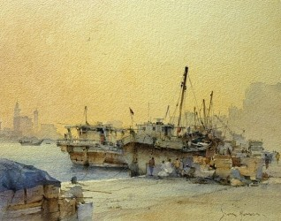
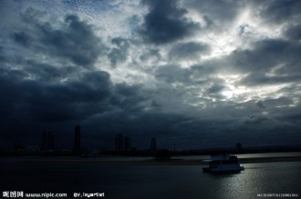

# 女船长的海

当毛线帽和烟斗纠缠起来时，一声船笛刺破黑暗传入我半聋的耳朵。我想起斐尔玛，翻江倒海地想，我想起她脖颈上永远去不掉的海水味儿，她发梢间藏匿的日晒雨淋，还有她唇边纹路里驻扎着的腥甜。

1857年，18岁的我即将和来自平原的远房表妹结婚，她是个可爱的姑娘，雀斑，腼腆，抿着嘴笑。订婚后的夏天我到镇上临时找了份工作，负责在码头为停泊的船只上结。忘了是早晨还是午后，我第一次见到斐尔玛，她插着口袋站在一艘停泊的船边，船身墨绿掉了一圈漆皮，有人喊她她便回头应着什么。后来我知道她是那艘船的船长，船长们都喜欢把船当做自己的情人，亲昵地称呼自己的船为她。我想那船是她的汉子，因为她称呼她的船为他。

后来的每天我都能看见斐尔玛甩着头发从船上骄傲地走下来，她的笑声朗朗还有她头上的太阳。她的船员们像敬仰一位女神那样敬仰着她。和我一起干活的尾巴是个活泼的伙计，夜幕时分总是喜欢远远地喊她：“斐尔玛，这里有美酒、汽水、还有等着你的男人们。月色正美，篝火正旺，一起喝一杯吧！”她就甩掉鞋子，赤脚从沙地上走过来，背对着大海。我望着她，觉得她是海的情人，每当这时尾巴总会重重地拍我的背，“喝你的！”

一天她的绿色小船提前开了回来，挂着请求医疗的信号旗。我拴好船就跑了上去，她发烧了，两个船员让我先照看一下她，他们下船去找药，屋里便只剩下我和她。她烧得很严重，说着胡话，我一点办法也没有，只能握住她的双手，一遍遍说着不要紧的，别害怕。她的声音渐小，我低下头靠近她，呼吸她呼出的热气，像是沸腾了的海面，煮沸了潮湿的空气，时间似乎静止了。只是当那两个船员拿着医药箱进来时，我立刻松开她同时退后了两步。

我不知道斐尔玛发烧的时候记不记事，因为后来的日子完全一如既往，泊船、上岸、狂欢美酒。一个风雨交加的晚上，我和尾巴拴好最后一条船奔回去时，看到她站在灯塔上，出神地望着海平面。我不由地停下来，又往前追赶尾巴，然后又停下来跑回去，却看到她已经跑了下来:“帮我解一下绳结吧。”她冲我说道。我死命地摇头:“风雨太大了，你不能这时候出海。”她没回答我，走向她的船。我紧张地望着她，还好，她只是温柔地抚摸它，一遍又一遍，时而摘下一块墨绿色的漆皮，你知道那场景有多美吗，暴风雨里一个女人抚摸着一条船，衣服全湿透了，身后是发怒的大海和闪电的夜空。我真想走过去抱住她可我没有，只是没料到那是我最后一次见到她。

夏天过后出海的船只就少了，我也便丢了工作，离开了码头。我无法知道她去了哪里，更无法相信她居然抛弃了她的船，这么多年来它都载着斐尔玛在大海的小腹上享受大海给予她的一次次高潮。我最后一次经过那里时，那条墨绿色的船也不见了，我不信它能被卖给别人，船是有记忆的，一条船只能配一个人。当然后来我和我的远房表妹结婚了，我们共同在陆地上生活了45年，从未出过海，并且很相爱。毕竟斐尔玛是大海的情人，而我从来都只是在岸上，我不属于她的国。

采编：刘铮；责编：刘铮

[【过路人】硬派球迷](/archives/38340)——陈总有段时间特别爱找我说话，因为据她说，我是仅有的对她没有非分之想的男球友。 当时我义正言辞地说我身为一个科黑，这是我的信仰，与你共存尚且值得商榷，谈何交配？

[【过路人】鲸](/archives/38273)——条发声的频率与同类不一样的鲸鱼，注定无法被听见，它一生都在拼命呼唤，期待回音，独自老去。而每个人都是这样一条鲸鱼，我们都没有遇到同类的幸运。

[【过路人】三女神](/?p=38362)——青春期的男生最丑。变声，长痘痘，稚气的嘴唇生出小绒毛，爹妈还偏不让刮。最要命的是猥琐。每次看那时照片，都有一头撞死的冲动。女生却个个像含苞欲放的花骨朵，豆蔻梢头二月初。

[【过路人】逆行的钟](/archives/38452)——这是一篇关于“注定”的文字，每一个生命诞生时都注定了死亡，每一段悲喜经历时都注定了遗忘，每一次爱情萌发时都注定了离散。时间呼啸着穿过我们的身体，我们握不住任何东西。
