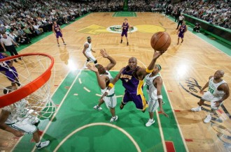
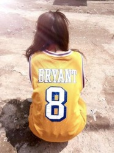
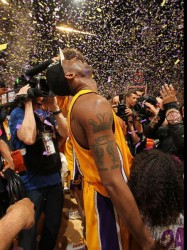

# 硬派球迷

我的朋友陈总十二岁的时候被他的球迷爹带着见证了曼联三连冠，从此以后就喜欢上了篮球。

之所以第一自然段的转折这么奇特，是因为老牌科密陈总是个奇特的人。

举个例子，陈总有次跟我看NBA，瞅着外面四个空位，科比冲队友曰区区顶薪球员何足挂齿科某去去便回，于是一个人杀进低位，咣一声打铁。 

忽然间风云突变，陈总一跃而起，指着三分线外球员们大喊一声：

补扣！

我大惊失色，问陈总这如何补扣。

陈总说，用腰腹。

我说那他妈也不能跳这么远扣啊我操。

陈总说，你看他们都长得跟猩猩似的，你看过人猿泰山吗，人都一跳好几棵树呢。

我只好说陈总我不是那个意思，我只是觉得这样补扣的话不太好算分，容易给人家数据统计员造成一定的困扰。

陈总翘起了两条美腿，撩了一下头发说我也觉得不太好算，那还是别勉强了吧。

对，第二个奇特例子就是，陈总是个女的。

这个年代，女球迷一旦出现，基本就是被男球迷活捉然后供奉起来的路子。尤其是陈总这种能侃的女球迷，尤其是陈总这种黑丝范儿的女球迷，尤其是陈总这种心上有篮球胸口也有篮球的女球迷。

陈总有段时间特别爱找我说话，因为据她说，我是仅有的对她没有非分之想的男球友。

当时我义正言辞地否认，说我是觉得我身为一个科黑，这是我的信仰，与你共存尚且值得商榷，谈何交配？

陈总大怒，晃着两颗篮球指着我说你必须共存，我不管我不管我就是不管。

我说好好好，共存共存，那交配呢？

喜上眉梢的陈总说你夸夸科比我就考虑一下和你交配的事情，你要深情，要真挚，还要引经据典。

我想了下说：

“啪啪啪啪啪啪啪，鹰郡巨侠紫衫湿。”

陈总说你讨厌死了你坏蛋而且一点儿都不押韵。

我说这原来本身就不押韵啊，那我重新说一个？

“好”。

“一花一世界，一球一科比。”

“滚。”

我说那我夸夸你？

“好”。

“一球一科比，两球一个你。”

智商堪忧的陈总笑着说你才是冰激凌呢。

陈总喜欢科比的原因特别简单，因为她前男友喜欢。

不幸的是，他前男友干事儿也有点儿像科比。

比方说出轨。

陈总发现后伤心欲绝，俩月后终于忍不住找我哭诉，眼泪从鹅蛋脸上一直流到乳沟。

我说小陈没事儿咱不哭我介绍器大活儿好的高富帅给你好不好。

她婉拒了我，说非要跟我出去喝一顿，于是当晚非拉着我睡一张床的陈总哭了个地动山摇。

那晚我什么事儿都没干，一是因为科黑科密水火不容，二是因为就算想容，喝多了的她夹着腿嘴还不停地跟我说我想他，女人身上一共就这俩地方能让我干事儿，她还全巧妙地防御了起来。

陈总那天晚上跟我学会了硬派这个词。她让我给硬派下个定义。

我说就是高难度死忠，打游戏你看一般那种打一下就死了的都是硬派游戏。

陈总说那你看我算硬派吗。

我说凭你这身段去演A片应该算硬派，日一下就死了。

然后当场发誓以后要变成硬派的陈总问我说，小唐啊你知道你为什么没女朋友吗。

我说因为我长得丑，不像科比鹰郡人似月皓腕凝碳黑。

陈总说不，因为你不喜欢科比。

我说嘿卧槽你知道为什么你分手吗，因为你喜欢科比，你的人生最后会变成一场群P。

陈总睁着没摘美瞳的眼睛问我说为什么。

我说因为硬派的科比敢一个干五个。

然后她嗷一声吐我一身。 

从那以后陈总就变成了一个硬派科密，连她男朋友的份儿都一起硬了，数据随便就能背出来，在张指导的带领下变成了一个动不动裁判草泥马你行你上啊的女人。

但是我觉得吧，越硬派，她越会想起来她和他的科密男友一起看球的日子，一起在电视前鼓掌大叫，一起在绝杀后拥抱，一起在满场MVP的声音中接吻的日子。

只因为每次一个好球，陈总转过脸想亲，却发现旁边经常是念叨着“哎哟我操还真进了”的我，然后脱下拖鞋砸向电视。

陈总感叹，世界上最远的距离，就是一个好球我还无法和你击掌相庆。

我说不，世界上最远的距离应该是你把科巨侠的球衣当情趣内衣穿，然后你汉子一下就软了。

硬派的陈总总爱和我念叨交易这件事，甚至已经跨界到了足球界。

有一阵子，只会分析胸罩该买多大的她执意要求切尔西用托雷斯换贝克汉姆。

我说你怎么能这么换呢，足球没有这么换的，而且就算能换，你也不要用一个妞换我人生偶像。

陈总说为什么不能换，都是人生赢家。你看一个有钱有冠军长得帅，一个没怎么踢拿着钱就把冠军集齐了。

我说你怎么不用范冰冰换郭德纲呢，都是名角儿。

陈总说，因为这俩都不够硬派，一切交易都只能给硬派。比如说只有乔丹才能单换科比。

我说去你妈的你科巨侠有交易否决权岂能让你如此轻易地换了。

有次陈总心血来潮，非要去浦东机场接我回西安。于是智商奇特的陈总不出意外的当晚就把我拉去杭州玩儿了。

我俩在西湖那个外婆家排了两个小时的队，陈总感叹说这群人都是等着来上科比的吗。

我说那你得数出来105个。

陈总说你他妈能忘了黑科比这事儿吗。

我说黑出了感情一时间放不下啊。

我一直想告诉她，其实我一点儿都不讨厌科比，我早在漫长的黑科时光中和科比结下了深厚的情谊，只有我们高端黑才能黑科比，低端黑敢来，我们就黑回去。

可我一直开不了口，因为这听起来挺像表白的，但我对陈总又没什么意思，所以这事儿最后不了了之。

吃完我俩去西湖遛弯儿，大晴天的晚上月亮照在湖面上，颇有情调的陈总拽着我说她喜欢上个男的，要跟那男的表白，而且还要用古诗词。

我说哎哟陈总你这是科密都要有文化了，来来来给我说哪一句古诗词。

“山有木兮木有枝，心悦君兮知不知。”

我迟疑了一下，问一脸期待的陈总：

小陈，这到底有没有枝？

陈总傻了，问我你说什么呢。

我说山有木兮木有枝，到底你麻痹有没有枝啊？

陈总硬派地拍着腿说我操山有木兮木有枝当然他妈有枝。

我说不是你麻痹的木有枝吗！

硬派的陈总差点儿把我踹下湖里去。

此后漫长的时光里，我和陈总一起观看了许多场湖人的比赛，虽然我大部分的视线都随着时间一起在陈总胸口汹涌的流逝了。

我曾建议陈总赶紧找个男朋友，别一天就跟我们这些汉子混迹，你看你虽然遇人不淑，但是科比这么铁命中率还有百分之四十六，你撒个网命中率肯定也不低。

陈总说那你是说我要把你们男人灌醉了以后上了再好吗，犯规加罚，罚球命中率也高点儿。

我统一说你丫身为一个硬派球迷，确实不应该来些文雅的，就应该直接点。

但我忘记陈总除了是个硬派球迷外，还是个女人。

前阵子陈总告诉我，她要嫁人了。

我们喜闻乐见普天同庆奔走相告，庆祝老大难问题终于解决。

结果正当我准备发表一番感言的时候，她说，你给我说一句你喜欢我我就不嫁了。

我花了小半个小时才明白，原来山里那个木到底有没有枝一点都不重要。

我说你个傻逼我才23岁我跟你玩儿这套干嘛，科黑和科密怎么互相结合。

硬派的陈总说你不是喜欢我吗？我胸大。

我说你胸大我也不喜欢你啊，想逃婚直接说，你看你傻逼了吧，别闹了傻逼咱俩谁跟谁啊你跟我玩儿这套。

然后笑嘻嘻的我就被拉黑了。

从没拉黑过人的陈总最终硬派了一次，和我站在了同一个篮球场上，却发现互为攻防双方。第四节最后5秒，陈总持球，一个回合定胜负。

显然我在最后哨响时刻被陈总干脆利落的隔扣了。

我以为这事儿已经完了，结果还吹了个2+1。

因为二十分钟后陈总给我打来电话，说你给我唱个歌吧，唱你最讨厌的乐队的你最喜欢的歌，就跟你讨厌科比但是还得给81分跪下一样。

我说好。我给你唱个硬派点儿的歌，你体会一下。

“再也没有留恋的斜阳

再也没有倒映的月亮 再也没有醉人的暖风 转眼消散在云烟 那一天那一夜 没有察觉竟已走远 那一天那一夜 从我的故事里走远”

陈总问我，真他妈难听，这是什么歌。我说，西湖。说完我就挂了电话。

我突然想起科比81分的那一天，还在上高中的我以为字幕打错了；我又想起三节六十二分的时候，我以为达拉斯只有四个人在场上；我想起09年10年我们一边下着注一边看着科巨侠虽千人吾往矣。原来硬派的真正定义就是，不管你讨厌他还是喜欢他，你硬是和电视上论坛上的他缠斗了小十年，根本没离开过。

我那时便是如此心情。

我和陈总缠斗了好几年，却从没料到最后蹦出个这样的结果。我曾构思过陈总可能是活活贱死的，也可能是把电视砸了的时候电死的，但从没想到一代硬派球迷居然用如此方式在我的生活里退役，几天后，科比跟腱撕裂。想到我表现得这么对不起我们这么多年的基情，我想打个电话过去安慰一下陈总，可我觉得，硬派的陈总一定不会为这些情啊爱啊伤啊痛啊的难受，毕竟硬派的人总要习惯人们在你的生活里来来往往，有人七进七出在你身上留下上百刀疤，有人一个回合把你斩于马下。就像这么多年和科比操蛋过的人不少，但现在留下来在场上的只有他一个人一样。

而你依旧得站直了，接受MVP的高呼，纵使有时那听起来像是山海般呼啸的嘘声。 

（采编：刘铮；责编：刘铮）

[【过路人】鲸](/archives/38273)——一条发声的频率与同类不一样的鲸鱼，注定无法被听见，它一生都在拼命呼唤，期待回音，独自老去。而每个人都是这样一条鲸鱼，我们都没有遇到同类的幸运。

[【过路人】三女神](/archives/38362)——青春期的男生最丑。变声，长痘痘，稚气的嘴唇生出小绒毛，爹妈还偏不让刮。最要命的是猥琐。每次看那时照片，都有一头撞死的冲动。女生却个个像含苞欲放的花骨朵，豆蔻梢头二月初。

[【过路人】女船长的海](/archives/38422)——当然后来我和我的远房表妹结婚了，我们共同在陆地上生活了45年，从未出过海，并且很相爱。毕竟斐尔玛是大海的情人，而我从来都只是在岸上，我不属于她的国。

[【过路人】逆行的钟](/archives/38452)——这是一篇关于“注定”的文字，每一个生命诞生时都注定了死亡，每一段悲喜经历时都注定了遗忘，每一次爱情萌发时都注定了离散。时间呼啸着穿过我们的身体，我们握不住任何东西。
