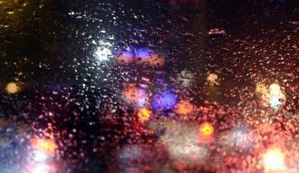

# 鲸

每次坐在车里，看着外面雨下的很大的时候，我都会特别惆怅。我觉得雨量到了一定的程度，就会变成眼泪，使人伤感。但其实不应该，因为雨下的越大，就会有越多的人坐我的车。每一天傍晚，当我看着地铁口的人群像软管爆裂而涌出的水流一样，凶猛的朝外奔走，我就觉得缘分的况味越来越浓，我快速的观察人群中的每一张脸，我知道，这些人中，将有一个人打开我的车门，和我进行一段短暂的相伴。或男或女，或老或少，无论如何，这是缘分，停着的这么多不怀好意的车里，他选择了我，这就是缘分。再短的缘分我都很珍惜，因为在孤独的人生里，一刻的相伴都会闪耀出珍珠的光芒。

而在下雨的时候，这种缘分感就越强烈。不知道为什么，我开始慢慢害怕缘分。直到那一个雨天，她打开了我的车门，坐在副驾上，收起伞，说，银河路514弄37号。

系安全带，我说。

她戴着墨镜的脸向我侧了一侧，将安全带系上。

然后我们就都没有说话。沉默和缘分一样，都是让我又爱又怕的东西。我打开电台，让气氛可以显得不那么压抑。主持人的声音和车外骤密的雨声，并同隐隐的发动机声响，似乎显得非常和谐，路边的树开始摇晃，行人逐渐消失，眼前只有红绿灯，和下一个红绿灯，模模糊糊的，像闪光的蝴蝶停在电线杆上。这一期正讲到夏天，据说民谣吉他的声音能够代表夏天。我将信将疑，这只是因为现在是夏天而已，而与吉他无关。不过，后来我相信了。

车内响起了吉他声：

“我坐在椅子上，看日出复活；我坐在夕阳里，看城市的衰弱。”

“我摘下一片叶子，让它代替我，观察离开后的变化”身边的女人跟着唱道。

“喜欢陈绮贞？”我问。

“以前喜欢，现在不了。”她说。

“为什么？”

“太多的人喜欢了，我就不喜欢了。”

我看不见她的眼神，却能闻到她的发香。天色渐渐暗下来，我打开了近光灯，暴雨变得更加晶莹和美丽。电台里的声音还在缓缓地唱道：别让我飞，将我温柔豢养。

车到了她家楼下，我开了车内的小灯，她一面付钱，一面问：“你明天还在那里么？”

“嗯”我说。

“我还是那个点下班，不要走。”她说。

“嗯”我说。

“还有，这个”她把车前的活性炭玩偶拿起来，说，“我帮你换了它。”

“为什么？”我很不解。

“这是什么？‘一鹿平安’吗？”她问。

“是啊”我说。

“可惜，这是只‘麋鹿’。”说完便笑着离开了，黑色的长发融进了夜色里。

我觉得人有的时候很奇怪。我时常站在阳台上观察对面的楼房，看着夜晚降临时，一盏又一盏的灯熄灭，一盏又一盏的灯又亮起，我的视野里，几十个家庭，几十个人生，几十个故事，同时发生，在这个角落暗下的灯光，总会在另个地方同时点亮，在四楼某户室的哭声中，我同时能看到六楼的某人喝酒庆祝。我这时候深刻的觉察到，我们都是芸芸众生里的一束野草，其实所有发生在我们身上的故事都不是故事，但当我们转过身去，面对身前自己的情书和纪念物时，却总是会忘了这一点，而把自己当做某个芸芸众生之外的特例，比所有人都更为悲伤和敏感的特例。

“胖胖啊胖胖”我对着脸盆里的乌龟说，“明天会不会下雨？”

它双眼乌黑，看着我一动不动。

“胖胖啊胖胖”我继续看着它问，“你孤单不孤单？”

它依旧没有任何反应。

“我提醒你啊胖胖，以前的人呢，都是把你先烤熟了，把你的贝壳掰下来，再问你问题的，如果你下个问题再这样敷衍，我也就不客气了！”

它缓慢的向前爬了两步，脸盆里浅浅的水泛起了波动。

“喂，你说——她有没有男朋友呢？”

胖胖将头缩进了壳里。

第二天雨势依然未减。她如约而至。

收好了伞，系好了安全带，她从包里拿出一个唐老鸭的车载玩偶，撕下底部的贴纸，二话不说的粘在了车前面。

“看，这个，比麋鹿要吉利多了。”她得意的说。

“唐老鸭？怎么吉利了？”我问。

“总之不是麋鹿”她说，“而且人人都认识。”

“人人都认识有什么好的”我说，“一举一动所有人都会知道，不是很麻烦么。”

唐老鸭巨大的脑袋随着车辆的前行一左一右不停地晃动着，像在偷听我们的对话。 和昨天同样的路，同样的树，同样的红绿灯，同样的蝴蝶发出忽明忽暗的亮光，唯一的区别是，这次我没有再放电台。因为我们开始攀谈起来。她是一名服装设计师，从小就对服饰敏感，对路上行人的穿衣搭配和风格，几乎达到过目不忘的地步。以此为职业，也算是实现了童年夙愿。只不过，她分辨人脸似乎有些难度，据说这叫脸盲症。我于是叫她用手机拍下我的样子，多看看，下次就会记住了。她没有照做。

到了她家楼下，我开了车内小灯，她一把捧过我的头，转过去面对她，用隔在墨镜后面的双眼注视着我，我吓了一跳。

过了好久，她说，我记住了，你的样子。

我望着她润泽而柔美的黑发，说，你呢？能不能摘下眼镜。

“不行。”她轻轻的，却又坚定的说。

“为什么？”

“要保持神秘感。”

“什么时候才能摘下？”

“缘分足够的时候。”

“你知道吗？这世上曾经有一条鲸鱼，生了一种疾病，它永远也发不出正常鲸鱼的声音频率，它叫的每一声都无法被同伴听见，从此就和别的鲸鱼失去了联系。可是它并不知道自己有问题，所以一直到死之前，它都拼命的在海中呼唤着，直到最后，都没有一条鲸鱼理睬它。于是它就这样，在孤独的大海里，绝望而痛苦地重复着错误的频率，然后在期待回音的过程中，独自老去。”

第三天的傍晚，我在车上给她讲了这个故事。她一时间没有说话。

人到底在什么时候才会不孤独？如果两个人在一起，是不是就真的不孤独了呢？或许我就是那条频率错误的鲸鱼，或许也不是，因为这个世界上，没有两个人会拥有完全同样的频率。我们一直在猜测和推断中共同生活，然后相拥相爱，但是人们永远都听不到我内心的呼唤，而他们也一样。

我没有询问她的名字，也没有索要她的电话号码，似乎我下意识地预感到，一旦我有办法联系到她，我又将一下子变回孤独。孤独总会在意想不到的时候出现，在它还没有出现的时候，我就不想改变现状，这样，或许它就永远不会出现。但接下去的48小时，我充分体验到了这样做的坏处：这是个双休日。

这两天里，我明白了很多事。比如，胖胖的龟壳上，一共有14个大的格子，裙边上则由39个小碎片组成。剥一只橙子，我最快只需用17秒，而彻底吃完一只橙子，我却需要至少1分钟，肚子还很胀。平均每看一个汉字22秒钟，它就会开始变得陌生。Windows XP操作系统的时间每第4秒到第5秒之间，会过得非常慢。

我拉上窗帘，将房间里的灯开了又关，关了又开，我以为这样就可以提醒地球，赶紧进行昼夜更替。我发现我家的楼下，一共有12个停车位，其中有9个已经被住户买去。这9辆车里，德系车占到了5辆，日系车占到了3辆，剩下一辆这两天始终没有归来，它的车牌号是沪F SN785。我突然觉得观察力敏锐的人，大概内心都很痛苦，就和我现在一样。

我从未如此渴望周一的到来。

周一的天气意外的好。黄昏的时候，一个中年男人打开了车门，我告诉他，我等人。没过多久，一个头发卷曲的中年女人过来，也被我赶走了。这样的人来了六七次，直到天色很暗很暗，我才意识到，她今天不会来了。最后一对父子坐上了我的车，月光清凉，车厢漆黑，父亲对疲惫的儿子说，乖，很快就到家了，妈妈做了好多饭菜。

我注意到路边的树上，叶子居然开始掉落了，可是现在才只有初夏。我告诉自己，那一定是棵很伤心、很伤心的树。

“胖胖啊胖胖，明天，她会出现吗？”

“唐老鸭啊唐老鸭，明天，她会出现吗？”

我的一个朋友曾对我说，如果你开始想念一个人，你就输了。我不是输不起的人，我也不是害怕输的人，只是尽管我输了，我也没觉得她有赢得了什么。我不会告诉她剥完一只橙子需要多久，也不会告诉她唐老鸭到底给了我什么答案。下一次，如果我还见到她，我会像什么事都没有发生一样。若无其事对我来说并不难，因为我已经这样活了二十多年。她消失了两天，在礼拜三的天黑时，她终于又从地铁口走了出来，依然带着象征神秘的墨镜，抬着高昂的头颅，像一个胜利者。她打开车门，坐了进来，系好安全带，说：“银河路514弄37号，谢谢。”

“这两天没有上班？”我问。

“不，我住我男朋友家里”她说。

“今天不住？”

“嗯。”

“为什么？”

“不许问。”

汽车一路飞驰。我知道人们总是把悲伤定义为负面的词汇，但我不，我觉得这是一个好的词，每次这样想着，悲伤的情绪也就不这么明显了。我一直用这个方法安慰自己，在我的这本积极词典里，寂寞、孤单、嫉妒也赫赫在列。我忽然之间明白了她到底赢得了什么：她赢得了存在。她在我脑中留下了美丽又失落的记忆，和不可触及的想象与希望。她就像分了身一样，在我脑中和我各种想法缠斗并且幸存。但是我并没有在她那里留下任何什么。对她来说，我就是一场雨，下过以后，蒸发殆尽，我就不再存在。

其实我根本没有办法若无其事，我的内心始终在发出某种隐秘的频率，从出生到现在，不曾停过。

“为什么？”我又重复的问了一遍。

她沉默了一会，说：“缘分到了。”

“什么意思？”

“你家有人么？今晚我住你家。”她说。

我在路边刹了车，问：“你说什么？”

“我要给你看样东西”她说，“去你家看。”

她的墨镜很深，在夜里更是。

“看，我的头发”我刚打开灯，她就迫不及待地在我面前展示起她的红头发来。

“前两天去染的？”我问。

“是啊，怎么样？”

我看了看，说：“还是黑色漂亮。”

她没好气地扭过头去，问我：“你家里有音响么？”一边说，一边开始寻找，然后翻了一盘CD，播放起来。那是一首西班牙语的舞曲，名叫“quizas，quizas，quizas”。中文意思是，或许，或许，或许。

我记不得当时她是怎么拉起我的手，又是用怎样的语气对我说出“一起跳支舞吧”这六个字。我只记得那天我度过了人生中最美妙的一个夜晚，她终于摘下了她的巨大的墨镜，露出了这个世界上最美丽的眼睛。

当时的我并不知道，这是我最后一次见她。第二天早晨我送她去到地铁口，她跟随着汹涌的人流一同钻入到地铁口去，就是我最后一次对她的印象，她像一个凡人，一个和我没有发生任何故事的人，和她身前身后的所有陌生人一样，在这势不可挡的人群中渐渐消失。之后的很长一段时间里，我依然每天守在那里，当我意识到，她真的再也不会来的时候，我终于学会了不再对胖胖说话。我猜她始终觉得这是一场游戏，并且坚信自己一直是赢家，可是她并不知道，她根本没有胜利，因为我没有留下她任何的联系方式，也不知道她的任何身世。我一直都明白，她也是芸芸众生中最普通的一员，在她的心底，也在用着我们所不了解的频率呼唤着什么。我终于觉得，站在阳台上所望出去的千家万户里，有我的一室一灯。

三个月后的某一天，雨又下的很大。我和女友一起回到家，发现门上用吸盘挂着两个鲸鱼的公仔，一个蓝色，一个红色。它们静静的挂着，也许是在用某种我们都听不见的频率，进行着特别的交流。我把它们摘了下来，送给了我的女友，我相信她能听懂它们的对话。

采编：刘铮；责编：刘铮

[【过路人】硬派球迷](/archives/38340)——陈总有段时间特别爱找我说话，因为据她说，我是仅有的对她没有非分之想的男球友。 当时我义正言辞地说我身为一个科黑，这是我的信仰，与你共存尚且值得商榷，谈何交配？

[【过路人】三女神](/archives/38362)——青春期的男生最丑。变声，长痘痘，稚气的嘴唇生出小绒毛，爹妈还偏不让刮。最要命的是猥琐。每次看那时照片，都有一头撞死的冲动。女生却个个像含苞欲放的花骨朵，豆蔻梢头二月初。

[【过路人】女船长的海](/archives/38422)——当然后来我和我的远房表妹结婚了，我们共同在陆地上生活了45年，从未出过海，并且很相爱。毕竟斐尔玛是大海的情人，而我从来都只是在岸上，我不属于她的国。

[【过路人】逆行的钟](/archives/38452)——这是一篇关于“注定”的文字，每一个生命诞生时都注定了死亡，每一段悲喜经历时都注定了遗忘，每一次爱情萌发时都注定了离散。时间呼啸着穿过我们的身体，我们握不住任何东西。
