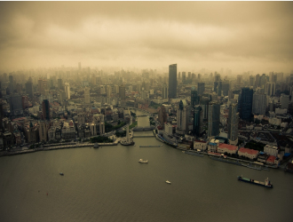

# 饿

凌晨两三点，校对员有点儿饿。头顶上的日光灯影影错错，他也开始晕晕乎乎。那个时候还什么都没发生，他正悠哉悠哉地看一份报纸的副刊。

这一期封面主题是精致的南方带馅小吃，恩，玲珑剔透的烧卖看起来不错，丰满诱人的麻薯似乎也很可口，这个蟹黄馅的包子尝起来是什么味道？他凑近了看，却发现不知道什么时候，那份布满美食的副刊已经不见了。

“吃掉了？！”这个荒唐的念头让他难以置信，舔舔嘴唇，舌尖似乎还有淡淡的油墨香。他大吃一惊，连忙站起来，审视这个空空荡荡只有自己的办公室，不由自主地发抖。

镇定，他下意识地把桌边画图用的三角板含在嘴边，用牙齿紧紧咬着。

嘎吱，嘎吱，这声音在寂静的深夜里是那么清晰刺耳，就像是从他脑中发出的一样。他触电般大叫，嘴中的三角板掉在地上，翻了一个半圈就静静的不动了，而且边上三十度的锐角也不见了，还像被家里小狗调皮啃掉的沙发那样留下一圈难看的咬痕。他呆呆地看着地上的三角板，捡起来，试探性地放进嘴里，嘎吱、嘎吱、嘎吱，没一会，三角板不见了。

还是饿。但像是获得了一种特别的能量，他信心倍增，开始尝试起木制的办公桌。他从办公桌边上的一个角开始慢慢地啃食，木屑从他的嘴边不断掉落，暗红色散发着梨木香的办公桌慢慢的消失在他的嘴边。他满不在乎的擦了擦嘴，感到胳膊的力量比平时要强大许多。

他又尝试沿着桌边的墙开始啃食。由于墙和桌子不同，嘴巴不方便，他恼怒地咆哮着，双拳猛击墙面，没几下，整栋墙就塌了，隔壁房间的同事惊愕的看着他，连救命都来不及呼喊，就被他吞进了肚子里。

告别了被夷为平地的公司，他意犹未尽的走到街道上。天刚蒙蒙亮，不远处传来公鸡悠扬的打鸣声。看着公司门口翻修一新的马路，他摸了摸自己涨得像怀了个篮球场的肚子，艰难地趴在地上，猪拱食般啃吃马路。

吃到一个油漆味很重的红路灯灯柱的时候，他听到一声熟悉的尖叫，回头一看，原来是一个骑电动车的上班族。

“真麻烦。”他嘟哝着，艰难地向那个上班族挪过去，在叫喊声中连车带人塞进嘴里。

打了一个心满意足的饱嗝后，他扭了扭身子，在被他啃了一半的图书馆边上找一个舒服的位置，享受着太阳的味道。

可是身子底下一群蚂蚁一样的小人却在他身边跑来跑去，还带来古怪的大机器发出又大又难听的声音。他噘着嘴，很不乐意地把那一个个味道难闻的小人和机器一起放进嘴里。

在吃完城市里唯一的跨江大桥后，他坐在桥旁边的绿草地上晒太阳。不知过了多久，他惊讶地发现太阳的方向，来了一个和他一样的人。一样的人。左手握着一根电线杆，右手抓着一座肚子里的小人们曾经引以为傲的千年古塔。

“你好啊!”他很高兴，却发现自己发不出声音，喉咙里“咕噜噜”搅拌了几下，发出的只是浑浊的“啊啊啊”。一样的人抬起头，看了看他，举起古塔也“啊啊啊”地挥了挥，又继续埋头啃食。

他又惊讶地发现，在太阳的阴影下，一样的人越来越多，他们“啊啊啊”地大声叫着，缓慢又努力地向他的方向挪动。

经过他的时候，他以为他们会把他带走。结果他们真的把他带走了。但是他们走的时候，边嘟囔着边大力吞咽。

陷入无休止黑暗的他在那一瞬间突然明白，那是在说，他们觉得他和他的城市混在一起的味道，没有想象中那么美味。

** **

   

( 采编：有奖信息公布；**责编**：王卜玄；)

** **
