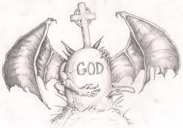
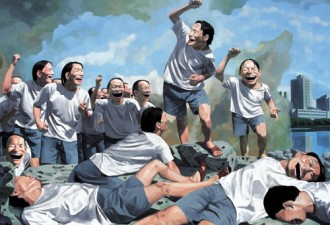
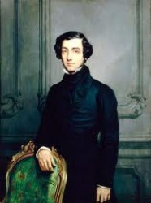

# 宗教还能拯救人吗？

一切要从上帝已死说起。在之前，命运降自神灵，我们就只需要虔诚祈祷和等待，不管神灵是否眷顾，都可以心安理得，不再慌张于命运无常、死之必然，我说的拯救就是这个意思。在现代世界，命运根植于自身。根植于自身那就自己行动，自我救赎，可是凭借什么就成了接下来的问题。

生活与价值之间的关系，其实一直是个问题，也一直磨练着一些最伟大哲人的心智。只不过曾经被上帝的代言人——教士垄断了解释权。随着有关神意秩序的宗教观念的衰落和纯粹人本宇宙观的兴起，我们越来越意识到寻找价值依靠来安放自身的困难。这就引出了我们最关心的问题，传统社会向现代社会转化过程中，社会、价值、人心的正当性基础究竟在何处落脚。正当性基础，可能又对某些读者来说是术语，其实通俗地说就是“当然之理”、“应有之义”源自何处。

社会秩序和价值秩序不再是上帝对于人类的计划中两个结合的严丝合缝的维度，已经成了理性反思的对象。而且，也成了人可以作出设计、进行干预竞争的领域。1789年的法国大革命凸显的暴力给人留下了这种印象，抽象理性可能不能给社会提供一套满意的道德框架，所以从一开始就破坏了所谓社会生活和价值之间原本固定配合的关系。这些在之后的历史也得到了验证，比如鲍曼就坚信大屠杀是现代性本身的后果（严谨地说是选择性亲和）。

法国大革命，是启蒙运动在政治活动层面上的高潮，也可以被认为是现代社会一个开端。思想家、民众都开始在政治观念上开放起来。但是在文化层面，很多还持有了保守的立场。这也就是说思想家们在传统留下的宗教面前，想象力不多，也逃脱不了根植于他们心中的思维方式和话语。我举一个大家喜闻乐见的例子，民主最初的分析师——托克维尔。托克维尔的核心观点概括成一句话就是：改变旧制度，不触动旧信仰。托克维尔细致地比较了法国和美国的民主进程。在他看来，法国的民主没什么意思。民主状态下“平等的奴役”、“多数的暴政”对自由的破坏在法国体现得很明显。而“第一个幸运地避开了专制统治的民族”就是英裔每美国人。美国民主各种好，托克维尔可以讲出一二三四五。比如行政上分权、乡镇自治、自由文化等等。说着说着就说到了自由和宗教的关系：“在法国，我看到宗教精神与自由精神总是背道而驰；而在美国，我却发现两者是紧密结合，共同统治着同一国家的”。宗教虽然在美国不谈自由，但却教导美国人很好地行使自由。法律虽然允许美国人自行决定一切，但宗教却阻止他们想入非非，禁止他们肆意妄为。总之托克维尔通过对美国与法国的比照得出结论：在一个社会中，特别是在现代民主社会状态中，如果社会成员内心宗教信仰不破灭，那么自由就有了依托。“人要是没有信仰，就必然受人奴役；而想要自由，就必须信仰宗教”。

不过，托克维尔本人不信教。据说托克维尔16岁的时候经历了一场精神危机，从此就没恢复过宗教信仰，转而相信，一个人要么生而具有宗教信仰，要么终生与宗教无缘。托克维尔的确是冷静理性的分析者，他不再相信现代人能够人为地向人们心中强行移植一种神圣性的宗教信仰了。所以他只是说：不触动旧信仰。那个时候想建新宗教的人可不少呢，比如既讲实证科学取代了神学形而上学又神神叨叨的孔德。其实他们的这些观点，也是早期欧洲社会经历的转型的一种反应，政治进程变迁先于宗教变迁。文化保守观点伴随着欧洲社会度过转折阶段，历史从湍急到缓慢，直到现在“向某种宗教观念回归”的声音还一直都在。可是，既然不可能人为地另创一套信仰，也不可能人为地保留一种信仰，如果这种信仰业已开始在人心中动摇。

到底发生了什么动摇？传统社会向现代社会的转化，笼统地也可以说成是发生了宗教体系到科学理性体系的转变。从宗教到科学的转变，也就是现代性的转变，是我们至今可见的最大的变化。我不是说现在没人信教，现在信教的人多着呢，有的是人还去教堂，教权还深刻影响着很多国家。宗教比如说基督教就给现代文明留下了巨大的价值遗产，但是由宗教全面控制社会到人的思想的体系已经瓦解了，理性和世俗化是现代的基调。小伙伴们很可能说：“Oh!My God!这不科学。”留着宗教印记，但是完全已经是理性思维了。这正是有趣的地方，也是讨论的前提。

宗教及其道德观已经不足以支撑现代社会秩序的正当性了，这点得到共识。但科学的世界观能否完全取代宗教就有所争议。我从来不认为科学的世界观能取代宗教，意义问题，仍然是宗教问题范畴里的。

首先探讨这个问题还是有必要的：宗教还可以拯救人吗？答案是：谁用谁知道。

社会和个体生活的意义问题仍然是宗教问题，不是科学问题。不过我们说宗教瓦解在于，统一社会的宗教话语权和道德立法权以经不存在了，宗教成为个体性的宗教，从而出现价值领域的多神状况。这也符合韦伯所说祛魅化之后是诸神之战。什么是幸福、美好、人生的终极价值？没有一个客观的、普遍的尺规了。这意味着，社会意义、人生意义等所谓终极问题，被转移到个体的位置上了，个体决定自己的选择。

这就与社会秩序的基础制度摆脱了干系。哪些是社会秩序的基础制度？政治、经济、法律的规则和这些领域中的正当性，是宗教不再能干预和支配的过程了。这是一个现代化的事实，也被认为是维护自由秩序的条件。其实这很好理解，宗教在我们的大多数生活领域中退场了。我们只依靠这些基础领域就可以很好的生活。大多数信教者，往往依赖于他们所处的生活共同体，也就是“生而信教”。

在前现代社会，宗教起着统治社会的功能，它提供元叙述，也就是基本的价值规范；在现代社会，宗教已经没有统一监制，他不存在于结构上，只存在于个人的视野里。

所以在生活实践的层面上，对于宗教，我不得不坚持自由主义的立场。价值多元是现代社会的事实。在形而上的层面上，对于社会和价值关系问题的回答，确实存在着两种立场的，用哲学的语言来说：“有些人继续确立一些应当主导人们的选择和行动的先验原则和目的；另一些人则尽力探讨，在‘上帝已死’的背景下，人的意志具有怎样的创造性潜能和虚无主义笼罩下的潜能。”对于这个问题，谁也无法完全回答。不过我觉得，不要着急，也没法着急，毕竟转变才发生了不久，把二百多年历史和两千多年历史比的话。

（采编：彭程；责编：彭程）

[【遗民】苏联与西方国民经济核算方法的根本性差异](/?p=41320)--死了的毛熊才是好毛熊。但作为国情多少相近的国家，我们同样要进行更深入的改革和转型。在这一过程中的任何阶段，都必须将邻国的教训作为鲜明的反面教材来学习。

[【遗民】江左：我的历史观](/?p=41205)--一生就是一场梦，从明季遗民张岱到民国遗民黄侃，都在梦忆前朝。遭逢离乱内伤的祖国的他们，也唯有看守着属于自己的最后一片精神净土，才葆有些微尊严。
