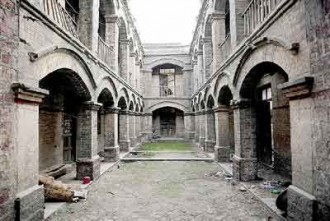
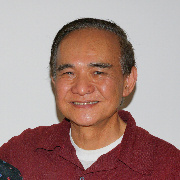

# 江左：我的历史观

Hallie，

多谢你恳切的长信，我很受感动，也代Michelle谢谢你热心的帮助。此外，你的设想很好，我很愿意支持。你的问题也引发我一些思考。关于那些老辈学人的故事，我想先谈几点。

首先是我的动机(drive)本身，还是基于历史感(sense of history)。历史感是什么呢？就是没有东西是断裂的，一切都是永恒的流水。从我自己就读过的学校的校歌来举例吧，福州一中的校歌起始是“闽山苍翠水萦回，美哉伟哉我福中“，中山大学校歌起始是“白云山高，珠江水长。吾校矗立，蔚为国光”（台湾的国立中山大学校歌起始改为“中华文化，源远流长”）。你看，那个时代的校歌都还有“云山苍苍，江水泱泱。先生之风，山高水长。”的意味在，就是历史本身的源远流长。意义何在呢？就在于以过往的古圣先贤、英雄豪杰启迪鼓励后人奋发，荣誉感往往来源于此，所以Alexander the Great读Iliad，MacArthur读Plutarch，意义都在于此。西哲言：“Biology is the best education.” 再以刚刚说的校歌做例子，福州一中的校歌接下去就是“正谊凤池托迹古，此邦人物甲南东。李忠定、俞家军，缅怀壮烈挹高风。鸡鸣风雨同舟切，百千健儿齐起勤勇复公忠。” “俞家军”是指俞大猷的部队，当然是因为抗战的时代背景。“李忠定”就是南宋名臣李纲，其精神不但在于抗金，而且如林则徐的岳父郑大漠诗曰：“吾爱李丞相，经书文章匠。时事不可忘，书生作良将。”其最重要的精神在于这点“书生作良将”的经世致用精神，之后的中国历史上亦有王阳明、胡林翼以及曾国藩等读书种子去出将入相。渊源被暴虐野蛮的强权截断的时候，自然就要有人去存亡断续。

那么为什么偏重民国呢？对于我而言，“中华民国”是一整个文化精神理想价值系统。民国肇建，如胡兰成言，是“新做人家”。那个时代是不割裂传统地向外看，社会也还没有被共产党的极权机制搞得这样原子化，譬如说乡绅阶级还在运作。民国是还存着对旧时代的温情的，哪怕像“胡祸”胡适之先生，大多数时候也是喜欢穿长袍的，而且上学时候也是喜欢在日记里用《离骚》的笔体翻译Robert Browning同Byron的。一直到今天，台湾的政府公文很多时候还是用文言。那个时代的学人，总体来说，在学术上，既有传统的“小学”训练，又真正了解西洋文明的精神；在政治上，是真挚的爱国者，奔赴国难，真正从根本救起，振兴中华；在精神人格上，即是中国传统意义上的君子，又是“文艺复兴式的人物”(Renaissance Man)。一言以蔽之，国家民族的精神人格被共产党“改造”成这个扭曲的鬼样子，我希望能有一个reset bottom，去看看中国人本可以是怎样的堂堂大国民。所以说，我所以为的“存亡断续”，并不是说去复兴什么礼制，而是去复兴那样一种美感、荣誉感以及中西的大视野。

如果用投资的语言来说，用以上的两个principal，就可以去找相对应的niche。这个niche就是龙应台所谓“大江大海”那一代的老台大人。为什么呢？因为吾生也晚，胡适之先生那一辈人肯定是错过了，他们的子侄辈也凋零得差不多了，但是这些不受共产党骗的有真正自由精神的中国学人，在台湾教的最后一批学生，就是五十年代六十年代这一批台大学生。而他们，多是三四十年代出生在大陆，历经抗战、国共内战，随父母逃难来台，到今天也七老八十了。我一贯的想法是，“夫君子者，所过者化，所存者神”，这些前贤的行谊懿范一定会深刻地影响他们的学生的精神气质。每个学生身上，一定都会留下老师精神灵魂的吉光片羽，我如果拜访了足够多的这些大家们的学生，就一定能从这些学生辈的老先生们的精神中去想见他们老师一辈人的精神。太史公曰：“余读孔氏书，想见其为人。” 也是一样的意思。但是同单纯读书不同，你是可以从日常生活中“侍坐”的时候观察体会这些老辈人物的一言一行、举止气度，那又是何其亲切的事情！而且你还可以从每一个小细节当中去模范。伟大一定是一点一滴地累积起来的，就同物种的进化一样，是颇漫长的过程。如果能在这一点一滴上都同这些大家一样，至少可以画鹄不成尚类鹜吧？

我在华府(DC)周边这一块，主要是Rockville, Maryland，见到很多这一辈的老人，纽约对于他们而言太冷了。华府气候适宜些，老同学老朋友又多，也热闹。但我也不是对每个人的关注度都平均的，因为很多人还是会有傲气，对同侪没什么好话的，去拜访他们我往往得很小心，怕得罪他们。毕竟无傲心则为鄙夫，有傲气则不能为君子。所以我只选择了陈一川先生，后来陈先生又介绍我飞到南部去拜谒他的老学长孙志燊教授，也就是微博上的@橡林子 。

陈先生真是蔼然长者，也实在是一位温良恭俭让的君子。孙公则是有豪杰精神的。但是他们二位都天真浪漫，都极诚挚(sincere)。他们教我读的书很多，不一一列举了。有时候陈先生送我大部头，陈太太就在一旁很无奈地摇头，说你们这些老人家不要给江左负担那么重嘛。但是他们的确会想尽可能地把自己的一生所学教给我，“宁把金针度与人”，会与我做竟夕之谈。同孙公一起吃饭会吃上九个小时，倒也是真正的《筵宴篇》(“Symposium”)了。陈先生会教我听歌剧，教我那些咏叹调最适合于表达爱情。孙公都七十八岁了，不但半夜会背着太太开车摸黑带我到海边去，还会拿出他半个世纪前追孙太太时候在宣纸上用小楷写的情书说现在年轻人都不懂得“sugerletter的艺术”。我同Michelle也有很多起起伏伏的时候，陈先生为我着急，居然会翻出他自己半世纪前同陈太太date的时候读的唐君毅先生作的《爱情的福音》。唐先生小书一册，我也是很受益的。你也要想到，他们是怎样挚诚的爱国者呀，但是台湾那么小，威权时代又那么长，半世纪在海外，孩子生长在这里，又走不了，却毕竟不可能影响美国主流社会，当然又不愿意去不自由的中国，就只能同老朋友们相濡以沫。他们多么希望可以有青年人来，可以薪尽火传呀。对于他们来说，青年人就是他们自己的reincarnation，their dreams live on.

譬如说，你问我可以读什么书。陈先生同孙公就会教我他们高中时代读的书，这是让他们一生立身的东西，半个世纪后都记得。很笼统地说，朱光潜先生的《给青年的十二封信》、《谈修养》是教青年人美感；罗家伦先生的《新人生观》、方东美先生的《中国人生哲学概要》是教青年人荣誉感；胡适之先生的《留学日记》、蒋梦麟先生的《西潮》是教青年人要有中西的大视野。

同这些老辈人物接触时候要注意什么呢？我想，还是一定要真诚。我指的真诚还包括你自己是否有大我的人生观，是否有立大志。因为这一辈的人物，都是有极强的忧患意识，有很深沉悠远的历史情怀。譬如陈先生赠书的题辞都是类似于“赠与 有志于振兴中华长期工程建设的江左夷吾学棣”。我有位高中隔壁班同学，现在胡佛研究中心做宋子文材料的整理。她去年平安夜来华府访我，同我说到宋家后人对于他们工作的一些犹疑。我的观点便是这些犹疑本身也来自于像她这样的工作人员并没有一种真正的热忱(zeal)在，并不像项目发起人、她的导师那样真正为宋子文鸣不平，就是少了真正对历史人物的“同情之理解”。

此外，我附上原来我赴台参加中国青年团结会活动时候作讲演时候的讲稿、一些纪行以及陈先生为我赴台的推荐函。《陌生的同龄人》是我幾年前同高中同学聊QQ的记录，所以散漫些，见笑了。这些材料应该能为我以上拉拉杂杂的这一通话做些注解，希望对你能有所帮助。

春绥

Douglas 谨上

Doug，你好！

不好意思，过去一个星期，我在忙着接手一些新的工作，漏掉了你的邮件，抱歉回复晚了。.........................（省略）

另外，还想跟你讨论个问题。前两天跟一个朋友聊天，聊到Chinese这个概念，就想到你在美国为找到reference跟那些老人聊天的经历，我觉得非常有意思，那些人就像是散落在世界各地的中国灵魂，而年轻人想要从他们身上找到自己的根基，或者aspire的身份。我在想能不能写一篇关于这个话题的文章，让大家更好的理解中国人或中华、Chineseness这个概念。可能采取的方式是以你为主角或至少是lead写个feature story。我目前刚萌生这个想法，你怎么看？或者能否推荐一些了解这个话题的入口（比如关注什么人，阅读什么材料，或者思考的路径等）。

盼回复。

祝好，Hallie

Sent from my iPad

（采编：李以诺；责编：彭程）

[【遗民】宗教还能拯救人吗？](/archives/41417)：一切要从上帝已死说起。在之前，命运降自神灵，我们就只需要虔诚祈祷和等待，不管神灵是否眷顾，都可以心安理得，不再慌张于命运无常、死之必然。

[【遗民】苏联与西方国民经济核算方法的根本性差异](/archives/41320)：死了的毛熊才是好毛熊。但作为国情多少相近的国家，我们同样要进行更深入的改革和转型。在这一过程中的任何阶段，都必须将邻国的教训作为鲜明的反面教材来学习。
