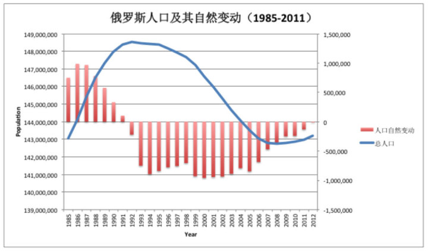
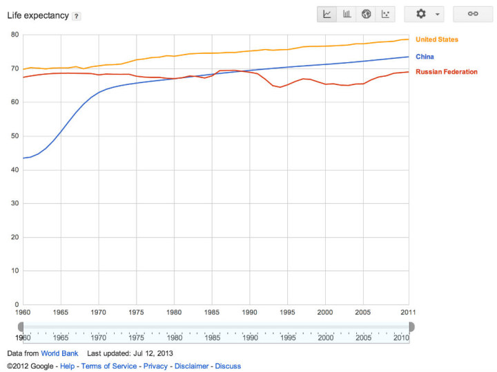
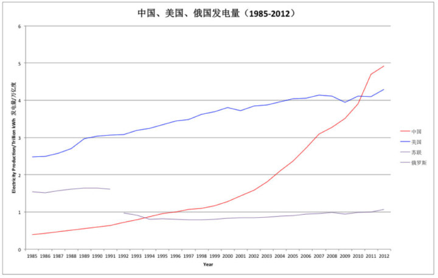

# 苏联与西方国民经济核算方法的根本性差异

读者应该知道这篇文章是对哪件事的回应，我就不废话了。简单地说，争论双方所表现出的水平都惨不忍睹，没有人引用的任何数据是权威可靠的。实际上，所有相关数字都是公开的，应该拿出来以正视听。但我意识到，对这些数据的理解和判读要依赖一些知识，其中有些远非常识。下面做一点说明。

**苏联与西方国民经济核算方法的根本性差异******

首先要明确一点：苏联的国民经济核算体系与西方的完全不同，而二者之间没有公认准确的换算方法。这导致所有关于苏联经济的数字都是估算，而不同的估算之间彼此可能有所差异。

如果用一个数字来度量一个经济体的总量，人们一般首先想到的是GDP（国内生产总值）。GDP是现在通行的联合国国民经济核算体系SNA所规定的一个指标，被几乎所有国家采用。其特点为：

反映所有产业的产值，包括工农业和服务业（第一、二、三产业）；

仅包括最终产品。即剔除了全部中间产品的价值

但GDP并不是一个天然的经济指标，SNA也并非一直有今天的支配地位。苏联和社会主义集团（包括1993年之前的我国）曾采用一种完全不同的方式来核算国民经济，即MPS（物质产品平衡表）体系。在这一体系下，度量经济总量的指标是社会总产品。与SNA体系下的GDP相比，社会总产品指标在上述两个方面都有很大不同。

社会总产品几乎忽略了全部第三产业的产值——根据MPS系统，所有产业部门被分为物质生产部门（包括工农业、运输业及商业）和非物质生产部门（包括文教卫生，住房和公共服务、政府、金融、科技部门）两类。而“社会总产品”被定义为所有物质生产部门的总产值之和。因此，这一指标排除了除部分商业之外的几乎所有第三产业部门。

社会总产品不但包括最终产品，也包括所有中间产品的产值。

不难看出，第一点将导致对经济体量的大幅低估，而第二点则导致了大幅高估。下面简单讨论一下高估或低估的幅度。

在发达国家，第三产业往往占据GDP的70%左右。即使是在被认为第三产业严重不发达的苏联，在八十年代，第三产业产值也估计占整个经济总量的60%左右（剩下的40%工农业各占一半）。

另一方面，一个工业化经济体的中间产值往往与GDP相当，多者则达到两倍以上。例如，2007年，中国GDP（最终产品）为26.6万亿元，而中间产品总值为55.3万亿元，为前者的2.1倍。2002年，美国GDP（最终产品）为10.7万亿美元，中间产品总值则为8.5万亿美元，为前者的80%。（数字分别来自2007年、2002年中国和美国的投入产出表）。

来看一个具体数字。1985年，苏联社会总产值为13825亿卢布，美国GDP为42175亿美元。按卢布对美元汇率0.92，中间产品与最终产品比1：1，第三产业占GDP60%算，可估算得苏联GDP为15899亿美元，即经济规模约为美国的四成。

但现实中的经济是复杂的，严肃的换算当然没有这么简单。

1977年，为解决两大核算体系的兼容性问题，联合国发布了《SNA与MPS体系之比较》，但这本书只是介绍了二者各自的基本原理，大致讨论了其区别和联系。但是，由于两个体系在对经济体系的根本理解、重要基础概念的定义方面有着原则性区别，更由于存在若干无法克服的技术性问题，使得根据社会总产值推算GDP的工作仍然非常困难，有赖于大量的估计。

这些技术性问题包括：计划经济体系下商品价格的扭曲问题；固定汇率制度下卢布对美元的真实汇率问题，等等。

至于两大体系背后所反映的对经济的深层理解之差异，这里就不展开了，非常复杂，远非马克思主义经济学vs西方经济学这么简单。

顺便说一下，苏东剧变之后，各国的国民经济核算都陆续从MPS转向了SNA体系。现在世界上好像只有朝鲜仍然采用MPS体系——这也是为什么世界银行不公布朝鲜GDP的原因之一。

**估算苏联——俄罗斯的（人均）GDP******

** **

由于上述原因，苏联的GDP都是（别人）估算的，而不同组织的估算也彼此有差异。好在把它们一起看，多少能够让人有个概念。

权威的全球宏观经济指标一般由如下三个组织发布：联合国、世界银行、国际货币基金组织。此外，美国中央情报局逐年发布的世界各国基本情况报告里，也有基本的经济统计数字。这些数据库中的GDP和人均GDP数字都是以当年价格计算的，有些也被转化为不变价格以便作纵向比较。

上述这些数据库一般前溯到1960-1980年。更长时段的各国人均收入数据有以下两个来源：美国宾夕法尼亚大学发布的《世界表》(Penn World Table，现在更新到7.1版），以及荷兰格罗宁根大学的英国学者麦迪逊的估算（The Maddison Project）。前者以当年价格计算，后者则以不变价格计算。

下图给出了上述六个数据库对苏联人均GDP（购买力平价，PPP）的估算，继之以俄罗斯的人均GDP——当然这个不必再估算了。再次提请读者注意，前五个指标是基于当年价格，最后一个是基于不变价格。

作为对比，同时给出同一时期世界银行和麦迪逊对我国人均GDP（购买力平价）的估算，由红色粗（虚）线表示。

# 

前五项基于当年价格的估算彼此差不多。它们显示苏联经济从解体前一两年开始下降，在1998年左右跌到谷底，收入水平大约是1990年的一半到六成；2002年左右在名义收入上回到苏联水平，而现在的水平则达到苏联顶峰时期的1.5倍到2倍之间。

但这些估算均基于当年价格，没有扣除通货膨胀影响。基于不变价格的麦迪逊估算则显示，俄罗斯经济直到近两三年来才恢复到苏联的顶峰水平。

与之相比，1980年代末，我国人均GDP约为苏联的十分之一，而目前的人均GDP则达到俄罗斯的一半（根据世界银行的数据），甚至高于俄罗斯（根据麦迪逊的估计）。

以上均为人均数字。由于俄罗斯人口约占苏联的一半，所以世纪之交俄国经济最低谷时的经济总量大约相当于八十年代末苏联水平的三成左右，目前则大致刚恢复苏联顶峰时期的水平。另一方面，我国九十年代初的经济总量约为解体前苏联的三分之一，现在则是俄罗斯的三到四倍。

** **

**如何评价俄罗斯的转型******

俄罗斯的经济在转型后遇到了很大困难，但现在毕竟恢复到了历史最高水平，并在继续增长。由于休克疗法预言了经济会有一段时期的下滑，即“阵痛期“”，所以这也算是意料之中。因此，对转型成效的评价，基本取决于对阵痛期长度的心理预期。如果十年或二十年都可以看作是正常的阵痛，那么俄罗斯的转型就算是成功的。反过来，如果认为转型阵痛长达十年或二十年是不可容忍的，那俄罗斯的转型无疑是个失败。由于心理底线是件很主观的事，所以见仁见智。但至少我们知道，叶利钦的态度倒是很清楚的：盖达尔和丘拜斯都很快被免职了——通常不是褒奖其伟大成就的做法。

话虽如此，稍微客观一些的评价方法还是存在的。就休克疗法这一具体政策而言，简单的评价方法是看看它是否达到了其一开始为自己设定的目标。

宏观指标：休克疗法本来用来是治理恶性通货膨胀和债务危机的。1980年代中期，萨克斯在玻利维亚第一次施行休克疗法，两三年后达到了上述目的。但是在俄罗斯，休克疗法却反而导致了连年的恶性通货膨胀：根据IMF的报告，1992、1993、1994年的CPI分别达到了2520%、840%和224%（与之相比，2007-2008年间我国CPI达到5%-6%，被认为问题严重，大力宏观调控），以及最终发展为1998年国债违约的债务危机（顺便搞垮了华尔街的明星LTCM公司）。无论如何，在这两个方面，休克疗法未能达到其目标。

产业经济：休克疗法期望通过激进的产权和制度变化，淘汰一批缺乏竞争力的企业，大浪淘沙之后，会涌现出一批新的、充满竞争力的企业。然而，经济改革之后，各产业在经历了严重的滑坡后，极少有能够恢复实力、在国际经济舞台上占据一席之地的，有些产业实际上甚至消失了。对此，很难相信改革前苏联的所有产业都没有国际竞争力。直到今天，一般认为俄罗斯经济的支柱仍然是能源等初级产品（其收益约占政府预算的一半）——跟拉美各国差不多。这与俄罗斯的人力和自然资源禀赋是非常不相称的。

社会公正：一步到位的、平均主义的、通过资产证券化推行的私有化方案的本意，是把国有资产公平的分给每个公民。然而，盖达尔、丘拜斯等人，甚至萨克斯本人，都显然未能预见到这一方案最终导致的国有资产快速、巨幅贬值，以及由此带来的国民经济寡头化的后果。国有资产损失之严重，不但在俄罗斯造成了一小撮寡头，甚至连参与改革方案设计和推行的哈佛经济学家Andrei Shleifer都从中分了一杯羹。这件事的影响极其恶劣，以至于美国政府后来都起诉此人——然而最终也没有定罪，赔钱了事。

政治文明：本文谈的是经济，政治就不多说了。无论如何，如果一个国家的总统能用坦克攻击国会；另一个总统当完总统当总理，当完总理再当总统；批评政府的人依然被逮捕——实在是吐槽无力……

由此看来，采用休克疗法的俄罗斯转型显然远未达到其既定目标。

**其他社会经济指标反映的俄罗斯转型******

有人可能认为估算的GDP“鸡的屁”算不了什么，但其他一些社会经济指标也能反映问题。

首先看人口总量，根据wiki引用的俄罗斯政府自己发布的数字。

苏联解体对国家人口的影响立竿见影的体现了出来。从1992年，即解体当年起，俄罗斯人口即开始负增长。在世纪之交的巅峰时期，几乎每年减少一百万人。在整个历史上，除了希特勒和斯大林之外，还没有谁在长期、持续的消灭俄国人方面做得如此富有成效。

再看人民的寿命，直接用Google提供的世界银行数据。

解体后，俄国人口的预期寿命最多下降了5岁之多，导致其在这一关键人类发展指标上被中国反超，更远远被美国甩在后面。

最后再看“克强指数”中的重要指标发电量，这个指标在很大程度上反映了一个国家的真实经济实力，这里引用美国能源信息局以及世界能源年鉴（2011、2012年）的数据。俄罗斯的发电量约占苏联的三分之二；解体后二十年，俄罗斯发电量终于恢复到了苏联的最高水平。与此同时，美国的发电量稳步增长，我国则从约占苏联四分之一的水平增长为俄罗斯的五倍——与GDP所反映出的趋势大致相同。

总之，按照正常的评价国民经济和社会生活的标准，苏联解体以及继之而来的俄罗斯转型，从任何方面看都是灾难性的，不仅仅是对作为国家的俄罗斯而言是这样，对于其绝大多数人民而言也是这样。当然，从我们的角度看，死了的毛熊才是好毛熊。但作为国情多少相近的国家，我们同样要进行更深入的改革和转型。在这一过程中的任何阶段，都必须将邻国的教训作为鲜明的反面教材来学习。

（采编：陈肃；责编：彭程）

[【遗民】江左：我的历史观](/archives/41205)：一生就是一场梦，从明季遗民张岱到民国遗民黄侃，都在梦忆前朝。遭逢离乱内伤的祖国的他们，也唯有看守着属于自己的最后一片精神净土，才葆有些微尊严。

[【遗民】宗教还能拯救人吗？](/archives/41417)：一切要从上帝已死说起。在之前，命运降自神灵，我们就只需要虔诚祈祷和等待，不管神灵是否眷顾，都可以心安理得，不再慌张于命运无常、死之必然。
