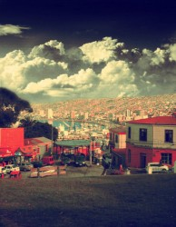

# 不要告别

罗伯特·伯丁顿出生在我们村最乱的一个区，叫做Aranui，直译为阿拉努伊。毒贩横行，暴力滋生，颇有些我国二线城市早年城中村每天出门都能看见对砍的风格。

阿拉努伊好小子罗伯特硬是在这个杂乱纷扰的地方缔造了属于自己的传奇。我当然不是说他有多能打架，也不是说他枪法过人，而是他学习好。

让一群大老粗服你，有两个办法。一是拳头比他们硬，二是脑子比他们快，罗伯特就是靠着全区无敌的学习成绩纵横四方大吃天下。试想，你们一起吃喝嫖赌的人群里有一个清华的，那地位必须就不一样。就算打群架的时候你内心也会冲起一股豪气冲他说：你退退，这帮杂碎我来就行了。

罗伯特就靠着这一个优势，安全地在大麻冰毒光头党环绕的世界中安然度过了自己生命的前十七年半，在低俗的咆哮和一群低龄爸妈的陪伴下上了大学。

我大学申请的依据就是你高中时候攒下的分数点。这颇像是打怪升级，你干掉会考，得到经验值若干，你再得个第一，又得到经验值若干。由于罗伯特的高中实在太差，政府的扶贫加分政策更是给其他人和罗伯特的差距雪上加霜——毕业的时候，罗伯特攒的经验值足够给两个半人上我们专业的。

罗伯特经常说，我不是一个合格的阿拉努伊人，我说为什么，他说，因为我连marijuana都不会拼。

我说我也不会，你没有必要会拼这个，就像我们中国人没有必要知道茴的四种写法一样。

只认识几个汉字的罗伯特问我茴是什么东西。

我说就是检验你汉语厉害不厉害的一种方法，你要会写四个，你就厉害。

罗伯特说原来你们中国不是以谁的爹有钱来判断厉害不厉害。

我说你怎么知道这个。

罗伯特说你学傻了吧你，全世界都知道这个。

罗伯特因为好奇社会主义的面貌，和我结交为好友。一开始对我很是敬重与客气，后来发现社会主义不过尔尔原来不是共产共妻，就开始暴露出真实的面目，再也不矜持，比如说在机房里公然用谷歌图片搜索男性生殖器官一词。

有次我的前女友专程打电话和我吵架，打完后罗伯特问我，你俩为什么吵架。

我说因为我在chinese twitter上关注了我的女同学，

罗伯特说这有什么，又不是你日了你的女同学，她个疯子。

我说她觉得我日了我的女同学。

他感叹说女人真是不可理解，她个疯子。

由于知道中国人喜欢比谁惨，罗伯特就自告奋勇，告诉了我一个他前女友的故事。故事是这样的：

一日，罗生起夜，水尽，只听铃音响起，遂外出接听，却忘记将垫圈降下。女友随后而至，见垫圈高耸，与罗生大吵一架，最终分手，连夜相忘于江湖。

我说只不过是你没放下去坐垫而已，她干嘛要和你分手。

罗伯特说她觉得我侵犯了她的主权意识，是对她女权的挑战。正如政党们都互相看不顺眼，因为只能一党执政，我俩都觉得执政党应该是自己，所以我们就分裂了。她个疯子。他妈的，还是一党专政牛逼。

这一定是体制的问题，我陷入了深深的思考。

 

罗伯特具有黑帮的一切特质，除了学习实在太好。

他还干过黑帮都不敢干的事情，比如说和警车赛车。

外国男人的长相大致分两种，一种十八岁就满脸胡子让你恨不得叫叔，一种三十八岁了还长得跟十八似的。罗伯特属于后者。

生长于淫窝，带着一嘴相当于我国城乡结合部地位口音的罗伯特长着一张十二岁的脸。

罗伯特在自己区里纵横惯了，一次驾车出游遛狗，嫌前面警车开的慢，怒按喇叭，然后超车。

警察估计有生以来没见过这么操蛋的司机，一脚油门和罗伯特并驾齐驱。

罗伯特当机立断踩油门上六档，准备凌驾于司法之上。不料警车配置精良，始终不温不火地和罗伯特并排行驶。

罗伯特一怒之下，在十字路口交通灯变色瞬间怒踩刹车降速，警车驶过绿灯，罗伯特被红灯拦下。警民关系是一条短短的街道，罗比在这头，警察叔叔在那头。

不想警察和罗伯特耗上了，停在前面开始等罗伯特，于是一分钟后再次和罗伯特并驾齐驱。

此时警察终于有空扭头看看我们的阿拉努伊好小子到底长什么样，一扭头警察乐了，示意罗伯特停车。

罗伯特把车窗摇下来喊老子又没违章老子才不停车。

警察说，你成年了吗你就开车。

罗伯特说我21了。

警察回曰哪儿有21长你这样的。

罗伯特说我们阿拉努伊21的都长我这样。

警察一听阿拉努伊，说你靠边停我要查查你车上有没毒品。

十五分钟后，望着罗伯特毫无破绽的身份证，死活不相信罗伯特成年了的警察悄悄问他：你说真话我就不收拾你，你这身份证哪儿买的？

罗伯特说我跟你妈那儿买的。遂局子一日游。

 

罗伯特一生放浪不羁，当然，并不是放浪形骸。

所谓放浪不羁，就是像日本旧时期的浪人一样的感觉。

比如说他因为穿着一身迷彩服，喝多了倒在灌木丛里八个多小时硬是没人发现这事儿。

带有日本血统的白人罗伯特自称武士，说这是他流淌在血液里的情怀，这是继承了他奶奶的基因。

我因为好奇什么样的基因才能养出来罗伯特这种飙风少年，于是就去拜访了一番。

罗奶奶是日本人，特别像日本电影里那些孤独而坚韧的老太太。岁月在皱纹里沉淀了下来，面庞棱角犹如被海风吹出轮廓的石头。

一如形象，罗奶奶沉默寡言到了可以终日不发一言的地步。

我问他你的奶奶是在修禅吗，我听说人修禅以后就特别厉害，一个眼神就能看破世间万物，不需言语。

罗伯特说你别看她那么平静，那只是因为太多的情绪没适当的表情。

我说那不说话也挺高深的，总给我一种若有所思的感觉。

罗伯特说你想多了，我奶奶只是在这边呆了这么些年，日语忘光了，英文也没学会，所以没法儿表达自己的内心。

我说那看上去也心静如湖深如山。

话音刚落罗奶奶掏出一瓶葡萄酒直接吹了。

我一时间失去了言语，只好说她喝酒时候的斜眼真是霸气，好像把世间风尘都甩在了身后。

罗伯特说你还是想得太多，她斜眼的意思是“你个没见过世面的撒逼。”

我觉得中日血海深仇果然还是一时半会儿没法放下。

 

在互相挖苦、互相蹭饭、互相交换CD MP3 AVI文件的过程中，不知不觉我和罗伯特在一起看血腥电影一起砸挂印度人黑人韩国人的日子里度过了两年的时光。

罗伯特有天在喝酒的时候说，我选了岩土工程这条路，就要和你们这些结构工程的人分开了。

我说没事，我们还会见面。

罗伯特说我们要用什么东西来见证一下你我尼克安德鲁维尼伊森们的友谊，Just in case we’ll never meet again.

于是他从书包摸了半天，掏出了一大包我国产的窜天猴。

我说我去你哪来的这玩意？

罗伯特说我去年烟火节买的。

要知道去年烟火节可是一年多以前，也就是这玩意在他包里放了一年没动过。

为什么没动过呢，因为他去摸包的时候，本来找的是大麻，结果摸到了这东西，就灵光一现拿了出来，以前压根就不知道这玩意儿存在过。

我说你他妈快把这放下，这个叫做flying monkeys的东西太响了。

罗伯特说你怎么知道这东西声音大？

我说因为他另一个中文名叫做笛声带响月旅行。为了解释这个名字，我花费了几秒钟翻译为The Moon Odyssey in Whistling

罗伯特说真是诗意，说完就在室内放了一个，我们吓得赶紧躲起来。罗伯特说你们这帮Pussy，在我们阿拉努伊我们都敢在室内放烟花。不过这玩意儿他妈既不Odyssey射程又到不了moon，真是欺骗善良的我。

我说我们中国讲究诗意你懂个屁，这是夸张的修辞手法。另外你们疯了么房子里放，装修这么贵的。

罗伯特说反正是我们撬开门去的a random house，who gives a shit.

我觉得他真是酷毙了。

毕业将近，渐渐我和罗伯特即将走向人生的分离点。

罗伯特要去奥克兰给全世界最大的工程顾问公司干活了，前途光明。又是一次喝酒，大家东倒西歪的时候，我由衷为他终于不用在那个乱糟糟的区里呆着而高兴。

他说我倒是挺舍不得我隔壁那造冰毒的实验室的。

我说啊你隔壁怎么还是冰毒实验室，谁开的？

罗伯特说我高中化学老师。

过了很久，大家全都疯了，乱叫的乱叫，躺倒的躺倒。作为仅有的还算清醒着的两人，我和罗伯特坐去了院子里。

罗伯特问我，你想过你以后的人生吗。

我说这种问题听起来不像是你这样的人会问的嘛，怎么了罗比。

他说也没什么，我就是觉得我以后一辈子就要定性了，我一辈子都会是个工程师，忙忙碌碌，考这个证那个证，一丝不苟地用不倒的地基保卫人们的性命。你呢？

我说我没想好，我连我接下来在哪都不知道，我这辈子都是一个地方又一个地方换来换去，总在认识新的人，总在失去旧的人。我们中国有首歌是这么唱的，注定我要浪迹天涯，怎么会有牵挂。

他说你给我唱这个有个屁用，我又不懂，你给我翻译一下。

我借着酒劲儿想了下，说，大概就是“Exile is my destiny, I can’t be hooked by things earthly.”

罗伯特大笑着说，exile is my destiny，cool.

于是我和他借着海风，把四个tequila shots一饮而尽。

罗伯特说我想听中文歌，感觉特别高级的样子。

我借着酒劲儿就去屋里拿了把吉他，出来翘着二郎腿坐在凳子上。

罗伯特卷了只大麻递给我。

我说我还是抽烟吧，给我根，大麻太难闻。

罗伯特说那行，你赶紧唱，我要入党。

我说好那爹要唱了，你努力感受一下寓意。

_“又是那下雨的时候_

_一人坐在深水码头_

_等待一个环球远航的朋友_

_望着天上飞的海鸥_

_拿着寂寞的香槟酒_

_想听他回来告诉我_

_什么才是自由_

_穿过了南半球_

_在太平洋漂流_

_和海豚一起跳舞_

_冲七米高的浪头_

_等待着那天_

_相见的时间_

_就在这海滩_

_我们醉一晚_

_把酒都喝干_

_快对海鸥说，Good-bye”_

我本来等着罗伯特让我翻译，回头却看见他已经high大get stoned了，随着冰冷的海风歪斜着倒在一把塑料椅子上一动不动。我点上那根他给我的烟，红中带黄的光芒，屋里透出的灯光和远处已经快要看不见的海平线一起，和着空气中弥漫着的大麻味道把星光下的罗伯特映衬得好像阿拉努伊区的界碑一样诗意盎然。

（采编：朱燚；责编：王卜玄）

[【野马】请给我一支兰州](/archives/42079)——我们的董小姐并不需要很漂亮，但一定不能是大众脸，脸上得有一些让人念念不忘的小细节。她的颧骨好似瘦削的山峦，目光就如水一样在当中淌过。

[【野马】神人马占北](/archives/42194)——马占北大概一两岁的时候就来到了这边，他的父亲是回民，母亲是甘肃的汉民，七八岁的时候，他爸爸就被西北军阀马步芳抓了壮丁，不知在哪死了，从此再没见过。

[【野马】老王](/archives/42215)——下午四点钟，闷热，无雨无雷声，我又看到老王。

[【野马】做小姐的女孩儿 ](/archives/42311)----这种坏同学不按老师家长说的来，一定会成为社会的渣滓，人间的败类。虽然我第一次打飞机时面对的是性病图谱，但是瑕不掩瑜，我懂得忏悔，他却执迷不悟。
