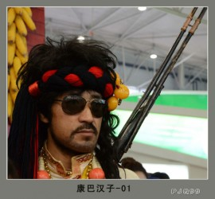

# 神人马占北

大概在二年级的时候，父亲第一次带我去看赛马节。那天我穿上虎皮藏装，还弄了个小腰刀，到了以后发现满地都是白花花的帐篷，却发现最精彩的两个节目骑马捡哈达和骑马打靶都快结束了，接下来是叫“佳昂”的表演，就是表演的人把自己最好的藏装和饰件穿在身上，腰里挂着每家祖传的藏刀绕圈，其实就是土豪给大家炫一下自己的宝物，亮瞎屌丝们的狗眼，节目比较无聊。就在这时候我看见了那个人，他看起来五十多岁，头上绑着康巴红缎子，身体很壮，也身穿着虎皮藏装。腰里挂着很长的一把藏羌刀、带着茶色眼镜、留着大胡子、后面背了一把叉子枪，相当威武霸气。我看着自己的小腰刀和装束，就觉得像霍比特人弗罗多遇到了刚铎王子阿拉贡，我拉着父亲激动的说：“这才是真正的康巴藏族，标准的康巴汉子！”父亲看了一眼说：“哦，这个是马占北呗，禅古那边谁不认识他”。我想了想马占北这个名字好奇葩，听起来就像……“他是个回民，”父亲说道。我的腿当时就软了一下，感觉跟小比利练了几个小时摔跤一样，那是一种什么样的打击我还说不清，想象一下有一天希姆莱指着一个小伙子说：“看，这才是我们高贵的雅利安人”结果发现是个犹太人，大概就跟这个感觉差不多。不过我也很好奇，为什么一个回民穿着藏装参加赛马节，父亲说这就要问你外公了，他俩算比较熟的了，于是在外公家我终于搞清了这个人的来历。（由于找不到他照片，印象中大概就是下图这个感觉）

马占北大概一两岁的时候就来到了这边，他的父亲是回民，母亲是甘肃的汉民，七八岁的时候，他爸爸就被西北军阀马步芳抓了壮丁，不知在哪死球了，从此再没见过。后来他只能和母亲相依为命了，因为各种隔阂，他只能跟回民小孩玩，要知道我们这个地方藏族人口占总人口百分之九十八，那个时代一个单亲小回民在这边生活非常不容易，就像一个巴勒斯坦小孩生活在以色列。直到有一天，外公的一个玩伴发现马占北在山头上念佛珠，外公听说后觉得很奇怪，但也没怎么关注，直到外公有一次去捡牛粪，碰见了马占北，看见他手上绑着一个佛珠，外公就决定跟他坐下来谈人生谈理想，两个人用两种语言混合使用勉强交流，让人回想起了智人第一次和尼安德特人交流的感人场面，马占北跟外公说他已经信了佛教，外公问为什么，马占北说有一次他在山里放羊，不小心滑倒滚下来了，满脸是血。一个僧人把他弄到了家里，给他洗了脸，伤口抹上香灰，还给喝了一碗枣子粥，他就决定信佛了。外公心想这果然是背叛了安拉的回奸，于是以后出去放羊也就找他玩，因为宗教上的认同，渐渐的就跟其他藏民小孩打成一片了，后来马占北穿起了藏袍，说着一口流利的康巴话，但名字没改过，他说这是父亲起的，不能改。因为性格豪爽，也得到了老人的认同，邻居们就经常给他们家送酸奶和青稞面，这让他们母子两度过了艰难的一关，这时候的马占北除了名字就完全是个藏人了。

1958年末，藏族人发动了新中国历史上最大的叛乱，遍及整个藏区，包括青海、甘肃、云南、四川和西藏本土，家乡半数以上的男人都参加了叛军。其实藏族人就这样，哪个地方干仗了，其他部族就得跟着干，谁不干谁懦夫，谁不干谁傻逼。从明朝开始，藏族就爱叛乱，清朝还跟着沙俄和蒙古人叛乱，民国的时候川藏战争叛乱，大家也不要觉得这是什么民族仇恨，只是我们很喜欢叛乱这种酷酷的感觉而已。那年外公十四五岁，由于亲人都去世了，他也就义无反顾地参加了叛军，在叛军聚集点，头人们分发美国空投的武器，外公至今还跟我吐槽说狗日的汤姆逊根本打不准，我想很大原因在于这个呆老头根本不会使用，就在整理编制的时候，马占北也提着一把步枪过来了，外公很奇怪说：“你跟共党有仇？”马占北说没有，外公又说：“那你丫傻逼吧，你没必要跟我们打仗啊……你又不是藏民，况且你家还有个母亲吧。”马占北说：“你们打谁我就打谁，你们是兄弟是亲人。”大家很感动，觉得多了一个陪葬的就收下了，战役一开始，没受过训练的他们虽然勇猛，但不是解放军的对手，很快就打散了，外公跟着小股部队到了四川一带，跟当地叛军打游击，至于马占北，就不知下落了。60年初外公在理塘被俘，但因为年纪小，关了半年就给放了，但并不是所有人都这么幸运，家乡大部分男人再也没有回来，当然，大家也以为马占北死在了战场上。直到62年的时候，外公正在祁连县接受电影放映员培训班的课程，基本成为了藏奸，这时候竟然听说马占北回来了，外公很是激动，接受完培训就立马赶了回来，才知道分开的几年马占北经历了什么。原来在被打散后，马占北被藏北的游击队收下了，走遍了整个藏北（藏北作为无人区跟西伯利亚一样可怕），还见到了康巴叛军的首领山东汉子姜华亭，打了近四年的游击亲手击毙了几个共军。后来听说部队要撤到尼泊尔，马占北就不干了，说实在太远了，老子要回家了，就跟另外一个称多人扎西回来了。大家都没想到，当初参加叛乱，坚持到最后的竟然是一个回民，尼玛就跟日本人投降了多年，一个台湾人衣衫褴褛的回来跟他们说我为天皇尽忠了，这实在是一个巨大的讽刺。大家都夸他牛逼，是康巴汉子！从那以后他的事情受到宣传，听说连邻县的人都很崇敬他，之后马占北因为识字，且藏汉语都非常流利，竟然进了县政府，这期间他娶了一个藏族姑娘，生活安稳，直到文革开始后，一个不知情的汉民官员给他戴高帽，他不知道马占北在当地的人气，你能想象一个脑残跑到五迷群里说阿信是人妖的后果吗？……晚上那个官员就惨遭围殴……即使在那么疯狂的年代，马占北也没受到太大的迫害，文革结束后，马占北就在县政府一直工作到退休，基本上每年的赛马节他都参加。

马占北的母亲在过了几十年安稳日子后在治多去世，去马占北家吊丧的人非常多，全是藏民，马占北今年大概七十多岁，也搬到了西宁，身体依然非常硬朗，还老去寺院干重活，我妈她们那一代见了还都喊马叔叔，队长本人也非常尊敬他。而马占北，早已是藏人社区耳熟能详的康巴回民了。

(采编：朱燚；责编：王卜玄)

[【野马】请给我一支兰州](/archives/42079)——我们的董小姐并不需要很漂亮，但一定不能是大众脸，脸上得有一些让人念念不忘的小细节。她的颧骨好似瘦削的山峦，目光就如水一样在当中淌过。

[【野马】不要告别](/archives/42035)——罗伯特·伯丁顿出生在我们村最乱的一个区，叫做Aranui，直译为阿拉努伊。

[【野马】老王](/archives/42215)——下午四点钟，闷热，无雨无雷声，我又看到老王。

[【野马】做小姐的女孩儿 ](/archives/42311)----这种坏同学不按老师家长说的来，一定会成为社会的渣滓，人间的败类。虽然我第一次打飞机时面对的是性病图谱，但是瑕不掩瑜，我懂得忏悔，他却执迷不悟。
