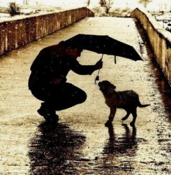

# 老王

下午四点钟，闷热，无雨无雷声，我又看到老王。

人与动物相像。有的人像老虎，有的像羊，另有似鹿、马、猪，甚至像昆虫的也不在少数。老王像河马，一匹大河马，黑着脸，架一副圆眼镜。他没有河马可爱，却比河马深沉，胯下一辆摩托，红色大摩托慢悠悠咕咕响，摇摇晃晃拐入羊肠甬道，深深不见底。

老王与我不算熟，点头之交，经常擦肩，上个礼拜撞见他街边遛狗，一只巨犬随老王步伐摇摆，狗与人皆罗圈腿，路上行人侧目闭目受惊皱眉，老王不管不理亦不问，径直走走停停，与狗同行，仿佛不亦乐乎。

老王家在街旁村落，红瓦，黑瓦参差不齐，路面时常泥泞，几次见到他揣一脚泥对着墙来回搓，笨拙的跳过大小不一的水坑，像极了河马沉默的潜伏于泥坑中突兀跳跃。村里该有的都有，没有的俱无。这句废话也像这个破废的村子，无聊却生机勃勃。门市部，体彩，卖米买油的作坊，几间狭小的洗头房，白天闭门，夜晚张灯，红灯。破门，烂砖，老瓦，锈栏杆，洗车店外光着膀的小青年，胡同口上站着穿睡衣摇蒲扇乘凉的肥女人、老婆子。

某天下午，我将车停在路边门市部去给手机充值，老王也在，嘬着瓶啤酒跷二郎腿发抖，两个女人狂声闲聊，甲女烫一头小卷，赤黄干燥发质如乱蓬蓬干柴，乙女肥腰肥腚肥胸脯昂首挺胸手舞足蹈，甲说：“天太热了，天太不要脸也不下个雨，老娘的奶子都长痱子了。”乙说：“呀！你穿的内衣不好吧，肯定是在市场买的。”甲说：“你的奶子这么大没长痱子吗？是不是穿背心透气啊？”乙女顺势撩起上衣喊：“我根本没穿。”一对肥乳上下齐飞，震动周围的我，门市部老板与玩耍的孩子，我们齐刷刷诧异囧囧，唯老王露一脸憨笑，打了个哈欠，像河马呲一口坏牙，吧唧吧唧嘴。

我第一次见老王时，他骑着一辆蓝色坤车，配合老王大身躯极勉强。老王骑车，双腿几乎劈到极致，从后面看像只螃蟹，横着骑，张牙舞爪。真担心两侧过往的各类车辆会将老王的腿刮折，而老王不怕，他倒不是不怕，他根本就没意识到这样骑车的危险。如此看，老王该是没有亲人吧，这些年，从未见过他与别人同行。人与人照面随着缘，人与人的关注随着因果，我与老王之间的缘分与因果该很深。

记不得哪年哪天中午，太阳毒辣，天空灰蒙蒙，空气沉着有力将人一层层包裹，我揣着相机寻找“决定性瞬间”，远远看见路的尽头一个光着膀子的大胖子骑着辆蓝色坤车夸张摆腿，我举着相机连拍三张，待我放下相机的一瞬，大胖子猛然向一侧倒下，人与车 砸到地上，掀起尘土，回响出一串车铃声，我急匆匆跑过去，确是老王无疑，鼻血顺流至地面，与尘土混为朱红色，人浑身颤抖，口吐白沫，长舌伸出贴着腮，我强作镇定，周围四下无行人，偶尔疾驰而过的车飞快急速，扬起尘土，落到我与老王的头上，我在尘雾中眼巴巴看着老王的鼻血与嘴边白沫上覆着薄薄黄膜，蓦然自觉，狠掐老王人中，不顾手上的血与白沫，终于，老王的舌头渐渐缩入口中，眼睛从狰狞回归无神，再终于叹了口气，我将手在土上搓了搓，自兜里掏出纸巾递给老王，老王接过去也没说什么，擦完嘴，喊了句：“操！”起身拍拍屁股，扶起车子，骑上就走了。

老王养了许多只狗，也许是街边流浪狗，隔一段时间他身边的狗就换了，再没多久就又回来，老王遛狗从不牵引，任狗乱跑，他自在前面走，狗四处游荡，忽聚忽散，人说物我两忘，而老王是人狗两忘。

傍晚的街上，车少人多，确切说车几乎无，人非常少。许是老王暗藏在村里的屋里枯坐，一盏灯，一屋子猫与狗，猫狗时不时离散外出寻食，时而回老王这里休养生息，有的一瘸一拐被打残，有的消失不再回来，仍有新的来，旧的去。就像街边的妓女，常常换，常常新，都是流离的人与狗，迥异于居家的人与宠物罢了。

我对老王没有多大兴趣，这么一个老胖男人，引不起什么兴趣，可是老王像是一条线索，串起了这条街上荒废的人与景，我时时遇见他，可见他很是赋闲，街上人流传着他的八卦，门市部的小老板说他不是本地人，大肥女人米店老板娘说他是个神经病，上次在门市部那位撩自己上衣的大乳娘说老王在江苏欠了一屁股债躲到此处逃难避祸。综上所述，老王是个神秘的寡人，是个孤家。

天还是闷热，此时头顶风扇旋转，身体粘黏，腿紧贴裤子，裤子紧贴椅子，一阵阵烦躁湿热上涌，我决定出去走走，外面比屋里凉，又是这条烂街，又是老王，依旧赤膊摇晃，一副巨胖躯体，一张河马脸。我叫住他，说：“见年前，你摔在地上，我掐你人中将你救醒，你起身后却说了声操就走了。”我笑着用气声扭着腔说出这一串话，老王扶了扶眼镜，回了句：“怎么。”我说：“没怎么，你是江苏人吗？”老王说：“是。怎么。”我说：“没怎么。你欠了一屁股债吗？”老王回：“是又怎么。”我说：“你再这么说我怀疑你是个精神病。”老王还是回：“是。怎么了？”这时天空响起一声雷，轰的一声，大于瓢泼，我与老王立在破街中央，任雨水猛泼，亦不回首，非怒目相视，也非含情脉脉，只是看着，忽然一群狗从胡同中窜出来冲着老王转圈狂吠，老王也不看，我也强作镇定，呆若木鸡，寸步不能移，终于，老王说：“一九八九年的雨比现在大得多，我是江苏人，欠了政府的债，家人的债，亲朋的情。那年我以状元身进京求学，赶上这场运动，学业中断，认了一滩滩鲜血，识了一场场苦难，回故乡，失魂又落魄。无奈再无奈，家人相继死，亲朋各自离，我来此图个清静，与你有个鸟关系，年轻人，你快滚吧！”

天意天意，瞬间天放晴明朗，云动，风来，我看着老王那张大长脸，用力扭头回身归家，家里的电扇仍然转着圈，我顾不上换下湿漉漉的衣裳，伴着一声声犬吠，写下老王的故事，心里很不是滋味……

(采编：朱燚；责编：王卜玄)

[【野马】请给我一支兰州](/archives/42079)——我们的董小姐并不需要很漂亮，但一定不能是大众脸，脸上得有一些让人念念不忘的小细节。她的颧骨好似瘦削的山峦，目光就如水一样在当中淌过。

[【野马】不要告别](/archives/42035)——罗伯特·伯丁顿出生在我们村最乱的一个区，叫做Aranui，直译为阿拉努伊。

[【野马】神人马占北](/archives/42194)——马占北大概一两岁的时候就来到了这边，他的父亲是回民，母亲是甘肃的汉民，七八岁的时候，他爸爸就被西北军阀马步芳抓了壮丁，不知在哪死了，从此再没见过。

[【野马】做小姐的女孩儿 ](/archives/42311)----这种坏同学不按老师家长说的来，一定会成为社会的渣滓，人间的败类。虽然我第一次打飞机时面对的是性病图谱，但是瑕不掩瑜，我懂得忏悔，他却执迷不悟。
