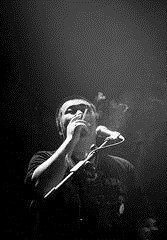

# 请给我一支兰州

你们肯定都知道我为什么写这个故事。

嘘。

老韩刚来广州那会，董小姐还没有烂大街。他抱着吉他摇头晃脑给我来了一首，说是献给我，抵上这个月借住我家的房租。“别瞎逼逼唱了，我给你找来一头野马。”我摁熄手里的烟，去给我们的董小姐开门。

和所有民谣狗的女神一样，我们的董小姐并不需要很漂亮，但一定不能是大众脸，脸上得有一些让人念念不忘的小细节。她的颧骨好似瘦削的山峦，目光就如水一样在当中淌过。我时常忍不住痴痴看她，然后告诉她，我觉得你的脸上有万水千山的迷人，只恨我却不能操你。

所以我改成用语言来实现对她的欲望，每次的形容都有迭出的新花样。

每一次她都说，呸。

对了，我们的董小姐不姓董，不过我们还是喊她董小姐吧，让她曾经爱得成了傻逼的那个男人姓董。

“这是你上次说要给我介绍约炮的那个兰州小哥吗？”董小姐坐下来，手法娴熟地点起烟。老韩看起来有点局促，手放在吉他上也不是，不放也不是。其实董小姐也是个局促的人，每次见陌生人她都会点烟，摆出一副要问候对方全家的阵势，其实按打火机的手指都在颤抖。

“不是那个。这是老韩。”我把她手里的打火机拿过来，给她点上。老韩有点发愣。“来老韩，笑一个。”老韩终于不情不愿地咧开嘴，露出他的大白牙。

那个下午仿佛就定格在老韩一口灿烂的白牙上。

如果生活也能像老韩的牙齿，洁白、坚硬，一口咬断过去就好了。

我跟董小姐相识在高二开学的那年秋天，那时候我们好像都没什么过去，后来上了大学，不知怎么的，几年就好像过完了前半辈子。

我还记得很清楚，考一模前的那个晚上，董小姐来我宿舍和我挤一张床。那晚有大雷雨，她是美术生，她说反正你成绩好，陪我聊一晚上，明天随便考考。她焦躁地给我讲她在外学画时认识的那个老师，他们差一点就做爱了，可是她正在例假。“我特别想知道做爱是什么样子的”，她把脸埋在我颈窝，我心不在焉地听她低声絮絮，手里不住抚摸她顺滑的长发，周遭都充盈着年轻女孩肉体的气味。单人床上的窗漏进来一些光亮，倾泻到她的发丝上就凝成一种非常稠厚的质感，软软地荡漾着，化不开来。我从来没有和同龄的女孩这么亲近过，她的长发黑得惊人，上面明晃晃的光一下子涌到了我的胸腔里，撞得我心脏发烫。

十七八岁的女孩真是一种惊人的造物， 我撩起她的宽松的校服下摆开始抚摸她的颈项，后背，腰肢，异乎寻常光洁的肌肤，从指间传来的腰肢陡窄的线条能一下子扼住呼吸。她还在低语，我开始找寻她的嘴唇。不要让她再讲该死的男人了，那些俗气的、令人生厌的动物，根本不应该来破坏这个绝妙的时刻。她没有拒绝。我们闭着眼睛，开始接吻。这种感觉如此笨拙，她的手缠上我的背，想要贴紧些，我们的胸部挤在一起，却根本没法消弭这最后的微末距离。

我们无限亲密，又很疏离，我只恨不得将她吮吸、融到我的身体里来，手上全是冰块一样的触感，和男人灼热的身体全然不同，恍如抚摸并且亲吻着我自己。我对她狂热的爱欲，仿佛是对我本身狂热的自恋。

作为女人去爱一个女人，大约是世上最美妙的事了。世界与本体融合在一起，堕入无穷无尽的狂恋漩涡，在潮湿的喘息里目见极致的美，女人丰饶如粮仓又苍凉如沙丘的乳房，竖琴一样的肋骨，窄长的肚脐如同流泪的眼，长长的、长长的腿犹如通往永恒的桥……

可惜董小姐始终没有明白这一点。高考以后，她就跟老董在一起了。那个暑假，她告诉我，每天他们都在一起。她让老董脱光衣服给她当裸模写生，他不干，说要她也脱了才公平，于是他们赤裸的身体相互对峙，她的笔触沙沙砥砺画纸，直到他过来，把她的画纸揉成一团，再拦腰抱着她扔到床上。她开始歇斯底里地尖叫，他们不要命地做爱。

她告诉我，现在终于明白做爱是什么样子的了，“就像是坐在一个没有顶盖也没有窗玻璃的汽车里在海上猛开，你想喊却喊不出来，最后只好撕破喉咙尖叫，然后跳到海里，叫声变成咕嘟咕嘟的气泡，一大群彩色鱼懒洋洋游过来，你感到脸上全是眼泪”。我不愿意仔细听她讲，只是呆呆地看着她的乌黑长发中间那段分界，青中泛白的头皮，极其干净、一丝不苟，像某种易碎的瓷器，敲一敲会有空灵的回响。我想，那个男人脏兮兮的的手掌，会抚摸这段头皮吗，就像是恶狠狠的践踏，逼近无限洁净的女性肉体。想到这里，我简直要恨出眼泪来。却又蓦然听见她语气恍惚地说，“每次和他一起的高潮，我都会掉眼泪。”

后来董小姐提起老董，总是一脸轻蔑，说要不是他能连续做两个小时，我才不会傻逼兮兮地一直忘不了。

多数人的所谓爱情不过是用爱来粉饰性，他们是幸运的。有的人却偏偏要用性来掩饰爱，总也不肯承认那是让人疼痛不堪的爱情。我们的董小姐，就是后面这种倒霉鬼。

高中毕业以后，老董去了兰州读大学，而董小姐留在了广州读美术。好几次，她找假期打算坐飞机回家的同学借学生证，买到兰州的硬座票，三十六个小时。就这样反复折腾快三年，俩人终于分手。那是大三的时候，董小姐开始忙着准备毕业设计，学期中没能腾出时间去看他，后来他干脆地告诉她，他喜欢了一个女孩，在学校的图书馆里几见钟情。

“我只是接受不了这么俗气的结局，并不是不能接受分手这件事本身”，董小姐来找我喝酒的时候，反复强调。我给她在加了冰块的杯子里满上伏特加，柠檬味，像洗洁精水。一杯下去，她坐在地板上，像她描述过的高潮那样歇斯底里地掉眼泪。“烟。我操。烟。”我翻她包，摸出来一包兰州。她身上滚烫，因为酒精而不停哆嗦，我给她点上火。烟雾缭绕，不知道是不是她忘不了的味道。

后来我看着她瘫睡在地板上，眼泪挟了融妆爬过苍白的脸庞，她的皮肤还没有一丝皱纹，却已经刻满了看不见的痛苦。很多年前我见过一句话，大意是我们都是只有一只翅膀的鸟，拥抱对方才能飞翔。现在想想，谁又能飞得起来呢，我们不过像是两条丧家狗，在破败的生活里彼此舔舐。

我想，董小姐还是需要一个新的男人。

所以我让她和老韩合租。董小姐在一家动画公司当美工，每周上六天班，月薪两千八，老韩给一家广告公司当设计师，薪水大约要比她高上一些，常常把活带回家做到一两点。他们租在了老城区的深巷里，老式居民楼，租金不怎么贵，楼下有档远近驰名的牛三星，路口拐个弯是烧腊店，对面有好几家开到凌晨四点的大排档。

老韩有个念念不忘的女神，一年前去了英国念硕士，他给我看过照片，皮肤白皙，戴着一顶绒线小红帽，笑容干干净净。而董小姐还是只抽兰州。不过生活无非是那么点事，董小姐有时候深夜帮着老韩改设计，老韩有时候周六早点爬起来煮好两人份的早餐，两个不是没有故事的男女同学顺理成章地开始牵着手去吃宵夜，排队喝那档出名的牛三星汤，周日一起去烧腊店斩料带回家吃。

我总觉得，我们对生活的所有执念最终都是要流散成人间烟火的。所以趁着年轻，才要拼命执着。后来我试着找了两任女友，一个有着油光水滑的黑长发，一个有着好似随时要被晒伤的高颧骨。不过她们都没有当年的董小姐年轻，也没有她美丽，说到底，我好像再也找不到那时候在董小姐身上看见的自己的倒影。那种深潭水影般的惊艳，再也打捞不回来。

就这样过了快一年，租约差不多要到期。董小姐打电话告诉我，她刚刚去面试得到了一个重点中学美术老师的教职，不知道要不要搬走。“可是我是真舍不得这里的牛三星啊，还有大排档的砂锅粥，你不知道，我都胖了好多”。我什么都知道，她舍不得的恐怕还是陪她吃这些的那个人。

过了几天，老韩抱着吉他来了我家。他的头发不再那么乱糟糟，脸上也少了一些青春的困苦和忧愁，却不再露出他的一口白牙。他的来意也很简单，北京有家知名的广告公司挖他去当首席设计师。“我觉得我不想在任何一个城市呆上超过一年。”他非要给我再唱上一首歌，“我订了下周的机票，不像从前坐火车那么方便把吉他带着，何况我现在也很少唱了。这吉他放你这，也许以后我会回来取。”

“亲爱的昨晚你在我梦里/敲着窗户一脸哀愁/你看着睡着了的我/轻声说着嘿你还不够成熟……亲爱的我要和你结婚/就在不远的2013年/然后我们再生一个孩子/然后等我们老了/就死在梦里吧……”

我不知道他为什么要唱这首歌，毕竟2013年都已经快过完了。

临走了，老韩忽然嘀咕了一句，“我真觉得当老师挺好的，还是重点中学。”

所以最后我们好像都得到了我们想要的结局，老韩在北京租上了比之前贵五倍的房子，董小姐准备去重点中学上课，我开始和男人约会。生活里毕竟没有那么多的野马，也没有那么多的草原，我们总要学着不再感到绝望。

为了庆祝她找到的新工作，我和董小姐决定在她搬走之前再吃一回楼下的大排档。席间箸来箸往，闷闷不欢，董小姐连喝了几杯啤酒，双颊酡红，开始发表讲演。“从前想起老董，想起的总是他的好，他的下巴的弧度，脸颊上的痣，背上的细密汗毛，总觉得他是独一无二剪裁出来的，想起他跑很远给我买一瓶梅子绿茶，想起我们相对着吃牛肉面，面碗热气升腾都糊到脸上变成圆滚滚的水珠，之后想起的全是他的坏，他的鼾声，汗味，随身带着的前女友寄来的明信片，他的暴躁脾气和自私自利，但是就是怎么都忘不了。奇怪得很，现在这些却是拼了命都记不起来，我给你讲着这些在心里重复过千百次的每一条记忆，但是当中的感受却好像全被掏空了。”她笑着要和我干杯，颧骨不再如山峦，笑意丰腴，她确实是胖了。

她没有提起老韩，我也没有。

吃过宵夜，她送我去地铁站。走过街角的时候，有个流浪歌手在唱着最近火得漫山遍野的董小姐。“鼓楼的夜晚时间匆匆，陌生的人，请给我一支兰州……”董小姐停住脚步，翻了翻包里，把一整包的兰州打开，全抖落在那打开的吉他盒里。“全给你。”她微笑。

直到走出很远，我听见她轻轻叹气，问我，“不知道鼓楼的夜晚是不是真的时间匆匆？”

她的长发还是和十八岁的时候一样黑得惊人，闪着明晃晃的光，于是我想起了那年读过的一句诗。

“年轻时我们曾经相爱却浑然不知。”

（采编：王卜玄；责编：王卜玄）

[【野马】不要告别](/archives/42035)——罗伯特·伯丁顿出生在我们村最乱的一个区，叫做Aranui，直译为阿拉努伊。

[【野马】神人马占北](/archives/42194)——马占北大概一两岁的时候就来到了这边，他的父亲是回民，母亲是甘肃的汉民，七八岁的时候，他爸爸就被西北军阀马步芳抓了壮丁，不知在哪死了，从此再没见过。

[【野马】老王](/archives/42215)——下午四点钟，闷热，无雨无雷声，我又看到老王。

[【野马】做小姐的女孩儿 ](/archives/42311)----这种坏同学不按老师家长说的来，一定会成为社会的渣滓，人间的败类。虽然我第一次打飞机时面对的是性病图谱，但是瑕不掩瑜，我懂得忏悔，他却执迷不悟。
