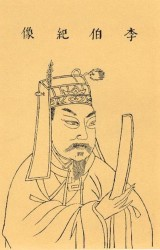
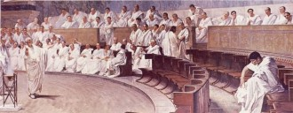

# 第六十五期：古代中国监察制度

### 编者按：

近期刘铁男、刘志军等官员的倒台或审判引起了人们对于监察制度的注意，事实上，对官员的监察自古以来就在中国的政治制度中占据着重要的地位，经过几千年的发展，古代中国逐渐形成了一整套自上而下的监察制度。这期百科就将为大家介绍古代中国监察制度的发展、特征及其与西方的比较。

### 目录

1 古代中国监察制度史

2 古代中国监察制度的特征

3 中西方古代监察制度的比较与评价

4 参考文献

5 延伸阅读

### 词条简介：

所谓监察，是指对官吏在职期间遵纪守法情况的监督和检查。古代中国自秦朝开始就建立起中央集权的封建专制主义的政治制度。随着空前庞大的委任制官僚机构的出现，对中央和地方的各级官僚机构及其官吏进行严密的监察，成为古中国历朝历代巩固统治的一项重要举措。

### 古代中国监察制度史

我国古代的监察制度自秦朝正式建立，一直延续到清末，其发展大致可划分为四个阶段。

夏、商、西周、春秋、战国时期，是监察制度的萌芽阶段。夏、商奴隶制时代，行政监察随之转变为国家管理的职能和手段。西周对“邦国”的监察主要有朝觐、巡狩等方式。后来针对诸侯国的离心倾向，开始向地方派遣监国使臣。监国使臣地位低下，不掌管军队。这一制度有利于中央的调遣和控制，并为春秋战国所继承，这一阶段是监察制度的雏型。

秦汉魏晋南北朝时期，是监察制度的形成阶段。秦代为了加强专制主义的中央集权，在全国范围内废除分封制，实行郡县制，初分天下为三十六郡，郡守为一郡的最高行政长官，郡监指监郡御史，秦代在地方最高行政机关郡级普遍设置了监郡御史，主要任务是掌一郡的监察，是中央监察机关派出的机关，隶属于中央御史大夫寺。汉初在地方实行郡国并行双轨制，因制度疏阔，且郡级权柄不重，没有实行御史监郡制度。刺史在汉末演变为地方最高行政长官，同时兼管监察，一直延续到晋初，削弱了中央对地方的监察。总体上说这一时期地方监察较为薄弱。但独立、专门的监察机构基本形成，在它的领导下，中央与地方两大监察系统已初具规模。

隋唐时期，是监察制度的定型阶段。御史台仍是封建国家最高的监察机关，同时为了更好地发挥御史的监察作用，唐朝又在御史台中设立了台院、殿院、察<院，加强了御史台内部的建设，使监察官的职责更加分明。贞观元年，将全国划分十大监察区，玄宗时增至十五道，每道以监察御史巡视，后来逐渐有了固定治所和印信，成为中央御史台常驻地方的监察机关。此外, 唐朝官修的《唐律疏议》、《唐六典》和专门监察法《监察六条》对监察机构的设置、职掌以及监察官的活动等作了明确具体的法律规定, 使我国封建监察制度进一步规范化、法制化, 对后世产生了深远影响。

宋元明清时期，是监察制度的完备阶段。伴随着皇权的强化，监察机构的职能随之加强，部署亦越来越严密，封建社会的监察体制发展到完备的程度。宋代基本承袭唐制, 中央御史台与谏院并设，地方上设立通判兼理对地方官的监察，号称监州，他们有权随时向皇帝报奏, 成为皇帝在地方上的耳目。元代御史台与中书省、枢密院并列为元朝中央三大机关，互不统属，地位并重。为了加强对地方的监督，元朝又在各省设行御史台，作为中央御史台的派出机构，并在全国划分22道监察区,设肃政廉访使常驻各区，肃政廉访使归所在行省的行御史台直接领导，形成了以御史台为中枢、行御史台为重点、各道廉访司为经纬的监察网。明清两代改御史台为都察院，清全国设十一道监察区，每道设掌印御史和监察御史，分理本道刑名和稽察所辖的中央国家机关，作为都察院的派出机构。言谏之官的地位每况愈下，至清代索性将六科给事中并入都察院。清政府还以皇帝的名义制定了我国古代最完整的一部监察法典《钦定台规》。至此, 我国古代监察系统达到了高度的统一和严密。

李纲（1083年—1140年），曾任北宋监察御史

### 古代中国监察制度的特征

古代中国几千年来监察制度的嬗变过程，大致可以总结为以下四个特征。

第一，监察机构独立化。伴随着封建中央集权和封建君主专制的发展，中国古代的监察机构亦由最初的监察行政不分逐步走向独立。秦汉时期,由于封建监察制度尚处于创建和形成过程中，监察机构及其职权的行使只是相对独立，御史大夫一身二任，既为御史府的最高长官，又领副丞相之职，在隶属关系上多少受到丞相统制。东汉御史台的建立和中丞制的实行，标志我国古代专门监察机构的确立，表现了监察与行政分离的趋势。、及至唐代，中央监察机构不仅独立，而且健全。御史台下设台院、殿院和察院，分工监察，自成系统。元代的御史台与中书省、枢密院三权分制，地位并重，鼎足而立。明代的六科给事中作为六部的部门监察机构，在编制和地位上完全独立，只对皇帝负责，不附属于任何机关。而清代的都察院无论在地位上还是在职权上，都超过了前代。不仅如此，地方的监察机构亦是独立的，垂直于中央领导，如汉朝的刺史、唐朝的十道巡按、宋朝的监司、元朝的行台和肃政廉访司等，均由朝廷的御史台管理。

第二，监察官员选任制度化。监察官员是治官之官，为“百司之率”。监察效果的好坏在很大程度上取决于监察官员素质的高低。通观我国古代监察官员的选拔与任用，其标准均严于一般官员，大致包括品德、学识和经验三方面。在个人品德上, 要求监察官员必须具有清廉耿直、刚正不阿、不畏权势、敢谏敢言等品格，能“表率群僚”；在学识上，一般要求监察官员学识宏博、思辨敏锐、通经懂史、熟谙律例、文词畅达，故监察官员的选任大多经过比较严格的文化考核；在经验上, 要求监察官员具有丰富的从政经历和治政能力。

第三，监察方式多样化。为了有效地通过监察控制内外百官，中国封建社会历代王朝采取了多渠道、多形式的监察方式。从组织方式上看, 在中央既设有国家最高监察领导机构，又在各部院设有部门监察机关；在地方既有垂直于中央领导的地方独立监察机构，亦有遣使监察，还有地方行政衙门对下属的分级监察。从监察内容上看，有对财政、仓库、立法、司法、军事、人事和礼仪等等方面的监察。从监察的实践形式上看，有接受检举、控告、采访调查、深入部门定期检查、重大政事活动亲临督察以及考课监察相结合、常驻巡回相结合的监察方式。不仅如此，为了制约监察权力，有效地防止失监现象发生，大多数朝代还采取措施健全和完善反监互察机制。反监机制主要是指监察系统以外的官员对监察机构和监察官员的纠举弹劾，互察机制则主要是监察系统内部各监察机构和监察人员之间的相互检举纠劾。反监互察机制使各级监察机构和监察官员既是监察的主体, 亦是被监察的对象, 天下百官包括监察官在内无不处在皇权至上的监察网络之中。

第四，监察制度法律化。中国古代监察制度在长期发展过程中, 逐步形成了较完备的法律制度体系。这些监察法律详细地规定了监察机构的设置、监察制度的构建、监察活动的合法性以及监察官吏的职责与纪律等。汉代《六条问事》、唐代《监察六条》、宋代《诸路监司互察法》等都是其代表，而清代的《钦定台规》可谓历代监察法规的集大成之作，其涉及方面之广泛，规制内容之严密，不仅为前代所未有，亦为世界监察法制史上所仅见。

### 中西方古代监察制度的比较

中西方古代监察制度都有着悠久的历史，但限于篇幅，本期百科无法详细介绍古代西方的监察制度，这里仅作一个简单比较。

先来看二者的共性。第一，在中西方古代政治制度中，监察制度都有着悠久的历史，都占据着非常重要的地位。西方古代的监察权多由权力机关执掌，即使是独立的监察机关和监察官员,如古希腊斯巴达的监察院、古罗马的监察官,也在其国家的政治体制中具有非常重要的地位,因而监察制度的地位非常突出,这是中西方古代国家的共性。第二，中西古代的监察制度, 都以不同的形式和手段突出对行政权和行政官员的监察制约。中西古代的统治阶级都有一个共性,即都把监察机关对于任命罢免官吏权、调查权、财务税收监督、询问和质询权的监控放于重要地位,乃是出于监察制度的本旨使然。第三，在中西古代的监察制度中,都存在职权庞杂,职能分工不明确的现象。监察机关和监察官员承担了许多非监察任务和工作，而许多非监察机关又承担了不少监察任务，中国古代的监察官员在君主专制之下自不待言，西方古代的监察官员也难免此点, 如占罗马的监察官员就还要对社会风气、道路桥梁等社会生活进行监督。如此种种, 造成了监察活动混乱、监察力度不强的局面。

至于二者的差异，最重要的一点在于，中国古代监察制度与西方古代的监察制度是两种性质不同的监察类型。西方古代的监察制度主要是一种议会监察。尤其是在欧洲中世纪的等级君主制下,国王不是君临天下、掌握一切大权的专制君主,他虽然是国家的象征,却只是封建领主中地位最高的一个,因此,议会监察体现的乃是统治阶级内部各阶层对于王权的约束。而中国古代的监察制度乃是一种司法监察。在中国高度集权的君主专制制度下,皇帝握有至高无上的权力,国家的最高立法权、司法权、行政权乃至监察权均集于皇帝一人之手。在皇帝的绝对控制下, 不断强化监察机关和监察制度, 对封建官吏实行司法钳制。这就决定了中国古代监察制度的类型只能是一种司法监察。这种司法监察体现的主要是专制君主对于臣下的控制, 而不是对于君权的限制。这是中国古代监察制度与西方古代监察制度的根本不同之处。中国古代监察制度与西方古代监察制度的最终结局为什么不同, 其原因也在这里。

罗马共和国时期的元老院会议

### 参考文献

[1] 杨鸿年、欧阳鑫. 中国政制史[M].武汉大学出版社，2005-08. ISBN：7-307-04571-0.

[2] 于波. 浅议我国古代的行政监察制度[J].行政论坛，2001（01）.

[3] 张国安. 论中国古代监察制度及其现代借鉴[J].法学评论，2009（02）

[4] 谢元鲁. 论中国古代国家监察制度的历史经验[J].社会科学辑刊，2004（03）.

[5] 王晓天. 中西古代监察制度之比较[J].湘潭大学学报（哲学社会科学版），2005（06）.

### 延伸阅读

[1] 钱穆.中国历代政治得失.生活·读书·新知三联书店，ISBN: 9787108015280.

[2] 易中天.帝国的终结：中国古代政治制度批判.复旦大学出版社，ISBN: 9787309057881.

(助理：朱燚 编辑：戴青 责编：高丽)

[【钦差大臣】<七星说法>第八十五期：中央巡视组，游走的青天？](/archives/38247)——伸出手指头来数数，我国到底有多少机关、机构承担着反腐职能？最高人民检察院反贪污贿赂局、国务院监察部、国务院国家预防腐败局......
