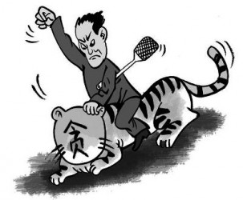
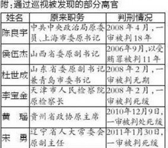
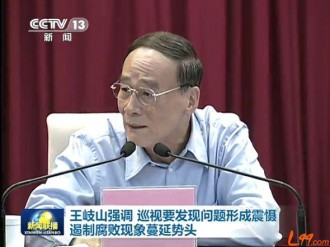
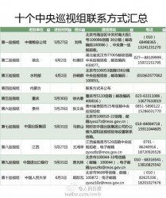
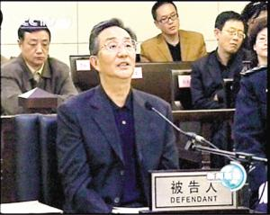

# 第八十五期：中央巡视组，游走的青天？

伸出手指头来数数，我国到底有多少机关、机构承担着反腐职能？最高人民检察院反贪污贿赂局、国务院监察部、国务院国家预防腐败局......当然，一定少不了**[中国共产党中央纪律检查委员会](http://baike.baidu.com/view/311905.htm)**，也就是中央纪委。

这些机关、机构之间的关系听上去还相当复杂，比如说，作为国务院部委的[监察部](http://baike.baidu.com/view/204422.htm)与党的纪律检查机关中央纪委**[合署办公](http://baike.baidu.com/view/1057679.htm)**，[监察部](http://baike.baidu.com/view/204422.htm)的[机构](http://baike.baidu.com/view/126106.htm)列入[国务院](http://baike.baidu.com/view/17491.htm)**[序列](http://baike.baidu.com/view/71968.htm)**，而**[编制](http://baike.baidu.com/view/557141.htm)**却列入[中共中央直属机构](http://baike.baidu.com/view/1971786.htm)；而07年新设的国家预防腐败局作为国务院的直属机构是在监察部**加挂牌子**的，局长也是由监察部部长**兼任**......好了，“合署办公”“挂牌”“序列”“编制”，如果你没有弄懂这些特色词汇，永远也只能是一头雾水。

不过这些细节暂且不表吧，要想从宏观把握我国的反腐制度，官方的描述就很有力，**“党委统一领导、党政齐抓共管、纪委组织协调、部门各负其责、依靠群众支持和参与的具有中国特色的反腐败领导体制和工作机制”**。或许可以这么说，反腐领域，是我国党政混同管理最突出的一个领域，在机构安排上都没有做明确的党政区分。所谓“齐抓共管”，不论效果如何，气势总是汹汹的。

这不，如今又来了中央巡视组，上半年内，十个中央巡视组就将分赴地方政府、央企乃至于高校，“只带耳朵、眼睛、照相机、录音机”，既寻“老虎”也寻“苍蝇”。本期说法，就要从这个中央巡视组说起。

 **什么是中央巡视组******

说起反腐，就很容易想到纪委，我国的政治监督机制实际上是以党的纪律机关为核心的。

那中央巡视组在反腐体系中处于怎样的位置呢，是下属于纪委吗？这还真不是，中央巡视组属于**中央纪委、中央组织部联合办公**，其工作由**中央巡视工作领导小组负责（**组长为中央纪委书记王岐山，副组长由中组部部长赵乐际和中纪委副书记赵洪祝担任。），其职能、工作方式在《中国共产党巡视工作条例（试行）》中都做了规定。可以说，中央巡视组仍旧是**党内组织**。中组部主要负责党的组织建设、干部队伍建设和人才队伍建设等方面的工作，作为中组部和中央纪委联合办公的中央巡视组自然也有着中组部的色彩，其主要职能在于巡视稽查**省部级领导干部**违反党纪国法的问题。

其实说起来，中央巡视组已经正式运行了十年了，只是**过去它的名字叫做“中央纪委、中央组织部巡视组”，****09年底才换上了如今的马甲**。这个名字颇为绕口的“中央纪委、中央组织部巡视组”，其广为宣传的战绩是在陈良宇、侯伍杰等腐败大案中寻找出了蛛丝马迹。可是，陈良宇在08年就受审了，侯伍杰是在06年，中央巡视组更换马甲是在09年，为什么近中央巡视组又突然频繁地出现在我们眼前？

是调整，更换马甲之后中央巡视组在今年开始了的职能上的调整。在工作方式上，最为重要的调整是有关巡视组组长的。在此之前，巡视组组长是一个特有的职位，就像汉代的刺史是一个官职一样，但今年5月之后，巡视组组长不再是一个职位了，**它成为了“一项任务”**。每一次确定巡视任务，都需要选定巡视组组长，巡视任务一结束，巡视组组长也就完成了任务，这被称为**“一次一授权”**。

在工作手段上，中央巡视组也被赋予了新的武器——**抽查领导干部的个人有关事项**。大概是中央纪委也逐渐认识到，在反腐工作中，手表、房产、名车、情妇似乎是比财务记录、项目审批更加有力的切入点，因为财务可作假、项目能忽悠，贪官带着名表亲近情妇的心，却总归会痒起来。

6月，多个巡视组进驻巡视单位，进行了为期两个月左右的抽查，并且对外公开巡视组的联系方式。电子邮箱、通信地址出现在各大报纸、网站中，似乎看上去，一场反腐的暴风雨又要袭来。

**向上头求方法******

不过有一个问题，**中央巡视组的工作人员并不多，而我国各种纪检监察机关却有数十万工作人员，为什么还需要中央巡视组那点人手亲临地方，动辄约谈三四百人？******

实际上，在政治监督中，任何政府都会面临一个权力安排的难题，即如何处理同级监督、自上而下监督的结构比例。在我国的政治体制中，**“以权力制约权力”往往是受到警惕的，绝大部分机关之间但凡有“监督”就必然急匆匆地加上“协调”与“配合”。**在我国政治文化传统中也缺乏足够的权力分立、制衡的意识。即使在制度设计中有此设计，也往往被人情、和谐化于无声。可以想见，缺乏独立性的机关所进行的监督，其效率和力度定然不会让人满意。

其实在整个国家制度中，都会面临着同样的问题。某地人民法院的法官如果主审该地党委一把手的贪腐案件，必然如履薄冰。为何如此？我国法院在经费上实行同级财政负责制，要是在审判中出了差错，法院不知道会被穿上什么尺码的小鞋。（省级人大常委会主任一般由该省省委书记兼任）。我们常说司法机关缺乏独立性，司法改革呼吁法院经费由中央财政承担也多年不见回音，这恶果之一就是地方主义风险。在制度上就出了问题，贪腐案件当地审判就失去了公信力，那么怎么办呢？只能**向上头求方法**，由上级法院通过指定管辖来实现异地审判。

纪委也是如此，《党章》规定：“党的中央纪律检查委员会在党的中央委员会领导下进行工作。党的地方各级纪律检查委员会和基层纪律检查委员会在同级党的委员会和上级纪律检查委员会双重领导下进行工作。” 地方纪委既受上级纪委领导，也受同级党委领导，如何能够很好地监督同级党委？纪委成员的提名、任命、调动等等全都掌握在同级党委手中，真要自发严查起同级党委来，难道要全靠当地纪委工作人员凭着优良的党性来作斗争？

作为政治监督中起最主要作用的纪委，命根子被同级党委握在手里，就如同法院的饭勺子把持在地方一样，其职能很难稳定、有效地发挥。就这样，**同级监督虽有庞大之身躯，其力量却被虚化了**。怎么办呢？和法院一样，**向上头求方法**。

于是乎，巡视组到了地方，座谈会、汇报会、述职述廉会、民主生活会、来信来访、约谈暗访。这和那不远万里来到北京上访的访民们倒隐隐有些类似？

**“交心”的逻辑******

然而比起自上而下的监督，恰恰是同级监督在信息获取、行动效率上都有着极大的优势，在权力制约过程中能够节省大量成本，故而同级监督理应成为政治监督中的常态、主力。说到底，我国的政治体制其实是强调同级监督的，但偏偏抵触“分权”，这样的政治理念颇值得玩味。

1962年，邓小平在扩大的中央工作会议上的讲话中指出，“对于我们党的各级领导人（包括常委会的所有成员），应该有监督”，“我觉得，对领导人最重要的监督是来自党委会本身，或者书记处本身，或者常委会本身”，**“同等水平、共同工作的同志在一起交心，这个监督作用可能更好一些”。**相较于中央所追求的“一个好的批评和自我批评的空气”，分权制衡无疑显得粗鄙得多，而**“交心”似乎也是比加强机关独立性更加富有人情味的方式**。在这样的政治逻辑之下，权力的集中并不可怕，缺乏独立性对于同级监督老说也根本不是问题，**党内监督最重要的，是“交心”**。

将近二十年后，兴许是因为“交心”的失败，邓公的“最重要”发生了变化，在1980年8月18日在中共中央政治局扩大会议上，他明确地说**“最重要的是要有专门的机构进行铁面无私的监督检查”。******

或许以上两段文字有断章取义、曲解之嫌，因为邓小平在建国初期就呼吁应当建立起专门的监督机构，而中央纪委正是在十一届三中全会中恢复重建的。但的确可以发现，“交心”的逻辑依然如幽鬼一般潜伏在制度运行之中，即使是在自上而下的监督中也是如此，这不得不让人有些匪夷所思。

在中央巡视组的工作之中，**巡视组还要向被巡视省的两个一把手通报巡视情况，除非他们本人的问题外，尽可能地通报巡视中了解道德情况和问题，使他们心中有数**。在论述这一工作方式时“心中有数”这一词语常常出现着，为何要使他们“心中有数”？对于巡视组所发现的官员违法乱纪的线索，一把手并没有直接的职权，让他们“心中有数”似乎没有多大意义。更为可怕的是，巡视组并不总是能把握什么叫做“除非他们本人的问题外”。

2005年下半年，中央纪委向时任上海市委书记反馈了中央巡视组的意见，指出不少干部对秦裕在廉政方面的问题反映相当大。这位时任上海市委书记就是陈良宇，**而秦裕，竟然就是他的秘书**。陈良宇在得知消息后，反而多次表示秦裕没有问题，继续让秦裕担任他的秘书，甚至一年之后，秦裕还升官了。（《权殇》，中国友谊出版社，P57）当时的中央巡视组工作人员应该没有预料到，陈良宇在两年后会和秦裕一样接受法庭的审判。

到底为什么要向当地一把手汇报意见？实际上，在去年《中国新闻周刊》对中央巡视工作领导小组有关负责人的访谈中，该负责人认为官员违法违纪的发现”只是巡视工作成效的一个方面”，其声称中央巡视组的工作甚至还包括掌握“被巡视地区和单位在调整经济结构、转变经济发展方式、节约能源资源以及保护生态环境等方面的情况”，这样说起来，倒是可以理解向一把手汇报的意图，只是实在搞不懂中央纪委、中央组织部联合办公为何要跑去收集经济发展情况来指导地方。更何况今年五月之后中央巡视组的工作重心已经调整为发现反映违法线索，为何依然保留了这样的工作方式？

**也许，这还是“交心”的逻辑从中作祟？******

 **从纪委到检察院******

说了这么多政治问题，这期说法的最后还是试着认真说些法律问题吧。

中央巡视组实际上并非是“钦差大臣”，手握“尚方宝剑”。相反，他们并没有办案的职权，他们的任务只限于发现问题，向中央（纪委）报告。这就是新闻稿中常说的“只带耳朵、眼镜、照相机、录音机”。

那之后呢？我们常说中央纪委“办案”，这个“办案”能把案子办到哪去呢？作为党内机构必然没有审判权，最多和中央纪委合署办公的监察部有行政处罚权。然而，对于腐败大案，又一般是由纪委主导调查的，那么既不能审判又不能起诉，纪委接下来是如何操作的呢？

在这里不讨论纪委的办案方式，只说明纪委一旦查清案情，只能做出党纪处分，接下来需要**移交检察院起诉**。这里有一个很关键的问题，那就是纪委所做的笔录在诉讼中是什么性质。纪委作为党的纪律检查机构，在办案中并没有进入诉讼程序，因而**其笔录并不能认定为《刑事诉讼法》第四十八条中的“犯罪嫌疑人、被告人供述和辩解”**，只能作为一种证据材料，并且证明力并不高。证据的证明力主要判断标准就是相关性和合法性，合法性中的程序要求是提供、收集、和审查符合法定程序，而与纪委有关的党内法规并未将纪委的工作与诉讼活动相衔接。**笔者认为，纪委移交检察院之后，检察院需要再对犯罪嫌疑人作讯问，如果犯罪嫌疑人认可并且进行签名确认等，则可以转化为犯罪嫌疑人供述和辩解。******

那么，犯罪嫌疑人要是翻供，怎么办？一般来说，检察机关应当继续依照法律规定讯问、收集证据、进行调查，如果依旧达不到起诉标准，做**不起诉处理**。此后纪委仍然可以继续调查。

坦诚地说，在当前体制下，我以为如果呼吁把贪腐案件的调查立马起诉归还于公安机关和检察机关，实在有些幼稚。不从“应然”层面的权力分配考虑，纪委作为党内纪律检查机关在组织的独立性上是要高出公检法机关的。以公安机关为例，同级政府、人大、党委乃至于政法委都与之关系密切，要往上调查贪腐更是难以下手。

然而值得关注的是，**在纪委较为“高效”运转的背后，缺乏制度化因素**。翻开刑事诉讼法，你可以清楚地了解各种强制措施的规定，然而对于纪委办案的方式却难以了解。如何处理这个问题呢，如果要进行规范化处理，解决好纪委和检察院的衔接，作为党的纪律检查机关的纪委如何能够被纳入到司法程序中呢？而一旦纪委的办案方式也如同公安机关一样被规范所固定，是否依然能够保持其较强的办案能力呢？

笔者并不知道答案。

此时，几个中央巡视组已经在被巡视地开始了活动，剩下的几个也即将赴行。笔者在本文所做的无论是提出问题也好，提出批评也罢，都是较为浅显的思考。中央巡视组究竟在反腐之中能够发挥怎样的作用，还需进一步的观察。

（编辑：陈澜鑫；责编：陈昱嘉、戴正阳）

P.S.加入“七星说法读者群”，我们一起说法！群号：262980026。

[【钦差大臣】<七星百科>第六十五期：古代中国监察制度](/archives/38273)——经过几千年的发展，古代中国逐渐形成了一整套自上而下的监察制度。这期百科就将为大家介绍古代中国监察制度的发展、特征及其与西方的比较。
