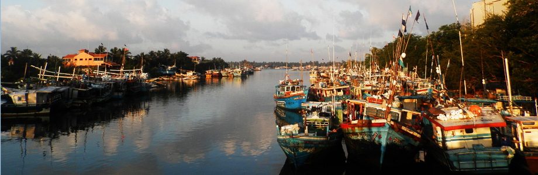

# 锡兰记：尼甘布过客

坐在印度洋边上的小餐馆里，看着天色一点点沉下去。一个人的时候，才会注意到暮色渐逝也有如此多的层次，从带点鸽子灰的蓝，慢慢转成一种渗着苔绿的藏蓝，最后才成了黑色，细看却又好似掺着一丝丝宝蓝。大约也没有什么别的人会留意此间的细微差别，天空本就与他们没什么关系，我以为，天空只和孤独的灵魂发生关联。

初到斯里兰卡，先去海边小镇尼甘布，准备坐过夜大巴去北部的贾夫纳。传说中尼甘布是大部分游人的落脚地，奇怪的是却见不到几个，阳光灼烈的午后，只偶尔在小店里可以瞥见穿着花裤子喝冰冻啤酒的白人。走去买车票的路上，经过小镇的圣玛丽教堂，小小一栋鹅黄色建筑，说不出有什么特别 ，旁边有一畦墓地，幽深碧草里歪歪斜斜立着许多十字架。雪白的十字架，用黑色的僧伽罗文写着大约是姓名，只有生卒年月用的是阿拉伯数字。一个个看过去，有好多都是八九岁的小孩子，也有1919－1998的，天主教的信仰伴随殖民历史，就这样不知不觉根植在一代又一代人的生命痕迹里头。又想起Emma Lakin在Finding George Orwell in Burma里头写到去看奥威尔那辈的死在缅甸的英国人墓地，歪歪斜斜，芳草萋萋，无人纪念。个体生命在历史进程面前的无力感，大概如此。

教堂虽小，玫瑰窗却还精致，颜色浓丽，有种少数派的尊严。有位老者在打扫地上，天气炎热，赤着上身，我微笑致意，想着这不和旅游业掺和的老人家大概是不懂英文。结果他一开口就是颇标准的英音，问我从哪儿来，又告诉我明早六点有弥撒。我和他聊了几句，到教堂外面逛了一圈，再看见他，他已经穿上了细条纹的衬衣，问我的信仰是什么，相信上帝吗，我说我没有信仰，又有点不好意思地补充，但我尊重上帝，也认为这些绘画雕塑很美。他庄重地点点头，知道我一个人来，他反复说，God bless you。

去买车票的时候，老板反复说，小心tuktuk司机，小心这个，小心那个，有事打我电话。

陌生人的善意，总是让人感觉有些惶恐，继而更感孤独。

从教堂一直走到海边，第一次看见印度洋，摄入眼内的是一道漫无边际的海岸线。赭黄色沙滩上孤零零立着一块不准游泳的铁牌，不时有一两只乌鸦立在上头，远处雨云浓厚，阳光苍白，只有海风猛烈地扑打过来。望向这样的天空，这样的大海，永恒，无尽，又什么都没有，只觉得它们与灵魂中孤独的部分所辉映，投下深邃的阴影——天空与海洋都是永恒的，正如孤独之永恒。

大学时候上拉丁文课，读贺拉斯，有一句说“Caelum non animum mutant qui trans mare current”，老师说，意思是"天空与海洋的转移都不能改变一个人的灵魂"，我以为说的就是这种与天空海洋一样无尽的孤独的无可转移。再后来才知道这句话应该译成"那些行色匆匆穿越海洋的人，改变的只是头顶的天空，而不是他们的灵魂"，大概有斗转星移，时易境迁，而本心不变之意。那这句话放在此刻，大概也就是，路途走得再远，也无法摆脱孤独吧。

谁此刻孤独，就永远孤独。忽然想起里尔克。我以前用这句诗在光棍节嘲笑小伙伴，但是心里明白得很，孤独与否，与是否有伴侣，一点关系也没有。

所以我以为有信仰的人总是比较幸福，寻求与一个心灵中自造的神对话，总比寻求与另一个独立的个体保持长久的对话关系要容易得多。只要是关涉到另一个人，事情就出离了可控的范围，最终多半只能失望。

从夕照投到我的芒果lassi上的时刻开始，一直写到了整个小餐馆的灯都亮了起来，悬在半空的浅绛红灯笼全在晚风里轻轻摇荡起来。饭后的爱尔兰咖啡太浓稠，厚厚的奶油压住了掺杂威士忌的咖啡，倾杯也无法触及唇边，平日的生活也大概如是，只有一个人的时候，才能直面自己，记下种种心绪。

所以人在孤独的时候，才真正属于自己。

一个人出行，享受着孤独带来的种种自由，只点自己喜爱的食物，只去想去的地方，保有沉默的自由，无须显得兴高采烈，同时开启了对世界的全部感受。至少目前，我非常享受这种世界属于自己的自由。

小餐馆的人渐渐多了，几乎全是爱侣。隔壁桌的白人情侣，点了两杯红酒，碰杯的同时深情接吻。见了这样的情景，心里也不是不羡慕，却又忽而想起了《白马啸西风》的结尾——"白马带著她一步步的回到中原。白马已经老了，只能慢慢的走，但终是能回到中原的。江南有杨柳、桃花，有燕子、金鱼……汉人中有的是英俊勇武的少年，倜傥潇洒的少年……但这个美丽的姑娘就像古高昌国人那样固执：“那都是很好很好的，可是我偏不喜欢。”

孤独，也是很好的。

而我这个只在尼甘布停留半日的过客，也该起身出发了。明晨五点，我期待见到曾经属于泰米尔猛虎的土地，贾夫纳，会是何种形容。

（采编：朱燚；责编：刘铮）
