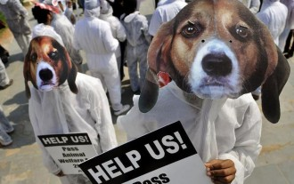
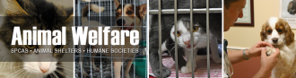
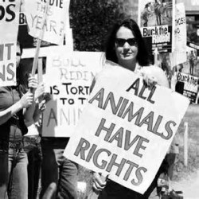

# 第六十八期:动物福利

**编者按：**动物福利的概念起源于18世纪初，近年来在中国也出现了众多追随者。而以爱狗人士为代表的动物福利呼吁者的一系列极端行为也在互联网上引起了诸多争议。这期七星百科栏目我们就为大家详细介绍一下，究竟什么是动物福利，它包含了哪些原则和内容，它的提出又有何意义？

**词条简介：******

**动物福利**是指为了使动物能够康乐而采取的一系列行为和给动物提供的相应外部条件。动物福利的内涵非常丰富，而以欧盟为代表的许多国家和地区以法律的形式在某种程度上对动物福利进行了界定和保障。

**目录**

1 动物福利的概念

2 动物福利的基本原则

3 动物福利的内容

4 动物福利的发展

5 动物福利的意义

6 动物福利的指标

7 参考文献

8 延伸阅读

**1.****动物福利的概念******

动物福利是指为了使动物能够康乐而采取的一系列行为和给动物提供的相应外部条件。动物福利强调保证动物康乐的外部条件，而提倡动物福利的主要目的有两个方面。一是从以人为本的思想出发，改善动物福利可最大限度地发挥动物的作用，让动物更好地为人类服务；二是从人道主义出发，重视动物福利，改善动物的康乐程度，使动物尽可能免除不必要的痛苦。由此可见，**动物福利的目的就是人类在兼顾利用动物的同时，改善动物的生存状况**。[1]

** **

**2.****动物福利的基本原则******

为了满足动物的需求，使动物能够活得舒适，死得不痛苦，具体讲应让动物享有国际上公认的五大原则：

①**享有不受饥渴的自由**。保证提供动物保持良好健康和精力所需要的食物和饮水，主要目的是满足动物的生命需要；

②**享有生活舒适的自由**。提供适当的房舍或栖息场所，让动物能够得到舒适的休息和睡眠；

③**享有不受痛苦、伤害和疾病的自由**。保证动物不受额外的疼痛，预防疾病和对患病动物及时治疗；

④**享有生活无恐惧和悲伤的自由**。保证避免动物遭受精神痛苦的各种条件和处置；

⑤**享有表达天性的自由**。提供足够的空间、适应的设施以及与同类动物伙伴在一起。[2][3]

**3.****动物福利的内容******

(1)**饲养方面**。以欧盟为例，他们规定了畜牧业生产中动物保护的一般措施以及不同种动物的最低保护标准[4]，如蛋鸡的最低保护标准，牛的最低保护标准，猪的最低保护标准，动物园中野生动物的最低保护标准，实验用和其他科研用动物的保护标准。

(2)**运输方面**。

①对运输者的要求。在进行动物运输尤其是长途运输时，运输者必须预先考虑到动物在运输中可能受到的痛苦和不安。在出发前，需要考虑的问题有：不用外力，动物能否自己上车；在运输途中动物如果一直站立，它能否承受自己的体重；运输的时间是多少；运输工具是否合适；动物在运输途中是能得到令人满意的呵护等，以做好适当的应对措施。另外，要对负责运输的人员进行定的培训，在运输途中要对动物进行照料和检查；驾驶员应谨慎，保持车的平稳，避免急刹车和突然停止，转弯的时候要尽可能的慢。

②对运输工具的要求。运输工具要达到一定的标准，如安装必要的温度、湿度和通风调节设备，地板要平坦但不光滑，车的侧面不能有锋利的边沿和突出部分，不能完全密封，地板的面积要足够大，使动物能舒服的站着或正常的休息，不至于过度拥挤；运输工具要进行消毒，动物的粪便、尿液、尸体和垃圾要及时清除，以保持运输工具的清洁卫生；并规定了最大装载密度和装载方法；运输工具上要有足够的水和饲料。

③运输时间方面。选择恰当的运输时间，高温天气容易造成动物在运输途中的高死亡率，要在凉快的清晨或傍晚甚至在晚上进行运输，尤其是运输猪的时候。并规定了最长的运输时间(休息、饮水和饲喂时间都有规定)[5]，在途时间要尽可能的短，运输时间不应超过8h，超过8h的，必须将动物卸下活动一段时间等等。

④其他要求。活畜运输者要经过登记和国家主管部门的认可；运输路线计划要经主管部门批准，禁止运输幼畜等。

(3)**屠宰加工方面**。动物福利除了强调“善养”，还应重视“善宰”[6]。为了确保动物在屠宰时受到的惊吓和伤痛最小，欧盟对屠宰场、屠宰人员和屠宰方法进行了详细规定[7][8]。

1屠宰时要有兽医在场进行监督，屠宰工人必须具备熟练的技术和专业知识，经过国家有关部门的认证，并进行一定的培训。

②屠宰动物时必须先将动物致昏，在很短的时间内放血。特别是反刍动物必须先致昏迷才可屠宰，昏迷和放血之间的时间要尽可能的短。宰猪时，必须隔离屠宰，不被其他猪只看到。杀猪要快，必须致昏，在猪完全昏迷后才能刺杀放血。

③欧盟强烈要求在屠宰时采用危害分析与关键控制点体系来衡量和检测屠宰过程。危害分析与关键控制点(hazard analysis citical control point，HACCP)主要应用在肉类加工厂，并建议在致昏、放血、噪音、悬挂和电刺5个关键控制点进行控制。

** **

**4.****动物福利的发展******

**早在18****世纪初，欧洲一些学者就提出：动物和人类一样，是有感知、有痛苦、有恐惧，有情感需求的，这是动物福利思想的起源。**世界上第一部与动物福利有关的法律一马丁法案于1822年出台，该法案虽然只适用于大型家畜，但它是动物保护史上的座里程碑。19世纪欧美大部分国家已完成了防止虐待动物的立法。二战以后，这些国家又陆续制定了动物保护法及相应的管理条例和法规，并设立专门负责动物福利的部门。目前，100多个国家已有了动物福利法，动物福利条款也写入了WTO的规则中，保护动物和尽一切可能保留生物的多样性已在世界各国达成共识。我国对动物福利的立法较晚，但已将动物福利条款写入《中华人民共和国畜牧法》及《野生动物保护法》等有关法律中，这是中国动物福利思想的一大进步。[9]

**5.****动物福利的意义**

**1 ****有利于提高生产性能和减少疾病发生**

重视动物的福利有利于生产性能的提高和发挥。饲养过程中提供舒适环境，能减少动物相互争斗，降低死亡率；提供营养完善的日粮，可明显加快动物的生长速度，提高饲料利用率。动物在运输过程中提供良好的通风条件，运输时间适当，宰前有充分的休息和饮水，屠宰时宰杀方法适当，可明显提高其屠体品质，减少PSE肉的发生率。Broom(1994)认为动物的福利水平与健康密切相关，福利水平差，会导致肾上腺功能下降，生产性能和繁殖能力降低，生命周期缩短，长期的持续免疫抑制则会导致严重疾病，甚至引起死亡，造成损失。

**2 ****有利于畜产品贸易和畜产品安全**

一些国家在畜产品进出1：3贸易中往往利用动物福利的差距来设置贸易壁垒。我国目前的屠宰流程是让动物排队进入屠宰场，待宰动物能亲眼看到被宰动物的惨叫、流血、分割，处于突然的恐怖和痛苦状态，肾上腺激素会大量分泌，从而形成毒素，这些毒素对食用者非常有害。目前，我国出口畜产品达标率较低的原因之一就与落后的屠宰方式有关。另外，长途运输和剧烈的屠宰手段还会诱发动物的应激反应综合征，宰后肌肉苍白、柔软，渗出水分增多，肌肉糖原分解，乳酸蓄积，pH值下降，蛋白质变性，肉质大大降低。因此，在屠宰和运输环节，如能重视动物的福利，则有利于畜产品贸易和安全。** **

** **

**6.****评价动物福利的指标******

限制环境下的动物经常表现行为规癖(behavioral stereotypy)，行为规癖是一种不断重复的、在形式上表现一致并且无明显功能的行为。行为规癖的发生与动物的生存环境密切相关，存在着一定的动机基础，饲养在集约化生产方式下的家畜和家禽表现得非常显著。行为规癖与动物的行为限制有关，反应了动物处于应激或心理痛苦状态。动物的行为规癖有时会直接影响动物的生产性能和健康状况。例如，运动行为规癖造成了动物的能量损失，引起动物的代谢增加，饲料转化率降低，从而对生长不利等。在限制环境中饲养的动物，其行为规癖会导致身体与圈栏的频繁接触，这往往造成身体的损伤和疼痛。

动物出现行为规癖除了给动物本身造成一定的生理损伤外，还意味着动物的行为需要没有得到满足或者正在遭受心理应激。保证动物的维持需要行为的正常表达以及避免动物遭受应激，是保障动物良好福利的必要条件，因此，行为规癖的出现标志着动物福利的恶化。动物行为规癖可作为评价动物福利状况的指标之一。[10]

  * **7. ****参考文献**

[1] 牛瑞燕，孙子龙，李候梅. 动物福利的现状与对策[J]. 动物医学进展，2006，27(2)：108-111.

[2] 王永康，徐新红．未来蛋鸡笼养的发展趋势和动物福利问题[J]．中国家禽，2003，20：1-4．

[3] 陈焕生．欧美国家动物福利法剖析[J]．中国牧业通讯，2005，(2)：52-54．

[4] 张学松．浅谈动物的福和问题[J]．Guide to Chinese poultry(专题报道)，2003，20(12).

[5] 李长乐．增强动物福利观念善养善宰确保肉品安全[J]．肉品卫生，2005，(2)：32—33.

[6] 刘金才，康京丽．关注欧盟动物福利提前进人战备状态[J]．动物科学与动物医学，2003：3-5．

[7] 朱其太，于维军．直面中国动物福利[J]．山东家禽，2003：10—l3．

[8] 何娣，薛梦晶．动物福利对我国国际贸易的影响及对策[J]．对外经贸实务，2003：819-12．

[9] 屈健. 动物福利的基本要求和重要意义[J]. 浙江畜牧兽医，2008，5：13.

[10] 崔卫国，包军. 动物的行为规癖与动物福利[J]. 中国畜牧兽医，2004， 31（6）:3.

  * **8. ****延伸阅读**

1、《动物权利》，（英）斯伯丁著，崔卫国译，中国政法大学出版社

(助理：朱燚 编辑：戴青 责编：高丽)

[【阿猫阿狗】〈七星视点〉第四十三期：康德的人与边沁的狗 ](/archives/39063)——荔枝狗肉节，是广西玉林的市民们自发形成的节日。然而这“吃的节日”一经曝光PO上网络，立刻招来了动物保护者、爱狗人士和各色微博明星的炮轰质疑。 

[【阿猫阿狗】<七星说法>第八十九期:恶犬伤人，何以治犬 ](/archives/39350)——对一无所知的狗，就算实行了剥皮、腰斩、车裂、凌迟、烹煮等种种极刑也无关痛痒，反而颇具有“以牙还牙”的同态复仇之意，暴露了一向自视为“万物灵长”的人类的心胸狭隘。 
