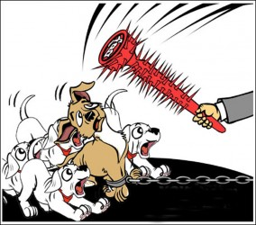

# 第八十九期:恶犬伤人，何以治犬

这个异常炎热的夏天，连狗的生活都异常热烈。先是颇具争议的玉林荔枝狗肉节，再是各地此起彼伏的恶犬伤人事件。正所谓一石激起千层浪，与之相关的口诛笔伐以及相对垒的歌功颂德，成排山倒海之势大鸣大放，软磨硬抗，相持不下。狗究竟在人类生活中扮演着什么角色，仁者见仁，智者见智，但对于既无悲天悯人情怀又惰于思考世界的不才在下而言，恐是个拈断髭须，百思莫解的问题。那就让笔者暂且单纯地将狗视为法律关系之特殊客体，就不同情形的家犬伤人事件中饲养者所须承担之责任谈谈鄙陋之见。

粗略概观现有的家犬伤人乃至伤人致死案件的处理方法，重点竟多是放在了对伤人之犬千姿百态的残暴处死，云南省某地区更有将伤人之犬游街示众，再处于火刑之例，然而对于饲养人却通常止步于民事赔偿与行政处罚。在我看来，对一无所知的狗，就算实行了剥皮、腰斩、车裂、凌迟、烹煮等种种极刑也无关痛痒，反而颇具有“以牙还牙”的同态复仇之意，暴露了一向自视为“万物灵长”的人类的心胸狭隘。事实上，不尽必要看管义务的饲养者才是酿成悲剧的罪魁祸首，而已然脱去兽性外衣，追求高尚理性的人类应该多多考虑如何有效惩处同伴失职之行为，使家犬饲养得到有效规制才是。

一、民事责任

首先，犬主需承担侵权责任是有法可依、毋庸置疑的。

《侵权责任法》第十章第七十八条至第八十四条规定：“饲养的动物造成他人损害的，动物饲养人或者管理人应当承担侵权责任；但能够证明损害是因被侵权人故意或者重大过失造成的，可以不承担或者减轻责任；违反管理规定，未对动物采取安全措施造成他人损害的，动物饲养人或者管理人应当承担侵权责任；禁止饲养的烈性犬等危险动物造成他人损害的，动物饲养人或者管理人应当承担侵权责任；遗弃、逃逸的动物在遗弃、逃逸期间造成他人损害的，由原动物饲养人或者管理人承担侵权责任；因第三人的过错致使动物造成他人损害的，被侵权人可以向动物饲养人或者管理人请求赔偿，也可以向第三人请求赔偿。动物饲养人或者管理人赔偿后，有权向第三人追偿。饲养动物应当遵守法律，尊重社会公德，不得妨害他人生活。”

因此，动物损害侵权责任是无过错责任，除受害人有过错和第三人过错两个免责事由外，饲养者均需承担侵权责任。

二、刑事责任

然而，随着恶犬伤人致残致死事件层见叠出，一条条鲜活的生命以惊心惨目的方式遭受戕害，止步于民事赔偿与行政处分的惩戒力度似乎已无法安抚义愤填膺、惴惴不安的人们，一时众口纷纷，适用刑法、实行重罚的呼声日益高涨。

《家犬管理条例》第七条规定：“如有违犯本条例者，按情节轻重给予批评教育、罚款，直至起诉追究刑事责任。”全国各地也逐渐出现了适用刑法的判决。前有呼和浩特判处以危险方法危害公共安全罪之例，近日，大连幼童遭藏獒撕咬生亡，辽宁省高院正式提出，可能用过失致人死亡罪来惩罚肇事者。

1、过失以危险方法危害公共安全罪

尽管我亦认为有效规制饲养家犬行为并且让失职饲养者为其造成的严重后果承担应有的责任无可非议、势在必行，但是立足于现有刑法条文及有关司法解释所设之罪，将饲养者归于此罪尚不能成为一个众人不谋而合的有力判决。

假设一条被主人遗弃的狗在大街上游荡，老无所依，兽性大发，咬死咬伤多人。主人被追究刑事责任的可能性有：

犬主未尽有效管理义务，任凭可能造成严重社会危害的丧家之犬在外游荡，致使血肉狼藉，人心惶惶，是不是构成过失以危险方法危害公共安全罪呢？

咱先来看看什么是以危险方法危害公共安全罪。刑法第一百一十四条规定：放火、决水、爆炸以及投放毒害性、放射性、传染病病原体等物质或者以其他危险方法危害公共安全，尚未造成严重后果的，处三年以上十年以下有期徒刑；第一百一十五条规定：放火、决水、爆炸以及投放毒害性、放射性、传染病病原体等物质或者以其他危险方法致人重伤、死亡或者使公私财产遭受重大损失的，处十年以上有期徒刑、无期徒刑或者死刑。过失犯前款罪的，处三年以上七年以下有期徒刑；情节较轻的，处三年以下有期徒刑或者拘役。以危险方法危害公共安全罪是指故意以放火、决水、爆炸以及投放危险物质以外的并与之相当的危险方法，足以危害公共安全的行为。而过失以危险方法危害公共安全罪是指过失以放火、决水、爆炸以及投放危险物质以外的危险方法危害公共安全，造成严重后果的行为。

可见俩罪名的成立均十分强调方法的危险性，这也是我认为归于过失以危险方法危害公共安全罪有所争议的原因。一只失控的疯狗虽然的确会对公共安全造成危害，即对不特定的多数人的生命、健康甚至重大公私财产的安全造成损害，但是否有能力造成如同放火、决水、爆炸、投放危险物质般的死伤相枕的结果，达到相当的危险性却难以断言，也缺少固定标准衡量。在司法实践中，对以其他危险方法危害公共安全罪的认定，不宜无限制的扩大解释，也不应任意缩小适用的范围。同理，除被遗弃的狗外，针对出逃的狗，遛狗时未被拴住的狗脱离饲养者有效控制，危害公共安全的案件，饲养者被认定为过失以危险方法危害公共安全罪均是不能完全令人信服的，尚需权威规定或意见予以支持。

2、过失致人死亡罪

过失致人死亡罪是指行为人因疏忽大意没有预见到或者已经预见到而轻信能够避免造成的他人死亡，剥夺他人生命权的行为。构成要件包括：（1）得是个命案，即客体为他人的生命权；（2）客观上必须有过失致人死亡的行为，包括作为和不作为，加之发生了死亡的凄惨结果，而过失行为与结果之间又存在着微妙的关系——间接的因果关系；（3）主观上是出于过失，包括疏忽大意过失和过于自信的过失，此过失是针对死亡结果的过失；

家犬伤人，犬主的行为形式可是作为，可是不作为。作为，积极地做了不该做的事儿。举个例子，带着条力拔山兮气盖世的巨型犬威风凛凛地溜达，不应该养还养，不应该带出来还带出来，那条狗狂性大发制造了血案，作为！不作为指应为能为而不为。应为：既是家犬，犬主自对其负有效管理的义务；能为：指事件发生时或之前相关联行为发生时的能为；不为，也就是他没有这样做；再举个例子，桀骜不驯的烈性犬未被栓养而伤人性命，之前应该拴起来能拴起来没拴起来，不作为！

主观方面，比如，针对被遗弃之狗害人的案子，一般情况下可以适用该罪。因为犬主狠心抛弃家犬之前，凭着自己的常识应该可以合理预见拥有兽性本能的狗放了出去就可能成为祸害。但是假设是这样情形的抛弃，就当另当别论。深情仁慈的犬主将亦是气息奄奄、日薄西山的爱犬放在了一个山清水秀的地方，本打算让它能在瑰丽美好的环境里走完最后一程，谁料该犬集天地之精华而平复如故，却无奈走火入魔，最后成了“倾危之士”。由于这样的情节发展远超出了一般逻辑，非一般正常人所能预料，包括无先知能力的犬主，对死亡结果犬主不存在过失。说了这么多废话，编了个曲折离奇的故事，我想说明的是，主观方面，家犬伤人案件，主人对死亡结果必须是应当预见而疏忽大意没有预见或已经预见过于自信轻信能够避免。案件千奇百怪，道理就是这么个道理。

然而，由于先例甚少，而刑事责任的追究又是对当事人最严厉的处罚，所以“狗犯罪”是否应追究狗主人的刑事责任还需要法律法规的明确规定。”

三、另谋出路

养条狗娱乐娱乐生活而已，闹出人命多不好。比总想着悲惨结果发生后如何惩处更福慧双修的便是将危险扼杀在摇篮里。故而，尽快完善饲养动物、特别饲养烈性动物的立法急可燃眉；已经相应出台不少法律法规限制城市养犬的地方，如何彻彻底底，踏踏实实地执行下去才是当务之急。例如：细化私人饲养的要求，可详尽到狗的品种，大小，年龄甚至牵狗绳的长度与粗细；人口聚居地禁止饲养大型且性烈易伤人的狗，诸如藏獒、狼狗、牧羊犬等；外出时，主人将家犬上嘴套，并严格牵管，以防受惊吓伤人等。

（编辑：陈昱嘉；责编：林骥）

[【阿猫阿狗】〈七星视点〉第四十三期：康德的人与边沁的狗 ](/archives/39063)——荔枝狗肉节，是广西玉林的市民们自发形成的节日。然而这“吃的节日”一经曝光PO上网络，立刻招来了动物保护者、爱狗人士和各色微博明星的炮轰质疑。 

[【阿猫阿狗】<七星百科>第六十八期:动物福利](/archives/39074)——动物福利是指为了使动物能够康乐而采取的一系列行为和给动物提供的相应外部条件。动物福利的内涵非常丰富，而以欧盟为代表的许多国家和地区以法律的形式在某种程度上对动物福利进行了界定和保障。 
