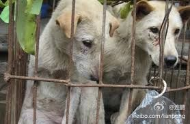

# 〈七星视点〉第四十三期：康德的人与边沁的狗

爱狗不爱人。——白岩松

荔枝狗肉节，是广西玉林的市民们自发形成的节日。夏至那天，食客们顶着烈日浑身大汗地剥荔枝吃狗肉喝米酒，大街小巷的各色狗肉馆生意红火。然而这“吃的节日”一经曝光PO上网络，**立刻招来了动物保护者、爱狗人士和各色微博明星的炮轰质疑**。

@**恒庄法师**：#呼吁#恳请您一起抵制“玉林狗肉节”！它们来自全国各地的偷猫、狗黑产业链，它们被残忍屠杀，被铁丝捏死、被乱棍活活打死、被火烧死、被滚烫的开水烫死，连幼猫幼狗都在当众活杀！它们在最后的挣扎无奈的呻呤！整个城市血流成河、尸骨遍地、腥味熏天。

@**张辛可**：#狗肉节#对于对于狗肉节大肆屠杀狗狗，你怎么看？坚决反对！这是非常无知、愚昧、残忍的行为！是丢国际丑的恶事！

@**广西动保坚决抵制玉林狗肉节**：招募天下志愿者和我们一起去广西玉林抵制惨绝人寰的玉林“夏子荔枝狗肉节”，那里每天将有上万个“汪星人”惨遭各种酷刑痛不欲生的惨死在玉林这座人间地狱！希望我们抽出短短的几天时间前往玉林抗议虐杀伴侣动物，强烈要求玉林政府取缔野蛮、残忍的狗肉节!有您的善念和行动才能拯救数十万个小生命。

**在反对声之外，也不乏持中立或支持立场的人**：

@**王金牙儿**：广西玉林狗肉节闹得沸沸扬扬。关于我们能不能吃狗肉，有没有可能禁止别人吃狗肉，这事儿涉及到逻辑、律法和常识。法律并没有禁止吃狗肉……爱狗者为狗争取狗权，是个好事儿，说明我们更懂得文明了。但是，爱狗，不能以混乱的逻辑去爱，不能用逼迫别人的方式去爱，不能以撒娇、指责、谩骂等等非正常情绪去爱。

@**粤语**：#玉林夏至狗肉节引争议# 粵地俗語有云, "狗肉滾三滾, 神仙都企唔穩." 主頁君覺得, 只要狗肉來源合法就得了, 反正咁多肉狗養殖場... 牛幫人耕田耕咗幾千年, 咪照樣畀人食... 唔食嘅人唔食, 食嘅人就食, 唔好用自己嘅價值觀強加喺對方身上, 咪相安無事囖.

到此为止，大家都能保持较平和理性的态度发出各自的声音，表达看法。而玉林官方也回应称玉林市政府从未举办过“荔枝狗肉节”，更从未提倡过。玉林市政府的一位副市长表示，政府若要完全禁止或取缔还没有什么依据，同时涉及至少数百万人的日常生活习惯，还需要一些时间慢慢引导。广西传统文化研究会副会长谢平祥则认为，**吃狗肉就是一种民间饮食习惯，不违法，和道德也扯不上关系。**

然而，随着北京加大了犬类管理力度，爱狗人士与支持政府这一行为的，甚至是中立的人们又起冲突。积水潭医院一位烧伤科医生因为在微博上发表反对养狗的言论，在6月29日上午7点遭爱狗人士留言威胁，称他们已组织好泼硫酸的队伍，提醒该医生如果不幸被烧伤请注意自己急救自己。

当天下午4点39分，此医生称“两个狗粉打上门来”并上传了多张受伤照片，可以看到手臂和前胸多出受伤且有伤口已经红肿。狗粉们跟帖评论说：

@**超级无敌大灰猫**：哈哈，我估计这家伙早晚被人打，没想到会这么快被俩女人打了。

@**舅舅的纠纷**：这丫的一天到晚发微博叨逼叨，真怀疑医院的医生闲成这样，丫还会治病吗？

而引起这一纠纷的导火索是之前发生了藏獒咬死小孩的事件，狗粉称人不惹狗狗就不会咬人，甚至称被咬活该。在这一事件里，**一些狗粉发表的言论，也让我们感到震惊**：

@**某网友甲**：我怎么觉得很开心蛤蛤蛤活该啊狗对人的报复啊！全都咬死更好啊！再斗狗啊再吃狗肉啊！人类杀狗的时候狗做错什么了？呵呵！

@**某网友乙**：狗咬死人的这种事我真是喜闻乐见随你们怎么说我就是没良心怎么样？对人类不需要有良心更何况他与我有半毛钱关系？我干嘛要同情他？见鬼了真是！你们大概都是他生的一帮杂种！我会给动物捐款但绝逼不会给人捐款！

@**某网友丙**：就是啊！狗懂什么，他们只知道肚子饿了要吃。主人不喂食，攻击路人怪谁？只能说那人命不好，正好摊上这种事。

狗粉是傻逼。——苍井空

因为部分狗粉的言论，**舆论又开始转向谴责狗粉，质疑狗粉的三观和智力水平**，甚至因为反对狗粉而更加支持杀狗吃狗。

@**李硕**：我现在强烈支持一切虐狗虐杀狗的行为，喜闻乐见，因为这可以让狗粉难受。这是一种正常人报复狗粉和捍卫自己正当权利的必要手段。

@**熊锐**：狗粉说，狗咬人是本性，错的在于主人没有牵引和受害者激怒了狗。其实这话也没错，孟子早就反驳过“杀人者兵也”的逻辑。不过我还有补充的，首先人类社会是人本主义，让人看见大狗躲开是不可能的。公共空间公民均有使用的自由，西方的做法也是主人牵着戴着嘴套，哪有人将就狗的？然后是因为烈性犬就伤人禁止养狗的决定，这就和禽流感杀灭所有鸡鸭，老鼠蟑螂传播疾病则杀灭所有一样的逻辑。人类对于其他物种可以采取预防性措施。最后，既然为狗开脱使用本能论，那么就不要再为搜救狗高唱赞歌了，狗不过本能而已。

爱狗有没有错？我认为是没有的，不论狗粉们如何宠溺自己的狗，那都是他们自己的选择，别人看到最多摇摇头说一句太病态了。他们也可以宣传发表自己对狗的极端喜爱之情，鼓励支持人们也这么做。**但是狗粉们不能将自己对狗的爱强加于其他人，挥舞着不自洽的道德大棒到处开炮。**到高速公路上拦截运狗车甚至殴打司机非但于情于理都说不过去，更触犯了法律。

狗粉的问题不仅在于没有认识到“别人的权利约束了自己的自由”，更在于他们爱狗胜过爱人，他们漠视自己同类的不幸却对自己的狗别人的狗充满了所谓爱心，如他们所说，“对人类不需要有良心，他与我有半毛钱关系？我会给动物捐款但不会给人捐款”。甚至他们主张一种人从属于狗的新关系，人类应该迁就狗，为狗服务。**这种主张显然是可笑荒谬的。归根结底，他们没有摆正人与狗的关系。**

所有的动物都是平等的，除了一些比另一些更平等。——奥威尔

动物是人类重要的蛋白质来源，是人类主要的食物。这种情况在过去、现在和将来都会存在。由此，**有一些人认为，所谓动物保护是非常吊诡的。**

@**海豹**：要是人类没需求的话这些动物根本就不会被养出来。

因为人类食用动物，所以饲养了更多动物，如果他们不吃肉，这些动物则根本不会存在。如果很多人突然改变了口味，不食用某种动物，那么关心此种动物的人们是不是应该更多的食用它们以保证它们的存在？如果假定生存过一段时间比根本没有生存过要好。

但这种假定是不是正确的呢？

试想把动物换成人类，若一对夫妻把他们的孩子数量限制在某个数目，一对孩子数已经达到此定值的夫妻想再要一个孩子必须在他成年时将他献祭，并食用。这对夫妻可以为自己辩护：如果这是不允许的，那么这个孩子根本不会诞生。而他诞生了，并存在了一些年，这必然对他更好。

这是荒谬的。**一个存在的人应该拥有自己的权利要求，即使是他们的创造者也不能随意对待他们。如果不能保证人的基本权利，生存过不一定就天然比没生存过要更好。**

那么，是不是动物一旦存在，也可以对自己的待遇拥有某些权利呢？这些权利或许不如人的权利要强。某些动物得以存在只是因为人们想做一些会违反这些权利要求的事情，这是事实，也是现实，但这是否就代表这些权利要求就根本不存在？

有一种意见是，是的，动物根本就不重要，我们也不关心它们。**我们关心的是如何对待动物会反作用于人的道德和思想，用动物的生命来满足人类的欲望本身似乎是无可非议的，但却会有一种道德副作用（moral spillover）。**

孟子：君子之于禽兽也，见其生，不忍见其死。闻其声，不忍食其肉。是以君子远庖厨也。

李渔：以生物多时之痛楚，易我片刻之甘甜；地狱之设，正为此人，其死后炮烙之刑，必有过于此者。

这个看法也有其矛盾之处。如果不管出于什么理由杀死动物都是完全可以接受的，那么为什么当一个人认识到动物与人之间有明确地界限，且在做出行动时时刻谨记在心，这种杀死动物的倾向还会使他变得冷酷呢？就会让他比其他人的道德水平更低，甚至更有可能做出伤害人与杀人的行为呢？

如果我喜欢精准地用棒球棒击飞棒球，是否就意味着我有更大的可能击打别人的脑袋？如果我没有能力理解别人的脑袋与棒球之间的明确界限，难道靠这样的规定和思想就可以消除道德副作用了吗？

有任何证据可以证明屠夫比其他人更容易犯伤人罪吗？

如果我们不考虑杀死动物的所谓道德副作用，进入边沁的功利主义世界，那么我们应该考虑所谓的价值。对于很多人来说，**食肉比食素所获得的快乐压倒了剥夺动物生命带来的生理痛苦和对人的道德谴责，食肉是可以接受的。**

可是这些人往往对虐杀猫狗的行为义愤填膺，要求“人肉”背后的“行凶者”，甚至主张对这些人施以私刑。**他们假定仅仅为了取乐而残忍地杀死动物是不能接受的。**

假设，我最喜欢做的事就是穿着高跟鞋跺脚，从中我会得到很大的乐趣，而如果在我跺脚的时候鞋下面有只小猫，小猫会被踩死。但我的快乐不来自于踩死小猫，而来自于跺脚。我也可以不跺脚，再穿一套黑丝袜也会使我愉悦，但这种乐趣和跺脚是无法相提并论的。

那么，为了得到跺脚的额外快乐而选择跺脚，对我来说，是合适的吗？

是否我们可以为了食用动物的额外快乐杀死动物，而不能通过“跺脚”（很有可能杀死动物的行为）来获得额外的快乐？

进而，我们发现把人和动物统一在一个功利主义的世界里是困难的：

一个人胃疼一下午或一只狗被残忍的杀死，该如何选择？

一个人被杀死以拯救十万头猪是正当的吗？

**功利主义被一个怪物纠缠着，功利怪物能从别人的牺牲中获得比这些人所遭受的损失大得多的功利。**人与动物都牺牲在了这个怪物的胃液里以便增加总的功利，而这是不可以被接受的。

人们要求动物永远居于从属地位并且几乎总是要求动物为人类作出牺牲。

**狗可以是边沁的，人则得是康德的，人不是手段，人是目的。动物可以为了其他动物和人的利益而被利用，但是人绝不可以违背其意愿为了动物的利益而被利用。禁止为了动物的缘故让人承受任何不幸与损失。这是“对动物的功利主义，对人的康德主义”。**

在这种规定条件下，我们可以推出阶梯型的道德地位：

  1. 该存在不可以为了任何其他生物而被牺牲或被伤害
  2. 该存在只可以为了处于更高级序列的存在，而不可以为了同一等级的其他存在被牺牲和被伤害。
  3. 该存在可以为了等级序列中同一等级或者更高等级的其他存在而被牺牲和被伤害。

动物们无疑是居于第三等级的，因为有一些动物当然可以为了另一些动物的利益而被牺牲。人似乎是居于第一等级，但是，人也有可能沦落到第二等级。因为第二等级的存在物虽然不可以为了同一等级或更低等级的存在物被牺牲，但他们可以为了更高等级的存在被牺牲。如果他们尚未遇到更高等级的存在，他们就会莽撞地认为自己处于最高等级。

而很多科幻小说已经向我们展示了当有更高等级的存在到来时，甚至低等级动物逆袭后，人类被牺牲的“惨剧”。

**就现实来说，动物是工具是不可能被改变的。**我们将会食用更多的动物，用它们做药物试验、解剖实验甚至猎杀它们为自己带来愉悦。但是我们也可以去寻找更好的对待它们的方式，例如动物实验的3R原则（替代、减少、优化），用没有使用没有知觉的实验材料代替活体动物，用最少的动物达到所需要的目的，优化实验程序、改进技术以最大程度地保护动物福利。例如，英国出台了专门的《实验动物法》，对怎样使用实验动物，怎样把实验动物的痛苦减少到最低点都做出了明确的规定。

**作为食物链中的一环，我们绝对无法做到停止伤害动物，停止牺牲它们的利益。但至少，我们可以找到一种“最不坏”的方式对待他们。**

（编辑：张山骁；责编：张舸）

[【阿猫阿狗】<七星说法>第八十九期:恶犬伤人，何以治犬 ](/archives/39350)——对一无所知的狗，就算实行了剥皮、腰斩、车裂、凌迟、烹煮等种种极刑也无关痛痒，反而颇具有“以牙还牙”的同态复仇之意，暴露了一向自视为“万物灵长”的人类的心胸狭隘。 

[【阿猫阿狗】<七星百科>第六十八期:动物福利](/archives/39074)——动物福利是指为了使动物能够康乐而采取的一系列行为和给动物提供的相应外部条件。动物福利的内涵非常丰富，而以欧盟为代表的许多国家和地区以法律的形式在某种程度上对动物福利进行了界定和保障。 
