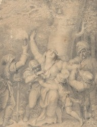
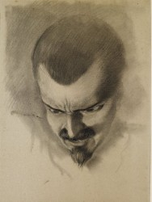

# 压寨夫人

当初你像是切西瓜一样劈开了我丈夫和孩儿的头颅，我没有掉一滴眼泪。在众多雄壮的凶徒中，你却是个瘦子，还矮，还黑，你的眼睛远远地把我的眼睛捉住了。我无视身边的杀戮现场，也不管丈夫和孩儿的鲜血溅满我的衣裳。我知道我终究要做你的压寨夫人。你不让手下把我捆绑，你栗色马儿驮着我往深山里走。船舱在我身后噼里啪啦燃烧，烧毁了我前半生，也断绝了我做县令夫人的命运。从此我要跟你这个土匪头儿，在平原和山野之间不断杀戮、逃离，因为从此以后，我就是你的压寨夫人了。

我没有什么美貌，只是一个平淡无奇的女子，嫁给那书生之时，也不知道怎样才能做一个好的妻子。书生用功读书，进京赶考，挣得了官宦生涯半生，他不会多与我说话，他的公务才是他最为萦绕于心的。孩儿也是寡淡的性格，跟他爹一样沉默如死人，且读书，且应试，我为娘的只能在边上默默与丫头做些针线。那些时光里，我忘却自己也是存在的，做一个夫人，偶尔跟那些官太太应酬，剩余的事情就是如何打发这无穷无尽的漫长时间。我也曾跟官人说放我出去走走，官人说这成何体统。他严肃正经的表情，让我觉得做了一件非分之事。孩儿只与奶娘亲热，见我敬畏有加，我想拉他说话他也只是客客气气，见此我也无说话的欲望。

他们都死了。你把他们连同所有仆人都给剁成肉酱烧成灰，劫得微薄钱财，你不知我官人是个正直人么？然而，我不会哭的。你的马儿颠得我身子疼，我也不会喊叫的。风吹松林，浩浩如波涛袭来，清冽的空气中裹挟着山野万木的清香。你且看我，再看我，一直地看我，你骑着的枣色马儿，跟我的栗色马儿同行，你瘦削的脸上双眼炯炯，把我罩在你的目光之中。我生不起恨，我也不疼惜我的锦绣夫人生涯，那仿佛是可以轻易丢弃的华衣美服，不足以我转身哭号一番。你放心，我不会逃跑，不会呼救，我只是安静地匍匐在马背上，听着这俊美的生物勃勃的心跳。

在我前半生的生命中，我见到的男人都是白面书生，他们肃穆雅致，喝茶走路，吟诗颂词，迈着小步。而你把我抱起，往你的房间走去，那步伐稳稳中带风，我的腰身被你手牢牢地控住，我知道我是安全的。你可以让我安然地进入到你个人的世界。那里有你的宝刀、虎皮、酒壶，还有你的床。我望着你，我不害羞，我看着你在灯火中脱尽你的衣服，你结实而精瘦的身子，你大大的喉结，你勃起的阳具，都坦然地裸露于我的眼前。我第一次敢于直视男人的肉身。我难以想起当初那死去官人的身躯，那白皙的肉体被重重的衣物包裹，又在黑暗中匆忙剥落，仿佛这也是件可羞耻的事情。而你不，你把手放在我的腰间，手指隔着我的衣耐心地盘旋。你一件件放开束缚我的一切，衣服也好，拘谨也好，你把我撬开，仿佛去取一颗从未有人染指的珍珠，只有你知道它在哪里。你让我想大声地叫，那想叫的欲望如此强烈，它要冲决我的喉咙。然而我不敢也不能，你却低头去看我，你的眼睛在鼓励我，你耸动的身体一波波冲击我勉力维持的矜持。终于在仿佛是白热化的激颤中，我再也忍不住喊叫起来。

你是我的压寨夫人。你说。你把手放在我毫无姿色可言的脸庞上。你真美。我一闪而过的黯淡眼神也被你捉住了。不，你很美。你的手滑到我的胸脯上。我直直地盯着你。你是说真的。我知道。你是个土匪。你没必要讨好一个平淡的女人。你是我的压寨夫人。你再一次说。我扭头看空荡荡的房间，这里是你的世界，你的天下，你拥有一帮跟随你的凶徒，你说一不二。你军令如山。而今你宣告我是你的。你的压寨夫人。我看见月儿在窗外，那是我多年来久久凝望的月儿，一日复一日，我只能跟它说话。现在它又来了，在枝桠间盈盈欲滴。对，我只能接纳现今的命运。我不会哭的。

我跟你见识那些杀了我丈夫和孩儿的凶徒们，他们好像忘记了杀人的事情，在我面前各个如孩子一般低下头，尊称我为“夫人”。为什么我走到哪里都是夫人？而你端坐在你的宝座上，与弟兄们大口喝酒，大口吃肉。你的眼睛却不放开我。你喝酒的海碗都遮挡不住你看我的眼神。我怕什么？我回望你。我们仿佛在做一个考验耐力的游戏。我不会收回我的眼神。你也不会。众人喧嚣，都遥遥地在天边。而酒入你喉咙的咕噜声却在我耳边听得分外真切。我们又在床上对战。你的身体。我的身体。你冲击我。我回击给你。而我的回击勾起你更大的冲击。我们互不相让，又各得其乐。你的喊声。我的喊声。肉体的碰撞声。你执拗地妄想压倒我。而我又岂能败给你？

你杀过多少人？你埋伏。你劫持。你杀杀杀。你烧烧烧。你劫持的那些女人们都去了哪里？她们都是哭哭啼啼地绑成麻花送到你的土匪窝里来的吧。她们祈求上苍解救，祷告山神显灵。她们期期艾艾、哆哆嗦嗦、哀哀怨怨，都给你的眼睛都杀死了一大半吧。你个土匪头子，你讨厌这些女人，如讨厌落水的狗。你必然像杀死她们的男人那样奸杀了她们是吧？我知道。你的眼神中扫过去，你的那些兄弟哪个不是吓得一哆嗦？然而，我怕你什么？我并非不怕死，只是如果活得太腻味的话，还不如这样。

你知道我不会逃走，相反我乐意盘踞着腿坐在你的宝座上喝酒吃肉，我开口大笑，我放声歌唱。我拍着这些杀了我丈夫和孩儿的凶徒们，我把曾经父母和塾师教诲的妇德全然甩到了山外。我跟你们在篝火边舞动。我是你们这些王八蛋的压寨夫人。你泠然地在角落，捉着我的腰肢，我用后脑勺也能感觉到。凌晨你哒哒的马蹄在窗口响起，我也奔出来，骑上我的栗色马儿。我要跟你们一起去杀人放火。我要跟你们穿过山野丛林，然后埋伏于一人高的荒草之中。嚯嚯嚯。锵锵锵。惊慌的旅人哆哆嗦嗦地求饶，你站在我身边，冷冷地看着凶徒们割去那些人的头颅，搜刮那些人的钱财。我跟着满载而归的你们回归山野，我也跟你高兴地在山谷之中呼叫。你是不叫，你的嘴角挂着浅浅的微笑。

官府悬赏你的人头。赏银加了又加。要抓要杀你的人何止官府呢？你结了多少仇家，哪个不要吃你的肉喝你的血？你焉能不怕？我见过多少你杀戮的场面，杀了就杀了，我从来不会存留于心。而你记下来你犯下的每一笔血债。你落草为寇之时，一遍遍告诉自己是个土匪。你内心认定土匪有罪。你恼火。你愤懑。你辩护。你也希望把一切罪孽一笔勾销，重新来过。你也许认定我那丈夫的生活才是你渴望要的。你倒是掩藏得很好，以为谁也不知？我跟你连日逃离山野，你的凶徒们都一个个在官府的围剿中给砍头了。你远远地看着他们的头颅在城墙上高悬。你的脸色是冷冷的。然而你却不给我你的眼神。我知你是惊惶的。你枣色马儿在你的胯下不安地踢踏着。

你在那一天的晚上突然问怎么从来没见我想念过以前的丈夫和孩儿。我在找你的眼睛。你却躲开了我。我见那萤火虫从屋顶的燕巢里盈盈地飞出，油灯啪的响了一声。而我的眼睛却渐渐地湿润了起来。我忽然想起在那官府后院的种种往事。我想起丫头伺候着我梳妆打扮。我想起铜盘里朗朗升起的水汽。我想起假山下面开的那朵野花。我想起的碎片，个个尖利地扎向我的心。我不记得我生命中那两个一模一样的男人。他们如淡淡的黑影在我的平白无奇的屏风上。然而我依旧哭了。我抱着自己的裸身放声大哭。我不哀痛。我只是惆怅。而你，却抱起我。我哽咽不成声，你就把我抱得紧紧的。你说我只要想回去依旧是可以的，你是不会阻拦的。你果真不阻拦？我问。我果真不阻拦。你肯定地说。那好。我起身，也不去穿衣服，直接走到门口。夜风凉沁沁的，远山隐隐抛出陡峭的曲线。那我走了。我回头看你。你走。你安坐在床上，嘴角挂着笑。那我真走了。我跺脚。你走啊。你大声说。我冷笑了几声。你以为我不敢？我不敢。你突然说。

你平日里绷得紧紧的，凶徒们个个以为你真真是个天不怕地不怕的英雄好汉，而每当深夜看你熟睡之时簌簌发抖的身子和梦话，我知道你哪里有不怕？你像个孩子一样，我抱着你。让你在我怀里安睡。我是不怕的。我不会因为你落魄而嫌弃你，我也不会因为你得意而讨好你。你是一具肉身，当我们缠绞在一起的时候，你粗狂、你细腻、你疯癫、你缠绵，你把路边的野花递给我，你把山谷的清泉捧给我。官府剿杀的鼓声咚咚，仇家追撵的脚步声嚓嚓，你只有我。你所有的凶徒都死了。他们的头颅将会在城垛上腐烂，乌鸦啄着他们的腐肉，野狗啃噬他们的骨头，而你的枣色马儿，我的栗色马儿在幽暗的山林中，你只有我，我也只有你。

现在你熟睡了。簌簌如雨落的虫儿振翅声，响在我们身边；露水濡湿了我们破烂的衣裳。你喃喃的梦呓在我耳边，你的手忽然在举起挥舞砍杀。而我把你抱紧。明日我们依旧要逃亡，或许我们终究会死在敌人的刀箭之下，那又有什么关系呢？当初你的眼神把我捉着不放，现在我也把你捉住不放。你勇猛的气概在白日对阵之时喷发，那夜晚就把你的恐惧交给我吧。现在我想唱歌，月儿升起来，银光四溅，那是我们的世界。睡吧。睡吧。我在这里。不要怕。不要发抖。你别忘了，我是你的压寨夫人。

（采编：张山骁；责编：王卜玄）

[【隔夜梦】失去睡眠的梁先生](/archives/41474)——他惨淡地一笑，说还是算了，毕竟睡完女人后不能擦干净睡一觉，而是默默躺着数自己多少个小时以后能再睡她一次，世界上没有什么比这个听起来更令人感到绝望的了。

[【隔夜梦】恋梦者](/archives/41536)——“这里建好之后就会被水淹没，以后我们再也没办法来到这里了。” “所以呢？” “如果我现在跟你表白却被你拒绝的话，我以后也不会因为触景生情而难过。”
