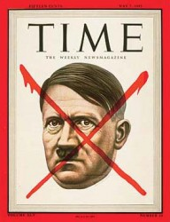

# 红X

【审查者的独白】

事情起源于一个我正在审查的电影剧本。

我发誓，这个剧本，不是最近一年我看到最好的，它是我到这个位置之后，看过最好的。它让我心惊肉跳。在内心深处，我最不想枪毙的就是这种剧本。平均每天，我要看三个以上的电影剧本，那些东西百分之九十是垃圾，在那个“粪坑”里，只有它叫我眼前一亮。它是颗埋藏在黑泥巴里的珍珠。就因为这个，我同意和那个年轻编剧见上一面。好吧，也许不是因为这个，也许是因为她，引起了我的好奇。直到今天，我也不清楚当初如果我拒绝了她，事情会不会好一些。

我们约在一家咖啡馆见面。这是个搞电影的人经常聚在一起吹牛和翻白眼儿的地方，名叫C.K.。我迟到了整整一小时。我可能是故意的。在二楼，我找到她。之前已经通过电话，但见到她本人，我还是忍不住，再次眼前一亮。

1

（她站起来，帮我要了一杯黑咖啡）

我看到了徐克，刚才。

（我下意识地看看周围，在她对面坐下）

真的？

嗯，就在你进门之前。

他在干什么？

喝咖啡，看报纸。知道吗，前天下午，也是在这儿，我还看见了陈国富，他和几个人在这里开会。开了整整一下午。

在这儿？

对，就那张桌子，你身后，靠墙、有台灯的那张。四个大男人，一下午，都没笑过……你审过他们的本子吗？

是的，有那么一两次。

它们通过了吗？

没有。当然。

你是个挡门神吗？

不，我只是个小公务员。

2

（我喝了一小口咖啡，忍不住飞快地扫了一眼桌子下面她的大腿）

……你的剧本，我看了。

怎么样？

它很……

很糟糕是吗？

不，正相反，它很……生猛。

生猛？

对，没人这样写剧本。

你是说，我太外行？

不，你写的很生动、很微妙、很深刻，也很……请原谅，很露骨。

你说它过于色情？

它是个非常出色的剧本，但是很抱歉，我没法让它通过。

为什么？我没有写政治……我用谷歌搜索过，没有敏感词。

你的主人公是一个性瘾者。

这有什么问题吗，电影不可以表现他的生活？

务实一些好吗？……你的剧本，性场面一个接着一个，而且，它们都很……具体。当中还隐含着一触即发的乱伦。

我想作为编剧和导演，你自己也很清楚，如果真把它拍出来，那会达到什么效果？你会把大家吓着的，它会引起一场风波，你会被大肆炒作。于丹小姐，不管你觉得它是色情还是艺术，有些东西，法律是不允许的。这不是观念问题，这是法律问题。

（她停顿了一下。我以为她一定是生气了，但事实却恰恰相反）

我喜欢你叫我于丹小姐。我真的喜欢。但我得说，我的故事，它的主题是严肃的，我试图用它来探讨的是一种现代病，还有，人类最永恒的孤独感。也许。

你可以把它写成小说，如果非要拍电影的话，那你是在浪费自己的时间。这样的电影，在这里是不被允许的。

“在这里”指的是在这个国家？可我写的是个真实故事。

它发生在你自己身上？

不。

（我不得不沉默了好一会儿）

你知道写一个审查鉴定，需要花多少时间吗？要打多少电话，填多少表格……如果我向上提交了这个剧本，就会有更多的人来参与讨论，你需要花时间去召集他们，他们又需要花时间来阅读剧本、写审查鉴定，填表格……

所以，为了节约行政成本，最简便易行的方法，就是由你，审查官大人，在上面打上一个X，然后，我整整两年的心血，就被判处死刑，丢进了碎纸机，对吗？

我们没有碎纸机。……请你冷静一点儿。知道每年有多少电影在我的图章下消失吗？

决定一个电影生死的感觉，一定很棒吧。

是的。一开始的确是，包括徐克、陈国富，他们都吃过这个X。你并不特殊。

为了能拍这部电影，我愿意承担任何风险、做任何事。

（我很认真地愣了一小会儿，我想知道她说这话，究竟有多认真）

你没明白……我理解，你刚从好莱坞回来，对吗？

是的，我在那里学了四年电影。

美国没有电影审查吗？

有，但我的剧本肯定能通过他们的审查，我向你保证。

哪怕被定为NC-17级。

好过死在碎纸机里。

我说过了，我们没有碎纸机。

我送你们一台！我打赌，它的使用率会很高的。它能提高你们的（枪毙剧本的）效率。

我承认，这是个很不同寻常的剧本，尽管里面充斥着色情内容，我个人依然对它持开放态度，但我们必须尊重客观现实，这里是中国，不是好莱坞。

那你干嘛叫我来？

（我愣住了，有些气恼）

我知道你对我的看法：我是个伪君子，一个自我压制、阉割艺术天分的小官僚。

我没这么说。……你不是吗难道？

3

（我在喝第二杯黑咖啡，她还年轻，我觉得我有必要说服她）

你写到一个坏警察。

他不是警察，更不是坏警察，我只是揭示了他有堕落的可能。

所以，如果我网开一面——当然我不会，我不想给你还有我自己招惹不必要的麻烦——我是说如果我肯网开一面，这个剧本恐怕不得不送交公安部。

为什么？他们要把电影里的坏人也统统抓起来吗？

除此之外，你还写了一个十六岁的女中学生。教育部也可能要看剧本。

教育部，凭什么，他们不是卖课本的吗，还管剧本？

他们不管，但当他们想管的时候，手就会伸过来。这不是最糟的，最糟的是高潮戏之前你写了一个喇嘛。干嘛要写个僧侣？

他们的造型很别致你不觉得吗？我都想好了，那场戏会是一个长镜头。

我说了，我喜欢你的剧本，包括这个情节，老人的善意，反而给了主人公最后一击，很深刻，是向伯格曼致敬？

不，是向昆汀。

哪一部？

《杀出个黎明》，看过吗？

那里面没有喇嘛。好吧，我们不说这个，我的意思是，不要涉及宗教，一丁点儿都不要有。总之，如果你肯改的话，不要宗教、不要警察、不要未成年犯罪……

你还给我剩下什么？

要不就和大家一样，把故事放在民国……但色情内容还是要删。

删多少？

……全部。

这不是修改，这是阉割。

自尊心和你的事业，哪个更重要？如果你迫切需要表达，完全可以把它写成小说。

父母送我去好莱坞，不是想让我成为作家，我学的是电影导演课程……我的梦想是，作一个电影导演。

这是你第几个剧本？

第四个。

之前的怎么样？

没这个好。

都是这种风格？

对，我喜欢犯罪题材，喜欢大卫•芬奇，你没看出来，这个电影有《七宗罪》气质？

所以，这是你自我评价最高的剧本，你想当导演，在国内拍这个？你以为只要剧本好，就可以无所顾忌？你以为，审查可以对像你这样漂亮年轻的女导演网开一面？你以为……你生气了？

我没有。

你是不是以为没有审查，一切就都能迎刃而解？让我告诉你审查的另一面：没有审查，将没有象征，没有隐喻，没有戒律，《瘾者》是一个关于欲望的故事，但观众没必要看到赤裸裸的性爱。

……我说过，这是一个真实的故事，真实，你明白吗？

4

（我真的很懊恼，和女人讨论这些事让我很是不快）

你一定觉得我们这种人，很残酷，像潜伏在人们头顶的怪物……

不，你看上去和普通人没有什么两样，甚至更温和。

但我们令人压抑、制造冷漠、遏制想象，让人们之间相互抱怨，产生隔阂，不肯以诚相待？可是，不要什么都推给审查，人是自由的，想象力很大程度上是被人自己扼杀的。人们 学会了自我审查，并且怀有被迫害妄想，这是国民性格。

我的电影很单纯，没有政治隐喻，至少我没这种企图，我只想用性和犯罪剖析人性的阴暗面，这种阴暗，在某种意义上讲也是神圣的。你不觉得吗？

在这个地方，表现和探讨阴暗本身就是阴暗。《无人区》是最好的例子。

我看过它的剧本……和我的故事比起来，它简直就是《阳光小美女》。好吧，我明白你的态度……（她还想做最后的努力）如果有了分级制，这种情况会不会好些？我不反对审查，我反对的是审查没有依据。

有记者曾经问张艺谋，问他对分级制推行缓慢怎么看，他只说了一句话。

他说了什么？

“那是国家的事，我不懂。”

他为什么这么说？

因为，他懂。

他曾经是受害者，后来他成为受益者。但最终，他还是受害者。

让我来告诉你什么是分级制，让我来Google一下……好了，有了，“电影分级，指根据影片内容来规定和划分适合观赏的年龄段。在一些地方，电影分级可能具强制拒绝未成年人看某些电影的法律效力……许多国家的政府都设有电影检查和制定分级的单位，站在政府的角度，检查制度的好处，是可以事先掌控可能具有威胁性或破坏性的电影，又不会过度侵犯人民的言论自由权……”

你相信吗？

（我不喜欢被她打断的感觉）

请让我念完，“中国大陆一直没有实行电影分级制度。当局声称，难以有效控制青少年观众进入市场、影院、网络和网吧，观看并不适宜其观看的级别的电影的情况，故未实施。2005年，一份被称为《中国电影促进法》的电影分级制度方案，被全国人民代表大会否决……Google上怎么会有这种东西！”

这句什么意思？

哪句？

下面这句——“有分析认为，若分级制实施，一些出于政治原因的删减，例如在《那些年，我们一起追的女孩》删除学校操场升旗礼中出现的中华民国国旗画面，就难以实施及解释其合法性”这句。

意思是，分级制会给政府带来麻烦。

什么样的麻烦？

很大的麻烦，这很难解释。总之，我个人并不看好分级制。你没有在录音吧？

（我突然有些紧张，但她没给我继续怀疑的机会）

所以就消极对待，是吗？可我觉得，分级制势在必行。

站在我的角度，我见过太多一厢情愿。

《金陵十三钗》在美国被定为R级，你知道吗？

不知道，也不关心。

既然你们的审查这么严格，为什么你的剪刀没有剪掉它的残忍而只是帮它修了修头发？我闺蜜带着女儿去看这个电影，她的女儿6岁，当场吓尿了裤子。

呃……我很同情。

我的闺蜜想和影院打官司，被老公阻止了。影院经理送给他们一桶爆米花。一桶爆米花！

他们吃了吗？

你什么意思？我是说，越来越多的家长会遇到类似情况，会意识到这是个严重的问题，他们的反应也会越来越强烈，他们是市场的终端，是支撑票房的主流消费人群，他们的需求会被重视，并对政策形成压力和影响。

这就是我所说的一厢情愿。你在美国呆太久了。这些年轻的家长，恐怕他们需要操心的事情要比这多的多，电影分不分级是所有生存不安全因素里最微不足道的一个，他们可能会为婴儿奶粉和人拼命，但相信我，他们绝不会因为电影没分级和什么人发生真正的冲突。他们最多会抱怨几句。抱怨也是我们生活的一部分。

用分级来取代僵化的电影审查，是市场决定的，是社会发展的必然，是大势所趋。

不存在你说的这个大势所趋，创造力萎缩才是大势所趋。

创造力萎缩不正是你们的遏制造成的吗？

别开玩笑了，我们最多拖着你的后腿，但我们并没有阻止你思考。你有没有想过另一种可能，实行了分级，同时现行审查也没有取消，结果出现双重审查，拍电影会更没有自由。

会这样吗？

不知道。

这不可能。

这不可能？

不可能。

为什么不可能？

这是个文明社会。

5

这么说，你坚持认为，分级制会打开中国的潘多拉魔盒？

不会。

为什么？

因为中国的盒子，早就已经打开了。

（她长长地叹息了一声，突然伸出手，来抚摸我蓬松的头发）

苏格兰人祝酒时有句常用语——“希望你能在天堂呆上半个小时……在魔鬼知道你死之前。”

你是在说，这里是创作者的地狱？

它本来就是。再来杯咖啡吗？

不了，谢谢。这么说，徐克和陈国富都来过这家咖啡馆是吗？

是的。

他们来干什么呢？

聊剧本，还能干什么。

你猜，当他们聊剧本的时候，他们都聊些什么呢？

6

（她站起身，坐在我的旁边）

听过那个说法吗——“审查，是人类异化的一个范例。当审查者自身的弱点和痛点被触及时，他们的反应会格外强烈，这是天性，也可能是权力的症结……”是这样吗？现在，请你诚实地告诉我，你是个性瘾者，对吗？

当然不。

可你对我的肉体有兴趣，对吗？诚实些！

这并不能证明什么。恰恰相反，我没有因为对你产生了兴趣或者欲望，改变我在审查你的剧本时的统一标准。

就是说，不存在潜规则？

不存在你想象当中的那个潜规则。

那是因为我的电影太出格。如果它不是那么犀利，不是那么离经叛道……如果它在你们的红线之内，你会不会利用你手里的权力……

（她突然伸出手，在桌子下面，握住了我的生殖器）

请你不要这样！

为什么不？

你在干什么，捉弄我吗，就因为我给你的剧本打了个X？

不，我这么做，是因为我喜欢你。 （

她在那个部位反复揉搓）

够了！我要离开了。

你没有勃起，是因为你阳痿，对吗？作为审查官，你是不是看了太多令人阳痿的剧本和电影？一定是，因为，你们从不肯给那些能令你们勃起的电影放行。如果我按你的要求修改我的剧本，你会让它通过吗？

如果你想拍这部电影，必须重新写剧本……我会给你一些具体建议，告诉你边界在哪里，什么是可以拍的……什么

不可以。

（她笑了）

你真可爱，你……抖地就像个筛子。

……在我们的筛选之下，也有好电影。

比如什么，《色戒》？他们是用什么方法让剧本通过的，像我现在这样？等等，你……勃起了。感谢上帝，你终于肯放下成见，享受偷情带来的快乐了。

这不是偷情。

可你并没有真的离开，不是吗。你享受着这一刻。

……好吧，我们一起来做最后的努力，试试看，能不能让你的剧本得到通过。现在，请放开我。

然后呢？我需要带你去开房吗？结束了。不会再有下次了。

你……什么意思？我不明白。

我不需要了，我不需要这个剧本通过你们的审查。它已经拍了。

什么，拍了？它是一部地下电影？

不，它是一部美国电影，在今年7月已经上映了。名字叫《羞耻》。

你什么意思？

你没看过那部电影，对吗？我只是把里面的人名、地名换成了中国的，你完全没有看出来。

为什么，你为什么要这么做！

我只想知道，这样的剧本，会以怎样的方式在你的手里被枪毙。

你太过分了！

是的，太过分了，可我治好了你的阳痿。（她起身离开了我，走了几步，她又转过身）…… 对了，我忘了说，是你的妻子让我来的。为了治好你的病，她付了一大笔钱。她真的很爱你。再见。

(**采编**：张山骁；**责编**：王卜玄)

 [【隔夜梦】压寨夫人](/archives/41510)——在我前半生的生命中，我见到的男人都是白面书生，他们肃穆雅致，喝茶走路，吟诗颂词，迈着小步。而你把我抱起，往你的房间走去，那步伐稳稳中带风，我的腰身被你手牢牢地控住，我知道我是安全的。 [【隔夜梦】失去睡眠的梁先生](/archives/41474)——他惨淡地一笑，说还是算了，毕竟睡完女人后不能擦干净睡一觉，而是默默躺着数自己多少个小时以后能再睡她一次，世界上没有什么比这个听起来更令人感到绝望的了。 [【隔夜梦】恋梦者](/archives/41536)——“这里建好之后就会被水淹没，以后我们再也没办法来到这里了。” “所以呢？” “如果我现在跟你表白却被你拒绝的话，我以后也不会因为触景生情而难过。”
