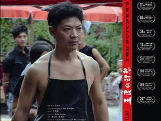

# 高雄杰《王良的理想》独家首映

 当代中国快速的城市化过程中 一群底层人演绎着自己的忧伤爱情 持着朴素理想的屠夫王良 向往城市虚华的妻子李俏 还有一份不完整的婚姻…… -------------------------------------- 分 割 线 -------------------------------------- 【时间】2012年12月22日 周六 14:00-17:00 【地点】706青年空间 (海淀区 华清嘉园甲13号楼1607 ) 【门票】15元（会员价：13元），均含赠饮 【问路】158 1121 3658；159 1078 8953 【公交】城铁五道口站/线路：86路、375路、398路 【地铁】五道口站/13号线： 从起点向正西方向出发，沿成府路走30米，左转进入财经东路，沿财经东路走180米右转即到 声明：青年沙龙所放映的一切电影及影像作品，均已获得原版权所有者授权许可。我们郑重声明不复制、不上传网络、不向他人借阅影像拷贝。 声明：青年沙龙 CICC 所放映的一切电影及影像作品，均已获得原版权所有者授权许可。我们郑重声明不复制、不上传网络、不向他人借阅影像拷贝。 -------------------------------------- 分 割 线 -------------------------------------- 【故事梗概】 《王良的理想》 Wangliang's Ideal 导演：高雄杰 片长：119分钟 类型：剧情片 完成时间：2010年 忠厚老实的王良在镇上当屠夫，他举债娶了高考落榜的李俏。两人立下婚前协议：王良支持李俏再考一次大学，考上了就离婚，考不上两人好好过日子，此前两人不同房。镇上有人传王良的闲话，说他那玩意不行。王良为此跟人打了一架，但仍然遵守协议。李俏再次考试失利之后，王良希望能和她好好过日子，但李俏去往了城市。她决定进城打工，挣钱还王良的彩礼钱并与他离婚。王良决定追到城市，把妻子带回家。王良历经很多艰辛，终于找到了妻子。王良的理想是希望有个安稳的好日子，理想很朴素，但又有些难以企及。 ------------------------------------------------------------------------------------------ 【参展、获奖情况】 第46届卡罗维法利国际电影节“独立论坛”竞赛单元 第15届釜山国际电影节“亚洲电影之窗”单元 第17届法国沃苏勒国际电影节主竞赛单元 第5届华语青年影像论坛影像展“特别放映”单元 2010香港独立电影节“独立视野”单元 2011巴黎影子电影节“中国独立电影” 第12届卑尔根国际电影节（北欧最大的国际电影节） 第34届美国米尔谷电影节 第24届新加坡国际电影节 第60届德国曼恩海姆-海德堡国际电影节"国际发现"单元 ------------------------------------------------------------------------------------------ 【导演阐述】 这部电影没有什么使人意外的情节，只是讲述一个乡村男青年的“理想”，如何被一个乡村女青年的“愿望”毁灭了。李俏的愿望就是逃离乡村。这样一点可怜的愿望实现得却极艰难，她走向城市的过程近乎挣扎。王良是城市化的牺牲品，是这一历史过程中被刻意牺牲的边缘化的廉价劳动力。他们的贫困是城市化的恶果，他们的愚昧肯定不是他们自己造成的。我所能做的，就是讲述这样一个故事，算是对他们的祝福，又算是一种祭奠，祭奠一种微弱的底层的渴望和挣扎。牧歌时代结束了，即便农夫也不再有闲暇吟唱牧歌。我们的思虑不能不变得沉重和忧虑，那虽然会损失一些美，但更真实，更切近实际。我希望全世界都能看到这部电影，希望有更多的人来关心那些容易被遗忘的人们。希望他们了解我的家乡——浙江永康，在我的家乡曾经有一群人这样在这个世界上生活过，他们有血有肉有情感。我一直相信，百姓演绎的历史是最真诚、最真实的历史，百姓是最好的故事表演者和讲述者。 -------------------------------------- 分 割 线 -------------------------------------- 放映会流程： 主持人介绍本次放映主题（5-10分钟），影片放映（119分钟），自我介绍+自由讨论（60-90分钟）。 讨论方式： 围绕主题，畅所欲言，杜绝人身攻击和意气之争。 报名说明： 由于场地限制需要预约，每次活动限报50人。报名请加入QQ群@群管理员均可报名。北京地区青年沙龙qq群：262627385。若有疑问，也可在群内咨询。 -------------------------------------- 分 割 线 -------------------------------------- 青年沙龙 CICC <Civic Imaging Center for Campus> 是一个创建于2012年5月的非盈利独立文化推广组织，由一群青年(大学生)志愿者协同运作，旨在通过展映、沙龙、聚会、讲座和读书等多种途径，发现、整合和推广有鲜明个性的独立文化，并致力于成为中国最具特色和最有活力的独立文化活动组织者。 豆瓣小站：[http://site.douban.com/177837](http://rrurl.cn/9NAgex) 新浪微博：[http://weibo.com/starsalon](http://rrurl.cn/i6kVq5) 电子邮箱：starsalon@vip.qq.com
