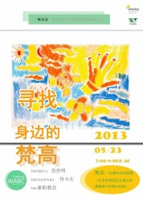

# 寻找身边的梵高——“we关注”系列公益沙龙第五期文字记录

活动嘉宾：苗世明 WABC（无障碍艺途）创始人

佟小左 WABC北京区负责人

WABC是一个设想用艺术来帮助这些残障人士心理的恢复的公益组织，全名是【无障碍艺途】。创始人是毕业于中央美术学院的苗世明，他所开创的社区服务（即通过在社区建立教学中心来帮助精残人士绘画）主要分为及理念传播构成艺途的两个方向，意在让更多的人通过学员画作衍生产品和志愿活动来接纳残障人士，并且理解这一类特殊人群。

**苗世明：我与WABC**

苗世明主要分享了两个对他创建WABC影响和触动最大的故事。有一次苗世明到一个社区给残障人士讲课，一个患有小儿脑瘫的学员突然在课上发言，由于口齿不清，在场很多人并没有听懂他想表达的意思，苗世明后来才了解到，他说的是：“我们残障人也需要当代艺术”。就是这句出人意料的话改变了苗世明对整个残障群体的看法，他意识到，原来这个群体也需要艺术，只是他们需要的可能是一种特殊的表达方式。

还有一次，苗世明办完画作展览到原来教学的社区归还画作，当他经过长长的走廊的时候，突然听到有人在后面大声的在叫“苗老师”，回头后才发现是一名社区的学员。听到他的呼喊后，一大群学员都从屋子里跑出来热情地将苗世明团团围住。事实上，苗世明和这些学员只短暂相处了一个月的时间，并且在此之前也将近一个月没有见过他们。分享的时候，苗世明仍对那天的场景记忆犹新，他说，那是一场“灵魂的奔跑”，他永远也不会忘记他们奔跑时的表情和跑步时的姿态。

Q&A

Q：请问无障碍艺途为学员带来了哪些直接的改变呢？

A：艺途通过艺术用另一种形式的沟通，来对他们进行心理上的疏导，使他们可以在绘画中开发内心世界。

Q：无障碍艺途如何引导残障人士进行创作呢？

A：从不否定他们的创作，遵循其个性，并进行良好的引导。

Q：你们有考虑过在物质方面给予这些残障人群补助吗？

A：这一点艺途也是在做力所能及的事，比如衍生品义卖等等。但艺途本身物质帮扶能力有限，我们也在寻找政府的最大化帮助。最主要的我们可能还是精神上的扶持以及社会引导作用。

**佟小左：和他们的那些故事**

接下来分享的是艺途北京地区代表佟小左。她首先系统地为大家讲解了“脑部残障”的划分：脑部残障主要分为智障（唐氏综合症）、脑瘫、非精神病（受后天刺激）、自闭症。对于自闭症，她进行了更充分的阐释。养一个自闭症孩子，就算养十年他也不会说他爱你，也不会有什么表示，因为自闭症患者不能正常输出。同时自闭症是无法预知的，即我们无法在他出生之前查出他是否患有自闭症，不知道他是什么时候会患上自闭症，更无法从生理上进行提前干预。

接下来，小左分享了很多故事自己亲身经历的故事。其中最打动人心的就是一个关于“胡子大叔”的故事。胡子大叔是一名四十岁左右精神病患者，爱抽烟，大烟牙，平日里趿拉着一双黑色布鞋，还总是带着略凶狠的目光。一次，社区的班上来了一名自闭症儿童，小左对坐在一边的春生（胡子大叔）说要好好照顾这个小孩。春生当时什么都没说，但是每次上课春生总是帮助不喜欢说话的自闭症小孩在课堂上发言，并且为了更好的了解和帮助这个信教的小孩，他还专门去了教堂。小左说，虽然他们这类群体并不会做什么口头上的承诺，但有些时候他们能把这种责任践行的比其他人更好。

还有一次，一个精障学员在课堂上带着挑衅的口气询问另一个学员：“你这画的这是什么？”（精障的人偶尔会表现出很刻薄的样子），导致了一些不愉快的矛盾，新来的老师有些压不住这个场面。这时候春生站起来，把口袋里的一把彩虹糖拿出来，分给在座的每个人，缓和了当时的气氛。起初，春生是一个典型的课堂破坏者，他总是否定自己，不喜欢画画，只是喜欢和大家呆在一起。但后来慢慢熟悉后，春生开始渐渐融入课堂，并且有了自己的想法，“音符”“卐”“红色”已经成为他画作的元素。每次他画出一幅带有艺术感的画作时，小左和教员们的内心都会不由得被触动，有时甚至有一种想哭的冲动，因为他们看到的是在他们的努力下通过艺术把一个很暴力的人变成一个热爱画画的人。

**小左说，我们要有所为有所不为。我们现在努力做的，就是想让他们感觉到，他们和我们一样有权利追求梦想，也许追了并没有追到，但是不能让这个世界告诉他们不能去追求。**

**最后小左以泰戈尔的一句诗结尾：世界以痛吻我，我将报之以欢歌。**

共勉之。

(采编：程小鱼 责编：程小鱼)
