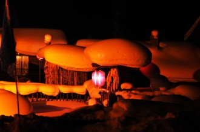

# 偷馒头的人

一

十多年前，我曾经偷过两个馒头。

如果没记错的话，那大概是2001年的冬天，对于我来说饥饿而又寒冷，伴随着疾病、焦虑和屈辱。

清晰地记得那个冬天的某一天晨跑时我的腰带断掉了，尴尬中惊慌失措，最后选择提着裤子去了与中学一墙之隔的姑姑家，敲门前还诚惶诚恐，生怕给别人造成麻烦。

另外一件事就是疾病。当别人提出把剩饭送给我的时候，我竟然出于对方的善意不会拒绝，随后另外一个人也干了同样的事，把他吃剩下的饭送给了我，于是我自然而然的感染了腮腺炎，两腮肿胀，面颊肮脏，像一个小乞丐。

当然这些不堪的记忆之外，也有些许美好。比如我美丽的班主任老师让我用她的水杯喝水吃药，我甚至不能即刻回忆起她的名字，只是觉得她很美，她当年大概和我现在一个年纪，刚从师范学校毕业不久。还有一件事情是在回家养病离校路过操场时，看见老师们正把学生集合起来，便凑热闹又跑进班级的队伍里，没想到当时正在宣布上次作文竞赛的获奖者，其中恰好有我，我便虽肿着两腮，却抑制住想笑的冲动，努力装出一副羸弱的样子去领奖状和奖品了。

我不记得这几件事情的前后顺序，只知道自己的确偷了馒头，而且是两个。

二

那年秋天，我升入初中。寒气逼人的早晨，已经升入初三的姐姐带着我搭上村里的农用三轮车去镇上的中学报道，我们在颠簸的车厢里热烈的随便聊些什么，披着秋天的太阳。

我清楚的记得自己下车后虽然负重却朝气蓬勃的样子，我不清楚自己的前方有什么，只是觉得新奇，并感到快乐。

我带着一只从姑姑家借来的小木箱，简单的行李和衣服开始了自己的集体生活。一个20平米左右的宿舍，南北向各有一个大通铺，每个铺位上睡着八九个人，很挤，晚上的时候大家拼命的抢占地盘扭动身体，靠墙的同学因为有支撑点便格外有优势，无聊的晚上大家热衷于此种游戏。我们从下自习到睡觉只有十五分钟的时间来洗漱整理，十五分钟之后电会自动断掉，一切归于黑暗，宿管老师开始在窗外巡逻，一旦发现有人说话，必然遭到训斥，严重时会有人被打耳光。然而此种制裁无法控制孩子们的顽皮，一旦发现宿管老师不在周遭，大家就会立即聒噪起来。我初中时被扇过两次耳光，一次是因为想看老师放给初三学生的《泰坦尼克号》而晚归，另一次是因为课上开玩笑触怒几何老师，他是我爹年轻时候的结拜兄弟，所以打我打得比我爹还狠，事实上，我不记得我爹揍过我。

夏天宿舍里会很热，而冬天会极冷，我们只有一个火炉，没有火炕，睡的是木板床，而火炉在晚上熄灯之后会熄火，因为牛粪也是定量供给的，更谈不上暖气。每个冬天的夜晚，我们都用自己的体温捂暖自己冰冷的被褥，而漫漫长夜，室内与室外的唯一区别就是没有风，温度略高，宿舍里的水到早晨都会结冰。也没有热水供应，没有人有暖瓶，甚至有些时候都没有冷水，我曾经在连续几天的时间里没有洗过脸，或者经常出现十多个人在一个脸盆里用有限的水洗脸的事情发生。因为冷水的供应也是定时定量的，每个宿舍会派两名值周生去打水，如果能按时打回来，却不能保证每个人都能分到水，因为水只有一桶，而每个宿舍都总会有几个身强力壮的小霸王，他们会占据大部分资源。

三

大概很难想象，在进入21世纪之后，内蒙古东部的某个农村中学，还在使用落后的饭票制度，然而事情就是这样的，我们每个人都会向学校交米和面，称重之后，再发给同重量量的饭票，这明显是不公平的，因为一公斤的生米或者生面，绝对可以制造出不止一公斤的米饭或者馒头。

订餐两个星期为一次，之后便不再接受补订。每个宿舍的饭都是打在一起的，回到宿舍之后再由值周的学生分配。比如这个宿舍16人，所有人的订餐两早餐订了14斤米饭，那么就打在一个盆里，由值周生端回宿舍后再行分配。

可想而知，分配绝对不会公平。

那些身体孱弱的同学为了吃饱，往往一次定一斤，甚至更多，然而分饭时仍然是只能分到半个饭盒，而小霸王们只需要定二两，就可以分到压得很结实的满满一饭盒，吃不掉就倒掉，分饭的同学在被打哭几次之后就晓得了其中的道理。

底层人的品质中当然不排除善良、朴素之类，但是容易表现的较为明显的，却往往是自私和狭隘，他们的孩子所接受的家庭教育，往往也是于最大化的自利息息相关的。

初中生活虽不属于童年，却也应该有更多的美好，然而我的初中生活让我见识了生存的残酷，丛林世界的弱肉强食在一群孩子们身上上演。我曾见过极为难忘的一幕——隔壁宿舍的小霸王提着菜汤桶在前边跑，而其他人在后边拿着各自的饭盒追逐的场景。我只记得这个小霸王姓刘，高中时回家遇到他，他递口香糖给我，手上带着混社会留下的刀疤。

四

我们的早餐是一桶米汤和米饭，中餐是一桶米汤和米饭，晚餐是半桶菜汤和馒头，菜汤大概就是卷心菜汤或者腌制过的咸菜煮的汤，里边会漂浮着几块肉。除了这些，别无他物。可以在家里自带干粮和咸菜，但是我们一般都离家30公里以上，两个星期才能回一次家。

那个星期我大概订了早中每餐五两的米饭、晚餐四两（即两个）的馒头，而我的朋友W君因为来晚了没有订上饭，所以我把食物分享给他。我本性羞涩，因为在同一个饭盒里吃饭，我总是吃的很少；我也没去向一墙之隔的姑姑求助，因为我打小就害怕麻烦别人，尤其是亲戚。我就这样处在饥饿状态中，而阴差阳错的是，那一周我是值周生，那天下午我去食堂端馒头的时候，食堂除了一个在背对着我在打扫卫生的大师傅之外，竟然没有一个人。

我几乎是无意识地，迅速从旁边的盆里拿了两个馒头放进自己宿舍的盆里，而端着盆走出食堂之后，道德感就迅速的重新占领了我的心头，我意识到自己是一个小偷。回到宿舍后，迅速把馒头藏进自己的柜子里以隐瞒罪行，并告诉了W君自己的作为。我感觉自己头和脸都很热，极力的控制自己的不安，也隐隐的觉得事情不会这么结束的。果不其然，食堂师傅找上门来，在他述说事情并推定一定就是这个宿舍的值周生偷了馒头的时刻，我夺路而逃躲进了厕所，那种羞愧难当的感觉让我恨不得跳进粪坑里淹死自己。

我只是在厕所里徘徊，透过墙上的通风口，我看到我的另外一个好友臧志龙来厕所了，我知道他是找我的，为了掩饰自己的尴尬，我选择蹲到了厕位上去，他进来的时候，我低着头，装作没事儿的样子，他竟然也很配合的掏出了两张已经揉搓的很软的书页纸递给我……

我和他一起走出厕所，不敢直视他的眼睛，他极温和的问我：“那馒头真是你拿的么？”我没有应声，只是点了点头，他拍了拍我的肩膀，安慰我说没事儿了，而我的眼泪却也不自禁的落了下来。

回到宿舍后，W君低声指责我说：“你怎么回事？偷个馒头也能被发现，要是我，绝对不会从旁边的盆里拿，太明显了。”我无言以对，毫无饥饿感，也没有吃饭，一个人到宿舍后的绿化带里徘徊，想了想自己为两个馒头丢掉的尊严，又忍不住哭了一回。

臧志龙这时又赶来安慰我，逼着我吃他不多的米饭，我看他态度倔强，便忍着情绪吃了几口。

自那以后，我对W君渐渐的疏离了，也因为他对我做的另外的一些事，实在让我寒心，比如吃一个鸡蛋都躲着我，而我的一切食物都是分享给他的。

而志龙与我陪伴着彼此，虽然他初中肄业，但我们一直保持着联系，年初的时候，他的孩子出生了，托我取名，我取了“云轩”二字。

五

诗人黄翔的作品《长城》中有一句“饥饿侮辱了我的尊严”，而正是我十二岁时的这段难以忘怀的经历给了我深刻理解这句诗歌的经验基础。

这个世界的苦痛实在是很多的，冉阿让因为偷了一条面包便被处以19年的苦役；相比之下，我失去了尊严，却没有得到惩罚，荏苒的岁月淹没了是非成败，也淹没了这件小事。然而我想把我的这个故事讲给世界听，告诉世界，这里有一个偷过馒头的人。

回想当年，如果让今天的我站在那个稚气未脱的12岁少年面前，我该对他说什么？我是不是该说：“李晓明，你住手，不要偷那两个馒头。”

（采编：刘迎；责编：刘迎）

[【静夜思】火车站一夜](/archives/42815)——白天的城市光鲜耀眼，隐藏了太多人的故事。夜宿火车站，“我”与朋友拍照、聊天、思考，将夜晚城市的百态呈现在读者眼前。

[【静夜思】桑干鲈鱼](/archives/42594)——世上的事情，本来都是挺简单的，严肃不成，还可以逗。毕业在即，有关爱情理想学业生活的种种感悟，就听作者随口说说吧。
