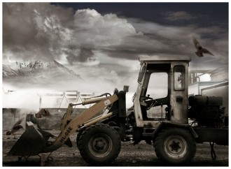

# 桑干鲈鱼

为了不影响广大师生的休息，后勤决定在半夜施工。推土机正在我的窗外，四周都已是一片废墟。如果它开错了方向推了进来，他会看到我的内裤，和国旗的颜色一样。我找不到八年前的任何迹象，也找不到八年前的任何人——他们正在忙着结婚、离婚、复婚。我打开了一本八年前买的书，八年来从未打开过，封面上印的作者是：斯宾诺莎，一位磨镜片技工兼民间哲学家。

推土机的轰鸣声里夹杂着劳动号子，时而传来几句埋怨。我爬到窗台上打开窗户，唱了一段空城计，给他们助兴，天儿太冷，我也不失为一个逗逼。

从我的窗台，可以看到大一新生那栋楼，我曾经在那栋楼住了八年，现如今江山易主，我也只剩九个月毕业。五年前，我刚办身份证的那年，我也以为我要走，但我留了下来，三年前，我刚学会贴发票的那年，我也以为我要走，但我留了下来。现而今，从时间上来讲，抗战都打完了，我估计可能没准也许perhaps应该终究还是要走了。

管他怎样，我肯定会渐渐被淡忘，我留下来的东西，也会被推土机推掉。从这点说来，我和校长们没啥区别，这的确值得人欣慰。

对于大多数人来说，这辈子就一次说走就走的旅行，往往是高考。然后他们进了大学，发生了很多说走就走的爱情，留下了很多纯洁的男女关系。在我们这个时代，纯洁的男女关系分为两种，一种是纯的男女关系，一种是洁的男女关系。每年毕业季，都有人找我做心理咨询，咨询以后怎么办。他们纠结是事业还是爱情，哪个更重要。我不理解这居然能成为问题，我是一个想问题很简单的人，我是这么想的，你纠结这个，只能说明两点，要么你不够本事，要么你不够爱，跟别的没半毛钱关系。我发现我这里的汉子们思维很好玩，对他们来讲，如果一个姑娘死活不让他上手，那她一定是个贱货，居然这么不识货；如果一个姑娘轻轻松松就让他们上了手，那她一定更是个贱货。我觉得吧，有啥事多找自己原因，可能你的确会瞎次眼，如果你次次都瞎眼，那绝对是你该。

洒家八年前说走就走跑到了这里，目睹了很多事情，总有人天天给我念叨好累感觉再也不会爱了，现在连我们组的女博士都不会爱了，我就没法理解了。我想问题特简单，我始终觉得累到不会做爱是可能的，累到不会爱，这绝对不科学。现在的状况是，由于这几天半夜有推土机跑我门口拆房子，如果你最近找我咨询那些破事，我没准让你破相。唉，我容易么，如果你们明天早上看到我睡在推土机的铲斗里，请不要忘记给我盖被子。

八年前我总想干什么，充满了理想和正能量，现在的我啥也不想干，啥是梦想，对我来说就是随遇而安。无可无不可，都是些荒唐事，干脆一起荒唐算了。我以前总想些大的，现在觉得想这些干啥，我就把我手头这点事干好，好好看我的书写我的论文。虽然人是需要靠意淫给自己动力的，但是我还是觉得，有些事情，诸如成名成家之类，从不是刻意为之，而是水到渠成。别矫情了，老实挖水沟去。

我现在是靠所谓的责任感和最基本的民间道义办事，绝不想哗众取宠，也懒得特立独行。我现在就希望我没故事，越没故事越好。兜兜转转了一圈，还是啥都没有最好。你确定你发生的是故事不是坑么？我翻出几年前写的话：“对于真正的浪子来说，绝不会回头，因为回头就是背叛，就是投降。”我现在在想，到底怎样算投降？怎样又算不投降？是形式上没投降天天飘来荡去就不投降了？对于一个逗逼来说，真正的不投降，就是乖乖举起手来。对于真正的流浪者来说，在路上流浪和在床上睡觉未必有多少区别。我现在最开心的一点是，我几乎没叛逆过任何人，就算有，我也和他们和解了，我只背叛过自己。或许我和某些文艺青年的区别是，他们永远都在背叛别人，从来不敢背叛自己，而我是个逗逼，我只敢背叛自己，从来不敢背叛别人。有些人存自己的天理，灭别人的人欲，从来都要求别人理解他们，从来不去理解别人。我不喜欢这样，与其如此，我还是存别人的天理，灭自己的人欲得了。

入夜的走廊，每每传来左邻右舍的脚步声，我住的这里，对面就是水房，哗啦啦的流水声夹杂着交谈。对于博士生来说，能不能毕业、以后的前程、成家立业，都是令人操心的问题。可能想得简单，想要的少点，也就没那么多烦心事了。姚期智说的对，你还在纠结要不要读，那你就不适合读。现在的情况是，该读博士的因为要去挣钱没读，不该读博士的因为以后想多挣点钱在这读，这不是开玩笑么，这绝对是开玩笑。这话他们要是知道了又该不高兴了，他们总是认真地开着玩笑，当然我只是对大家认为该认真的事情很儿戏，大家还是有很大区别的。你要读书，就该做好没钱赚的觉悟，否则干脆别读。尤其是商科，你要能有那本事，不读书都行，你要没那本事，文凭再高也白搭。

有些小伙伴，的确很有才华，但是他们的才华不能给他们带来快乐，反而让他们局促而难堪，每每如此，我总是感到伤心。我觉得吧，想留点东西下来挺好，但绝对不是天天喊着我要留点东西下来。而有些小伙伴，总是洋溢着“我很有才华我们一起躁起来吧”的鸡血，或者是“我很有才华但我很孤独我需要被安慰”的说不上来什么味道。我一直不太理解，你要躁起来自己躁就好了啊，何必要叫人一起躁呢，我有些怀疑你其实是想给躁字换个偏旁。

对于我现在来说，我就想回家吃鲈鱼，到这边快九年了，再也没吃过阳澄湖大闸蟹，就吃过一次盘锦河蟹。

对于我现在来说，有点想回南方，但估计真要回了，也不过是无端更渡桑乾水。

对于我现在来说，我想回到十一公寓429，取回我亲笔书写的两个大字：

毓婷

（采编：刘迎；责编：刘迎）

[【静夜思】偷馒头的人](/archives/42610)——“我们在一起谈论世界，我们面对的不是一个世界，谈论的也不是一个世界。”少年时代的“我”因为饥饿偷了两个馒头被发现，那种丧失尊严的痛苦感多年之后仍记忆犹新。

[【静夜思】火车站一夜](/archives/42815)——白天的城市光鲜耀眼，隐藏了太多人的故事。夜宿火车站，“我”与朋友拍照、聊天、思考，将夜晚城市的百态呈现在读者眼前。
