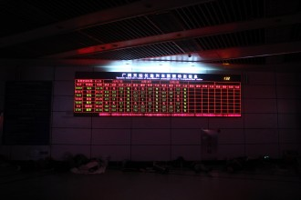
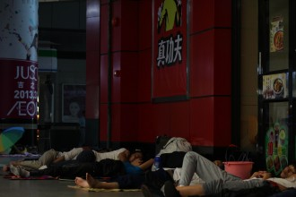
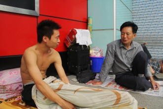

# 火车站一夜

从10月1日晚上九点半到10月2日早上五点，我和白鸽在广州东站待了一夜。

夜宿火车站的想法是白鸽提出来的。我一开始有点儿犹豫，毕竟通宵一晚顶多只能出一组照片，性价比是不是太低了。我并非那种热爱摄影的人，要不是DB的国庆作业，我真懒得拿着单反到处逛、到处拍。

“就算不拍什么，和他们聊一聊，听听他们的故事也不错。”这是个好理由，我瞬间决定去赴这场夜谈会了。

九点半我俩赶到广州东站，偌大的厅里空荡荡的，甚至还有点黯淡。我们从7号门绕到1号门，看到大多数自助取票机已经停止工作，好在售票大厅里还有两台尚在工作的自助取票机。拿到广州东——佛山的9块钱火车票时，我心里莫名地有种兴奋感。没有这票，我俩进不了候车大厅；有了这票，我俩却不会踏上夜行的火车。

事实证明，我俩本可以省了这二九一十八块钱的。

九点四十五我俩来到候车大厅，厅内一片空旷。我们本该坐的K1121次车已经开始检票。除了这两排长长的队伍，还坐在座位上的人不超过十个。队伍走得很快，一会儿就消失在茫茫夜色中，随着火车的汽笛声渐行渐远。此时此刻我才知道，这趟车的始发站是哈尔滨，终点站是海口，天南海北。

“走吧，走吧，这是今儿最后一列车了。”一位乘警大叔不耐烦地说道。

“卧槽！这算什么事儿！”我和白鸽不约而同地喊道。

留在这里的人仍然不走。一对中年夫妻说，他们没有赶上今天的火车，只好坐明儿中午11点的车回湖北信阳。我暗暗吃惊，明天的车何必今晚就来等呢。他们的解释如此自然：外面住一晚太贵，不值得。

还有一位小伙子固执地说：“怎么是最后一列了？11点不是还有一列车吗？”这显然是来错站的主儿，乘警大叔见怪不怪，懒洋洋地说：“你看看你的车票上是‘广州’还是‘广州东’？”小伙子把票掏出来一瞅，无奈中带着愠怒：“怎么办？最近的地铁在哪里？地铁是不是都关了？”

“走啦走啦，整个站都要搞清洁，明天五点才能开门。”乘警大叔又开始赶人了。大家拖着行李往外走，过道里、走廊里都是熟睡的人和他们的行李。于是我们又想到，候车大厅住不了，一楼大厅总是待得了的。

来错站的小伙子问我和白鸽：“你俩是做什么的？是不是间谍？”

大概是我们的单反太扎眼了，我们笑着打哈哈：“我们是学生，学间谍的。”

他也走了，消失在茫茫夜色中。

一楼大厅里躺着不少人，有人垫着报纸，有人垫着凉席，甚至还有人垫着毛毯。他们都在等明天的火车，我们在等他们等火车。

墙角的地儿已经坐满了人。我跟白鸽找了个柱子倚着，屁股底下垫的是几张本子纸。我把书包往地上一放，两腿一摊，就差一碟花生二两酒，要不人生就圆满了。白鸽也是一脸兴奋，好像东站就是我们的宫殿一样。

“你俩是不是记者？曝光一下他们赶我们的事儿，太气人了！”一位年轻的姑娘凑过来，半是玩笑半时认真。

“我们还是学生......也是出来玩的......就是觉得拍着好玩......”

“去哪里啊？”

“……信阳？！”

我在心里为白鸽点个赞，然后想着怎么转移这个话题，结果脑子和嘴一样笨。

“学生也没关系啊，拍下来放到网上嘛，不是有那个叫什么……”姑娘的男朋友也凑过来了。

“第一次在火车站过夜，好兴奋啊！”我没头没脑地冒出这么一句话，心里只想给自己点蜡烛。

我和白鸽商量着，手里的机器太显眼，不如先收起来，和他们聊一聊吧。白鸽又说，我们先出去走走吧，顺便买点儿吃的。

晚风凉凉的，安抚着我过度兴奋的心情。这个本该热闹的地儿居然难得的安静下来。白鸽心里住着一个文艺的小女人，她走到出租车停靠点拍夜里打车的人。出租车没有排起长龙，打车的人也三三两两。交警大叔好脾气地说：“这么晚了还拍啊，注意安全。”

我拍了几张，效果都不太好，换了个地儿，几个中年男人就围过来，你一句我一句地教育我：“偷拍是违法的知道么……昨儿就有个人在这里瞎拍被人摔了相机……小姑娘你都拍了啥……”我心里怦怦乱跳，喊了白鸽，快步往前走。一个男人缠住她，说她拍了他不能走，白鸽想和他讲道理，我注意到那个男人的脸上有伤，于是走过去拉着白鸽就走了。

我心里有点儿不太舒服，倒不是因为那几个中年男人，而是因为自己吧。这感觉有点儿像王小波的那句话：人的一切痛苦,本质上都是对自己的无能的愤怒。

坐在KFC里，我和白鸽翻看带来的书，停在第一页。我们开始聊感情，经历过的，正在经历的，心里想着一个人，欢愉而美好。

等到我们自己的心情好起来，我们就往火车站大厅走。火车站果然关门了，1号门外睡着不少人，售票大厅里也睡着不少人。虽然之前在电视上看到过这样的场景，但是当我身处其中时心里还是泛起一种酸楚感，我为自己单纯为了作业而作业的想法感到羞愧。

白鸽安慰我说：“不要自责，也不要太有目的性，我们要珍惜这种缘分，和夜晚睡不着的人聊聊天吧。”

一号门外有块挺宽敞的地儿，左边是真功夫，右边是KFC。我们找了KFC和电梯中间的一个过道坐下来，之前搭讪的年轻情侣也坐过来。他们说乘警不让人待在里面，过道走廊也不能待。姑娘把男朋友的外套铺在地上，脱了鞋子，盘腿坐在上面。俩人好像在闹别扭，小伙儿倚在电梯边上，不肯坐到旁边。姑娘索性不理他，过来和我们聊，抱怨广州人太多，物价太贵，火车票太难买。今儿他们从广州南站，到广州站，再到广州东站，好在终于买上了回家的票。

“你们是哪里人啊？”

“江西新余。”

“来广州做什么呢？”

“玩……”俩人相视一笑，回答地怪怪的。

“广州好玩吗？”

“不好，再也不想来了。”

我很难问出“为什么”，只是想到，台北不是我的家，我的家乡没有霓虹灯。

姑娘和男朋友和好了，两人倚靠在一起，有一搭没一搭地说着话。旁边又来了一家人，爸爸、妈妈和10多岁的儿子，妈妈不知道从哪里拿来一些纸壳，铺在地上，一家人躺在上面，渐渐睡着了。

我换了个长焦，跑到电梯上，在尽可能远的地方拍了几张人们休息的样子，镜头把远处的他们拉伸到我的眼前，我透过取景框感受着他们的辛劳、无奈、困顿，或者甜蜜、幸福、安详。

姑娘出去买了宵夜，还要分给我们几片面包。我们客气地推托着，但是却拗不过她的意思。我接过一片，撕成两半，实在没有地儿放就吃了。我的脑海在一秒内浮现过各种从小到大接受过的告诫：不要随便吃陌生人的东西，但是想到刚刚姑娘和男朋友撒娇时说的话：“你就是不给我钱我也能回去，还是好人多不是么？”

姑娘和小伙儿要睡了，我和白鸽也想挪个地儿换个角度，于是从KFC这边换到真功夫这边。真功夫这边视野开阔得多，有些人已经熟睡，发出均匀的鼾声。有些人还在夜聊，发出会心的笑声。一位大叔看到我俩，问道：“你们俩是记者，是来体验生活的吧，拍拍这些回家的人吧。”

“我们还是学生呢，也是出来玩的……”白鸽说，撒谎的感觉真不好，说了一次就得一直说下去。我点点头，邪恶地想到，白鸽之所以会觉得心里不好受，是因为大叔长得好帅。我 和白鸽一致认为，大叔年轻时一定是个帅哥！

我们把书包移过去，和大叔，还有一位年轻的小伙儿坐在一起。大叔是湖北人，在梅州做保安。小伙儿是河北人，在深圳一家合金厂工作。大叔今年五十五，大孙子都六岁了，头发还是乌黑浓密，灰色衬衫也整洁熨帖，就连铺在身下的报纸都是整整齐齐的。小伙儿二十出头的样子，赤裸着上身，露出健美的肌肉。他不太相信我们是出来玩的学生，但是也把话说透。他把自己的小窝收拾得特别舒服，纸壳上面还铺着一层毯子。

大叔和小伙儿聊得起劲儿，我俩和他们也聊得开心。大叔说，这趟回去不想再回来了，2000多的工资也不算高，哪里也没有家里好。小伙骂骂咧咧地说，他妈的我也不想回来了，回家自己开厂子去。大叔也去过不少地儿，小伙儿去过不少地儿，说着还拿出一叠火车票来。我凑过去说能不能拍一张，小伙儿说您可真有意思，拍拍自己的不就成了吗，不过他也没有拒绝。

我们坐在一起聊了好一会儿，看到大叔都没吃东西，于是又出去转了一圈，带回来四瓶水和一袋火腿肠。大叔笑着摆摆手说“不用”，但是这次轮到我和白鸽说“难得有缘”。大叔谢过我们，但是没有吃，也没有喝。

我转过身去，大多数人都已经睡了。他们躺在地上，躺在行李上，躺在电梯上……大叔和小伙儿在谈改革开放，我听不清他们在说什么，但大概懂他们的意思：上面的政策是好的，就是到了下面变了味儿。这不是我第一次听到这句话。我翻开《林村的故事》，开始念起来：“传统上，农民吃尽苦头。但他们的生命却显得有意义而且易于满足，社会也就有弹性得以复原……”

夜太深，黎明都要来了。大叔和小伙儿也睡了。警察的巡逻车来回的过，成为唯一的声响。我和白鸽挪到一边儿去，屁股底下垫着大叔给的报纸。

我又开始念：“红豆生南国，春来发几枝。愿君多采撷，此物最相思。”心里却不是这番滋味，默默地把书合上了。

星巴克的绿色logo悬在红色的墙上，墙角睡着一排回乡的人。白鸽说：“神在头顶，俯视苍生。”

火车站在五点开门，我们在四点五十九分离开这里，不告而别。

（采编：刘迎；责编：刘迎）

[【静夜思】偷馒头的人](/archives/42610)——“我们在一起谈论世界，我们面对的不是一个世界，谈论的也不是一个世界。”少年时代的“我”因为饥饿偷了两个馒头被发现，那种丧失尊严的痛苦感多年之后仍记忆犹新。

[【静夜思】桑干鲈鱼](/archives/42594)——世上的事情，本来都是挺简单的，严肃不成，还可以逗。毕业在即，有关爱情理想学业生活的种种感悟，就听作者随口说说吧。
