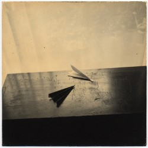

# 与友人书

四点了，夜已无法更深了。

我拿起朋友搬家时送给我的望远镜，望向窗外。对面的大楼里，有两盏灯亮着，看样子会一直亮下去。没有月亮，没有星星，夜空生出密密麻麻的头发，越来越长，仿佛我一打开窗户，她们就会缠上我的脖子。

北京已经冷了。早起的阿姨在路上遇见后会彼此喊上一句：这天儿可真凉啦！好像是一桩惊人的发现。她们提着菜篮子，就像提着自己的一辈子。你说你无法忍受这样的一辈子，菜市场居然是离大自然最近的地方。你要去的地方，除了鸟没有什么在天上飞，除了虫没有什么在地上爬。

你住的地方离北京站很近，休息的时候你说你喜欢一个人买张站台票，假装去接人。而事实上你只是坐在木制长椅上抽着烟，看着一拨又一拨人从远方来，又到远方去。你说火车站是整个北京唯一有着波西米亚气质的地方。我说你还敢再布尔乔亚一点么。你只是摇摇头，笑着说你攒够钱就走，攒够钱就走。

我说你去哪儿，你说你要去南方。南方有更多的色彩，更多的阳光。你还说你要写一部伟大的作品，作品的伟大之处在于它只有腹稿，永远不会被其他人知晓。你说通过这个方式，你成功地解决了卡夫卡临死之前没有解决的难题，在你身上将不会存在被背叛的遗嘱。我说那你临死之前可以背给我听一下么，你自信地说我会死在你前面的，因为算命的说你可以活120岁。为此，你父亲还给了那个算命的120块钱。

第一次去你住的地方，你说你烧水给我喝。最后水烧干了，壶烧穿了。你说你身边的所有事物正在变得跟你一样沉默，你的自行车车铃不响了，电脑开关机也没有声音了，这下连水壶也不响了。

第二次去你住的地方，房子到处都是苍蝇。我问你为什么不买个苍蝇拍。你说你不忍心打死他们。不仅如此，每当蚊子咬你的时候，你都会轻轻赶走它们。你甚至会害怕自己的血不合它的胃口。

我觉得你差不多该去医院看看了。后来你真的去医院了，不过是去看你病重的父亲。你把你攒下的钱全都花在父亲的治疗费上了。我最后一次去了你住的地方，拿走了你留给我的书。水池里有一大坨纸浆，我猜那应该是你写的诗歌吧。很奇怪，你却留下了你写的《[哲学笔记](http://www.douban.com/note/312980563/)》。老实说，我不喜欢这些笔记，它们都太严肃了，像地铁里的人，板着脸。

你已经回家了。给你打电话，你说你再也不会来北京了，你说等你父亲死掉了，你就去南方。你的声音低沉得让我怀疑是不是我的手机坏掉了。我说不出什么安慰的话，只是笑着问你家的水壶烧开的时候会响么？

后来我们就失去联系了。给你寄的苍蝇拍不知道你有没有收到，我还是觉得你应该拍死它们。

天已经亮了。早起的阿姨们又提着菜篮子赶去菜市场了。人们正在陆续从噩梦或美梦中醒来。今天又是一个雾霾天，我还是不习惯戴口罩。楼下的店铺很快就要播放广播了：走过路过千万不要错过。我还能说些什么呢？我觉得我已经开始忘记你了，或者我已经忘记你了。我已经原谅了你。愿你在南方找到你的吉普赛之乡。

你还记得小学课本里一篇叫《凡卡》的文章么，是契诃夫写的，小说的结尾，凡卡把那张写满字的纸折成四折，装进一个信封里，那个信封是前一天晚上他花一个戈比买的。他想了一想，蘸一蘸墨水，写上地址：“乡下爷爷收”，小时候每次读到这里，眼泪都会夺眶而出。

我猜这封信我也只能写上：“南方诗人收”。

Inspired by Famous Blue Raincoat.

（采编：刘迎；责编：刘迎）

[【非俗客】我的朋友Mona](/archives/43655)——依靠精准的判断力和坚定的执行力，在大大小小的情况下，她总是能做出最happy的选择，她何以如此游刃有余？让我们跟随作者，一起来认识下Mona。

[【非俗客】道人不是寻常客](/archives/43574)——非常人行非常事，这世上恰恰有着这样的人，非僧非道，却又与凡人迥异
