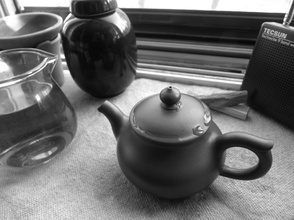

# 道人不是寻常客

我认识一个朋友，他非僧非道，却又不甘做个凡人。喜欢四方游走，却不在任何地方过多的停留。他喜欢喝那种普洱饼子，你什么时候见他，身上都揣着那么一块。他没念过什么书，然而跟他聊天你会觉得很有意思，会倾倒于他知识的广博。他是个大俗人，又是个真性情的狂人。

嗯，我认识这么一个人。在我的生命的旅途中曾与他有过一段交汇。

在一个盛大的法会上，那是我第一次见到他。我已经忘了当时的很多事情，只记得他坐在台下，不同于其他僧侣，翘着腿，一脸的不耐烦，透过那副金丝腿儿圆框的旧式眼镜，我从他的眼神里看到了一种不同旁人的神情。那是一种复杂的状态，直到后来，我见过他最多的表情，就是第一次见他时他的这个表情。我至今也不了解那时他的心境，即使后来我们有过几次的长谈，但我依然不能极具体地描述出他是怎样的一个人。

照理说，他似乎应该是个恬静散淡的世外之人，然而他却不然。透过他的谈话，你会觉得他似乎对一切都那么不满意，甚至是鄙夷，周围的东西好像总能莫名其妙的让他感到痛苦。我有些时候能跟他产生共鸣，时而又觉得他太过刻薄。我没什么能力反驳他，他的理论都是成体系的，我总被他绕进去，然后进入一个死循环。他对待周围人的态度也是一样，交过几个朋友，最后都因受不了他的那种冷漠的态度，逐渐断了联系。

我有一天忽然想到，会不会他的内心里其实特别热情，只是他故意要做成这样的呢？因为那天我看了顾城的一段小诗，大概是说，有些人不愿意养花是怕花死的时候伤心。他是不是也有这样的心理呢？

他曾跟我说过，他随身带着一块普洱饼是给自己定的一个规矩。来到一个陌生的城市，他会开始喝一块普洱，他的茶是每天不间断地，直到把一块普洱喝完，他就离开这里。我从不以为这是一种很潇洒的行为，因为我是那种可以在寺庙呆上一个月不出门的人，我不喜欢改变，我喜欢稳定的生活模式。每每想到他，我会想到王家卫电影里说的那种没有脚的鸟，但我天生不是一个那样的人。

后来他真的把那块乌青的饼子喝完了，却还没走，不是因为不守原则，因为他病了。他说他是总生病的，每一次流感他一定第一个染上，最后一个好。于是他又拿出了一个拳头大小的窝窝头似的沱茶，大夫跟他说茶解药性，要他不要喝，他不听，倒也就无所谓了。

那块沱茶还没喝完，他的病就好了。他给我发过一则短信，说他要走，当时我不在市里。第二天我回来的时候他已经走了，我用不着去他房里看就知道，因为我的门缝里塞着一张毛边纸。他毛笔字写的很好，学的是怀素的小草。我不明白的是，他很少用宣纸，就习惯用那种微黄色的毛边纸，他笑说是因为便宜，我不信。我打开来看那张纸，写的不是什么离别赠言，也看不到与情感有关的东西，只有两句话：“雪埋夜月深千尺，陆地行舟万里程。”我知道这是汾阳善昭的一个公案，但我不理解他写给我的意思。

他走了之后我们很少联系。一个秋天，他给我打过一次电话，简单地说了两句就挂掉了。我不知道往后还能不能见着面，我希望能，那时候他可能会改变，转念一想又不太可能。

僧人里面怪人很多，他算是最对我脾气的一个。我对他多少是有些敬畏的，不止是朋友，他传递给我了很多观念，有些东西后来我才明白是他教会我的，我猜想也可能还有，只是我现在没发现。

像他这样的人，前路必定不好走。很久没有他消息了，都不知道他是否还在江湖上游荡。

(**采编**：谢逸云；**责编**：刘迎)

[【非俗客】我的朋友Mona](/archives/43655)——依靠精准的判断力和坚定的执行力，在大大小小的情况下，她总是能做出最happy的选择，她何以如此游刃有余？让我们跟随作者，一起来认识下Mona。

[【非俗客】与友人书](/archives/43748)——南方的诗人，你的心里，到底有着怎样的温柔。
