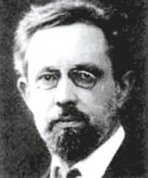
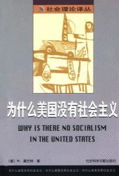

# 为什么美国没有社会主义？

向大家推荐德国社会学家维尔纳·桑巴特的著作《为什么美国没有社会主义》，该书与马克斯韦伯的《新教伦理与资本主义精神》、以及托克维尔所著《论美国的民主》可相参照，有助于了解资本主义世界的旗手——美国。除去观点本身，本书中的社会学研究方法及其数据分析，也值得有志于学术研究者参照借鉴。

维尔纳·桑巴特(Wemer Sombart，1863年～1941年），德国思想家。1888年取得柏林大学的哲学博士学位。1888年至1890年间在不莱梅商会做商务代表，开始进行有关资本主义和社会主义的研究，并取得了丰富的成果。他曾参与马克斯韦伯创立德国社会学会的工作，并合办了《社会科学与社会政策》杂志。桑巴特著作等身，一生撰写了20多本著作，其中部分作品已经成为经典，大部分作品都被翻译成多种文字出版。桑巴特还发表了众多的学术论文和专题研究，是名符其实的高产思想家。其代表作有《奢侈与资本主义》、《为什么美国没有社会主义》。

桑巴特早年倾向于马克思主义，后受到韦伯和历史主义的影响。他认为社会学是一门有明确内容和特殊方法的独立学科，其任务在于提出有关精神领域的社会联系的理论。桑巴特反对人文科学中的价值取向，主张价值中立。在其学术生涯的前半段，桑巴特关心社会公正和改革，基本属于持社会主义观点的资本主义批评者。“他沉浸于马克思”，在其《现代资本主义》中，声称他的工作是马克思工作的继续和对马克思工作的完善。在其学术研究的后半段桑巴特背弃了马克思主义并成为马克思主义的狂热反对者，但依然是资本主义的坚定批评者，他和马克思的分歧在于，桑巴特认为资本主义会导致道德秩序的瓦解，工业化会使人丧失人的本质属性，所以资本主义的衰亡无法产生新的更高形式的社会秩序。从这个角度来看，桑巴特甚至比马克思更加激进，而且似乎随着后现代主义的兴起，他的某些观点部分得到印证，也间接启迪了法兰克福学派等西方马克思主义。晚年，由于对工业社会及其工具理性的厌恶，桑巴特选择与右翼反资本主义势力结盟，并转向国家社会主义——法西斯主义，这成为桑巴特一生的污点。

《为什么美国没有社会主义》成书于1906年，属于桑巴特的早期著作，书中观点有较明显的马克思主义色彩。

美国环境资源得天独厚，且建国时间短，没有封建贵族。强权源于专制，妥协产生契约，正因人的“自利”意识，从“五月花”号开始，新大陆遵循的就是新的规则体系。而正因为建国时间短，美国城市不是自发形成的村落扩大、而乡镇、而城市，而是直接由共同体进入纯粹的城市社会。以上因素使美国成为资本主义的沃土，只有在美国，资本主义才能得到如此完全的发展。

由于资本主义必然导致一种将数量上的巨大误以为伟大的倾向，倾向于用金钱“量化”，作为衡量人或事物的程度，导致基于贫富差距的话语权不均等，所以现代社会主义是对现代资本主义必然的回应。但美国却没有出现这种强烈的回应，原因为何？

桑巴特认为，这与美国的选举制度有关。美国选举繁多，从联邦总统到各级事务官吏，都需要通过选举产生。以当时的俄亥俄州为例，每个公民一年要参加22次选举。面对并不了解的候选人，民众只能通过传媒和宣传机器了解候选人的施政纲领，然后决定给谁投票。这种选举形式需要大量经费，导致社会主义政党无法在选举中占据优势。

根据桑巴特的论述，我们可以导出，在美国体制下社会主义政党存在的两大悖论：1、政治献金悖论：社会主义政党要想得到政权，首先要赢得竞选，而赢得竞选需要大量经费，如果社会主义政党接受“有产阶级”献金，则违背其社会主义政党的本质。2、无产阶级悖论：如果社会主义政党取得政权，则该政党的党派领袖还是无产阶级么？他们还可以代表无产阶级么？所以，在美国如此完善的资本主义制度下，社会主义政党根本不可能通过竞选掌握政权。

那么，美国的社会主义政党有可能通过另一种方式，即“人民战争的汪洋大海”取得政权么？也不可能，首先，美国的工人阶级就不答应。美国的资本主义精神鼓励每个人追寻自己的利益，而美国的制度也允许每个人追寻自己的利益。美国人对宪法有一种近乎神圣的崇拜——宪法偶像崇拜，而他们争取自己权利的一切行为：罢工、示威、游行，甚至由工人代表进行国会质询，都由宪法予以保证。美国工人无论如何斗争，也没有想过否定美国宪法，对政府的批评更多是在经济领域，比如失误的经济政策导致的失业率增加，而这种批评，依然是在宪法的框架下进行。“社会主义和乌托邦在面对烤牛肉和苹果派时化为了乌有。”正因为美国工人阶级不是真正的无产者，所以他们不可能进行社会主义革命。在功利中融入一抹理想主义的色彩最能诱惑人，比如“美国梦”，到处充斥着穷屌丝凭借自己的努力以及“神的眷顾”——运气一举逆袭的“励志传奇”。美国的社会主义政党既无法通过竞选得到胜利，也不可能发动自下而上的“革命”，从过去到现在，再到可预见的将来，美国毫无社会主义政党执政的可能。

桑巴特指出，美国有最普及的民主政治，却没有严格意义上的政党政府。民主党和共和党也许历史上有，但现在并无明确的理念分歧、主义之争，如果驴子和大象对换名称，也毫无违和感。至少现在的民主党和共和党并非理念结成的政党，而是选票结成的利益集团，是地地道道的“选票政党”，只为选票服务。

或许在很多美国的质疑者眼里，自老山胡桃安德鲁杰克逊开始，“胜者分赃”已成为美国政治的重要属性，政治更多的是获取并分配权力的工具。但正因为两党“选票政党”的特征，这种“党争”反而在一定程度上有利于底层民众，因为他们有选票，选票是“第一生产力”，为了选票，政客需要向民众示好。也正因为工人有选票，当他们对政府强烈不满时，会更多的选择“下次不投他票”，借助一个多数党将不满意的政客选下台，而非暴力对抗。

虽然美国的制度不可能实现话语权的绝对均等，但至少在形式上保证了权利的统一与平等。这种政治体制的成功之处在于让每个人都参与，有强烈的“参与感”，使人感觉自己也是国家政治的一份子，感觉自己能参与决定国家的走向，至于是不是真能决定另当别论。有参与感，无需灌输，自然会有强烈的“主人翁意识”，美国的民众很少会像极权国家的国民对政治漠不关心，认为“那不是自己的事”。这种认为“这是我的国家”、“这是我参与的政治”的错觉也好，真情实感也罢，一旦建立起来，工人阶级就再也不会选择革命。

距桑巴特写作此书，已经过去百余年，其中有些观点，已有过时之嫌，但仍有阅读的价值。

（采编：杨修；责编：杨修）

[【韦伯&桑巴特】对汉语学术界关于马克斯•韦伯 《新教伦理与资本主义精神》误读的类型学分析](/?p=42682)--马克斯•韦伯的《新教伦理与资本主义精神》一文在东西方处于两种截然不同的“繁荣”之中。一边是欧美学界对韦伯研究的“过度繁荣”，另一边是汉语学界因对韦伯翻译和研究不足而造成的“虚假繁荣”。
