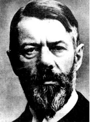
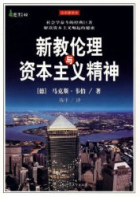
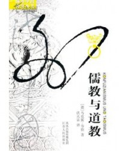

# 对汉语学术界关于马克斯•韦伯 《新教伦理与资本主义精神》误读的类型学分析

“两种繁荣夹缝中的文本 ——对汉语学术界关于马克斯•韦伯 《新教伦理与资本主义精神》误读的类型学分析 ”原文刊《基督教学术》，2009年，第8期，第128-148页。

** **

内容提要：

马克斯·韦伯的《新教伦理与资本主义精神》一文在东西方处于两种截然不同的“繁荣”之中。一边是欧美学界对韦伯研究的“过度繁荣”，另一边是汉语学界因对韦伯翻译和研究不足而造成的“虚假繁荣”。

本文试图首先回到韦伯的文本本身，通过对文本内在定义和结构的疏理，挖掘出韦伯论证的出发点、论证结构、研究方法以及真正的学术旨趣所在。其次，在对历年来汉语学界对《新教伦理与资本主义精神》的大量研究和阐释著作、论文广泛阅读基础之上，从中总结出若干个典型的误读方式，以进行类型学分析。从而找到汉语学界在处理韦伯文本时惯常出现的若干视角偏差，阐明它们背后共同的思维习惯，并在中国乃至东亚文化、经济发展的历史背景中发现某些长时段的问题。

本文将《新教伦理与资本主义精神》不仅视为韦伯宗教社会学研究的总起点，还将其当作是欧洲宗教社会学研究的一个方法论典范。通过这个研究，作者希望在东西方两种韦伯研究的繁荣之间寻求一个平衡点，以韦伯的《新教伦理与资本主义精神》作为借鉴，来反观儒家伦理倡导者的立论方式和论证手法，以为将来的汉语学界的韦伯研究、宗教社会学研究，乃至对中国自身宗教和文明之间内在关联的反省打下一个坚实的基础。

 ** **

关键词：

**** 马克斯·韦伯、新教伦理、资本主义、儒家伦理   ** **

导言

马克斯·韦伯（Max Weber，1864-1920）的《新教伦理与资本主义精神》（Die protestantische Ethik und der Geist des Kapitalismus，以下简称“《新教伦理》”）自诞生之日起，就从没有远离过批评和争论的风口浪尖。[1]现代学术工业似乎特别垂青曾经隐没德国本土学术界近半个世纪之久的韦伯。很多个彼此矛盾、带有歧义的韦伯形象分别在欧美诸多韦伯诠释学中分别占据了统治地位。关于韦伯的研究著作、论文足以用汗牛充栋来形容——这种局面可以被称为韦伯研究的“过度繁荣”。

但是韦伯却以另一种方式在汉语学术圈登场——他进入汉语学界的视界滞后西方主流学界大约三十年，对他的原著翻译和研究始终显得十分稀缺，整体质量也参差不齐。然而，就在上世纪八十年代，韦伯似乎在一夜之间在汉语学界声名雀起。奇怪的是，在其后的二十余年时间里，中文韦伯时常是以一种面具化和符号化的形式充斥于很多汉语学术著作及论文的行文和脚注中。误译、误读加上某些比附和假借，使得韦伯的面目在汉语语境下有时模糊不清，有时又支离破碎——我们姑且称这种状况为汉语学术圈韦伯研究的“虚假繁荣”。

对比欧美学术圈韦伯研究的“过度繁荣”和汉语学术圈的“虚假繁荣”，我们不难发现，《新教伦理》作为韦伯遭受争议最多的作品，也成为了韦伯在汉语知识界命运的一个缩影。一方面，在一段时间内出现了言必称“新教伦理”的局面；另一方面，对《新教伦理》的解读、阐释又是最不彻底的。一些学者没有深入韦伯的原著，而是道听途说地引用所谓“韦伯式命题”（Webersche These），最终变成学术界集体无意识的以讹传讹；还有一些学者往往假“新教伦理”和韦伯之名，夹带“私货”，大胆发挥，将一些本不属于韦伯的看法强加在韦伯名下，将韦伯研究变成了“伪伯研究”。

《新教伦理》可以说是韦伯的宗教社会学一个提纲挈领式的“总起”。对该文本的研究，其意义不仅关乎对这一文本及其讨论的新教伦理与资本主义关系的问题，必定还会牵涉对韦伯以后大量著作的解读基准问题。可以说，该文是整个韦伯理解社会学（Verstehende Soziologie）乃至德国宗教社会学径路的最具代表性的作品。进一步讲，《新教伦理》还具有方法论上的价值。韦伯分析新教伦理和资本主义之间关系的“范作”为以后的学者开启了一个独特的分析视角。它可以更广泛地用于对基督宗教和中国社会、文化之关联，以及中国本土宗教和中国社会、经济关系的讨论之中。

因此，以上所述汉语学界对《新教伦理》的误读，不仅会损害到韦伯研究整体水平，还会整体地影响宗教社会学在汉语文化圈的发展。基于以上理由，本文试图在系统理解《新教伦理》一文内容的基础上，疏理汉语学术界对该文本的误读。鉴于汉语学术圈内对于《新教伦理》的误解、误读已不胜枚举，因此本文尝试使用“类型学”（Typologie）的方法，归纳几种误读的典型案例，分析其共有的思维定式，并挖掘出隐藏在误读背后的深层次文化原因，以期达到抛砖引玉、正本清源的效果。

  ** **

一、《新教伦理》的设问依据：神学还是社会学？

众所周知，韦伯在《新教伦理》中讨论的是这样一个问题：即某种特定的宗教信仰、教义是如何可能对看似不相关的一个经济现象（资本主义）的诞生起到推动作用的？或者用韦伯自己的术语—— “文化意义”（Kulturbedeutung）来理解宗教，该问题就变成了文化如何影响经济。仅从“新教伦理与资本主义精神”这个标题入手，读者便可以提出很多问题。从立论的一般思路出发，如果要说明一种独特的经济现象，完全可以从经济领域内部给出说明，例如人力资源、自然资源（矿产、气候、地理环境）、市场供求等等，也可以从其它的社会组成部分来研究经济，例如政治、军事等。作为国民经济学（Nationalökonomie）教授的韦伯对此应当是心知肚明的，那么他为何偏偏要选择从宗教——或者从更为广义的文化角度——来探求资本主义崛起的“原动力”问题呢？这个设问是不是随意、偶然的呢？这是不是由韦伯个人的喜好所决定的呢？

当然我们首先可以通过历史考察，给出一个学术史的解答。[2]但这并不是本文考察的重点，因为它并不涉及韦伯提问的内在逻辑。可能是由于韦伯使用的大量论据都是新教各教派的神学思想及教义，有的学者得出了这样的结论：“韦伯学家也承认，‘新教伦理’的全部证据是建立在神学家、作家的理论上面的，全书没有引用过一个企业家的实例。换句话说，这部书仅仅提供了‘新教伦理’方面的证据，但没有举出资本家怎样运用‘新教伦理’的证据。”[3]这段话至少包含了以下两个判断——判断1：《新教伦理》的论据是神学，换言之不是社会学；判断2：《新教伦理》没有给出实例。那么这两个判断是否准确呢？让我们看韦伯自己在《新教伦理》中的一段话：

我的一个学生曾经仔细整理过当时我们关于这个问题所能掌握的最为详细的统计材料——巴登州宗教信仰的统计数据。参见**马丁****·奥芬巴赫**：《信仰和社会阶层——关于巴登州天主教徒和新教徒经济状况的研究》，图宾根和莱比锡：1901年。第4册，卷5，巴登州高校的国民经济研究。以下表格中所使用的事实和数据均来源于此。[4]

在《新教伦理》第一章“问题”（Das Problem）的第一节“信仰和社会阶层”（Konfession und soziale Schichtung）中，在短短的14页中，韦伯在9处脚注中提到了这个学生的研究成果。如此高的援引密度，并且出现在全书的最开始的设问部分，不可谓不引人瞩目。那么这位奥芬巴赫博士的研究著作对《新教伦理》有怎样的意义呢？从韦伯所征引的内容（包括一个表格）看，其大致内容可以归纳如下：根据详细的**统计学**调查，在某些地区（巴登、普鲁士、巴伐利亚、乌滕堡，乃至匈牙利），存在这样的现象，即⑴在新教徒中企业主和资本占有者的比例明显高于天主教徒；⑵在现代企业中的高级技术人员和商人阶层中，新教徒的比例明显偏高；⑶新教徒进入各种非义务教育机构（文理高中、职业高中、理科高中和市民高中）学习的比例远远高于天主教徒和犹太教徒。类似的现象还存在于西欧不少经济发达的地区，如荷兰、爱尔兰、日内瓦等。以往的人文科学虽然没有如此详细的统计数据，但是已经有不少学者注意到了类似的现象。

可以说，正是基于以上的**统计相关的事实**，韦伯才能够提出《新教伦理》的核心问题：新教对资本主义的发展究竟起到了怎样的推动作用？也只有基于这样引人注目的**统计差异**，韦伯才能够合法地从宗教切入探讨经济问题。这才是这部《新教伦理》的设问基础，既便它们隐藏在了一个又一个的脚注中。韦伯的随后章节中的任务就是给出一个能够说明新教和以上经济现象因果关系（Kausalzusammenhang）的解释（Erklärung）。

由此可见，上文提到的那位学者的两个判断可能都无法成立：首先，关于判断1——韦伯设问的出发点完完全全是社会学的统计事实，这一点无须再额外进行合法性的论证；其次，关于判断2——因为具备了如此充分的统计学数据，韦伯无须再给出某些具体的企业家的案例来加以说明。相反，如果没有统计数据的支持，仅仅列举企业家的实例，不仅要有足够大的样本数量，而且还要符合随机抽样（free sample）的原则，才能成为合格的社会学研究对象。因此判断2对于韦伯的研究而言是不必要的。

汉语学界在研读《新教伦理》的时候往往忽略了韦伯的这个至关重要的出发点，将眼光放在随后的论证上，就会丧失对韦伯命题性质的基本把握。

****

二、《新教伦理》的涉及范围：资本主义，特指还是泛指？

韦伯在《新教伦理》中究竟是在何种意义上“资本主义”一词？或者说，“资本主义精神”（Der Geist des Kapitalismus）中的“精神”的存在时间和地域到底是否有所限定？首先还是让我们来看一位学者的话：“资本主义只有在欧洲的西部和西北部以及美洲的北部才能产生，因为只有在那里基督教新教才占据统治地位。这个假定实在过于大胆，以至于迫使韦伯本人也要到别处去寻找佐证。”[5]

从行文的句式上来看——“只有……才……”——这个学者对韦伯理解的资本主义下了一个很强的限定。细细分析，我们就会发现其中隐藏的一个三段论结构：首先他假定，韦伯认为，只有在基督教新教占据统治地位的地区，资本主义才能够产生——大前提；其次，他认为，只有在北美和欧洲西部及西北部基督教新教才占据统治地位——小前提；所以，他认为，韦伯认为，资本主义只有在欧洲的西部和西北部以及美洲的北部才能产生——结论；换言之，在世界其它地区，资本主义不会产生。可以说在这样的前提和假设之下，完成一个三段论推理是很简单的，而其结论是具有非常强烈的排他性的。

那么，韦伯是否能够接受这样一个三段论呢？让我们看一段韦伯自己的话：

在这种特殊的意义上我们使用“资本主义精神”这一概念。当然：指**近代**资本主义精神。我们这里所论述的只是西欧和美国的资本主义，根据我们的设问这一点是不言自明的。“资本主义”在中国、印度、巴比伦、古代希腊罗马和中世纪都曾经存在过。但我们将会看到，**那里的资本主义缺乏这种独特的精神气质**（Ethos）。[6]

我们发现，韦伯对“资本主义”概念的使用是十分审慎的。从以上这段短短的引文中我们就可以至少得出一下几个结论：

结论一：韦伯在《新教伦理》中所谈论的资本主义有双重的限定：时间上——近代的；空间上——西欧和美国。我们暂且将韦伯所指称的这种狭义的资本主义称为“资本主义1”；

结论二：除了这种资本主义之外，在人类文明的其它时间段内、在世界其它地区也可以产生资本主义，我们暂且将这种广义的资本主义称为“资本主义2”。

如果将韦伯的限定和上文引用的那位学者的三段论加以比较，我们便会发现：因为韦伯承认“资本主义2”的存在，所以以上的大前提不成立，自然其结论也和韦伯的想法完全矛盾。至于上面的小前提，在韦伯看来仅仅指的是“资本主义1”。韦伯的资本主义定义不是强烈排他的——资本主义2在世界其它地区和其它时间段早已或可以存在。但是韦伯在《新教伦理》中的旨趣并非资本主义2，而是相对狭义很多的资本主义1——近代西欧和美国的资本主义。

为何韦伯会将自己的研究对象限定地如此狭小呢？想必这还是和我们在前一点中谈到的韦伯研究的出发点相关——因为前人的统计学数据恰好是仅仅关于这些地区和这个时间段的。超出了这些地区和这个时间段，如果要提出类似的问题，可能会面临问题本身合法性的挑战——或许就根本不能以这种方式提问了，假设要这样问，在缺乏统计数据支持的情况下，这样的设问自然也就不成立了。韦伯的工作旨在说明新教这种宗教观念和这一特定时间和空间内发生的经济现象（即资本主义）之间的“因果关联”（Kausalbeziehung）。

以上所要表明的是汉语学术界对《新教伦理》的第二种典型误读，即不加区分和限定地使用“资本主义”概念，从而可能扩大韦伯的论题范围，将其意义无限放大，而脱离了统计数据的支持范围，成为无末之本。

** **

三、《新教伦理》的效力：是否可以证否，以及如何加以证否？

在完成了以上两点的澄清之后，对《新教伦理》的阐述就可以在相对清晰的认识平台上进行，对汉语学术圈关于该著作误读的分析就能读更近一步展开了。可以说，汉语学术圈对《新教伦理》热衷程度和对它的误读不得不被安置在一个超越文本本身的大历史背景中才能被完全阐明——即在过去三十年内亚洲范围内“四小龙”和“四小虎”经济的相继崛起。有学者认为，这些发生在亚洲的经济现象背后都是以儒家伦理为支撑，这构成了对韦伯理论的有力反驳。[7]

那么究竟这种主张是否能够成立呢？我们需要在以上两点结论的基础上首先来探讨，韦伯的《新教伦理》[8]究竟在何种意义上可以被证否、以及在方法论上如何可能证否这两个彼此关联的问题。

在此我们不妨赘述一下以上的两个结论：一、《新教伦理》的出发点是统计数据；二、韦伯在《新教伦理》中主要探讨的是新教和近代美国和西欧的资本主义。基于以上两点，本文认为，《新教伦理》在原则上是可以被证否的。但是证否的方式无外乎以下两种：

一、给出相反的统计学上的数据，来说明同样是在西欧或美国，新教徒占据人口多数的地区经济发展不如其它宗教信仰占据优势的地区——我们可以称之为“异地异教比较”。西方学者使用这种反法反驳韦伯的案例有苏格兰和英格兰的比较：17至19世纪，英格兰的新教徒大约只占全部人口的一半，而新教徒比例高出英格兰很多，但是在这一时期，苏格兰的资本主义经济发展远远慢于英格兰。[9]

****

二、同样是给出相反的统计学数据，但是要显示，在同一个资本主义和现代经济高度发展的地区，新教徒所占据的企业家、资本家、技术工人、商人乃至非义务教育的学校内学生的比例低于非新教信徒——我们可以称之为“同地异教比较”。

一般而言，试图从东亚经济崛起的事实来否证韦伯在《新教伦理》中的结论，大多属于上述的第一种类型——即“异地异教比较”研究。但是这些研究隐含了以下的危险：

（1）将韦伯在《新教伦理》中的“资本主义”概念扩大——即从上文加以界定的“资本主义1”（近代的、发生在欧洲和美国的资本主义）扩大为“资本主义2”（历史上其它时段的、发生在欧洲和美国之外的资本主义），或者在上下文中不加区分地混淆两者。

（2）既便将资本主义作为一个普遍的概念来使用，倘若要说明东亚资本主义的兴起受益于儒家伦理，还需要论证在所涉及的东亚地区，儒家[10]信徒在现代资本主义机体中，在资本占有者、企业主、管理层、高级技术工人和接受高等教育等人群比例上高于其它宗教信徒人群。但是由于儒家不同于基督宗教的教会体制，很难明确统计所谓的“儒教徒”数量和比例。这也就意味着，这种对《新教伦理 》的东亚否证从一开始就缺乏必要的统计数据的支持，至多可以被称为“东亚猜想”或“东亚假设”。同样，如果要在东亚地区采用“同地异教比较”也会面临相似的界定难题。

（3）这种否证的企图往往将“东亚”——一个曾经受到儒家思想影响的、巨大的地理区域——作为一个文化的整体来处理，而忽视了其内在的张力和差异。例如，日本、韩国、新加坡、香港为何在不同的历史时期发生了经济起飞。同时，上述国家和地区的经济样态又是如此不同，是否都可以用一个同源的文化现象——儒家伦理——来加以解释。

综上所述，所谓东亚资本主义的崛起对构成对韦伯《新教伦理》的证否，尚停留在愿望的层面上。因为它们或者混淆了韦伯的“资本主义概念”（1），或者在论证的技术层面面临定义和统计的困难（2），或者未能解决“儒家伦理”的内在歧义和问题（3）。

** **

四、儒家伦理：超越《新教伦理》？

概括而言，汉语学界研究韦伯《新教伦理》的很大一个驱动力来自试图找寻一个新教伦理“功能等价物”（functional equivalents）的企图。不同的学者赋予了这种功能等价物不同的名称，例如儒家伦理、新儒教文化（Neo-confucian-culture）、宗教伦理、儒教文化圈等，而与资本主义和资本主义精神相对应的产物被命名为“儒教资本主义”、“儒教国家”等等。

然而，一个功能等价物要发挥等价的功能，绝对不是通过命名就能够完成的。至少韦伯在《新教伦理》一文中论证加尔文宗的前定论教义（Prädestinationslehre）如何产生出资本主义精神，从而最终推动了资本主义的诞生，这个论证过程是有环节的，而非一蹴而就的。两相比较韦伯在《新教伦理》中的论证和不少汉语学界学者对“儒教伦理”的“论证”，就会发现以下一些偏差：

（一）变“描述性（deskriptiv）命题”为“规范性（normativ）命题”

由于韦伯《新教伦理》一文有大量的统计数据为经验支持，所以他的任务就是要“解释”那种统计相关性。而汉语学界的“儒家伦理”研究往往不是在从事解释性的工作，而是要为“儒家伦理”的合法性进行论证，或者通过推行儒家伦理的教育来促进本地区资本主义的发展或者抑制资本主义发展中的某些社会问题。例如有的学者认为儒家伦理可以用来抵制工具理性：“我们深信，随着东亚地区日渐现代化，儒家思想应予重新肯定。这里不只有着共同的文化渊源，而且都纳入全球性的现代化进程,工具理性的泛滥指日可待。如果我们同意法兰克福学者的判断，工具理性是高度现代化社会许多罪恶的主要源头，则儒家思想正可发挥制约作用。”[11]

也有学者对儒家伦理本身的发展和转型提出了很好的设想：“儒家伦理的现代化转化或现代化可以归纳为如下过程:批判并摈弃其意识形态化的形式，在现代化生活转化与学习的必要性以及非意识形态化的儒家伦理中寻找现代化的启动力量和基础。以此为起点，在现代社会中重构儒家价值观:在现代化的现实环境中实施现代化的儒家价值观,包括制定正确的策略，采取正确的态度，解决现代化过程中的问题。也就是说，转化儒家伦理,使之现代化，并且创造性地、广泛地运用它们。”[12]

如果从语言现象上分析，它们往往以祈使句的形式出现，即“应当……”（should be），而不是“是……”（be），也即将实然命题改换为应然命题。这就使得学术研究的性质发生了根本的改变，它不再是认识、理解和解释，而变成了愿望、建议、计划。韦伯虽然在《新教伦理》中也隐约流露出对资本主义的某些个人的不满情绪[13]，但是韦伯在社会学方法论上一直是坚持价值中立（Werturteilfreiheit）的——简而言之，学者不应该将个人的好恶引入学术研究。[14]

（二）变“非预期性结果”为“预期性结果”

德国思想中一直有所谓“意愿和效果之背反”（die Paradox der Wirkung gegen über den Wollen）——也就是说，人按照某一事先持有的意愿行动，但实际的结果往往和之前的预期不同，或者产生了超出意愿甚至是和意愿完全相反的结果。韦伯在《新教伦理》中也将新教伦理和资本主义视为这种关系的典型表现：

因而，当我们从研究加尔文、加尔文宗和其它“清教”派别的著作中体现出来的古老的新教伦理与资本主义精神之间的关系出发，不能将此理解为，我们期望发现，任何一个教派的创立者或代表者，把唤起“资本主义精神”视为他们终生工作的**目标**（Ziel）。我们也不能以为，他们中的任何人会把追求世俗的物质利益作为自身目的（Selbstzweck），或者他们中的任何一个会把这种追求直接就当作伦理价值。有一点我们必须首先确定：伦理观念的改革从来就不是任何宗教改革家——我们这里指门诺、乔治·福克斯、和卫斯理——核心问题。他们既不是“道德文化”团体的创立者，也不是人道主义的社会改革和文明理念的代表者。灵魂救赎，而且仅仅是灵魂救赎，才是他们生活和工作的中心。他们的伦理目标及其教义的实际效果都是与此相关的，而且纯粹是宗教动机的**后果**（Konsequenzen）。因此我们必须承认，宗教改革的文化作用在很大程度上——甚至对我们这个特殊的视角而言绝大多数是改革家们未曾料到的、**非预想到的**后果（unvorhergesehene und geradezuungewollte Folgen）。这些结果往往同他们本人所想要达到的目的相去甚远，甚至完全相反。[15]

也就是说，资本主义本是新教伦理的非预期性结果（unintended consequence），或者说是“副产品”。儒家伦理的倡导者们似乎完全忽视了社会、历史的复杂性，要将资本主义确确实实塑造为儒家伦理的直接产物。更有学者提出了将“儒家伦理”改造为“普世伦理”（universal ethics）的宏伟目标。[16]姑且不论其它文化是否具备这样的意图来接受儒家伦理，单就伦理在现实中贯彻的艰巨性而言，它也不能被象牙塔中制造出来的玫瑰色梦想所轻易克服。

（三）用商人个案替换“代表阶层”

韦伯在《新教伦理》中在分析加尔文宗对资本主义产生的作用时明确指出，加尔文宗的前定论教义使得教徒必须寻找一种尘世的象征，来表现出他们被神恩选择这一事实。因此才会产生一种工作伦理（Berufsethik），以及在日常的此世生活中实践这种工作伦理的人群。这些人群更容易成为资本占有者、商人、高级技术工人等等。简而言之，落实新教伦理所代表的生活方式（Lebensführung）需要一个代表阶层（Trägerschicht）或者说一个特定的人群：

那种适应资本主义特性的生活方式（Lebensführung）和职业观（Berufsauffassung）之所以最终能够得到选择，并且能左右其它的生活态度，显然它必定早已产生，并且不是在若干孤立的个人那里产生，而是作为一种为人**群**（Menschengruppen）所共有的直观方式（Anschauungsweise）产生的。这才是我们要解释的对象。[17]

汉语学界在探讨儒家伦理在东亚产生的作用时，似乎每每在这个问题上都采取了回避的态度。这其中或许也有上文提及的无法界定“儒教徒”的困难，也有统计数据匮乏的实际。有的学者开始从成功商人的个案及访谈入手来落实儒家伦理，并塑造出一个“儒商”的理想型。[18]但是由于样本数量的局限，加上样本选择不符合统计学的随机取样原则，这样的尝试始终还是停留在初步的材料整理层面上。也有学者试图用某些企业家的例子来说明儒家伦理对一个企业（尤其是家族企业）产生的积极作用。但最终只能得出“中西伦理的差异并不是绝对的，中国传统伦理同资本主义经济并不绝对抵触。中西伦理在亚洲四小龙经济发展中的融合是其鲜明的特包之一”这样一个模棱两可的结论。[19]

（四）用“引文关系”替代“因果关系”

韦伯在论证新教伦理对资本主义精神和经济理性主义（ökonomischer Rationalismus）兴起时，始终注意论证的层次和推理的环节。如果将两者之间的关系加以简单表述，可以归纳为以下的“链式关系”：

加尔文宗的选民前定论→入世苦行（aktive/ innerweltliche Askese）：即加尔文教徒将尘世财产的积累作为被神恩选择的外在标志；形成了一种工作伦理，即工作、盈利不是为了自己的享受，而是作为生活本身的目标（Selbstzweck）→为此要形成一种理性化的生活方式（rationale Lebensführung），例如井井有条的生活、严格的簿记制度等等→资本主义的兴起。这样的“链式反应”才构成了宗教和经济之间的“因果关联”（Kausalzusammenhang）。

而不少汉语学术著作在讨论儒家伦理对东亚资本主义兴起的作用时，却缺乏如此严格的因果关联的论证，而只是简单罗列引文。而且还经常出现这样一种现象：即他们讨论的资本主义存在于二十世纪，而引文则来自形成于先秦《论语》或者某些明儒的代表作——似乎这些历史文献在二十世纪尚存有多少社会影响是不需要论证的。这种“引故纸堆”和“博物馆式的论证”将一种社会学的研究变成了纯粹哲学思辨，也将一种哲学思想对社会的影响的可能性直接等同于现实性。

也有学者相对比较审慎，试图说明中国宗教“中唐以来的入世转向”和“十六世纪以来商业的重大发展”。他认为：“中国的宗教伦理大体上恰好符合‘入世苦行’的形态。……以‘理想型’而言，韦伯所刻划的‘入世苦行’也同样可以把中国宗教包括进去。”[20] 他还表示：“韦伯论新教伦理有助于资本主义的发展，首推‘勤’（industry）与‘俭’（frugality）两大要目。”[21] 这样对“入世苦行”（innerweltliche Askese）的概括似乎过于简单了。因为历史上几乎所有民族都将勤俭作为美德，而不是相反。韦伯对入世苦行界定的关键点是将工作自身作为生活的目标（Selbstzweck），也即不以世俗的享乐作为工作和盈利的目的。上文的作者始终没有说明，中国近世的宗教伦理是否也存在类似的特性。既便明代商人的“贾道”和韦伯的“天职”（Beruf/ calling）概念存在表面的相似性，但内在的因果关联的论证始终是缺失的——也即“中唐以来的入世转向”如何在一个人群的日常行为中发生具体的作用，从而使得他们的日常行为具备某种特征，进而促进了“十六世纪以来商业的重大发展”。毕竟哲学引文和商业现象的平行描述不能等同于社会学论证。

****

 

六、总结

韦伯的《新教伦理》意义在很大程度上超出了一个文本能够承载的内容。它始终处在东西方两个学术圈、两种文明样态的夹缝中间。对它的解读集中地体现出这种中间状态的张力以及思维方式的差异。

如果韦伯在《新教伦理》之后的宗教社会学研究可以简单地用一个问题来概括的话，那就是为何西欧和北美成为了如此这般、而不是其他形态（so- und- nicht- anders- Gewordensein）。虽然我们不能过分苛刻地将韦伯称为“西方中心论者”，但是韦伯研究的关涉重心始终是在西方文明的特殊发展（Sonderentwicklung der abendländischen Zivilisation）。而当汉语学术界讨论《新教伦理》时，眼光不会和不能停留在西方文明，自然要引伸到东亚和中华文明的发展问题上来。这可以被称为“**焦点的平移**”。

自从韦伯在二十世纪五十年代被美国社会学界“返销”德国之后，在西方学术界韦伯热似乎会周期性地出现。而在汉语学术界，韦伯作为一个标志性人物出现，还仅仅是近三十年的事件。这个时间差不仅仅说明，汉语学界在很多问题的基本素材掌握和研究深度不足；它还意味着，汉语学界不得不首先参考西方学者的研究成果，先领会他人的“先入之见”，然后才能发出自己的声音。这可以被称为“**研究的滞后**”。

事实上，以上两个学术领域的问题都是历史本身的缩影。西方资本主义早在宗教改革之后就开始萌芽，韦伯对资本主义精神的讨论大约就发生在西方文明出现强烈危机感的前夜——一种文化的优越感还是可以透过文本体现出来的。而东方的资本主义却是迟至十九世纪到二十世纪才登上历史舞台，而且是以“次生的资本主义”（der sekundäre Kapitalismus）的面貌出现的——不说资本主义是全盘由西方人引入，至少东方文明原先的历史路径已经被打断。对韦伯问题的讨论可以说是汉语学界自我意识觉醒的另一种表达。这可以被称为“**现代化的错峰**”。

处在以上三种境遇下的韦伯和《新教伦理》遭遇误读似乎也是必然。而本文更多地以批判的形式出现，而不是以建设的方式完成，也是对这种状况不得以的反应。毕竟，马克斯·韦伯在社会学界的地位康德在哲学史上的地位相类似。倘若想“超越”他们，就要首先“进入”他们，而不是忽略和回避。在此意义上，汉语学界尚任重而道远。

     ** **

参考书目：

** ** ** **

中文著作**：**（按照姓氏笔划排列）

马克斯·韦伯著，林荣远译：《经济与社会》，北京：商务印书馆，1997年。

马克斯·韦伯著，王容芬译：《儒教与道教》，北京：商务印书馆，1995年。

马克斯·韦伯著，于晓、陈维纲译：《新教伦理与资本主义精神》，北京：三联书店，1978年。

本迪克斯著：《马克斯·韦伯思想肖像》，刘北成等译，上海：上海人民出版社，2002年3月。

朱元发著：《韦伯思想概论》，台北：远流出版社，1990年8月（1993年9月）。

杜恂诚著：《中国传统伦理与近代资本主义——兼评韦伯〈中国的宗教〉》，上海：上海社会科学院出版社，1993年4月。

杜奉贤著：《中国历史发展理论——比较马克斯与韦伯的中国论》，正中书局。

杜维明著：《新加坡的挑战——儒家伦理与企业精神》，高专诚译，北京：三联书店，1989年1月。

余英时：《余英时文集（第3卷）：儒家伦理与商人精神》，桂林：广西师范大学出版社，2004年4月。

余英时著：《中国近世宗教伦理与商人精神》，台北：联经，1987年。

苏国勋著：《理性化及其限制——韦伯思想引论》，上海：上海人民出版社，1988年。

顾忠华著：《韦伯学说》，桂林：广西师范大学出版社，2004年7月(2004年11月)。

 ** **

中文论文：（按发表时间排列）

安彧文、陈奉林：〈儒家伦理与东亚国家的现代化〉，载《外国问题研究》1994年第4期，第44－48页。

张岱年：〈儒家伦理与企业道德〉，载《探索与争鸣》1995年第8期，第15－16页。

罗荣渠：〈东亚跨世纪的变革与重新崛起——深入探讨东亚现代化进程中的历史经验〉，载《北京大学学报（哲学社会科学版）》1995年第1期，第4－19页。

魏洪峰：〈韦伯思想与东亚现代化〉，载《山东社会科学》1996年第6期（总第58期），第37－39页。

刘伯高：〈超越韦伯——《新加坡与儒家文化》述评〉，载《江南论坛》1996年第7期，第43页。

刘为：〈韦伯东方理论批判〉，载《史学理论研究》，1996年第2期，第80－86页。

成中英：〈整体性与共生性：儒家伦理与东亚经济发展〉，载《浙江社会科学》1998年第2期，第15－23页。

吴灿新：〈儒家伦理对现代中国经济发展的影响〉，载《现代哲学》1998年第4期（总第54期），第51－57页。

李帆：〈韦伯学说与美国的中国研究——以费正清为例〉，载《近代史研究》1998年第4期，第240－254页。

任德军：〈对韦伯中国儒家伦理研究的认识——兼论对东亚经济发展的解释〉，载《青年研究》1999年第11期，第39－44页。

万俊人：〈儒家伦理：一种普世伦理资源的意义〉，载《社会科学论坛》1999年第5－6期，第38－43页。

张德胜、金耀基：〈儒商研究：儒家伦理与现代化社会探微〉，载《社会学研究》1999年第3期，第37－47页。

陈文寿：〈韦伯新教资本主义模式与海外华人经济的文化诠释——评《新教伦理与资本主义精神》〉，载《华人华侨历史研究》，1999年第2期，第19－23页。

向荣：〈文化变革与西方资本主义的兴起——读韦伯《新教伦理与资本主义精神》〉，载《世界历史》，2000年第3期，第95－102页。

葛兆光：〈穿一件尺寸不合的衣衫——关于中国哲学和儒教定义的争论〉，载《开放时代》2001年11月，第49－55页。

邓子美：〈道家社会观新论——兼评马克斯·韦伯对道家伦理的曲解〉，载《宗教学研究》2001年第3期，第39－44页。

马涛：〈韦伯理论理解中的一个误区〉，载《同济大学学报（社会科学版）》，第12卷第2期，2001年4月，第62－66页。

刘东：〈韦伯与儒家〉，载《江苏行政学院学报》2001年第1期，第38－47页。

盛邦和：〈余英时：一个“韦伯式的问题”〉，载《福建论坛·人文社会科学版》2001年第2期，第83－87页。

邢东田：〈1978－2000年中国的儒教研究：学术回顾与思考〉，载《学术界》总第99期，2003年2月，第248－266页。

梁宗华：〈韦伯的儒教伦理观〉，载《哲学研究》2003年第3期，第21－26页。

章益国：〈“‘勤俭’伦理与东亚发展”辨析——儒家资本主义学说与韦伯理论的纠缠〉，载《华东师范大学学报（哲学社会科学版）》，第35卷第3期，2003年5月，第54－59页。

单世联：〈韦伯命题与中国现代性〉，载《开放时代》2004年01期，第34－51页。

 ** **

西文**：**（按照姓氏字母顺序排列）

Buss, Andreas E.: Max Weber and Asia: Contributions to the sociology of development. London: Weltforum Verlag, 1985.

Heins, Volker: Max Weber zur Einführung. Hamburg: Junius Verlag, 1997 (2. Auflage).

Kaesler, Dirk: Max Weber: Eine Einführung in Leben, Werk und Wirkung. Frankfurt/ New York: Campus Verlag, 2003.

Knoblauch, Hubert: Religionssoziologie. Berlin, New York: Walter de Gruyter, 1999.

Lee, Ming-huei: Konfuzianismus im modernen China. Leipzig: Leipziger Univ.-Verlag, 2001.

Michaels, Axel (Hrsg.): Klassiker der Religionswissenschaft: von Friedrich Schleiermacher bis Mircea Eliade. München: C. H. Beck, 2004 (4. Auflage).

Schluchter, Wolfgang (Hrsg.): Max Webers Studies über Konfuzianismus und Taoismus: Interpretation und Kritik. Frankfurt: Suhrkamp, 1983.

Song, Du-Yul: Die Bedeutung der Asiatischen Welt bei Hegel, Marx und Max Weber. Frankfurt am Main: Johann Wolfgang Goethe-Universität, 1972.

Weber, Max: Gesammelte Aufsätze zur Religionssoziologie I. Tübingen: Mohr, 1988 (9. Auflage).

Weber, Max: Soziologie Grundbegriffe. Tübingen: Mohr, 1984 (6. erneute durchgesehene Auflage).

Weber, Max: Protestantische Ethik II: Kritiken und Antikritiken. München und Hamburg: Siebenstern Taschenbuch Verlag, 1968.

Weber, Max: Gesammelte Aufsätze zur Wissenschaftslehre. Tübingen: Mohr, 1988 (7. Auflage).

Weber, Max: Wirtschaft und Gesellschaft: Grundriß der verstehenden Soziologie. Tübingen: Mohr, 1990.

 ** **

网络资源和电子文献**：**

说明：鉴于目前国内学术界尚未对互联网及电子文献的征引作出一致的规定，本论文参考了国际通用的3种引用方式APA（The Publication Manual of the American Psychological Association）、MLA（The Publication Manual of Modern Language Association）和大不列颠百科全书（The Publication Manual of Britannica Encyclopedia）后，决定采用MLA方式给出网络和电子文献的参考目录，其基本模式如下：

创建者：网页标题。进入日期。**URL**地址

顾忠华：〈资本主义与中国文化─韦伯观点的再评估〉（原载台湾国立政治大学《社会学报》，第二十七期，1997年）。2006年5月9日。

[http://economy.guoxue.com/article.php/993](http://rrurl.cn/hDdcnx)

文国锋：〈马克思·韦伯专题：理性的基础？亦或合法性论证？——读《新教伦理与资本主义精神》〉。2006年5月9日。

[http://www.booker.com.cn/gb/paper54/1/class005400006/hwz6318.htm](http://rrurl.cn/pkw78m)

許振偉：〈以韋伯觀點：分析基督新教徒與資本主義發展的關連性〉。2006年5月9日。

[http://www.hku.hk/sociodep/oracle/MM_01net1.html](http://rrurl.cn/g5J0qP)

王宏仁：〈禁慾與原始積累：論馬克思與韋伯對資本主義形成的看法〉。2006年5月9日。

[http://benz.nchu.edu.tw/%7Ehongzen/MarxWeber.html](http://rrurl.cn/4PMxg7)

方在庆：〈马克斯·韦伯是如何成为经典作家的？〉（原载2000年6月14日《中华读书报》）。2006年5月9日。

[http://www.ihns.ac.cn/members/FANG/f12.htm](http://rrurl.cn/72I9kl)

苏国勋：〈完整的马克思韦伯〉。2006年5月9日。

[http://www.ptext.cn/index.php?option=com_content&task=view&id=333&Itemid](http://rrurl.cn/gC5Ra4)=

单世联：〈韦伯命题与中国现代性〉。2006年5月9日。

[http://www.yannan.cn/data/detail.php?id=4994](http://rrurl.cn/7OUztA)

葉仁昌：〈東亞經濟倫理的澄清與辯思：韋伯、儒家與基督新教〉。2006年5月12日。

[http://web.ntpu.edu.tw/~soloman/asiaeconomics.htm#_ftn5](http://rrurl.cn/qylFvi)

  ** **

注释：

[1] 韦伯的《新教伦理与资本主义精神》最早分两次（1904/05）发表在《社会科学和社会政策文库》中（Archiv für Sozialwissenschaften und Sozialpolitik, 20. Bd., Heft 1, S. 1-54 sowie 21. Bd., Heft 1, S. 1-110）。该文发表之后，在学界引起了巨大的反响。很多学者纷纷撰文对韦伯的观点作出评论或者批评。韦伯也以“答复”（Replik）的形式对一些文章进行了回应。其中的一些论文及韦伯的答复后来由Johannes Winckelmann 编辑成为Weber, Max: Protestantische Ethik II: Kritiken und Antikritiken. München und Hamburg: Siebenstern Taschenbuch Verlag, 1968. 该书中Ephraim Fischhoff: Die protestantische Ethik und der Geist des Kapitalismus: Die Geschichte einer Kontroverse（1944）一文还详细回顾了韦伯《新教伦理》发表后引起争论的过程。

但是在其后的五年时间里，对韦伯的误解和误读的文章不断出现。1912年韦伯的好友特洛尔奇也出版了关于类似问题的专著（Troeltsch, Ernst, Die Soziallehren der christlichen Kirchen und Gruppen. Tübingen, 1912.）。这些因素促使韦伯决心转向系统地讨论宗教、经济和社会的跨文化研究，即后来形成的《诸世界宗教的经济伦理》（Die Wirtschaftsethik der Weltreligionen, 写于1911-14年，发表于1915/16年的Archiv für Sozialwissenschaften und Sozialpolitik中）。

当1919年韦伯编辑《宗教社会学论文集》（Gesammelte Aufsätze zur Religionssoziologie）时，增补了以后撰写的几篇文章，形成了所谓的1919/20年版本。这也是韦伯本人亲手整理、编辑的《新教伦理》的最后状态。以上参见Kaesler, Dirk: Max Weber: Eine Einführung in Leben, Werk und Wirkung.Frankfurt/New York: Campus Verlag, 2003. S. 99-100.

[2] 《新教伦理》的诞生在学术史上并不是一个孤立的事件。1902年，韦伯的好友维尔纳·桑巴特（Werner Sombart）的两卷本著作《现代资本主义》（Sombart, Werner, Der moderne Kaptialismus. 2 Bde. Leipzig 1902.）就已经探讨了加尔文宗和贵格教派对于资本主义发展的作用问题。而在此前数年，德语学界就一直在讨论宗教与经济发展的关系。

[3] 余英时著：《中国近世宗教伦理与商人精神》，台北：联经，1987年。〈自序〉，页七一。 余英时并没有具体说明“韦伯学家”是哪一些学者，但从上下文及该书的参考文献来判断，大概指的是S. N. Eisenstadt、Kurt Samnelsson和Gorden Marshall等人。即便如此，余英时下这样一个判断不能全部归因于这些学者，因为他在该书的另一处说：“我不但读遍了韦伯本人的有关作品，还参考了屈尔施（Ernst Troeltsch）〈基督教会的社会教义〉（The Social Teaching of the Christian Churches）中有关的部分。”同上，页六九。

[4] Martin Offenbacher, Konfession und soziale Schichtung. Eine Studie über die wirtschaftliche Lage der Katholiken und Protestanten in Baden. Tübingen und Leipzig 1901 (Bd. IV, Heft 5 der volkswirtschaftlichen Abhandlung der badischen Hochschulen). 参见Weber, Max: Gesammelte Aufsätze zur Religionssoziologie I. Tübingen: Mohr, 1988, S. 18-19, Fußnote 1. 引文中加粗部分在原文中韦伯用字母间加空格或斜体表示强调，下同。本文中使用的《新教伦理》的引文是作者从Gesammelte Aufsätze zur Religionssoziologie I翻译。另外，此翻译还参考了Weberian Sociology of Religion网页（[http://www.ne.jp/asahi/moriyuki/abukuma/](http://rrurl.cn/d7IG4w)）上的电子版英译本以及于晓、陈维纲的中译本。引文内容的准确性全部由本文作者承担。

[5] 刘为：〈韦伯东方理论批判〉，载《史学理论研究》，1996年第2期，第81页。

[6] Weber, Max: Gesammelte Aufsätze zur Religionssoziologie I. Tübingen: Mohr, 1988, S. 34.

[7] 例如王义钦著：《新加坡与儒家文化》，苏州大学出版社，1995年12月。

[8] 从韦伯作品的内在逻辑上讲，讨论这个问题必定要和《儒教和道教》（Konfuzianismus und Taoismus）一书相关联。该作品大致写于1913—1915年间，最初以“儒教”为标题在1915年《社会科学和社会政策文库》（Archiv für Sozialwissenschaften und Sozialpolitik）10月号和12月号发表。1919年韦伯对其进行修改后以“儒教和道教”的标题收入1920年出版的《宗教社会学论文集》第一卷（Gesammelte Aufsätze zur Religionssoziologie I）中。1951年，格斯（Hans H. Gerth）将《儒教和道教》译成英文，改名《中国宗教：儒教和道教》，以单行本出版(Religion of China: Confucianism and Taoism. New York: Free Press, 1951)。该文是韦伯《诸世界宗教的经济伦理》（Die Wirtschaftsethik der Weltreligionen）在导论后的的第一部分。《诸世界宗教的经济伦理》可以视为韦伯《新教伦理》研究的直接扩大和深入，也可以视为韦伯对种种误读的回击。他试图通过对佛教、印度教、道教、儒教、犹太教和伊斯兰教等各大宗教与经济之间关系的研究，来阐明西方理性主义和资本主义发展的历史特殊性。韦伯对中国宗教的研究，主要就集中在《儒教和道教》中，而且韦伯还专门辟出一章来比较儒教和清教。但是限于本文的论题和篇幅限制，在此无法深入涉及韦伯在《儒教与道教》中的内容以及相应的汉语学术界对他的批评。

[9] 参见Weber, Max: Protestantische Ethik II: Kritiken und Antikritiken. München und Hamburg: Siebenstern Taschenbuch Verlag, 1968.

[10] 或者采用另一个概念“儒教”。但本文并不想涉及已经在大陆学界进行过激烈争论的“儒教是不是教”的问题。这个争论从一开始就缺乏共同的概念平台。至今没有学者对“教”和“宗教”概念如何在“西方”（Okzident）发现“东方”(Orient)和世界其它部分的历史进程中的演变进行一项概念史的考察。这使得本应建立在这基础之上的讨论显得缺乏根基。

[11] 张德胜、金耀基：〈儒商研究：儒家伦理与现代化社会探微〉，载《社会学研究》1999年第3期，第46页。

[12] 成中英：〈整体性与共生性：儒家伦理与东亚经济发展〉，载《浙江社会科学》1998年第2期，第22页。

[13] 韦伯对资本主义是持有批评态度的，而汉语学界在论及这一问题时，似乎对资本主义缺乏一种审慎的批判态度。例如，韦伯在《新教伦理》的最后写道：“没人知道，将来会是谁在这铁笼（Gehäuse）里生活；没人知道，在这巨大的发展的终点会不会有全新的先知出现；没人知道，会不会有一个古老思想和理念的伟大再生；或者——如果两者都不会——那么会不会在某种骤发的妄自尊大情绪的掩饰下产生一种机械的麻木僵化呢？那么，对这个文化发展的“最后的人”而言，下面的话就要称为现实了：‘专家没有灵魂，享乐者没有心肝：这个废物（Nichts）幻想着它自己达到了人类前所未有的高度。’”但他紧接着就又说：“但这就把我们引人了价值判断和信仰判断的领域，而这篇纯粹讨论历史的文章无须承担这一重任。”见Weber, Max: Gesammelte Aufsätze zur Religionssoziologie I. Tübingen: Mohr, 1988, S. 204.

[14] 详见Max Weber: Der Sinn der „Wertfreiheit“ der soziologischen und ökonomischen Wissenschaft. In: Weber, Max: Gesammelte Aufsätze zur Wissenschaftslehre. Tübingen: Mohr, 1988, S.489-540.

[15] Weber, Max: Gesammelte Aufsätze zur Religionssoziologie I. Tübingen: Mohr, 1988, S. 81-82.

[16] 万俊人：〈儒家伦理：一种普世伦理资源的意义〉，载《社会科学论坛》1999年第5－6期，第38－43页。

[17] Weber, Max: Gesammelte Aufsätze zur Religionssoziologie I. Tübingen: Mohr, 1988, S. 37.

[18] 其中最值得称道的尝试是张德胜、金耀基：〈儒商研究：儒家伦理与现代化社会探微〉，载《社会学研究》1999年第3期，第37－47页。

[19] 杜恂诚著：《中国传统伦理与近代资本主义——兼评韦伯〈中国的宗教〉》，上海：上海社会科学院出版社，1993年4月，第61页。

[20] 参见余英时著：《中国近世宗教伦理与商人精神》，台北：联经，1987年，自序页六九。

[21] 同上，页一三七。

（采编：彭卓文；责编：杨修）

[【韦伯&桑巴特】为什么美国没有社会主义？](/?p=42784)--为什么美国没有社会主义？抛开意识形态分歧，这一问题能否从学术角度予以回答？德国社会学家维尔纳·桑巴特于100多年前给出了自己的答案，时至今日，仍有其借鉴意义。
