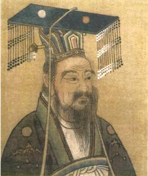

# 帝王心事也是诗

中国的小孩子，多少都背过唐诗，有个《唐诗三百首》集子，不少人家里都有。里面有首唐玄宗的作品，是写孔子的一首五律，四平八稳，算是合格。好歹放到《唐诗三百首》里面，不至于太不配。唐诗佳作甚多，唐三百晚唐选的奇少，偏爱韦庄，无视罗隐、皮日休。但就算抛开韦罗皮陆诸公到底算晚唐还算五代这些个事，唐玄宗能入选唐三百，还是沾了皇帝光。他要不是皇上，何必要选？

中国文人往往“难养也”，比他们所看不起的女性难养多了。一方面自视清高动不动摆出不为五斗米折腰的架子，一方面多少都有点“帝王师”的期许。古往今来，真正像陶渊明林和靖般隐士，又有几个？多少都有点捷径终南驿路北山的味道，等身价高了，三请四邀，方才出山，也不会说是为了做官，而是“如苍生何？”只是帝王师是不好做的，终究还是沦为了帝王的工具，供他们敲锣打鼓粉饰太平。唐三百的编选者，还是免不了中国文人的酸腐气，怎么地要选一首皇上的作品，以表明其“代表性”。唐玄宗那首在写孔子的诗里头算好的——这是因为别人不敢写，孔夫子是圣人，岂容一介读书人议论？依我看，以艺术水平论，选唐玄宗这首，真不如选点薛涛、鱼玄机的作品，更具有“代表性”。

再者，中国这些个皇上，也好涂涂抹抹。诚然，有几位的确艺术水平很高，艺术成就也了不起，但大部分绝对是没事找事，附庸风雅。文学艺术这玩意纯看天赋，与努力程度关系不大，与身份地位更是没半毛钱关系。欧陆诸王，艺术修养审美能力也很高，但人家就安分，我已富有四海，何必和几个吟游诗人争个高低？不如安心当艺术的赞助人和欣赏者。联合王国有桂冠诗人封号，何曾听说王室成员觊觎此位？只是中国的皇上，是天子，是圣人，于是乎啥都应该会，你顺天应人代天授命，不是凡人嘛。再说了，皇帝憋出一句，早有谄媚之徒牵强附会，将皇上捧得比天高。只要皇上写出来，侍读学士，经筵讲师，无不哄然叫绝；而且，谁也不敢当着陛下的面，说长道短，总是好，好得不得了。人处于如此氛围，能认识到自己不行、承认自己不行，何其难哉？

艺术成就最高的几位皇上，几乎都做了亡国之君。首推李后主，词是真棒，谁都知道。后主他爹中主水平也可以，但不如他痴迷，存世作品极少，不过有“细雨梦回鸡塞远，小楼吹彻玉笙寒。”一句，也足以流传千古。其余如陈后主、宋徽宗，也是个中好手。当然，陈后主那位同好隋炀帝，也不错。

抛开历史课本，隋炀帝此人，天赋极高，也有大略雄才，但是玩走了手。天赋极高之人，并不适合当绝对权力的专制帝王。治理国家万机加身，普通人早已不堪重负战战兢兢勉力为之，遇到天才，三下五除二，就收拾了山河，手中又有绝对权力，不玩一玩，岂能快意？天才要当了皇上，都喜欢干两件事，首先自然是作死，其次就是修仙。作死派代表高洋、杨广，修仙派代表嘉靖。天才都好作死，虽然作死的未必是天才。只是一旦皇上作其死来，大臣日子就不好过，大臣日子不好过，老百姓更是被折腾死。为什么说宋仁宗是好皇帝No.1，因为他资质平庸，性情也温和，不胡闹不折腾，“垂拱而治”。有年上元节，仁宗偕宫女太监们观灯，有宫女嗔怪道，为何汴京城里这么热闹，而宫里节过得这么冷清。仁宗答曰，正因为我节过得冷清，老百姓才能过得热闹呀。此语，道破为君要义。毫无疑问，宋仁宗个人资质比隋炀帝差远了，但是，隋炀帝时期，文化艺术方面，虽然有几位杰出人才，但总体并不出众，更谈不上文化繁荣期。而宋仁宗时期，唐宋八大家有其六，更有柳永、晏殊、宋祁诸词人，是无可置疑的文化繁荣期，就算不是五千年头号繁荣期，也差不多少。所以，好领导要会“糊涂”，承认自己不是全能战士，有不及之处，欣赏就好。隋炀帝折腾来折腾去，用实际行动了证明了“不作死就不会死”，落得一声叹息。

有关隋炀帝写诗，有则公案，说薛道衡才高，隋炀帝有心自负不输于他。某日薛道衡作诗一首，有“空梁落燕泥”一句，隋炀帝看了，不免怅然，心下了然，自己这辈子写不出这种句子。为确立自己第一诗人地位，找了个借口，将薛道衡赐死。不过，隋炀帝虽然好大喜功， 但未必一定亡国，因有文景朝的积累，汉武帝才打得起，如果隋炀帝不是第二代，而是第四、第五代，没准也是个扩土开边名垂青史的雄主。时也运也，在错误的时间遇见了错误的人做了错误的事，纵使堤岸垂柳千条，也只能身死江都。

后世有一位皇上，天赋比隋炀帝差远了，可样样都学着隋炀帝。幸亏爹攒够了家底，才没玩脱手。这就是“十全老人”（自诩的）乾隆。清朝由盛转衰，从乾隆始。乾隆写诗几万首，当称“高产作家”，可是没一首像样。所到之处，只有唐突山水。给大家抄一首乾隆作品，写的是长城：

金墉迤逦倚山尖，想象当时守备严。

但拟天骄祛冒顿，那知民怨萃蒙恬。

千秋形胜因循览，万古兴亡取次觇。

自是天心无定向，从来违顺卜黧黔。

除了第三联，没有能看的，就这也是别人说滥的套话。乾隆上万首诗，合起来不如魏武帝“月明星稀”四字，天赋这个事情，真是没办法。乾隆一向看不起曹操，我看除了曹操没当上皇帝这点，他哪点都不如人家。当然我这么说，乾隆爷可能不高兴，“你知道我有多努力么？”嗯，你的确很努力，这么努力出诗集丢人，你爸爸知道吗？

乾隆爷宠爱一位文坛泰斗沈德潜，沈德潜是钦封“诗友”，天下能和皇上以诗会友者，只有沈老一人，足见尊荣。沈德潜自己写诗，也评诗选诗，选过本《唐诗别裁集》，评诗的角度很有趣，绝非浪得虚名之辈。乾隆总爱和沈老师诗词唱和，写了很多诗送给沈老师，其中有两句：“我爱沈德潜，淳风挹古福。”让人不禁浮想联翩。沈德潜高寿，活到了97岁，死后也是备极哀荣，头衔一大堆，乾隆帝痛失知己，伤心欲绝。只是十年之后，江南发了文字狱，有位读书人被抄家，抄出了沈德潜和他的通信，里面有沈老师对皇上写诗的评价：

写的不行。

乾隆被深深的伤害了，我是那么爱你，你居然这样对我！于是乎一切待遇剥夺，打回原地。话说回来，乾隆帝报复死去的沈德潜，和隋炀帝杀害活着的薛道衡，都是一个调调，不外乎俩字——嫉妒。只是隋炀帝之所以杀薛道衡，是因为他自愧不如，知道自己不如薛，而乾隆帝，怕是真不知道自己诗写的不行，连这点自知之明都没有，也够可悲。

话说回来，六朝皇帝，文化水平都还可以。有位独眼龙萧绎，践行“人丑就该多读书”，艺术造诣极高，宫体诗写的好，画也好，也成了亡国之君。穷一生之力，收集了十几万卷图书，城破之际，怪读书害了他，一把火将图书馆烧了，简直是文化灾难。你自己读书迂腐，关书何事？可以看看萧绎的宫体诗，香艳太过，略嫌忸怩，我是不喜欢。不过他被俘却促进了南北文化交流，庾信因此去了北边。

这些个守成之君，也许文化程度更高，但总是少了点创业者的豪迈。刘邦是个流氓，但一曲大风，堪称千古绝唱。毫不粉饰，英雄之气沛然而出。至于另一位大流氓朱元璋，写诗也毫不掩饰大老粗本质，但读起来却比萧绎的宫体诗有味：

杀尽江南百万兵，腰间宝剑血犹腥。

山僧不识英雄汉，只管哓哓问姓名。

(采编：薛晨如；责编：刘铮)