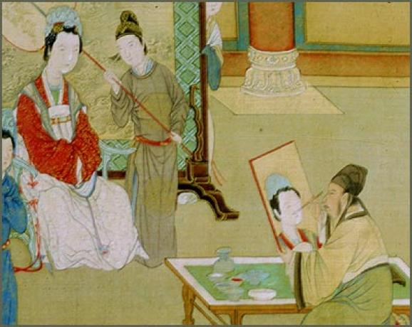
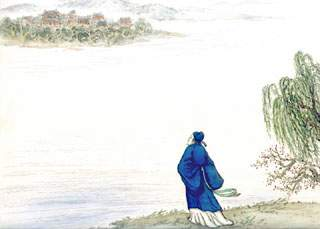

# 当时枉杀毛延寿

杜甫律诗，格律谨严气象开阔，不愧诗圣，但总不免自伤沦落借古喻今一番。比如咏怀古迹五首，总之是宋玉好可怜庾信好可怜王昭君好可怜刘备诸葛亮都好可怜，我便喜欢不起来。少陵此老，我还是最喜欢三吏三别，读来痛如切肤，真乃诗中史家手笔。

少陵作诗，诸葛亮绝对是一关键词。别的不说，以入门教材唐诗三百首来看，杜甫写诸葛亮的诗就有好几首，而且警句名篇颇多。我读少陵写诸葛亮的诗，却很难被触动，很少进入语境，与作者共情，想是因我没有那般人生体验。但当我读到温飞卿《过五丈原》末句“从此谯周是老臣”，不免心折，杜甫大开大阖，层层推进，而温庭筠且战且退，却在退军途中猛刺回马一枪，妖魅冷辣得紧。不说诸葛亮死后蜀汉何去何从，却说从此谯周是老臣，有几分八大山人哭笑不得的意味，沈德潜言“诮之比于痛骂”是此意。这好比小时候看战争片，看到“向我开炮”总是兴味索然，很难被感动，但是看到苏联片鸽子飞过白桦林情人为坟墓送上一束花，我却瞬间理解了战争的残酷，有时候侧面奇兵效果的确好过阵地战。当年冯小刚《唐山大地震》，姑娘拽我去看，结果电影院卖票的时候送纸巾，我转身便走，为此还吵了一架。电影院这做法让我特反感，你要逼着我感动，我就真没法感动，你希望我到时候哭，到时候我没准笑场。真要让我评，咏诸葛亮的诗，我绝对推温庭筠此句为第一。

老夫当年途径青冢，也涂了一首，有句“依依青冢星月夜，漠漠黄沙风马牛”，颇为得意。同样的，写王昭君的诗，我最喜欢王安石《明妃曲》。“意态由来画不成，当时枉杀毛延寿”和“画图省识春风面，环佩空归夜月魂”说的一件事，但前者就透着点揶揄的小坏，连作者王相公那一脸傲娇样都跃然纸上。你汉元帝自己有问题，怪毛延寿有啥子用？你不后宫万千，犯得着找人画图么？有权力就会有寻租，多正常的事儿。写江山美人的诗，总是拿自个当美人，嗟叹命运坎坷，怀才不遇“我这么好这么腻害你为什么不用我为什么不用我”的样子，难免有点小家子气。你咋知道人家美人就和你们一样不大气，我看王昭君就挺好，单于哪点不比汉元帝强，没准人家乐在其中哩。我发现一件事，直男写女人的心绪，总有点自作多情云遮月隔层纱，所以我试过一次，再也不从女性视角写东西了，我不想把自个掰弯。男人写江山美人的诗，要是来点肃杀气，我必高看一眼。比如写戚夫人，我一定最喜欢“当时应恨秦皇帝，不杀南山皓首人”，有意味。吴梅村写陈圆圆，真是棒极了，你看上去还是红颜薄命又祸水的老套路，其实旧瓶装的全是新酒。说到吴三桂，我鄙夷其人，我鄙夷的不是他为女人降清，如果单是因为这件事，我反而要佩服他。为了自己的妞，家国天下都可以让它一边去，这难道不是大丈夫大豪杰大枭雄气象么？（当然也是大流氓。）可惜他晚年纳妾，闺房不修，又搞出反清闹剧，说明他不是痴情，而是好色；不是投机，而是拎不清。刘秀给中国男人树了个标杆，也被视为千古一帝，结果废郭圣通立阴丽华为后，却被说个不停。宋儒点评光武“废郭立阴，圣德之玷”，我却因为这事给光武加无限分，大丈夫为天下主，不让自己最爱的女人当皇后这皇上做起来有啥意思？郭是政治婚姻，阴丽华才是真爱。这种事爱骂骂，就是得干，让她快意，也让老子快意。后世儒生喋喋不休，没劲透了。

扯远了。说回老杜，人的写作风格，必然与其生活经历有关。王维摩诘就有点禅趣，漠漠白鹭阴阴黄鹂，虽然也有衣冠拜冕旒这种拍马屁车轱辘话。而孟浩然就透着点散淡，虽然还是心有不才明主弃的不甘。老杜流离颠沛，难免沉重苍凉，有促狭者诸如郭沫若之流还要嘲讽他茅屋为秋风所破，还要讥刺他吃了坏牛肉食物中毒，真是贱人就是矫情。杜甫写律诗，格律词句都没得挑，真是“工”。但是话说回来，词句是可以锤炼的，也就是说可以人力得之，而立意可不是“苦吟”就能有的，靠的是天分。“从此谯周是老臣”、“当时枉杀毛延寿”就透着点天才的灵性，所以更让人可喜。但天才都有点毛病，比如落拓的温八叉，比如执拗的王相爷，所以成就都不及老杜高。有天赋没啥子，有天赋还肯下笨功夫，这人不搞出点名堂，老天爷都不答应。于是乎个性使然，大李杜我更喜欢大李，小李杜我更喜欢小杜，就是因为有那股天才劲儿。唐宋八大家中宋六家，我喜欢东坡和荆公，东坡有趣恢廓，荆公为人刻板但绝非真无趣，而是“此老狐狸精”，可鬼着呢。

晚唐藩镇割据，人一离乱遭际，咏史诗就多了。皮日休罗隐陆龟蒙韦庄都有此类作品，韦庄有《秦妇吟》，也是三吏三别一路，有句“天街踏尽公卿骨”，读来却有种莫名的快意，简直有种库布里克的画面感。胡曾几乎到一个地方就要怀怀古，写了一票怀古诗，老调子的太多。有一首博浪沙，言道“山东不是无公子，何事张良独报仇”让人叫绝，其余的多半泛泛。

到底什么是气象，什么是风骨，一直纠缠不清。前段，吾友梁亮氏语我，说所谓盛唐气象不就是遍地广场舞，到处大秧歌么？我想想，好像是这么回事。所谓盛世，还真是与劳动人民同乐，歌舞升平相。到了白乐天，完全口语化写作。北宋之盛，也是歌馆风情之繁华，是全民娱乐，所以有水井处皆可柳词。看来凤凰传奇背后的团队不仅市场定位精准，政治嗅觉也很敏锐。有广场舞处皆可凤凰词，劳动人民扭起大秧歌，这就是道路自信、理论自信、制度自信。像凤凰二人组能进部队文工团成为团职干部，不是一点原因没有，也未必完全是领导个人喜好，其实有一种政治正确的意味。文艺范的民谣则更近乎魏晋风骨一路，只不过当年飞的是五石散，现而今改飞叶子了。民谣盛的时代，好像还真不是大一统大集权所谓“盛世”，比如两周国风。美国新民谣最火的时候，也是六七十年代新左派运动那档子事。

王相爷写《明妃曲》，还惹来一身腥，有句“汉恩自浅胡恩深，人生乐在相知心。”被骂得狗血喷头，或谓“今之背君父之恩投拜而为盗贼者皆合乎王安石之意”；或谓“苟心不相知，臣可叛其君，妻可弃其夫乎？为王安石辩护的人也只好说，“汉恩自浅胡自深”的“恩”是专指男女关系，无关君臣之义。王安石这里所说的恩，就是男女关系，但要说是君臣之义，也没什么不可以。合则留不合则去，君王如此，国家亦如此，没必要用对国家、政府的愚忠换了对君王个人的愚忠，总之还是愚忠。我同情李陵，什么贰臣都是些风凉话，换你被杀了全家，你怎么办？我认为伍子胥好样的，狗脚朕谁都可以做，领导多的是，爹就那一个。我也不感觉应侯刻薄，相反，我认为应侯仁至义尽，已经给魏国留面了。

王安石这人，思想很超前，但是性子急了点，的确难以成事。但怎么说呢，中国人总喜欢抓坏蛋，把一朝一代的得失全推到一个人头上，有时候是女人，比如妲己褒姒陈圆圆，有时候是奸臣，比如严嵩，甚至北宋灭亡，就是王安石的事。复杂系统，每一点都有关系，但没有任何一点可以负全责，今日有些人认为中国近代积弱完全是因为中国文化，和地缘啥的好像一点关系没有。这种想法还是抓坏蛋思维的体现，真中国人无误。

很多事情怪这个怪那个，说白了就是迁怒。有个人怪了，就能把自己摘出来，仿佛自己就一点错没有了。那些个陈圆圆王安石，都和毛延寿一样。意态由来画不成，当时枉杀毛延寿。

（采编：薛晨如；责编：王卜玄；）
