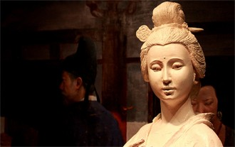

# 我一心只想王宝钏

对于王宝钏来说，不知生死的丈夫，很可能只是一个幻象。支撑王三姐坚持的，可能是所谓的“丈夫”，也可能是所谓的“梦想”，但选择坚持并坚持下去的，是王三姐自己。

至于薛平贵，毫无疑问，是穷小子，自然也是凤凰男。且不论他西凉国另娶代战是否有苦衷，无论如何，薛平贵只是旧社会的中国男性，身上那种好面子的大男子主义显露无疑。在他们的意识当中，三妻四妾再正当不过了，而妻子要是背叛了他，那这事可大了。毕竟这戏是从话本中来，出现这种程度的认识并不令人惊异，要是薛平贵有女权思想，这绝对不科学，薛能想着接王宝钏去享福还封王宝钏为正宫，按薛这么一颗古代小说人物的大脑，已经不算太差了。欧洲中世纪也有过贞操带，古小说的英雄人物，多的是处处留情。且不要拿严阁老说事，严阁老身不二色，只是钟情，不是尊重女性，要是尊重女性，怎会让自己儿子干出“肉痰盂”这种恶心事儿？对于这样的桥段，我们后人来看，只能是“以发展的眼光看问题”，所谓“发展的眼光”，一是要与时俱进，另一方面也要承认古人的不足。这年头我们尊重同性恋的自由，也不能挽回圣殿骑士团成员的生命呵。

武家坡这出戏，在道学家眼中，首先是歌颂女性的忠贞——而且是单方面的忠贞，将王宝钏树为样板，号召大家去学，这种饿死事小失节事大的道德观，当然害人无数。但这未必是民间艺人的本意，而是道学家根据自己的需要作的解读，对文艺作品的解读，必然是见仁见智，根据自己的味觉去切自己最爱吃的那块蛋糕。比如汉儒注诗，为强调“忠君”、“君为臣纲”，便将“山无棱，天地合，乃敢与君绝”。这一显而易见的情诗解读为士大夫忧谗畏讥，但却依然忠贞不二，盼望君主回心转意的媚态。要作者真是这般媚态，反而不是儒家的做派。这诗用来天涯海角尚可，用来忠君爱国，难免味道很怪，可没有“画眉深浅入时无”的机巧。

民间艺人的话本，可以看成另一套不同的话语体系——与官方不同的话语体系。所谓才子佳人，一方面是勉励寒门学子好好苦读，一朝得中封妻荫子富贵可期，一方面也是对负心郎的抨击。很多话本用历史人物说事，但艺术来源于生活，往往有其本事。有些凤凰男一朝发迹，就赶走了糟糠之妻，另娶了官小姐，乡里乡亲都为老实巴交的糟糠之妻鸣不平，但凤凰男现在得势了，除去腹诽又能如何？民间艺人便用故事编排他，我铡的是陈世美，骂的是蔡伯喈，但我说的是谁，言者未必无心，听者往往有意。我治不了他，便巴望着包公甚至是宋世杰这类人治了他。（当然宋治的是贪污犯，不是负心汉。）此外，古代民间故事，往往有投胎转世这一说，这种因果报应说，未必完全是封建迷信，有些时候，是作者替那些失败英雄找回来点。比如韩信十大功劳，却在未央宫里面被舂死，说书人就让他转世成曹操，去出这口气报这个仇；萧何就转世为杨修，前世有恩所以享他的俸禄，前世有怨于是偿他的性命；锁五龙单雄信赴死，说到这一段，每每有听众捶胸顿足哭倒全场，为了照顾“观众感情”，就让单雄信转个世，下辈子用飞刀点死瓦岗三十六将，出口恶气。这种话本乃至后来的小说戏曲，可以看作老百姓的想法，所谓“公道自在人心”，就是这个道理。

像红鬃烈马这种戏，全本倒是长，但观众爱看的，还就是武家坡和大登殿。武家坡好玩，我总有种感觉，王三姐早就想到来人可能就是丈夫了，故意先不捅破，但是她可不能先问，得让薛平贵百口莫辩只得乖乖承认是我是我就是我。后面薛问三姐早知是我该当如何呀？三姐说早知是你骂得可是要更难听呀。这说明三姐是故意骂给他听哩，很多男的总感觉自己特聪明，其实都不如自己老婆，人只是让你逞能不点破而已。而大登殿爽快，薛王夫妻腌臜了这么些年，可算扬眉吐气，男坐昭阳女封正宫，是人民群众喜欢的大团圆结局。当然薛平贵的事和薛仁贵的事有些渊源，比如有出说薛仁贵和柳氏的汾河湾，也是武家坡这一个路数。对于百姓来说，管你英雄好汉，任你锦绣文章，只要负心薄幸，少不得被人背后戳脊梁骨。大部分人不在乎你三箭定天山，可谁都在意你三击掌的时候许下了什么誓言。

我从小看这出戏，并不是完全进入王宝钏固定的“受害者”形象，我觉得王三姐真是个特别厉害的女性，人看问题的视角，绝不简简单单是爱情。她之所以对薛不离不弃，都不完全是爱情，而是“不向这个操蛋的世界投降”的风骨，她是等薛来证明，她给自己选择的路是对的。结果她等到了，所以大登殿的时候有没有代战她根本不在乎。真要说王三姐这人是不是爱情对不对这些个事，得进入王三姐的语境。对于王三姐来说，她在系统中的对立面不是薛平贵，而是他爹和他二姐夫，也包括那些看她笑话的围观群众。在戏中的状况下，她一个弱女子能怎么办？像花木兰一样从军然后将薛平贵刺在马下？按王三姐的性格，也只能倔强的等待薛平贵回来证明她是对的。王三姐不完全是忠于薛平贵，她是忠于自己选择的道路，矢志不渝。王三姐不能接受屈服，已经不是忠贞不忠贞的问题，而是要不要彻底否定当初这条路的问题。薛平贵是死是活，是贵是贱，反而不那么重要。所以如道学家般，将三姐简单视为苦苦等待丈夫的弱女子，是太把薛平贵当回事，也太小看了王三姐；而今天有些拿这事批判这出戏的观点，也一样高看了薛平贵，小看了王三姐。没有薛平贵，王三姐一样活得很有尊严，但没有王三姐，薛平贵就是个负心汉，没有谁会当他是英雄。从这一点上，王宝钏恰恰彰显了女性的柔韧与刚强，她选择，她喜欢，不是她属于薛平贵，而是薛平贵不能没有她。

有种结局，是薛许诺要让宝钏每一天都要像过年一样，结果以日易年，十八天耗尽了十八年寿数，宝钏因此逝去。很多人不喜欢这个结局，但话说回来，求仁得仁，又何憾哉？当坚守开始的时候，宝钏可能在等待丈夫，但到十八年后，宝钏所坚守的，更多就是坚守本身。

这般倔强想是让所谓英雄尽皆汗颜，放下西凉无人管，我一心只想王宝钏。

（采编：薛晨如；责编：王卜玄）
