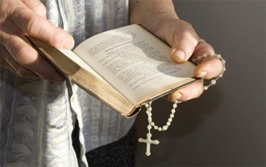
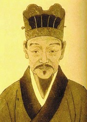

# 焚书

在我六岁之前，就已经被养成了逛书店的爱好。我这人事有蹊跷，现在我的脑海里依然残留有一岁之前的影像，照理说， 三岁之前是不记事的，但我竟然有一些零星的碎片，脉络清晰，痕迹鲜明。我至今能记住我幼儿园时代质问书店店员有眼不识泰山那个下午的所有细节，说起来，人记忆力太好，对他不是什么好事，对别人也不是什么好事，有些事情还是别记那么清楚的好。一个人记忆力太好，难免会有些神经质，他会特别恐惧不能控制自己的意识，所以他会恐惧醉酒，他会在将醉未醉之时采取措施，更不会使用致幻剂，他特别惧怕记忆里存在空白。每一个特别理性的无趣之人，往往都有过人的记忆力。

当我将玛德莲贝壳小蛋糕泡进红茶的时候，我清晰地想起，我质问过店员的那家书店里，曾经用小黑板写一些书名，类似于当下的店主推荐，有一段时间，写的赫然是《北回归线》、《南回归线》，那是九四年。那时的我自然不会明白这两本书代表什么，四岁的我翻看过，我以为它们是地理书，然后发现自己看不大懂，但好像写的和那两条线没什么关系。小孩子读书，难免囫囵吞枣，我读老子，就没读懂“峻作”，也弄不懂“周公之礼”是要干啥，十数年后，我才明白。十数年不长也不短，宣传部长都换过好几位，如果我没记错的话，我应该不会记错，卡牌大师主政宣传部时期，书店里找不到亨利米勒的作品。

我错过了启蒙的好时机。上大学之后，室友总拉我去图书馆，美其名曰上自习。他每次都会在书架前流连一番，停在一方书架之前，有一次我实在忍不住跑到后面去，发现他正在认真研读一部奇书——《金瓶梅》。我的室友果然志气不凡，然后我俩决定分享知识，以免独学无友孤陋寡闻，并进行了深入的探讨和愉快的交流，体现了严谨的治学精神，严谨到一字一句都要推敲。夕阳西下，落日余晖透过窗棱洒在少年的面庞上，他们俩正在认真地读书，图书馆老大爷经过他们身后，总少不了颔首赞许，心里默念：要是我家孙子也这么爱学习就好了。

中国的青春期教育一直是在认真的儿戏，初中教过我健康教育的老爷爷，已经在睡梦中无疾而终，不知谁能继承他的衣钵。人肯定会被性启蒙的，大家都是动物，问题是什么时候启蒙、谁来启蒙、怎么启蒙。教育者总是想不明白这个问题，你们不是想控制孩子么，不是怕孩子们“学坏”么？那就自己掌握启蒙的主导权才对呢。与其让我们被兰陵笑笑生、渡边淳一、王小波、松岛枫、苍井空启蒙，学校干啥去了？你们自己教点生理知识就挺好呀，何必让我们从王小波那里学一些独立思考呢。

有人说我教坏小孩子，理由是我出一些诸如“爱情是原始冲动”之类的命题，让新生辩论，怕新生辩了我的题之后，变的不纯洁。我不知道他们怎么看纯洁，我始终认为纯洁不是啥都不知道，而是什么都知道之后依然可以不变初心，以乐观的态度和昂扬的斗志去面对这个世界。啥也不懂，不叫纯，那叫蠢，不是善良，而是无知。只见过所谓的“好”，不可能有什么鉴别能力，花花世界音容宛在，谁也隔绝不了。我最佩服自己一点，就是不管发生什么事情，我还是会一如既往往下走，哪怕最后只有我一个人，我认为我特别纯洁。

书这个东西，写出来是用来看的，也是用来烧的。各国都烧过书，集中焚烧，很像不久前集中扑杀家禽。家禽会传播生理病，书籍会传播某些人认为的心理病。之所以让人“纯洁”，背后是对服从的耳提面命，是对肉体乃至精神的规训。被阉割的青春期教育便是如此，在人的潜意识里埋下种子，性是羞于启齿的，放浪是不对的，于是肉体被自我训诫，不敢越雷池一步，既然肉体被束缚，也就可以惩戒精神，灭杀不羁的灵魂。因为不羁和反抗会人传人，比禽流感更加猛烈。有些事情，我之所以不做，是因为我不打算去做，而不是谁不让我做，所以不要夸我道德水平高尚，你夸我道德水平高尚，和抨击我居心不良一样，都是在揣测我的动机。

可是书这个东西，永远是烧不完的。焚书，是徒劳无功的事情，只要人有思想，就会有书。禁书也只是一时，不可能彻底扑杀，有些时候，你禁止什么，只会让人更加想读。于是乎我又看见南北回归线拿出来卖了，萨德也拿出来卖了。在我父亲读书的年代，《通向奴役之路》、《致命的自负》这些玩意，想看是要申请的，是要为了批判才去阅读，现在也公开发行。就连《一九八四》，都被缠上了腰封，写上一句话：多一个人读奥威尔，就多了一份自由的保障。序言里写道：奥威尔通过对斯大林极权主义的批判，坚持了真正的社会主义。曾几何时，和托洛茨基扯上关系，戴一顶“托派”的帽子，可以让你家破人亡，现在已经开始讨论列宁到底是选择托洛茨基还是斯大林接班，到底谁才是马列主义的正统，向死在墨西哥的托洛茨基奉上光环：被遗忘的先知。凡此种种，真真让我情何以堪。

话说有个人，颇有自知之明，写的书就叫《焚书》，自觉地将自己的书放在被烧掉之列，此人是李卓然的哥哥李卓吾。（改动？）《焚书》显然没有被烧光，因为我书架上就有，毫不违禁，包含大量私人书信，也没有阴谋颠覆政府的内容。李卓吾一生行事出乎常人，不被时人理解，难免有激愤语。只是在我们这里，异端从来没什么权利，李卓吾作为异端，被整的很惨，后来又用他当大棒，去修理新时代的异端。批林批孔时，任继愈编过一本《法家著作选读》，估计任老自己都不愿提这档子事，关键是这本书我家有，成了任老血淋淋的黑历史。李卓吾生生的被归入法家，但凡说过儒家哪怕是宋明理学不好的，都会被归入法家；还有些懂经济的同志如桑弘羊，还有柳宗元，就因为写过篇《桐叶封弟辩》，也光荣的入选了《法家著作选读》。我要是任老，最想烧的一定是自己编的这本。

李卓吾还有本书，我认为那才是重点，你们谁在市面上见到过？各大网上书城哪个有卖？这本书叫《藏书》。李卓吾分明更看重这本，《焚书》烧了就烧了吧，《藏书》你们可要藏好了。我只在一个地方看过，东北师范大学历史学院有个藏书室，摆放已故老院长林志纯先生的私人藏书。我大一的时候砸门进去，说我想看看你们老院长的书，管理员愣了，也没阻拦，就让我看了。那里有《藏书》，果然厉害，从三皇五帝开始，到明朝开国，全部中国历史吐槽个遍。包含《大臣传》、《名臣传》、《儒臣传》、《武臣传》、《贼臣传》、《亲臣传》、《近臣传》、《外臣传》八种，每类之下又分若干门，写了八百多名历史人物。不仅抨击言论，更是直指人心，把政客那点子破事和盘托出，难怪市面罕见！

作为常年的好邻居，也作为没被我校并掉硕果仅存的长春名校，东师长期是大南岭技工学校的后花园。这里有家好书店，本来南岭也有分店，但在工科校区实在卖不出去书，就撤回东师了。今天我路过门口，决定进去买两本书，发现我的会员卡号都被销了。真是树犹如此，人何以堪。

还是我上大一的时候，有一次，我偕同一位1米9出头的壮汉勇闯女儿国，在食堂被人发现，有位姐姐大喊一声：男人！我俩闻言撒丫子就跑，跑到文昌路，才猛然想起，我俩跑个甚咧？面面相觑，现在想起来，都怪青春期教育没做好，都怪教育体制，哼。

我喜欢在暮春初夏的时候去东师，不是去看姑娘，是去姑娘们的食堂吃饭。那里的洗手间有一个会唱歌的烘干机，它总是在唱同一首歌：九九那个艳阳天来哟，十八岁的阿哥细听我小英莲莲莲。

(采编：薛晨如；责编：王卜玄)
