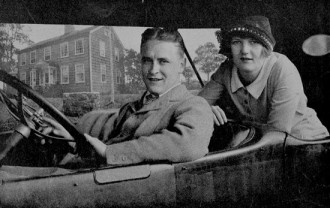
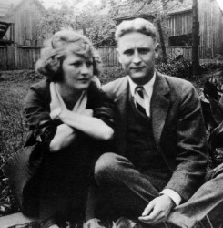

# 爵士时代的盖茨比

2007这一年，法国最有影响力的文学奖项——龚古尔文学奖颁给了小说《阿拉巴马之歌》。主人公名曰泽尔达，是一位性格鲜明极富魅力的女性。小说以倒叙的手法，叙述了泽尔达与精神病抗争的一生，而最引人注目的桥段，则是她与丈夫的初见直至火热。谁让泽尔达的丈夫太过闻名，这位以弗朗西斯·斯科特为名的男人，在婚后，为泽尔达冠上了自己的姓氏——菲茨杰拉德。

长时间以来，人们心中的泽尔达都是十足的坏女孩形象，她的疯狂与自私毁灭了他的丈夫。可是谁知道呢，如果没有泽尔达，会不会有一个叫菲茨杰拉德的作家以及那部名小说《了不起的盖茨比》。或许正如菲茨杰拉德夫妇的好友海明威所言，毋宁说女人毁掉了菲茨杰拉德，不如说女人成就了菲茨杰拉德。菲茨杰拉德注定要为泽尔达绽放，只有泽尔达，才能将他的才华点亮。

《阿拉巴马之歌》的作者，记者出身的勒鲁瓦表示，自己热爱那些“拥有极端渴求的人。是这种欲望的能量、对自由的向往，令他们出类拔萃。”于是，他把泽尔达的故事写得轰轰烈烈。“我不可能淡然处之，泽尔达活着和死去的方式都不是淡然处之。”他将龚古尔奖献给他的主人公，“为她的牺牲，为她从未得到过认可的才华”。

泽尔达塞尔（Zelda Sayre）1900年7月生于美国南方州阿拉巴马的蒙哥马利，父亲是州高院的法官，爷爷是参议员，显赫的家庭背景和家人的骄纵，养成了泽尔达放浪不羁的个性。6岁那年，小泽尔达爬上自家房顶，打电话给消防局，说她家发生了火灾。看着下面乱成一团的消防车、邻居和警察，小泽尔达开怀大笑，从这个熊孩子的故事，可见泽尔达的性格。成年后的泽尔达美丽而野性，是当地的明星，深受驻军追捧。她命令飞行员给她做特技表演，而她的骑士们也争先恐后地效劳。

也就是泽尔达18岁这一年的乡村舞会上，明星泽尔达引起了少尉菲茨杰拉德的关注。他默默注视着自己的女神，不知道该怎么开口，对于泽尔达来说，菲茨杰拉德太卑微了。终于他鼓起勇气，走到被军官和大学生簇拥的泽尔达面前做了自我介绍。“就像把鼻子压在镜子上凝视自己的眼睛一样”。

少尉菲茨杰拉德本不必如此困窘，他母亲的娘家曾经阔过，到他这代家业所剩无几，加之他的父亲生意也不成功，现在的菲茨杰拉德的确不够富裕。只要不提倒数前列的学业和穷愁潦倒的父亲，菲茨杰拉德简直“完美极了”。不难想象当菲茨杰拉德遇到泽尔达之时，会是如何的忐忑与颤抖。

从此，菲茨杰拉德所有的长篇小说里，几乎都有一个如他一般的穷小子和一个如泽尔达一般的女神。

人们通常都会问小说家一个问题：“你的角色有你多少的影子？”对于菲茨杰拉德来说，答案是很多。今天，当我们打开《了不起的盖茨比》，如果你了解他的生平，你可能会在恍惚间把小说当成自传。

盖茨比与黛茜的恋爱和分手本来是个很普通的爱情故事。作者把盖茨比热恋的姑娘化为青春、金钱和地位的象征乃至“美国梦”的化身。盖茨比为了追求黛茜耗尽了自己的感情和才智，最后葬送掉自己的生命。他天真地以为：有了金钱就能重温旧梦，赎回失去的爱情。他生活在梦幻之中，被黛茜抛弃，为社会冷落，终于铸成了无法挽回的悲剧。而现实中，成名之后的菲茨杰拉德夫妇也过上了纸醉金迷的生活，这是泽尔达想要的，当然也是菲茨杰拉德想要的生活。不必将菲茨杰拉德的悲剧推给泽尔达，菲茨杰拉德遇到的，只会是明快激烈的泽尔达。他就是盖茨比，富贵而衣锦夜行，是无法忍受的。由于铺张无度的生活，拿着当时最高档次的稿酬，菲茨杰拉德依然入不敷出，他只有不断的写，写，写。我们今天看到的菲氏故事，总不免感到些许失望，哦，又是一篇有关穷小子和女神的故事，但菲茨杰拉德总会带给我们惊喜，他总能构筑最为精美的桥段。纳博科夫之所以成为小说之王，在于你永远不知道他会打出什么牌，而菲茨杰拉德，永远只有那几张牌，但却总能打出不同组合，却同样精彩的牌局。虽然菲茨杰拉德的作品总因其通俗性受人诟病，以至于当时的评论家并不认为他可以与海明威、福克纳、德莱塞相提并论，但今天看来，你又无法不佩服菲茨杰拉德天才——一种讲故事的天才。他的一生，是浮华而虚无的一生，但这对文学而言，未必是悲剧。

据沈诞琦《毁掉菲茨杰拉德的女人》文中所言，菲茨杰拉德欣赏泽尔达的才能，鼓励她写作——用他的名字写作，因为这样稿酬更高。为了钱，钱，钱，为了维持纸醉金迷的生活，泽尔达选择了默许。也就是说，菲茨杰拉德的作品集里很可能有泽尔达的作品。酗酒损害了菲茨杰拉德的健康，也影响了他的写作，收入因此下降，而困境只会让菲茨杰拉德继续酗酒。1930年，泽尔达患上了精神分裂症，治疗费用又进一步加剧了经济负担。自1933年起，他们的婚姻就名存实亡。1940年12月21日，菲茨杰拉德死于酗酒，时年四十四岁，死时的菲茨杰拉德已经破产，他的葬礼十分简陋，就像盖茨比一样。七年之后的1947年，泽尔达所在的精神病院失火，泽尔达被活活烧死，得年四十七岁。 

一战结束后的美国，此时1929年大萧条还没有到来，传统的清教徒道德已经土崩瓦解，享乐主义开始大行其道。形成了一个如菲茨杰拉德所言“奇迹的时代，艺术的时代，挥金如土的时代，充满嘲讽的时代。”这便是后来被称为爵士时代的美国20年代，而菲茨杰拉德则是爵士时代最伟大的桂冠诗人。“由于他本人也热情洋溢地投身到这个时代的灯红酒绿之中，他敏锐地感觉到了这个时代对浪漫的渴求，以及表面的奢华背后的空虚和无奈，并在他的作品中把这些情绪传神地反映出来。在他的笔下，那些出入高尔夫球场、乡村俱乐部和豪华宅第的上流社会的年轻人之间微妙的感情纠葛是一个永恒的主题，他们无法被金钱驱散的失意和惆怅更是无处不在。他的作品经常以年轻的渴望和理想主义为主题，因为他认为这是美国人的特征；他的作品又经常涉及感情的变幻无常和失落感，因为这是那个时代的人们无法逃遁的命运。”（引文自百度百科）这便是所谓“迷茫的一代”，战后的精神空虚似乎一脉相承，二战之后，也出现了金斯堡、凯鲁亚克及所谓“垮掉的一代”。从精神溯源上，似乎与“迷茫的一代”系出同宗，只是“垮掉”比“迷茫”似乎能量更大，六十年代美国的新左派运动，遗泽也好，遗毒也罢，其阴影流湎至今。

比起菲茨杰拉德赖以成名的长篇小说而言，我更喜欢他富于想象力的中篇，那里更能不折不扣的反映他的天才。比如那颗比饭店还要大的钻石，比如本杰明巴顿的一生，也就是布拉德皮特所演绎的《返老还童》。

或许经济起步之后，其城镇化及表面上的光鲜，那种光怪陆离的奇幻，难免让小市镇来的年轻人目眩神迷。在钢筋水泥的高楼之间，他找不到方向，只想握住这一切。当霓虹灯在玻璃橱窗上投射下光怪陆离的倒影，橱窗里的华服和首饰等待着他们的主人，这样的时代，所需要的正是讲故事的人，使我们且歌且行，如怨如慕，如泣如诉。让文学回归文学，生活自然就能回归生活，生活甜蜜，是苦涩，都需要用故事来描述，将感同身受送向世界的每个角落。

也许正如《了不起的盖茨比》导演巴兹鲁曼所言，现在的中国有些像1920年代的美国，也许今天，又是一个盖茨比的时代。

正如狄更斯在《双城记》中的剖白：这是最好的时代，这是最坏的时代；这是智慧的时代，这是愚蠢的时代；这是信仰的时代，这是疑虑的时代；这是光明的季节，这是黑暗的季节；这是希望之春，这是失望之冬；我们面前什么都有，我们面前一无所有。

——这段话，适用于每一个时代。

(采编：张山骁；责编：王卜玄)

[【七星影像】盖茨比真的“伤不起”？](/?p=41452)--多少人的爱情里夹杂着金钱、权利、身份这些外在的东西？有多少人能拿出勇气执着地追随心灵深处那道绿光？这些问题，总渴望从某个故事中找到答案。

[＜玉衡＞毁掉菲兹杰拉德的女人](/?p=9303)--他毁了她，她毁了他，可这远远不能说清他和她之间最深沉的理解和冲突。他控制不住把她灵光四溢的日记抄袭进自己的小说，她控制不住在作家的妻子之外为自己寻找其他的身份。

[【七星影像】伤不起的盖茨比——那些年，我们没逆袭到的女神](/?p=41553)--为什么Daisy不选择Gatsby？Gatsby是注孤生吗？屌丝逆袭后如何才是推倒白富美的正确攻略？请看本期<七星影像>！
