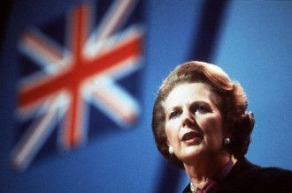

# 玛格丽特来到东方 玛格丽特离开东方

过去的一个世纪，有一位玛格丽特来到了东方，任湄公河的波光投射自己的倒影，这倒影里，有玛格丽特怀春的憧憬，也有古老东方的美丽与哀愁。过去的一个世纪，有一位玛格丽特离开了东方，她步下石阶时的悠长背影，浓缩了一个老牌殖民帝国的落日余晖。20世纪的一百年，仿佛旧有的一切都被颠覆，枷锁被挣脱，秩序被颠覆，几个世纪的不刊之论不再天经地义，几大强国的殖民统治又怎会绵远流长？世界改变了东方，而东方也在改变着世界。

杜拉斯与撒切尔，这两位玛格丽特的象征性意义无需多言，她们的故事交错在东方。

19世纪中后期以降，随着门户开放，东方被迫进入现代化过程。无数西方人涉足神秘的东方，与军队同时到来的，有真正虔诚的传教士，也有披着宗教外衣的掠夺者，有向往东方文化的学者，也有利欲熏心的文物贩子。这批西方人，以及借此契机前往西方的东方人，对历史的影响不可谓不大。东亚诸国的新思维、新文化、新制度，离不开容闳、约翰万次郎诸人。这段时期，东方与西方第一次真正的共同存在于世界性的话语体系之下。司徒雷登创办了燕京大学，为中国培养了大量具备全球视野的第一流人才，赛珍珠凭借有关中国的作品《大地》摘下诺贝尔文学奖，林语堂有关中国人生活方式的书籍，长期占据美国畅销书排行榜前列。东方和西方，从对抗逐渐走向融合，从纷争逐渐走向和解，也从殖民者与被殖民者走向较为平等的外交关系。

杜拉斯的意义，绝不在于她对越南旅游业的促进，而在于她作为严肃作家，坦荡的走向通俗文学。正如她夫子自道：如果我不是一个作家，会是个妓女。杜拉斯的意义，在于她将对爱的渴望和对写作的渴望同质化。杜拉斯的一生，是在对不能言说的恐惧中度过，正因为惧怕不能说，所以她不断的写作。也因为此，杜拉斯的作品总有种莫名的张力，将死亡与爱情、毁灭与永恒交织在一起，用瞬间的爆炸场面完成叙述。讽刺的是，杜拉斯的文笔，一度成为国内女文青模仿的对象，虽然她们模仿的只是王道乾的译作，这是对王道乾先生翻译的肯定，却不一定是对杜拉斯的肯定。杜拉斯的故事之中交织着殖民地家族创业失败的背景、对母亲与兄弟的爱与恨，青春的希望与绝望，如怨如慕，如泣如诉。但如果因故事的表象，将对杜拉斯的解读流于小资情调甚至忧郁气质，则完全偏门，在悲怆而低沉的故事背后，是霹雳般的态度，强悍的生命力和坚决的渴望。杜拉斯承继了自乔治桑以来法国女作家的特点，个性鲜明，奔放不羁，是她纷纷的情欲让她70岁还去包养一个男同性恋，也让她参与密特朗所领导的抵抗活动，并为她的文学烙上鲜明色彩。东方之于杜拉斯，不仅是自己独有的话语权利，也是快感及灵感的源泉。

可能你会认为，撒切尔和杜拉斯除了都是女人，都叫玛格丽特，都来过东方之外，似乎没有什么共同点，这真的不正确，她们最大的相同之处是那种旺盛的生命力。撒切尔夫人这个从小就习惯坐在第一排的玛格丽特，以其铁腕赢得了铁娘子的名号。作为教育大臣，为减少政府经济开支而取消了小学生的免费牛奶供应，成为当时英国最不受欢迎的女人。1979年5月3日保守党赢得大选，撒切尔受命组阁，女首相上台便抛弃了“共识政治”。撒切尔信奉货币主义，立刻进行大刀阔斧的改革：一是私有化，二是控制货币，三是削减福利开支，四是打击工会力量。撒切尔极度仇视共产主义，也极力维护帝国荣光，1982年马岛之战，莽撞的加尔铁里、果断的撒切尔高下立判。讽刺的是，被中国某些自诩为女权人士的视为女权偶像的撒切尔，在西方却长期遭受女权主义者批判，因为撒切尔在政治中的表现太像男人，如果一个女人只有像男人一样才可以赢得政治地位，那这个社会还是男权社会——男人和像男人的人主宰的社会。所以在这个层面上，撒切尔并不是女性权利的代表，反而无意识的维护了男权社会。其实撒切尔在中国的好名声多半是由于她的女性身份和铁娘子的励志传奇，西方民众因其保守主义政策和极端右翼的政治主张对其争议颇大。其实生活中的撒切尔夫人仍然是一位贤惠的妻子，只是她作为政治家的强硬掩盖了这一点。由于女性的天性，包含希望被呵护的女心，也包含护翼子嗣的母性，有其柔弱也有其极为坚韧的刚强。当女性成为一国元首，母性被权力张扬为特殊的强硬，这也许是女性政治家多半以铁腕示人的缘由吧，撒切尔夫人如此，梅厄夫人如此，默克尔、朴槿惠也绝非鸽派。_ _

__

无论杜拉斯的私人生活是否受人诟病，无论撒切尔是不是所谓的男权主义者，这两位玛格丽特的存在，客观上是对女性地位和话语权的极大彰显。女权是要让第二性成为人，而非成为男人。当过往的桎梏一旦被打破，女性也可以把握机会，谱写一样华丽的篇章。对女性的尊重，本质上是人权精神的体现，在对人权和平等权的弘扬当中，无论是女性还是男性，丢掉的都只是枷锁，而可能会得到全世界。

而古老神秘的东方，一度成为掠夺的对象、冒险者的天堂，正如萨义德在《东方主义》中指出，19世纪西方国家眼中的东方世界没有真实根据，是凭空相象出来的东方，西方文化中对亚洲和中东长期错误和浪漫化的印象为欧美国家的殖民主义提供了借口。但一旦东方呼唤平等地位，融入世界，摆脱被殖民身份，其进步一日千里，东方深厚的底蕴也在持续为世界贡献精神食粮。当女性与男性的天平向中间回摆，东方与西方的心态也日渐公允。

今天，撒切尔夫人逝世了，死者已矣，其功过是非留待后人评说，两位玛格丽特的故事也宣告终结。她们来过东方，最终回到西方，新的女性、新的东方，在新的世纪将继续上演更为精彩的故事。

玛格丽特从未离开东方。

（采编：强壮；责编：孙梦予）

[【撒切尔和她的时代】民智还是体制？](/archives/33957)
