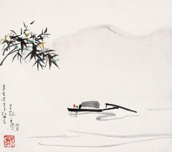

# 上善若水任方圆

君子曰：“道不同于万物，故能生万物；德不同于阴阳，故能成阴阳。”是以衡无轻重，故能轻轻而重重；度无长短，故能长长而短短；法无善恶，方能善善而恶恶。盖身无是非，而后能明是非；事无曲直，而后能通曲直；形无方圆，而后能成方圆矣。

夫水者，无所定形，因器而形，无所从适，顺势而适。以其无定形，故能因器皿之方圆而方圆，以其无从适，故能因江海之南北而南北。水者天下至柔，其柔也，纵鲁缟不能穿，然势为所聚，可颓坚城，倾房屋，滴水千载，可穿垒石，是又至刚也。故君子曰：上善如水。水者，君子之道存焉。

世有君子，其性如水，其心在天下。本无定形，因天下之形而形，遂无定势，因天下之势而势，为天下之人，任天下之事。孔子曰：君子不器。器者，形也。有形即有度，有度必满盈。故君子之思不器，君子之行不器，君子之量不器。故君子不溺于一日之短长、一事之是非、一地之得失，以其能大能小，变化莫名故也。天行健，君子以自强不息，地势坤，君子以厚德载物。流水不腐，是自强不息也，水能载舟，是厚德载物也。故君子如水，乾坤之德备矣。备乾坤之德，通天人之辩，履霜坚冰，终日乾乾，含章可贞，或跃在渊。故能通权达变，利有攸往。

昔汉高祖起兵芒砀，兵不过百，将不过十。高祖无留侯之智，少霸王之勇，贵不如魏豹，侠不如田横，善战不如英布，治赋不如萧何。卒能灭强秦而制群雄，一匡天下，何哉？无可无不可也。因其性如水，无所方圆，应时而动，顺势而行，故鸿门未宴，项伯联姻，天下初定，雍齿封侯。萧何韩信、张良陈平，皆世之豪杰，奇谋诡谲之士，轻易不能屈人下，而皆为高祖所用，以其无所偏倚，从善如流也。闻郦生之言而折节，览陆贾之书而向化，叔孙娄敬，虽有一策之可取，皆擢为亲贵。高祖虽无勇而善用勇，虽无谋而善用谋，故能垂拱而取天下。上善如水，无所方圆，其汉高祖之谓哉！

【2013年湖北高考题】

你注意到了吗？装鲜牛奶的容器一般是方盒子，装矿泉水的容器一般是圆瓶子，装酒的圆瓶子又一般放在方盒子里，方圆之间，各得其妙，古诗云：方圆虽异器，功用信具呈。人生也是如此，所谓：上善若水任方圆。以方圆为话题，根据此材料，题目自拟写作文。

[【高考同题作文】爱迪生看手机](/archives/37860)——一笔一划的写一个人的名字其实并非是什么不可替代的仪式，重要的是我们是不是还那么在乎那个名字背后的人。

[【高考同题作文】穴居蝶](/archives/37994)——梦里我化为一只穴居蝶，在午夜的丝寂中翩飞，不用再挂心进食的事情。

[【高考同题作文】背后的秘密](/archives/38072)——沙老板竖起大拇指：“了不得了不得！深藏功与名哟。老子走南闯北这么多年，你是头一个把国宝认出来的司机！”

褪去学业的负担、“正确性”的压力，回首记忆中的语文课，是否有了和当年不一样的触动与感受？与北斗一起重读当年语文课，期待你的参与，期待你的声音。欢迎投稿至[coldline@ibeidou.org](mailto:coldline@ibeidou.org)

采编：曹雨晨；责编：曹雨晨
