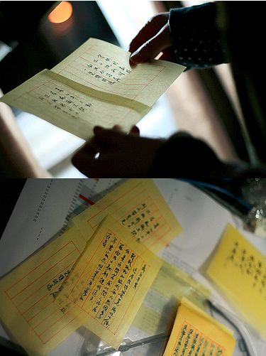
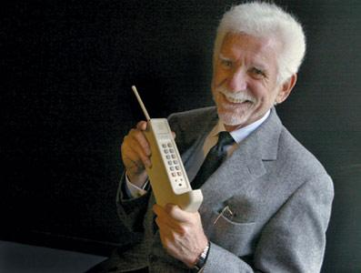

# 爱迪生看手机

记得小学的时候，上课常常和自己喜欢的女孩子传纸条，然后会把这些纸条留下来一个人的时候慢慢看。其实那个时候自己还太小还不懂什么是喜欢，只是觉得看到纸条上的字很温暖，很开心。

记得初中的时候，手机只能发文字短信，总有那么几个人的短信我舍不得删掉。不开心的时候翻翻他们的话，能从黑白色的屏幕上感受到一种特别扎实的力量。那个时候我虽然也不大，但是朦朦胧胧地知道了什么叫喜欢，什么叫友谊。短信发出去就守在手机边上，等着回复的振动激荡我的心情。

前几日，去国求学的挚友寄来一张明信片。我有几分莫名，因为现如今通讯发达，我和这厮三五日便在微信上调笑一番，似乎也并不算是缺乏联系。线上交流的时候，他仍然保持了发送大段文字的语言风格，我往往回复的简短。有时聊到深处，一些艰涩的词汇不愿去多做纠结，便发个表情表达自己的意思。每每这个时候，谈话也就意兴阑珊，沉寂在黑夜与白昼的交汇处。

** **

明信片很普通，但是钢笔字很好看。我看着明信片收件人一栏上我的名字被一笔一划的写在纸上，心中莫名的有些感怀。除了我自己，很久没有人把我的名字写在纸上了。而我自己，又有多久没有写下别人的名字，如同维特写下绿蒂一样写下一个人的名字，恐怕也很久了吧。

西元一八七九年，当爱迪生在新泽西点燃全世界第一盏电灯的时候，并没有发觉他已经引起了一场轰轰烈烈的科学和技术革命。生产方式的变革影响了整个社会以及社会中的每一份子，而这种改变一直持续到了今天。 现代化导致的现代性已经不可逆转地在每个人身上留下了它的烙印，如哈贝马斯所言，“人的变化可能比机器的变化更加彻底。“送信的车马似乎已然太慢，慢的赶不上这个大家飞速前行的时代。

在今天，交流的对象已经变成了选项，当我们拿出智能手机里的通讯录，里面的一个个名字不再是具体的人，反而更像是货架上任我挑选的物品。他们被贴上了“好朋友”、“一般朋友”、“女朋友”这样空洞的标签，在我们想找人吃饭、自习和拥抱的时候供我们选择。当我们感叹信件的浪漫不再，当我们再难以把某某的短信保存很久，当我们抱怨整个社会同质化的行为方式和快餐式的情感表达时，却没有意识到这其实都是我们自己的选择——从来没有人禁止我们写信，手机储存短信的能力也比以前强出数倍。但是我们还是宁愿舍弃含义丰富的词语和其中包含的深沉的感情，而决绝地选择一个每个人都能发出的表情，那么究竟是世界变了，还是我们变了？

** **

秦时明月汉时关，汉代的关隘已经荡然无存，秦时的明月又何曾黯淡。一个流变的时代中若是全是随波逐流的沙子，那么这个时代终将变成浑黄的浊流。若是想砥柱中流，总该让自己先拥有真挚的厚重。一笔一划的写一个人的名字其实并非是什么不可替代的仪式，重要的是我们是不是还那么在乎那个名字背后的人。

才发现明信片上有一行字。

人生忽如寄，且行且珍惜。

西元二〇一三年六月七日 暴雨

于复旦大学

**【2013****年北京卷高考作文题】**

科学家：假如爱迪生来21世纪生活一星期，最让他感到新奇的是什么？

文学家：我想手机会不会让他感到不可思议呢？

科学家：我同意，手机是信息时代的一个标志物，简直称得上是一部掌中电脑，丰富功能一定会让这个大发明家感到新奇。

文学家：手机的广泛应用深刻影响了影响了人们的交往方式、思想情感和观念意识，这或许也是爱迪生意想不到的吧。

科学家和文学家关于手机的不同看法引发你怎么样的想法和思考？

自拟题目、自定角度、自选文体，诗歌除外，写一篇不少于800字的作文。

（采编：曹雨晨；责编：曹雨晨；配图：曹雨晨）

[【高考同题作文】上善若水任方圆](/archives/37860)——世有君子，其性如水，其心在天下。本无定形，因天下之形而形，遂无定势，因天下之势而势，为天下之人，任天下之。

[【高考同题作文】穴居蝶](/archives/37994)——梦里我化为一只穴居蝶，在午夜的丝寂中翩飞，不用再挂心进食的事情。

[【高考同题作文】背后的秘密](/archives/38072)——沙老板竖起大拇指：“了不得了不得！深藏功与名哟。老子走南闯北这么多年，你是头一个把国宝认出来的司机！”

褪去学业的负担、“正确性”的压力，回首记忆中的语文课，是否有了和当年不一样的触动与感受？与北斗一起重读当年语文课，期待你的参与，期待你的声音。欢迎投稿至[coldline@ibeidou.org](mailto:coldline@ibeidou.org)
