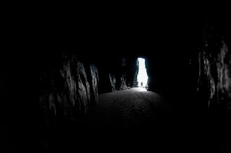
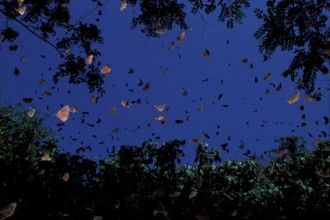

# 穴居蝶

我们在半山腰的洞穴停歇，这支经验丰富的探险队此时已经呈现罕见的疲态，在四月份的东南亚丛林当中，瘴雾凝结的水滴与汗水交汇在一起，形成一层包裹全身皮肤的黏液，每个人都感觉自己正在融化，不是冰雪的消融，而是在强酸腐蚀下无可逆转的消解。我们用仅剩的清醒斟酌扎营的地点，在近乎人工凿砌的平直峭壁上，一切的平面似乎都是陡立的，只有眼前的洞穴向我们展示了一种回复水平的可能。唯独队伍里那个土著小伙子对此面露难色，他从离这座山最近的那个小镇，以非常低廉的价格充当向导跟随我们至此。在他的那座小镇上我们补充了这次探险的大部分给养。美钞面前，当地人兴奋的作为干粮的土特产装载到我们的背包当中，他们用当地特有的奇特手势祝福我们旅途愉快，他们告诉我们，在这座热带地区极端少见的花岗岩山上，有一种当地独有的蝴蝶品种，它们居住在洞穴之中，与黑暗同寝。

我们打开安全帽上方的冷光灯，光线冲入了洞穴里淤积的黑暗，但似乎这里的黑暗已经封存得太久太厚，我们依然无法看清洞里的光景，只有入口处薄薄的光亮指引我们迈出第一步。队长和向导并行在前方，队员们以散乱的队型跟随，盘踞的黑暗被我们所搅荡，因此洞内的一切渐露雏形，我因此看见了与洞外无异的花岗岩石质，以多重的棱面构成坚固的拱形，拱形向洞穴的深处不断延伸，直至不可知的尽头。洞穴的地面平坦开阔，仿佛一间没有人气的毛胚房。队长的步伐一如既往的坚定有力，而向导则显得战战兢兢，好像周围的原始环境里，居住着他们当地古怪而任性的神灵。队长驻足回头，张嘴向我们吩咐了什么，声音惊起一片窸窸窣窣的动静，转瞬无数的细小生灵已经在我们上空飞舞，在幽暗中看不清颜色的纤巧躯体好像片片落叶。穴居的蝴蝶。当地人衷爱而敬畏的造物。 

它们吃什么？

蛮荒的山上寸草未生，更甭提蝴蝶所亲睐的花蜜。这个奇怪的疑问徘徊在我脑海里，仿佛蝶翼盘旋。队长并没有因为眼前的一切而迟疑，他继续指挥我们安寨扎营，磁性的语调在蝴蝶振翅的声响中别具魅力。他卸下了自己的行囊，而刚刚从震慑中恢复过来的向导却扑通一声跪地，乞求他到别处去，远离这座洞穴与其中的生灵。

但我们已经无处可去。队长的回答斩钉截铁。向导显然绝望了，在跪地的姿势中喃喃自语，嘴里繁衍着好像祷词又好像诅咒的土著语言。然而队长不为所动。蜡烛点燃了，映亮了向导惨白的脸，东南亚人特有的黑色眼睛蒙上一层石质的灰，当他终于站起身，抱起队长搁在地上的背包，仿佛逃亡的人犯，不顾一切从队伍间穿过，消失在洞穴外沉沉的夜色里。我们慌忙丢下手头的工作，跟着他的足迹冲出洞穴，而这位黝黑短小的土著男子，此时已经不见踪影。

我们站在崖壁边缘，用微弱的视力探寻向导的去向。但一无所获。我们推测他可能已经坠落悬崖，而崖底的山谷实在太暗太深，以致于我们无法用肉眼寻获他的尸首。他就像一头献祭的牲畜，被神明幽深的口腹所吞噬，嚼碎，成为黑暗排泄物当中的一点一滴。我感到无比的憾然，自己竟然来不及问他，关于穴居蝶的秘密。

我们最终结束了议论，回到洞穴里。刚才漫天的穴居蝶已经无踪无影，或许它们已经往洞穴的更深处去，把面前的空地让予我们这群疲惫的旅人。这是多么和谐的情景。为了不辜负它们的美意，我们安寨扎营，燃起篝火，分享当地特色的食物。午夜我们沉沉睡去，与穴居蝶共享洞中的安宁。

梦里我化为一只穴居蝶，在午夜的丝寂中翩飞，不用再挂心进食的事情。

【2013年江苏卷高考作文题】

材料作文：

一群人来到光线暗淡、人迹罕至的洞穴里探险，洞穴里很神秘，他们就点了几只蜡烛，发现里面竟然有一群色彩斑斓的蝴蝶，他们欣赏了一会儿，不想惊动打扰蝴蝶就离开了。几天后，他们回到原地，想看看蝴蝶在不在，却发现蝴蝶已经栖居到更深更黑的地方去了。他们在想，是不是几只蜡烛的光亮影响了蝴蝶的生活习惯呢？

要求：阅读材料、自选角度、题材不限，诗歌除外，完成作文。

（采编：曹雨晨；编辑：张山骁；配图：曹雨晨；责编：曹雨晨）

[【高考同题作文】上善若水任方圆](/archives/37860)——世有君子，其性如水，其心在天下。本无定形，因天下之形而形，遂无定势，因天下之势而势，为天下之人，任天下之。

[【高考同题作文】爱迪生看手机](/archives/37898)——一笔一划的写一个人的名字其实并非是什么不可替代的仪式，重要的是我们是不是还那么在乎那个名字背后的人。

[【高考同题作文】背后的秘密](/archives/38072)——沙老板竖起大拇指：“了不得了不得！深藏功与名哟。老子走南闯北这么多年，你是头一个把国宝认出来的司机！”

**褪去学业的负担、“正确性”的压力，回首记忆中的语文课，是否有了和当年不一样的触动与感受？与北斗一起重读当年语文课，期待你的参与，期待你的声音。欢迎投稿至coldline@ibeidou.org**
