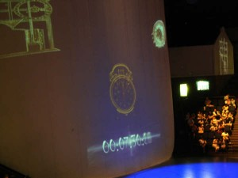

# 一个瘸子的时空之旅

** **

写在前面

答应我的专栏编辑，最近把上了锁的旧稿子打开来。这篇文章本是基于酒话和梦境的调笑之作，酒桌上说起革命，说起沉香和二泉映月，便随手记了下来，凑成一个小故事。今儿又看到了，却多了些让人笑不出来的感慨。

今儿是公元2012年9月15日，发生了一些事，看起来大得很，可在血红的历史湍流中，这样的日子，这样的大事，无论如何也算不上什么“大”了。

每个曾有志向要救世的人，大约都对革命有着某种说不清的情愫。革命与梦想和青春联系得紧紧的，绚烂多姿。上个世纪的那场大变革被翻来覆去地讲，许多充满偶然性的事，都因为某种政治目的而成为被美化和修饰的必然。这其中最重要的因素是“人”，而遭受最多扭曲的因素也正是“人”。抛颅撒血的人有成千上万，有些成了博物馆里的铜像，有些成了被深埋的恶灵，有些坟墓上有鲜花，有些坟墓上有狗屎。斯人已往，后人说再多也是枉然，只是想起百年之后，我们的血肉必将化成教课书上的一滴油墨，我们的爱恨必将化成茶余饭后的笑柄，可那时我们已经成了无言无力的鬼。

我是庞瘸子，庞瘸子就是我。我活得不明白，死了以后打算飘在城市的上空，做一个糊涂鬼，看更多活不明白的人。

我努力地看，努力地写，只求一秒钟的心的平静，只求留下一只秋虫寂寂的哀鸣。

全勇先老师说过，“_历史就是每个人眼里的故事，好多人和事与真相相距甚远。它不是真实的样子，是后人希望看到的样子。_”

前人撒土迷后人眼，这种“不可知”是一个人在有限的生命中所要经历的最大的绝望，但我一直相信正是因为这种绝望，才让人类去思考此生的来处和去处，才让人类愿意去追求某种“不朽”，才让人类对于广阔的宇宙和无尽的时光怀有深深的敬畏之情。

这种绝望，是我生而为人的喜悦。

这世上有这么多的人，每个人为了自己心中的希冀和爱奉献生命，也许悲凉，也许荒诞，这是每个人要修的业。但总有一种情怀，就像我竭力描摹的瞎子的苍凉的胡琴声，穿越时光抚摸你的发，你抬起头，你看见星和月，你体会你懂或者不懂的孤独，这种感觉，让天下所有人心心相印。

明天是初一，我要去进香，无论许什么愿，都是我的一片痴心而已。

但愿人长久，千里共婵娟。

1.

我坐在门槛上，抬头看着屋檐。雨滴淅淅沥沥的，顺着瓦片拼凑出的路径往下流，被瓦当阻了一下，汇成更大的水流，落在地上。

我伸出手去接这雨。

广州今年的四月连着好几个阴天，天天下午下小雨。这天气叫我难受，我那条瘸腿又酸又胀。

身后传来叮叮当当的声音，我叹了一口气，回过头去。

“老喻你到底有钱没有？不给钱下次就没有货了啊！”

他停下手中的活计，用油腻腻的抹布擦了擦手，“我说庞瘸子哟，你也是做老了生意的人，朗个这样小气？等两天就有钱了。”

呸，等两天你都死了，我找谁要钱。

虽然我知道他过两天要去送死，可是钱不能不要，“人死账不烂”，这是老话。

“上次要鹰洋，这次又要安全火柴，全是紧俏货！你当我不知道你们要干什么？我是瘸子，不是瞎子。还要王水，我到哪里给你搞王水？黑市上卖的是金条，洋人钟表，倒斗倒出来的冥器，不卖王水！”

他伸出右手在我眼前摆了摆，他的右手上缺了三根手指，很是丑陋“庞瘸子你这个话就不地道，收钱卖货，你管我做什么，话多了小心被割了舌头！”

他说出这话，我便不敢再多嘴。他是个川汉，蛮得很，割人舌头的事情是做得出来的。世界上有几个人敢像他，自命为“世界恶少年”。

我叫庞瘸子，我不是人。

哎你别笑啊，我真不是人，其实我也不是庞瘸子。

我呢，是个鬼。

这么说也有点别扭，反正你要记得，我本质虽不是人，但和“人”是没有什么两样的。我是个可以在人间地府里自由来往穿越的“人”，想去哪里都可以。

这要多亏我二舅。我二舅他老人家是地府里的判官，就是掌握着生死簿的那位。

我妈生下我的时候，家里人问她我爸是谁，我妈死都不说。我一出生就是个瘸子，又没爸，我命挺苦的。但是娘家人好啊，我二舅是判官，他一直对我很好的，他说这种事情天上人间六道轮回里到处都是，天上那个二郎神的妹妹就是和凡人生了个儿子，人家那个儿子叫沉香，斧劈华山救亲妈，很厉害的。

这么想来我的命也不算太苦。起码我的舅舅姨妈们从来不嫌弃我。

有的时候，地府里的鬼比人间的老爷们有人情味儿。

我今年十八岁，二舅说要给我找点儿活干，在地府里找个又轻闲又体面的衙门当少爷，我说，到处都是刀山火海油锅铁链，哪儿也不体面，要不您老让我上去玩儿两天行不行？

二舅看了看他的生死簿，说，娃想上去玩儿两天也行，就是待不长，想去哪儿？

我想了想，要不去热闹点儿的地方，革命暴动什么的就挺好，要是死的人多了，我还能帮帮黑白无常。

二舅乐不可支，黑白无常是前辈，要你个屁孩子帮忙？行吧，这儿好，公元一九一一年四月，广州，好像要起义，你去凑个热闹？

咻——”

2.

于是我庞瘸子就在这儿了。

我是个倒货的，不过倒的不是什么值钱东西，洋火，牙粉，布，有时候也下黑市倒一点儿子弹金条什么的。

欠我钱的川汉叫喻培伦，是个革命党，造炸弹的。

革命党最烦，总是欠钱，还凶很。

看来来往往的人，喻培伦算是厉害角色。去过东洋留学，自己造炸弹，还教别人。

鹰洋就是墨西哥银元，溶在王水里就能炸，但是不保险，会炸到自己人。喻培伦想了个新办法，用安全火柴当导火索，不用提前点燃，直接把炸弹扔出去就行。

现在全广州的革命党都要买安全火柴。我给他弄来了，他不给我钱。

你说你革命就革命吧，你凭什么欠我钱呢？革命是为了拯救天下苍生啊，我庞瘸子也是苍生，你倒是拯救拯救我啊。

你说街上拉黄包车的，他拉谁不是拉，拉洋人也是拉，拉官儿也是拉，拉革命党也是拉，你只要给车钱，他就能吃饱饭。你说他除了拉车什么都不会，你现在非要说拉黄包车是受剥削，不让拉，不拉车他吃什么？

我想不太明白，索性就不想了。

二舅说人间的事最复杂，叫我别想，别钻牛角尖，就是看个热闹。地府里的事最简单，生死簿一划拉，该下油锅的下油锅，该投胎的投胎。

得了，看来今天这钱又要不到手，这川蛮子没几天活头了，我也别杵在这儿给他添堵。

四月二十日是约定起义的日子。这天我睡到半晌午才出门。

还是个雨天，天上却有太阳，太阳光白晃晃的，没什么温度。

我妈说，天上下太阳雨，人间就要有人冤死。

城里和往常没什么两样，推车卖早点的，刮脸的，测字打卦代写书信的，都在，街上人不多，行色匆匆。我听说今天的起义军是分两路，统归大黑胖子黄兴领导，黄胖子我见过一次，挺和蔼，不像喻培伦。二舅说黄胖子阳寿未尽，今天死不了。陈炯明，姚雨平他们原先约定好的人马都没有按时进入广州，估计是看情形不对，怂了。就黄兴这么一路人马，仓促起事，还要前后夹击两广总督署，太难了。

我吃了一碗猪润粥。我在人间也是要吃饭的，虽然没什么禁忌，但是猪红还是不敢吃，就要老板给我加双份的猪润。猪肝就猪肝吧，还非要叫“猪润”，人间的破规矩真多。

太阳向西，城里的气氛越来越紧张，街边的店铺不知是有了什么预感，纷纷上门板挂水牌提前打烊。莲塘街上都看不见什么人，我躲在吴公馆后门，心中不由的感到一阵不安。

五点半刚过，第一发枪声终于响了起来，接着是“哐哐”的土制炸弹落地爆炸的声音。我想，都是老喻造的炸弹。

枪炮声越来越近，我已经能感到我脚下的石板路开始微微颤抖。对面的街角灰蒙蒙的一片，什么也看不清。大约是有人向这里狂奔，我听见橡胶鞋蹭在路面上“叽咕叽咕”的响。渐渐的，向前奔涌的人流变得清晰，一百来号年轻人，穿学生装的，穿短褂的都有，脚上穿着约定好的黑胶鞋，臂上缚的白布条已经黑乎乎的，有的还带着血痂。

我伸长了头在人群中寻找喻培伦，人太多了，脸上都很脏，实在分不清。他们从我面前跑过，谁也没有转过头看我一眼。

突然我看见了一只有两只手指的右手挥舞个不停，是老喻，他在胸前缚了一个筐，里面全是他造的炸弹。

那么重的筐， 他难道不累么？

远处的两广总督府火起，火势蔓延得很快。天上的雨不知什么时候停了，总督府里的枪声响得像爆豆。入夜时，整个广州城已经乱作一团，大南门，督练公所的形势尤其激烈。从总督府里撤出来的革命党四处奔逃，却在巷战中被逐渐消耗。

我眼看着被子弹洞穿的肉体在我眼前倒下，关节处露出白森森的骨节，我蜷成一团拼命的往墙角里缩，那肉体还未死透，四仰八叉地躺在街上，看装束是个革命党。他仰面对着墨黑墨黑的天，嘴巴一开一阖，大口地呼吸着人世间最后的空气，可是没用，他的肺叶被打穿了，口鼻冒出殷红的泡沫。他慢慢慢慢的转过头来，望向我藏身的方向。我赶紧往墙角里又缩了缩。

他终究看见了我。

他对我笑了一下，死了。

枪声在黎明时分变得稀落，到了天完全亮的时候就停了。总督府的火已经被扑灭。我拖着我的瘸腿走在街上，到处都是血肉模糊的遗骸，残肢遍地。街上一个人都没有，平时热闹的巷陌此时变得十分空旷。

我仿佛站在一片荒野上。

起风了。

黑白无常飘来飘去。

他们看见了我，对我点头致意。

3.

我回到地府之后，安分地住了一阵子。

过了几天，我又去找二舅，我说二舅我还想上去。

二舅嘬着嘴，摸着肚皮，娃啊，你妈说了，热闹的地方下次不许去了，而且呢，最近上去的名额少，舅给你看了个地方，安静得很，跟着个道士还有小曲儿听。

我听到这话狂翻白眼，我说舅你是我亲二舅吗？你是我妈亲二哥吗？我上去跟个道士我还回的来吗？道士要是做法第一个收的就是我啊二舅。

二舅一双大肉手摸着他的生死簿，哎呀舅哪能让娃跟真道士呢，这是个假道士，又抽大烟又嫖姑娘，嫖得一身花柳疮，眼睛都瞎了，才娶了一个小寡妇。

我又不乐意了，舅你倒是让我去点好地方啊，你这么大个官儿，外甥上去就跟个假道士，还五毒俱全。

二舅苦着脸，其实呐，这回上去这个地方跟你有点关系的。无锡洞虚宫雷尊殿，旁边有个一和山房，你妈就是在那儿遇见你爸的。

我大惊，二舅你知道我爸是谁？

二舅的大肉手一把捂住了我的嘴。

你妈跟我最亲，那点儿事我能不知道？你亲爸是谁我不知道，估计也是个道士。你妈当时也是上去玩儿，女孩子嘛去江南最好，又有甜酱排骨又有阿福娃娃，就让她去了嘛，谁想到把你带回来了。

我想了想，问，我能见到我亲爸吗？

咳，肯定见不着。就是让你去看看，给你妈留个念想。

那行，就去这儿吧。哎，你说的瞎道士不会是那个拉《惠山二泉》的吧？

“咻——”

4.

还真就是那个拉《惠山二泉》的瞎道士。

我还是庞瘸子，我的师父是小天师瞎子阿炳公。我喊他师父，其实我就是个打杂的，他不教我拉琴。他说瘸子拉琴勿好看。

呸，我拉琴好不好看你个瞎子看得见吗？

阿炳公今年四十岁，和我一样，也是个私生子，穷得像个要饭的。按理说他这么穷，不该收留我。我跟他说，我爸从前也是雷尊殿的道士，我爸和我逃难的时候走丢了，我来这儿等我爸，等几个月就走，我不要钱也不多吃饭，只要有个住的地方就行。

其实我说的都不算谎话。

阿炳公虽然穷，但他走在路上还是和别人乞丐不一样。他决不肯在身上系草绳，也决不穿破衣。他的衣服都是洗过之后打上补丁的，他的手也很干净，他始终说自己是个艺人，是无锡城里拉胡琴拉的最好的艺人，不是乞丐。“我有艺名的。”他的艺名就叫瞎子阿炳，有一种不咸不淡的冰冷的幽默感。我和他走在街上，我走在前面，用细竹竿牵着他，他走在后面，瘦长的上半身僵硬地往后倾斜，看上去很滑稽，仿佛随时要摔倒一般。他走路的时候微微仰面，看不见的双眼仿佛在望向很远的地方。

跟着阿炳公的日子真的很安静，这种安静因为贫穷而变得更加纯粹，和在广州给革命党倒货时的感受完全不同。我每天把他带到街上，替他摆开一张马扎，再铺一块麻布。然后我就坐在离他不远的地方，看他拉胡琴，看街上人来人往。晌午的时候我帮他把麻布上的钱收拾起来，再从包袱里拿一个窝头给他吃。

我不吃他的窝头，我不是人，我什么都不吃也不会感觉饿。

他在喧闹的街上拉胡琴，琴声响起的时候，无论街上有多少种声音，你都只会听到他的琴声。那首《惠山二泉》他拉得最多，流畅的旋律很温柔，带着隐约的不安，和更加不容易被察觉到的凄清愁苦之意。我看着弓缓慢地擦过琴弦，内心一片黑暗。昼夜交替的时光就在这摩擦声中“吱吱”地流走。路人有时候认出了他，这不是阿炳么？原来他还活着？

人的想法很多，我都不明白。阿炳公是个瞎子，穷得吃不饱饭，白天拉胡琴，晚上修胡琴，师母是个村气的寡妇，每天洗衣，缝补，用仅有的钱煮一些粗糙的饭食。就是这种贫苦而毫无变化的生活，他们过了一天又一天，昨天和明天没有区别。尽管如此，他们的内心，我这个地府的来客却永远看不清。我不明白这人间的事，有人觉得死了很好，在死去前一刻对着我笑，而有些人却苦苦地活着。

有的时候，阿炳公也会在夜里拉琴。

夜风如水，月光如水，琴声如水，从山林坠入谷底。所有人都站在山谷上向下张望，可是什么也望不到。其实这谷底里什么都没有，就是一片空旷。

我又站在了人间这片荒野上。

人间真寂寞。

5.

我跟二舅说，我想做一次“人”，做一次人世间的小小的英雄，不杀人也不被人杀，不受冻饿之苦，做好事，有人替我鼓掌喝彩。

二舅的大肉手乖巧地握成一团放在肚子上，这个好办。

我说，这次再上去一下，看看人间到底是怎么回事。

二舅说，咳，娃别想了，玩儿一圈就算了，想多了连鬼都做不明白，是个糊涂鬼。

“咻——”

6．

我还是庞瘸子，不过现在大家叫我庞老师。

这人和人之间表示尊重，都喜欢称呼别人“老师”。这个称呼挺好的，老少咸宜，阳春白雪下里巴人都可以用，我以后可以叫我二舅“判官老师”。

我庞瘸子老师是一个小小的英雄，身残志坚。我参加了残疾人骑车环城的比赛，为保护流浪动物的基金会募捐。我以后还要骑着自行车，走遍中国，最终环游世界。

我住的居委会都贴出了大红喜报，“热烈祝贺庞瘸子老师所在街道成为骑车环游世界第一站”。

早上骑了四个小时，我感到有点儿累，停下来休息片刻，去路边的杂货店里买个面包吃。

从杂货店了走出来的时候，我大吃一惊。

我自行车呢？

谁偷我自行车了？

“那什么，听说人间有这么个规矩，自称外国人，被偷走的自行车能找回来。”黑白无常又出现在我的身后，拍了拍我的肩。

（采编：欧阳银华；责编：周拙恒）
