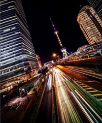

# 一切皆有可能

最能概括这个时代精神的，也许就是这句广告词：“一切皆有可能。”就像很多人正确地理解的那样，它强有力地宣告：如今，任何人只要充分发挥自己的潜能，就能追寻并实现自己的人生梦想。虽然这本身就是一个有待证实的梦想，但历史上从未有一个时代，像今天这样激励个人打破一切禁忌和阻碍去实现自我，并许诺那都是可能实现的。在憧憬之中，很少人注意到这一图景也有它的另一面：“一切皆有可能”同样意味着任何可怕的事都有可能发生。这本来就是同一枚硬币的两面。

任何时代的人，通常都有一种对安全感和稳定感的需求，对冒险和动荡生活的偏好很少成为社会主流。尽管生活水平很低，但只要有一块地，传统社会中的农民基本不存在失业问题，也不会有不安全感——或者说，其不安全感是源于充满敌意的陌生世界，来自那些难以预测的天灾、战乱和神灵，但他们至少可以通过向神灵的乞求而获得一个可掌控的平静生活，尽管这是非常低度生存水准上的安全感。

现代化改变了这一切。这一进程一方面打破了原来固有的秩序和束缚，予人前所未有的解放，另一方面也使人陷入不确定、不安全之中。无人能否认，在这快速变化之中，现代化给予了人们以往做梦也想像不到的实现自我的机会，有时似乎唯一能阻止他们成功的就是他们自己。但不断的更新推进也使许多旧的技艺形同多余，人们常常发现自己的技艺、价值观都赶不上时代的步伐，稍不留意就落伍了。近年来最流行的“新经济”，其特点就是“风险、不确定性和持续不断的变化是常规而非意外”，在这种生活中的人难免越来越缺乏安全感，因为你无法预见自己未来的生活，却很容易被替换掉。与此同时，由于原有的秩序和禁忌都已遭到破坏，很多原先无法设想的事，现在似乎也逐渐变得屡见不鲜；无论多么荒谬不可思议的事，都有可能发生在你身上。

中产阶级是最受这一图景鼓舞的人，也是因此而最缺乏安全感、生活得最焦虑的人。与其他所有阶层相比，他们最相信通过个人努力来实现自我（对他们来说这几乎是一种美德），通常也是最重视教育的一个阶层。在英国，直到最近些年，上层阶级和贵族仍十分坚定地反对知识，相当看不起中产阶级过于看重学历的想法，这一点上社会上层与底层的观点不谋而合。底层人物虽然也时常面临动荡不安的生活，缺乏稳定的收入，但与中产者不同的是，他们往往以一种“今朝有酒今朝醉”的宿命论式的快乐哲学来应对，并不那么担心自己的未来。

现代生活说到底是不可预测的。在风险社会中，谁也不知道自己将面临什么，也不知道明天会发生什么。没有什么是确定无疑或永恒不变的。正是在这个意义上，“一切皆有可能”这句话，既适用于乐观主义者，也适用于悲观主义者，而这两者事实上常常是同一个人——只不过是不同处境下的中产者，正如好事和坏事也只是同一件事的两面。

吊诡的是，正是由于如今都依据受教育程度和个人才能来给人以承认，才加剧了人们的不安全感。因为知识和形势变幻如此之快，谁也不敢确信自己能始终居于不变的优势。按社会学家西摩尔•李普塞特的说法，“管理体制愈是真正的民主，不安全感也愈强”，理由很简单：既然所有成员都有同等机会获得有权的位置，那么人员更替就是其内在规律，没有哪个人是无法被替换的。现代化也要求现代体制下的所有人和事物都是可替换的（interchangeable），用时新的说法就是“更灵活的”工作；可以想见，如果一个人可以像螺丝钉一样被随意替换，他必然会缺乏安全感。这也是为什么中产阶级往往更在意获得他人的承认。

正是由于生活动荡不安、无法预见，由于无力控制自己的生存环境，我们才会信奉一些心灵鸡汤式的生活哲学——按照这些理论的观点，人们必须展现自己进攻性的一面来打消自己的被动性，表现出自己仍能控制自己的命运。有时人们则转向将生活模式固定化来对抗深深的不安全感，西欧人反对移民无产者的浪潮，在很大程度上就是担心自己的生活会被改变。另一个选择则是转向信仰共同体来寻求安全感，这也是为什么在一些社会实现现代化之后，宗教非但没有衰亡，相反还迎来了复兴。

近三十年来中国社会眼花缭乱的变化已带来了深刻的变化，人们也正在逐渐进行心理调适。如果说有不同，那么或许是：中国中产阶级的崛起速度更快，其雄心也显得更没有限制。年轻一代在进入社会之前，就已被周围的传媒反复暗示：只要你敢于梦想，无论多么有雄心的梦想都可能实现，因为当下的中国原本就是一个巨大的造梦机器。这种“中国梦”的理念给无数人以巨大的动力，促成了无数人将他们自身的潜力发挥到极限，也鼓励这个原本羞怯谦逊的民族的现代成员不顾一切地勇于展现自我，有时为了成名而做出种种雷人之举。

成功来得太快，这本身就可能成为不安全感的来源，因为你会害怕失去它。在一个无所顾忌追求梦想的社会，通常也不会有什么限制和禁忌来阻止其他事情。上班时还不知道下午自己将被解雇、一向恩爱的妻子突然说不爱自己了……没什么是不可能发生的。就像《跨国灰姑娘》中说的那样，台湾中产的女性雇主在缺乏安全感的驱使下，惟恐失去丈夫和孩子的爱，不知不觉地将她们与菲佣之间的关系转变成为一场在烹调技巧、美貌和其他“好太太”必备条件上的竞争，其实这又何止是在这一领域如此？

太多的梦想，也有太多的焦虑。这也是为什么有那么多人如今都感觉活得很累。他们是真的累，而这种累，不仅是在工作量的意义上，更重要的是心里累。他们放不下自己已被抬到很高的欲望（是的，只要自己继续努力一下，“一切皆有可能”啊）；同时他们又不能不担心自己的未来（谁知道明天会发生什么？你知道“一切皆有可能”）。这一双重的波浪，正重塑着人们的社会体验。

（采编：孙晓天，责编：佛冉）
