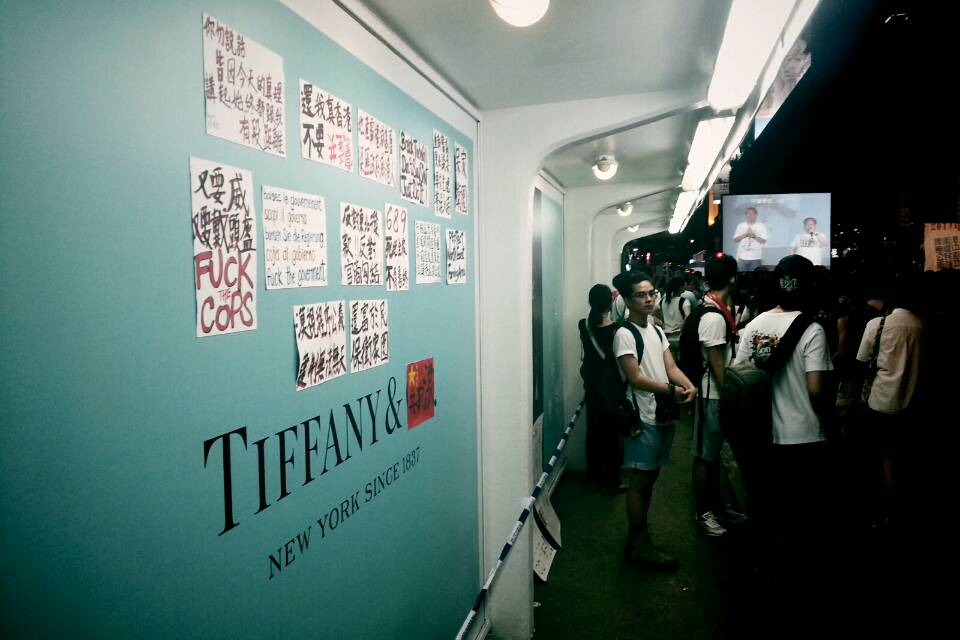

# 一名在港台灣學生的“佔中”觀察

 （摄影：苗硕）

“是一個那樣的時代。能量失去出口，只能拚命往裡面一直塞。好像某個海邊風平浪靜氛圍般的時代，安靜不動都會流汗，卻無法乾脆地讓它發散出來，只能耐著性子忍受那溫溫的汗水。”川本三郎在《我愛過的那個時代》這樣寫道。

不但流汗，還被雨淋。這是2014年香港的七一游行，人們在蒸騰的溽暑耐著性子走著。

正值香港政改如火如荼地進行，在民怨高漲的關鍵時間點上，我第一次參加了七一游行，有生以來第一次見識到潮水般的香港市民從街道上汩汩涌出。在烈日高照的酷暑假日午後，要把號稱有51萬的香港人，從舒適的的冷氣房引到熱氣逼人的街上游行，沒有一個堅定的信念，是不容易做到的。

游行在平和中進行，溫吞得有些無聊，隊伍中沒有過多的煽動言詞與激情。“公民直接提名”、“廢除功能組別”、“捍衛港人自主”、“無懼中央威嚇”、“梁振英下臺”、“我要真普選”、“自己政府自己撿”等口號，從隊伍的這一頭此起彼落地串連響起；《問誰未發聲》這首歌更是一遍一遍地被唱著。彷佛《島嶼天光》這首歌對現下大部份台灣青年的意義一樣，《問誰未發聲》或許也是最能代表香港當下氣氛的歌曲之一吧。

令人印象深刻的是，參與游行的人大都是年輕人。游行中不少時候都是以“開路”作為抗議口號。而參與游行的法輪功樂隊，自游行開始便不停歇地吹號打鼓，提振士氣，穿插於游行隊伍之中的還有幾面港英旗與中華民國國旗，安靜卻不低調，群眾看了似乎都有一種心照不宣的默契。有一個持青天白日旗的長者，山上披掛著標語，步伐堅定，一點也不在意周遭的註目。

滿坑滿谷的游行群眾，擠滿了街道，但警方並未全面清空馬路並管制交通，僅開放單邊西行線道與部分東行線道供游行使用。“開路、開路”一波波的抗議聲浪，在龜步的人群中此起彼落地響起。從希慎廣場七樓的落地窗俯瞰，只見游行隊伍與反向東行線的車輛均動彈不得。我無法理解香港警方對游行動線的決策理據；讓人流保持暢通，不是達致雙贏的方法嗎？這點與台灣警方清空道路專供游行的處理手法似不相同。

我2011年來香港就學，三年間，在台灣的土地上，大大小小的公民運動，諸如士林文林苑、紹興迫遷、華光迫遷、苗慄大埔、多元成家、反核四、反媒體壟斷、太陽花學運等浩浩湯湯地展開。這麽多事情發生，自己雖均未親歷，也都在港島這端，透過社群媒體聊表聲援與關註。

但待在香港的這三年，連外人如我，也都感覺到香港與日漸增的焦慮──恐懼原有的生活方式、香港的獨立自主以及其核心價值會全盤喪失。北京近期發布的《一國兩制白皮書》更加深了那種恐懼。

這三年也清楚感覺到，台港的距離，在“中國因素”──姑且不論這種提法的爭議──的逼視下，倏忽被拉近。“台灣香港化”、“今日香港，明日台灣”成為耳熟能詳的話語。

在不久前臺灣的太陽花學運中，香港才突然進入台灣的公共視野。在台灣反服貿的論述上，香港被視為“中國因素”侵蝕下的負面教材；占領立法院期間，香港學生代表專程來台聲援，並進入立法院展示香港學生簽名支持的布條；一個香港人在學運現場身上掛有寫著“我是香港人，請台灣踏在我們的屍體上想你們的路”的紙板，更引起台灣社會的熱議，以及香港人的唏噓。

近年來，在香港與台灣都看到了相似的現象，包括大眾媒體逐漸被親中財團控制、財閥壟斷、發展主義至上等問題主導。但同時也在兩地的公民社會中，看到了異議與反抗的浪潮。相似的問題，相似的抗爭，這個圖景正是近年香港與台灣兩地社會運動的共同語言；在抗爭過程中，兩地遙相聲援、互為取暖。距離被拉近的背後，是在“中國因素”的陰影下，一股“同命相憐，同舟共濟”的情感連結。

距離的縮短，亦可表現於其他現象。2011年台灣電影《那些年，我們一起追的女孩》在香港錄得了6186萬元港幣的票房，打破了周星馳《功夫》6128萬元港幣的紀錄。同時，台灣交通部的數據顯示，來訪台灣的香港游客從2003年的32.3萬人增長到2013年的118.3萬人。“移民台灣”也在2013年成為香港熱詞，兩地交流似乎更加熱絡。

這次有些大陸朋友、香港朋友、在港的台灣朋友也都全程參與游行；有一位熟識的香港朋友甚至因參與“占領遮打道”，成為被逮捕的511人其中之一。

“我覺得今天不出來良心過不去”，一位港大陸生這樣和我用通訊軟件聊到，“不過估計回去就應該要被請喝茶了XDD”。句末的嘻皮笑臉符號（XDD）帶著一點無奈與悲涼。

除了對“民主”、“自由”這些普世價值的堅定支持外，自己對這個游行並沒有其他特別強烈的感受。三年來，盡管很努力的學習粵語、瞭解香港歷史與文化，試圖融入這個社會，但畢竟不是生於斯長於斯的香港人，要說對待了三年的香港的感情超出我生長的台灣，是不誠實的。

香港的問題最終必須由香港人自己去解決。作為一個負笈香港的台灣人，在這個時點上，我只能出一顆人頭、和港人一起風雨同路。

“對我而言，上不上街游行、出不出一顆人頭去壯大游行人數，已經毫無意義了，”居於宿舍同層樓的香港樓友這樣感嘆，“以前政府還會因為人數而有所反應，現在根本連理都不理了。”

“台灣的民主是無數個世代花了一百年拼出來的，而我們才拼到一點點。”一名台灣學者曾在台灣某個抗議場合說道。那在香港搞民主更加艱巨坎坷。
但改變是一點一滴的，慢慢的向前推進──或許有時候會再後退一點點──但公民醒覺時爆發的巨大能量，終能將 ”We Shall Overcome” (Joan Baez) 改成”We have Overcome”吧。但願我們都能看到那一天。

（註：本文作者張瀚元系香港大學就學的台灣學生，文章僅代表作者個人觀點。轉載自FT中文網）

(采编：余泽霖；责编：叶璐蓓）