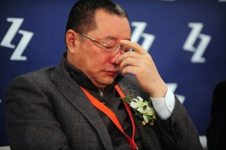
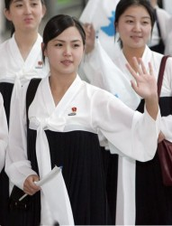

# 一周速递第一期

## 国内新闻

## 宗庆后被砍

中国内地前首富、杭州娃哈哈集团董事长宗庆后13日清晨在家附近遭到袭击。据新华网报道，经医院诊断，宗左手有两根手指肌键受伤。杭州警方公布，已侦破娃哈哈集团董事长宗庆后受伤一案，犯罪嫌疑人系向宗持刀要挟行凶。目前，涉案嫌疑人杨某已被警方依法刑事拘留。据杨某交代，想找宗庆后援助在其公司安排一个工作，因未如愿，于是实施了违法行为。

## 王菲离婚

9月13日晚，7点30分左右，王菲发布一条内容为：“这一世 夫妻缘尽至此 我还好 你也保重”的微博，宣布与李亚鹏离婚。随后，李亚鹏发微博，承认两人已经分手，并称：“我要的是家庭 你却注定是传奇。”

关于二人的离婚原因，外界猜测较多，主要集中在两人性格不合、男方有“外遇”、天后看破红尘决心出家三方面。

18日下午15时天后王菲短短几十个字回应了与李亚鹏离婚的种种猜测纷扰。“婚是我要离的，没有第三者，没有婆媳不和，不牵扯财务问题，不是悲情狗血剧，和平分手，换一种方式相处。对孩子来说我们仍然是一家人。谢谢@一号立井(李亚鹏)用爱和理智包容这一切，感恩。p.s支持嫣然天使基金不会停。内什么，不会出家。”

## 王功权被抓

13日中午，微博有消息称，“北京市公安局20余警察将王功权先生从其北京寓所带走。名义是传唤，涉嫌罪名是聚众扰乱公共场所秩序。” 13日晚9点半，北京瑞丰律师事务所律师李方平发微博称，王功权被正式刑拘，北京警方已向家属送达刑拘通知。

环球时报发表评论认为自由派人士以价值观划线，不由分说为王功权背书，同时站到警方对立面的做法不可取，对警方执法采取征集签名式的对抗做法尤其不应该。9月18日中午12时许，王功权律师陈有西在其实名认证的微博中发布消息称，“王自述无罪，无任何危害公共秩序的目的和行为，只做了一些支持公益的符合良知的事”。“王功权本人此前主要在教育平权、财产公示等社会问题上，对他人观点表示支持，他的一些行为可能会引起了官方的警惕，在公安机关看来，可能是言论不当问题”陈有西称已向公安机关提交保释申请书。

## 腾讯收购搜狗

9月16日傍晚，搜狗CEO王小川发布的一则微博为国内互联网投下了重磅炸弹——腾讯正式投资搜狗。随后，腾讯、搜狐、搜狗共同宣布，腾讯注资搜狗4.48亿美元，并将旗下的腾讯搜搜业务和其他相关资产并入搜狗。在先后与360、百度、阿里等数个互联网巨头传出“绯闻”后，搜狗最终落入腾讯的怀抱。

随后，试图收购搜狗但却失败的奇虎360公司总裁[周鸿祎](http://app.finance.china.com.cn/person/detail.php?id=2177)表态称：“恭喜张朝阳及搜狗，这个价格还是不错的，也希望老张借此机会，让搜狐公司发展得更好。”此次收购完成后，新的搜狗公司在国内搜索市场份额为12%左右，奇虎360公司的市场份额接近20%，百度市场份额超过60%。由于腾讯的加入，搜索市场变成了“三强争霸”的局面。

## 河南多名高中生打砸食堂

9月14日中午12时，河南省商丘市柘城县第二高级中学20多名学生与窗口售饭人员发生争吵，其中有4名学生情绪比较激动当场掀翻了餐厅桌椅，引起部分就餐学生围观。

多名学生介绍，学生普遍对学校的管理有意见，认为学校管理制度苛刻。学校要求所有学生住校，即使家住附近也不允许回家，吃喝必须都得在学校。除此，餐厅饭菜质量不好、价钱昂贵，学校查寝不固定，影响学生休息。

事后，学校校长被免职。学校秩序逐渐恢复正常。柘城二高贴吧中学生自发留名发帖，在表示罪恶感的同时希望挽留被免职的校长。

## 国际新闻

## 华盛顿美国海军司令部枪击案

美国首都华盛顿警方9月16日下午表示，一名前海军预备役人员持枪闯入海军司令部一座办公楼，开枪射杀12人后被警方击毙。枪击案成为31年来华盛顿最为惨重的死伤事件

2007年5月至2011年1月间，嫌疑犯亚历克西斯曾在位于得克萨斯州的沃思堡海军航空站服役，为三等士官。不过2011年，他因为一系列的“行为不当”被美国海军除名。

目前警方调查的焦点是亚历克西斯的犯罪动机，但因为他患有“精神疾病”，尚未能彻底查清作案动机。亚历克西斯的父亲曾告诉西雅图警方，自己的儿子无法控制自己的愤怒情绪，患有创伤后应激障碍症。

## 叙利亚申请加入《禁止化武公约》文件

联合国方面12日证实，已经收到叙利亚申请加入《禁止化学武器公约》文件。这表明叙利亚谋求加速交出化武的步伐。俄罗斯率先提出将叙利亚化学武器设施置于国际监督之下以避免美国对叙实施军事打击的倡议，立即得到叙利亚政府的积极回应。阿萨德指出，叙利亚交出化学武器是出于对俄罗斯倡议的欢迎，而并非出于美国的威胁。

## 李雪主身份曝光

9月14日，据韩国《朝鲜日报》网站9月13日报道，金正恩夫人李雪主的父亲为空军飞行员出身，其母亲为一中学老师。朝鲜民众普遍“以为金正恩会选择学历、家境都最上乘的女性，但没想到选择了大学都没毕业的女歌手”。

朝鲜老人不仅认为领袖与夫人手挽手的场景有碍观瞻，还指责称李雪主的着装有些“轻浮”。但朝鲜年轻人对李雪主些许“破格”的行为青睐有加。因为朝鲜当局曾通过演讲等方式严厉管制过未婚男女光天化日之下手挽手的行为，但在李雪主登场后，这些指责都烟消云散。目前，许多年轻人模仿金正恩夫妇的穿衣风格及发型，朝鲜保守的社会风气正悄然发生着改变。

（编辑：方小华；责编：张山骁）
