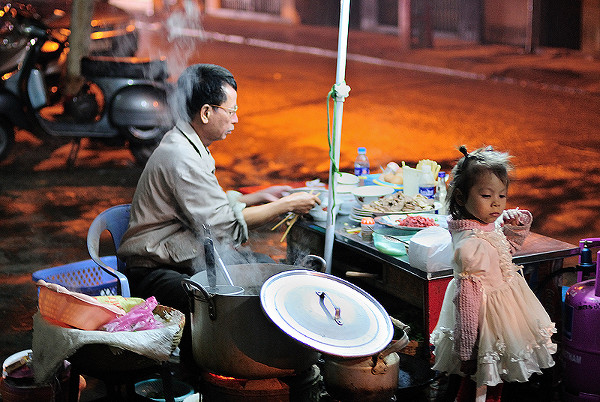

# 一碗米粉的思念

米粉在湖南人心中的地位，就如法棍在法国、羊肉泡沫在陕西的地位。

湖南的米粉既有像桂林米粉一样圆圆细细的——谓之圆粉；也有扁扁宽宽的——谓之扁粉。湖南的中部和东部多爱吃扁粉，西部喜食圆粉的人增多。一般说的湖南米粉，多为扁粉，最有名的又数常德津市牛肉粉，它与桂林米粉、云南过桥米线共为中国的三大粉。这种扁粉不同于河粉，它的口感柔软纤薄却滑嫩有弹性，出了湖南就不常见到。

米粉绝对是一种能让湖南人团结起来的神奇物品。湖南人可以从小到大直至老，都以这一种食物当作早餐。这在其他地方的人看来不甚理解。米粉店在湖南随处可见，遍地开花。有居民楼的地方必有米粉店，这几乎是一条从未被打破的规律。这种粉店大多只有一个很小的铺面，有的甚至只是沿墙摆了几张桌子和几条椅子，条件简陋，饱经风霜的木筷子斜斜地插在铁罐子里，但这也一点不妨碍人们快乐地吃米粉。

很早以前，那时的米粉还是在手工作坊里产生。每日天未亮，便有人推着做好的米粉走街串巷地定点卖给米粉店，而米粉店的主人也早早起来在蒙蒙夜色里开始熬制骨头汤。沁人的香味随着蒸气不断升腾，滚烫的沸水在炉子上吱吱作响，一个一个的碗整整齐齐地垒在台上，每一只里面都已经放好了油盐酱，一切整装待发迎接着即将到来的忙碌。

天色渐亮，陆续有人走进粉店。居民区边的米粉店，来的大多是熟客。客人与店主之间很可能是十几年的老邻居，彼此非常熟悉。客人走进店，往往言简意赅朝店主喊一嗓子：“一碗粉”，忙着烫米粉的店主头也不用抬，只消说一句“马上来”，不出两分钟就能将一碗热气腾腾的米粉准确无误地端到你的面前。要不要加鸡蛋、要不要放辣椒，这些早已在日日的重复中成了默契。来吃米粉的客人之间，很多从前就认识，借着吃早饭的时候打个招呼拉个家常；即算不认识，日日见面，大多也混个脸熟，不出几日，在哪工作，家里几口人，甚至昨天夜里打麻将输钱还是赢钱，互相也就大致清楚啦。

湖南的冬天潮湿阴冷，窝在睡了一宿才稍稍暖起来的被子里，谁也不愿意起来。而唯一能让我有动力在某个时点挣扎着爬起来的就是小区外的米粉店。因为在这种米粉店里，有时到了早上九十点，当天的米粉就卖完了。店家端上来的米粉已经浇上了肉泥、葱花、木耳丝，不过在湖南人眼中这只是半成品。米粉店的每张桌子上，都有若干坛坛罐罐，少的三四个，多的七八个，陈醋、酱油、盐、干辣椒粉、剁辣椒是必不可少的，另外每家还会根据自己的特点，盛上酸菜、酸豆角、萝卜皮、花生米、蒜泥等等供大家选择。一碗米粉的好坏，往往跟两样东西相关，一是熬制的汤，二是辣椒。米粉店那么多，天天吃的人只消一口就能辨别出不一样，这不一样就来自于前述两样。湖南人很享受自己动手添加的这最后一步，往往把所有的添加倒在碗里高高堆起，再用筷子调制均匀，剩下的就是大口“唆”了。“唆”这个字用在这里大抵只有湖南人才能听懂然后会心一笑，我琢磨着也许是因为吃米粉时动作迅速而又迫不及待，于是很多人在吃长长的米粉时会近乎吸食而发出“唆唆”的声音。冬日里，随着米粉入口，一股灼热鲜辣的刺激感立马从喉咙弥漫到胃里，全身上下瞬间暖和起来。待一碗米粉下肚，已是辣得微微发汗、鼻涕轻流了，寒冷驱走大半，客人带着满足踱出店面，走入外面的车水马龙里。

这么多年过去了，米粉早已幻化成味蕾对家乡的思念。在他乡的湖湘学子，总也忘不了家乡早晨的那一碗米粉。大学期间提起回家，最让人兴奋期待的就是早上可以吃米粉。身未动，内里已是馋虫大闹。有人坐着夕发朝至的火车回家，跳下车后第一件事便是直奔米粉店。虽然近年来出现了很多老字招牌的米粉连锁店，但是最好吃的米粉永远在小巷街头不起眼的店里。家门口的那个粉店，最简陋，却是最温馨。从小吃着店主阿姨烫的米粉长大，店主阿姨看着小孩子从小学到初中到高中，直至去了外地念大学和工作，小孩子长成了帅小伙或者美姑娘，店主阿姨也已成店主奶奶了，不变的，是那鲜辣滚烫的味道，以及越发浓烈的思乡之情。它虽不是什么登大雅之堂之物，但因着它的大众和亲民，它早已融入到湖南人的日常生活中去，因此它打败了湘绣、瓷器、烟花和腊肉等，成为湖南人心底最时常念起、最抹不去的乡愁。

其他地方的人尝着米粉也许不会有多大惊喜，甚至会不喜欢那种软绵绵的口感。这其实很容易理解，人吃东西吃的也不过是一种习惯，没有从小与那些食物一起出现的生动场面、没有与自己一起吃这些食物的人，没有在这种食物的陪伴下经历过的事，所有的东西不过是普通的裹腹之物，最多尝个鲜。这是为什么东北人对锅包肉如此倾心，南方却鲜有人爱吃这种又甜又粘的东西；法国人认为抱着那根长长的法棍既有风情又好吃，而我可以买根法棍放到它发霉为止。吃的念的，都是一个情字罢了。从前日日陪伴在身边的东西不觉得有多特别，一旦离开才发现它是如此让人魂牵梦绕。

前几日有朋友告诉我北京也终于有了湖南米粉店，我迫不及待地找过去，点了最常吃的米粉。热乎乎的米粉入口，听着厨师传堂的乡音，我无比感动。虽然味道不甚地道，但我对家乡的眷恋，此刻在异乡的北京，找到了最完美的载体，并且与我美妙地融合了。

（采编：黄梅林，责编：佛冉）
