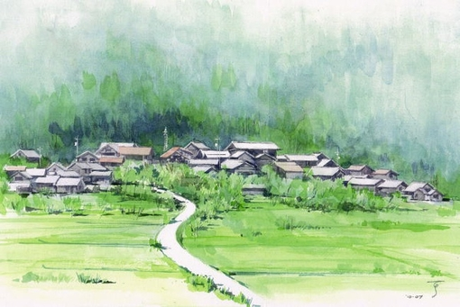
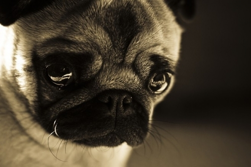

# 一骑当千

沙上民俗，将已故先人之墓安在家宅周遭，以希冀亡人在天之灵，能护佑家门平安，宗族兴旺。水三不兴此风，但我家堂屋后面，翠竹林旁，立浅墓一座，到边上找一株约男子臂粗的大竹，上刻墓志：忠犬黄大之墓，共和国三十七年立。

黑二是我的狗。给它起名字的时候我还不知道黄大的事，也不知道功灿就是伤了黄大的那位表亲。功灿是个和蔼的小老头，爱说笑话，总是喜欢待在树荫下，或站或蹲，你不仔细看定然察觉不到他。他须发皆白，眉毛上也挂了霜，额头前凸，一颗大酒糟鼻，像极了人家中堂里的老寿星。我欢喜他。我与老人们实在有特殊的缘分。那时总不知父亲为何对他从来不苟言笑，我知道，父亲最敬乡老，也最爱笑。

后来从奶奶嘴里陆续知道许多事情，功灿爹爹死得早，家中兄弟几个太穷，有件好一点的衣裳都是谁去见客人谁穿。他从不和人争什么，走路都是走边边，娶娘娘拜堂时，连条裤子都没有，拿坯布包了屁股了事。我同情他，一个人若是一辈子像狗一样活着，最应是纯朴良善，实难想他为甚要害了大黄。奶奶说家里还赊过两条小猪给他，十多年也从不来打个招呼。后来黑二的事情发了，我时常发狠，总说要去向他讨小猪的钱。

黑二是随年富来我家的，他在东厂后头看见小家伙瑟瑟发抖，扔了小半个馒头过去，不想小东西倒一路随他越过了东疆岸，跟到我家的场上来。

年富是我奶奶的外甥，朱家二代中的小儿子，承过父业，十年弄潮把皮肤晒得黑里透红，一双铁手搬山碎岩，却生了一副菩萨心肠，轻易不害生灵。有一年夏天，他家院角的烂网里缠住了一条地皮蛇，他端详许久，慢慢靠上去踩住蛇颈，轻轻念话：“畜生呐，今天我是救你，不要乱搞啊。”那畜生果然不动，他用剪刀一道道地剪开网结，然后快速跳开，任它自己游走。这是我亲见的。后来的一日早晨，也是一条大蛇盘在了他家的水桥上，舅奶奶上了两柱香出来再看，蛇已不见，说是护家之神，我总觉得是否为先前那条地皮回来谢恩了？未得亲见，不敢乱说。

刚来的黑二难讨大家喜欢，它太瘦了。肋排夸张的凸出，一条后腿还瘸了，又有点黄杂挂在脚上，走步一摇三晃，一副见风倒的模样，和人家的肥壮一水油黑子比起来，直让我母亲骂它丑怪。

只有我肉麻它。那会儿家里正开着饭店，每天多出不少骨头，我放学之后把骨头从泔水里捞出来，小的直接放，大的就剁细了放它饭盆里。在外面它是吃不到食的，别的狗比它大，和它差不多大的比它壮，连残渣也抢不到。我见不得它受欺负，那场面让我想起小时候被一群皮孩子压在身下骑马的样子，就会拿住棍棒冲上去把别的狗赶得远远的。我想，它小时候和我一样可怜。可我还有母亲，它的妈妈又在哪里呢？黑二比我可怜。

母亲受了工伤，头颈交接的地方烫掉了大块的皮，我让奶奶照料黑二，陪着她去南通治伤。大约过了一个半月，母亲出院在家疗养，我见到了阔别多时的黑二。它看见我居然不认生，在脚边蹦圈子摇尾巴，这使我很高兴。它比之前足足大了一圈，腿也不瘸了，本来嘛，之前拐着肯定是缺钙所致，身上也有了油光。最稀奇的，或是以前小没察觉，它两眼之上，眉骨左右的地方，居然长了两点蚕豆大小的白毛，像是豆油灯的灯焰，随着头脸运转还能一动一动的，滑稽喜人。母亲说，这丑狗还能长得挺俊。

黑二来家的时候，正是青苗打秀的时节，圈里的母羊产了两只小崽，算是做了它最初的玩伴。一条狗和两只羊做朋友，打闹的时候还被乳白色的小蹄子蹬得后退连连，叫人又好气又好笑。都说狗是狼变过来的，我看这么些骨头是白给吃进肚里了。这没骨气的还常常去鸡窝偷着吃碎米，然后被一群母鸡撵得满场跑，生怕被叨烂了毛。一到这时候，孵在凳子下的猫总是眯着眼看场上的闹剧，然后缓缓偏过头，闭上眼，满脸都是不屑。

我觉得猫儿闭上眼的神情和父亲对着黑二皱眉的样子很像，也有可能前者蕴藏了更多的思想，毕竟我父亲只是单纯的鄙视，我看得出来，可是我们怎么能跟上一只猫的思维？父亲的鄙视自有道理，和前辈相比，黑二确实像个笑话。

然而骨头竟也没白吃，到入冬那两只小羊出栏时，黑二长成了一条大狗。寒假父亲接我回来，远远的看见一条壮狗像黑箭一样从田野里朝我们射来，一直跟在摩托车后边追，还露出一副伸舌头的谄媚相。父亲刚停好车它就扑上来乱蹭，拿爪子靠人的腿，满嘴的哈喇子。我说别闹，再不听话没骨头啃。它恍若未闻，蹦得更欢，还要来扶人的肩膀。父亲大喝一声，不要搞。黑二老实得跟他儿子似的，舌头一收，蹲在那连尾巴都不摇。

为此我伤心了很久。想是因为这次离家上学校的三个月分别让我俩生疏了，这个没节操的居然投靠了我父亲。归来后我对他温言温语，给他吃肉喝汤还洗澡，就是别想使唤得动他。我父动则厉喝，还兼拳脚交流，这厮偏偏就吃这套，每日准时舔脸相迎，风雨无阻，乐此不疲。父令一下，无有不从，甚守上下尊卑之礼。

我苦思冥想，总结两条，一乃我父天赋异禀，有震狗之威。二则狗就是狗，永远成不了佛。后一条确有明证，黑二身条已经长成，高大健硕，膘肥体盛，牙如刀斧，力能撕羊，居然每次进餐依旧让老猫先用，他在一旁目不斜视，待猫儿吃过离开，再上前风卷残云。且一如既往地偷吃鸡粮，被众禽狂追，只是有时候会突然一个猛回头，把鸡吓得蓬蓬乱飞，然后嘴一吱，两片松弛的皮肉从牙口拉到靠近耳朵，好似在贼贼地笑。奶奶不准他这样，怕把母鸡吓坏了，不生蛋。

更有叫人无奈的，这畜生不知从何处学来，竟公然捕捉老鼠与麻雀以作玩物。我怀疑是老猫所教，经常偷偷观察，猫儿居然若无其事，丝毫不为黑二越权之举所动，缓缓偏头，闭眼打盹。这两个没出息的。

当初瘦弱不与他狗争食，现今壮健了碰见同类还是低眉顺眼，母亲说是小时候留下了阴影，大了也不敢和人家抢。我说这样很好，不惹是生非，也不恃强凌弱，能交到好朋友。真是这样，圩上的狗都愿意和他待在一块，他倒是好狗缘。

黑二来的第二年夏天，曹圩发了一件大事。隔着东港的汪圩乘农闲兴修水利，造石管三根作为排水所用，然这三根管道的方位却不对，正冲着曹圩的圩头，这下可犯了大忌。试想若是对门的人家排了三门大炮直指你家大门口，这是个什么状况？曹圩群情激愤要求上门讨个说法，其时队长向问美，中学退休教师上任，又是一位曾教过我与父亲两代人的先生，兢兢业业，廉洁奉公，向来说一不二，深得民心，可谓女中豪杰。

向队长待到傍晚人家吃罢了饭，把她父亲参军抗美援朝时村里送别的壮行鼓抬了出来，架在拖车上，队长男人拉车，问美先生亲自站车击鼓，由西向东一路缓行。向队长一介女流，不过四尺身材，可往那车上一立端的是意气风发，声威雄壮，自西往东，有一户算一户，每家最少要出男丁一人，组成队伍，随车出征。竟还有人捧出家中祖辈参加解放战争受奖的“支前有功”的红旗，披挂于竹竿，摇旗进发。一时间人声鼎沸，鼓声震天，旌旗翻卷，实在是我儿时仅见的壮观景象。

我家祖孙三代，外加黑狗一条，响应号召，从征随行。队伍浩浩荡荡地开赴东港边，对面众人也早已列队分行，严阵以待，甫一相见，即开骂腔，间或夹杂了大人、小孩子、女子、婴儿啼哭、老岸话、沙上话、夹话、铜锣、宣鼓、酒瓶、石子泥块落水……种种声响，直像开了家野戏铺子，聒噪非常。对骂已然是不能解气，双方壮劳力赤膊敞胸，准备干仗。向队长和对岸的头头几乎控制不住愤怒的乡民，好在连接两岸的桥是浮桥，上不得太多的人，大家一时施展不开，各自先上了三五个。

正是一触即发的时刻，对方阵营里却猛窜出好大一条狗子来，上了浮桥横冲直撞，爪牙并用，惊得我们这边打头的几位纷纷落水避让。对面传来一阵爆炸般的哄笑，大意人不如狗，只会躲。我们这边未及交锋便先失一城，一时都有些丧气，呼应不响。那草狼狗汪汪狂吠，耀武扬威，叫人怒火中烧，我看看刚刚落水后爬上来的壮汉子，又看看脚边龇牙咧嘴的黑二，正想让他往后挪点儿，他忽的一下窜出去了。

“好！”这边的人群又沸腾了。我们祖孙三个倒呆了。平日里连鸡都不敢斗，放个鞭炮就要躲到床底下发抖的窝囊黑二，是怎么冲上去的？我看看父亲，他张着嘴，不说话。我要去拉黑二，父亲扯住我，看看周遭摇摇头。人群已经疯狂了，不分这厢彼岸，敌我双方个个握紧了拳头，憋红了脸脖，身子聚拢着朝前倾，眼目珠子里要喷出灼灼的火焰，他们奋起全部气力吼叫，似乎恨不能以身代狗上前厮杀。

我也恨不得他们去替代黑二。他们都是邻里乡亲，还有很多本家的叔伯弟兄，平常最温和熟识，此刻却似乎成了被引燃的干草堆，那凶恶的面孔和狂热的喊杀让人感到一阵阵的陌生与厌恶。他们兴奋了，可下面搏命的是我家的黑二啊。

向队长和对面的头头却是松了一口大气，若是场面一乱，人群相殴，那是要出大事的。现在么，不过是两条狗，死也就死了，人没事，其他事情都好说。

不像圩上其他的狗咬架那样互嘶缠斗，黑二是直冲着对手的爪子去的，一声也没吭，扑上去一口咬死了对手的一条前腿。对面的狼狗痛嚎不止，不住地收腿，黑二没它壮，钉在它腿上被拖着走，狼狗张大了嘴狠命往黑二脊背上撕咬，皮开肉绽，血从黑毛上淌下去，滴到桥面上流进港水里，泛起层层红花。岸上的人见了血，叫得更欢，绽放出欣喜的笑容。

我看见黑二死命拖住狼狗，身子被咬得处处开花，鲜血长流，两岸百姓笑骂辉映，击掌顿足。父亲牵住我的手，捉得紧紧的，按下来。那晚落日的余晖太好，天边像有火在烧，人们像有火在烧，水里像有火在烧，我没来由的一阵口干舌燥，还有一阵恶寒。

黑二半蹲半跪，一声不吭。一吭声他就输了。狼狗从开始的狂声惨嚎到后来的一咬一吠，再到现在的呜呜哀鸣，也是强弩之末，就看哪个坚持得久一点。父亲松开了我的手，他知道这时候黑二已算是赢了，狼狗无力再战，黑二的牙却还嵌在它的腿骨里。果然，两只狗摇摇晃晃，齐齐向水里栽下去了。我手上湿湿的，都是父亲的汗。

人群神奇的有了短暂的安静，我夹在中间，心惊胆战。好在黑二马上松了口，艰难地爬上浮桥。他们再一次爆发出震天的欢呼，抢在我前头拥上去抬起黑二，往拖车上一摆。当即有人放起两千响的小鞭，黑二痛苦的喘息着，我赶忙上去护住，他最怕鞭炮声。对岸的人流也涌下来捞起狼狗，它前腿断了，游不动水。

向队长上前发话，历数对方的不是，动情晓理，严词要求拆除破坏双方团结的不良设施。对岸头头输了战阵，没有话讲，稍稍申辩两句，当晚连夜带人拆除了水管。

人们像拥戴英雄一样护卫着黑二，依旧是队长男人拉车，有人说还要敲鼓彰显我水三曹圩人强狗壮之威，大伙哄然叫好，说我养的好狗要让我敲，我不肯，向队长也不敲，功灿站出来说我来我来，众人大笑应了。车马缓行，鼓声隆隆，高举的红旗在风中飘扬，人群像欢腾的鬼魅一样在晦明交错中满足惬意地穿行。

东港浮桥一役，黑二单骑阻住对岸数百悍民，阵斩对方大将，一战成名。队上开会决定，送锦旗一面上绣金字，“勇狗得胜”。从此黑二有了大号，得胜。

我高兴不起来，黑二伤得很重，又是夏天，多处伤口都溃烂了。好在队里特别照顾，用了好药，好歹救活过来。只是身上的毛皮损失甚大，好久都没长齐。不过这事以后，家里人对他的印象大大改观，父亲也不怎么骂他了，母亲也能偶尔叫叫他的名字。他还是老样子，放着自己的骨头拌剩饭不吃，贼兮兮地跑去偷鸡食，被追得满场跑。父亲想骂，又忍住了，我知道他想骂啥，我也想骂。

农村的狗命贱，他们与宠物一般沾不上边儿，如果有人赞扬一条土狗漂亮，那是在说它可以看家护院，很有用场。也正因如此，乡民家里的狗往往经年下来劳苦功高，渐渐被当做家中的一份子。乡民爱家，也爱他的狗，狗不会不孝顺，也不会背叛。

圩西黎红兵养了一条杂种獒，狗生病时红兵花了四个小时在医院陪它挂水，人家说笑话，要是红兵爹爹得病挂水，别想让他守五分钟。可惜红兵的心意似乎没能感动那条獒犬，它半夜里挣脱铁链，逃进圩田，由此惹出一桩大祸事。

连着一个礼拜，圩上有三人被狗咬伤，其中两起是由红兵家逃脱的杂獒所为，另一起是看护晒场的土狼狗，并且在伤人之后被击毙。从死狗尸体来看，目有血丝，口流白沫，典型的狂犬症状。狂犬疫苗费用动则数百上千，并非便宜，一时间人心惶惶。接到群众汇报，向队长马不停蹄，组织大伙在受伤最重的王同福家开会讨论。

这次会议不同于以往的沉闷，大家踊跃发言，研究并迅速得出结论，獒犬是病源，其他狗类想必被它感染，同样危险。稳定压倒一切，要以人民群众的生命财产安全为重，组织上做出了严肃而悲痛的决定，全力缉拿獒犬，死活不论，圩上所有人家的家狗全部集中处理。与会各户纷纷表态拥护，稍有犹豫的立刻有人出来质问，你家的狗咬了人你出不出疫苗钱？犹豫者看看王同福的伤腿，立马飞快地表态响应。有人提出为求保险应将鸡鸭一并处理，气得养鸡场主立富摔碎了一把紫砂壶，向队长短手一挥，要讲科学，只屠狗不杀鸡。立富快意了，又心疼起那把壶。

会议精神下达后，整个水三，乃至周边十里范围内大多数的村子都被曹圩的屠獒令搞得活泛起来。闲汉们骑着摩托从四面八方赶来共襄盛举，情势比上次浮桥会战还要热闹。理由很简单，大家都吃过狗肉，可谁闻过獒肉香味？只一天一夜的功夫，罪魁獒犬伏法，为保土安民立了大功的壮汉们抬着獒尸，在洋龙岗的鬼头杨下面支起一口大锅，扒皮煮肉。犬身没有一处明伤，划开膛来，里头的骨头断的差不多了。他们没有用枪，犬受的全是内伤，这样把血都憋到肉里，鲜味一点不失。

散装酒，香獒肉，他们打起锣鼓唱起歌，像是一群刚做成一批大买卖的山寨喽啰。寨主是功灿，他面上挂着异样兴奋的醉红，说大家吃得畅快，要吃好了，后面还有许多活计要做。吃狗的大家们快意地大笑，惊飞了田里的一群白鹭。功灿也快意地笑，他蹲在鬼头杨下面，两只手臂交叠在身前，像极了一条老狗。

水三防疫大队意犹未尽地吃下酒肉，立即开赴头一户清理对象王同福家。王同福家有一只雪白的狮毛狗，娇憨可爱，同福的大孙子王狗子泪夺眼眶，大骂王同福爷爷不是好人，王同福黑着脸站在旁边不说话。王狗子喝住众人，掏出一包火腿肠，撕开包装，一根一根地喂小狮毛，一直到它再也吃不下，小狗子泪如雨下。功灿收起他那根抬楼板用的毛竹棍，换了一把铁钎，朝白狗脑壳上一敲，那闷声像熟鸡蛋的壳裂开。王狗子听见声响，晕死过去了。

队里开会之前我已不准黑二出门，他也像是预感到什么似的，整日缩在供桌下面，无事不露头。我与奶奶连夜商议，认为黑二属于队里的有功之臣，但事出有因，此刻显然不能靠昔日功劳保他性命，甚至因为之前的事情更加惹人注目。我问奶奶该当如何，奶奶思虑片刻，说让他躲到后院界港的河床下面去。我说可靠么，奶奶说当年解放军过长江时，大家怕江南打过来的子弹乱飞，就躲在那河床里，子弹掉在水里噼里啪啦响。再说有黄大的坟墓掩护，应该不会被发现。

功灿很快就来了，几日里他们吃狗肉吃得红光满面，到我家更是精神抖擞，我知道，他们早就打上黑二的主意了。我守在堂屋前，颇有黑二当日一骑当千之感。

“三郎，得胜在家么。”

“不在！”

“嘿，你不要哄我，快叫他出来。”

我一把扯出锦旗，斜眼看他：“看看这旗子，得胜是好狗，立过功，他不会伤人。”

“不管立什么功，这次是公家的决定，谁也逃不掉！”

“那么，当初是你敲的鼓么？是你喊的好么？”

“这个你不好怪我，是队里的决定，真要是放了哪个，要出人命的！”他的白脸难得红了一下，马上又恢复，说话间眉宇总带了一股子喜气，分明是十分得意。

我偏过头去，不再看他。他就要带人往里走，我一手执旗，一手抓着毛笔，拦住他们，谁敢上前，就花他一脸墨汁。奶奶从房里迎出来，一把柳木梳子从头顶一顺到底：“根家的，这屋里没的狗子，狗子有几天没归家了。你还是到沟外猪栏去看看啵。”她与我站在一块，虽差不多高，却让对面气势陡然一低。

“二娘娘说笑了，你说没的就没的，猪栏里想也不会有的。”说完转身作势要走。我怀疑他是听到猪栏后想起了什么陈年旧事。

还未及他跨出两步，旁边一个帮闲突然从麻袋里掏出一把小鞭，引燃火线朝堂屋里一扔，一下炸得满堂通透，猫儿被吓的猛窜出来，毛蓬蓬地竖直。

这帮鼠辈，居然带了鞭炮来。他们一看还是没有动静，又瞧见奶奶停下梳子满面怒容，赶紧朝外溜。

“二娘娘，我们先走了，找到得胜的话会招呼你们的。”功灿陪个笑脸，带人迅速撤离。

大清洗只用了十天不到的时间，几十条忠心耿耿的护院家犬在屈辱与茫然中丧生，并且除掉那条小狮毛，余者全被人吃进肚里。他们嫌狮毛是宠物狗，怕肉是酸的，而且也没几两重，扔在了田埂上，王狗子用麻袋收回来，埋在了东疆岸。有人质疑说应当烧掉，不然可能要生瘟病。后来看看王狗子那要吃人的眼神，加上谁也不愿意出火葬的费用，便不了了之。这样，黑二成了唯一的幸存者。

年富家的老狗在草堆里藏了三天，被拖出来的时候浑身发抖，拖它的人欣喜若狂，丝毫不顾这孱弱性命发出的最凄惨的悲鸣。一声脆的，是打断了鼻梁；一声闷的，是击中头颅。我家老太太倚墙根靠着，连声的“造孽”，“阿弥陀佛”。我站在后沟的河床上，从围墙洞看过去，恰好可以看到一只呕血的狗头，依照黑二的视力，应该能够瞄清楚同伴垂死滴落的眼泪。他没有叫，默默地低下头。

一场风波结束了，但对于黑二来说，噩梦远没有消失。他不再叫唤，像即将死亡的那种沉默，虽然之前的黑二也不大吱声，但是会欢快地跑动，逢人都谄媚地摇尾巴。爷爷最先发现问题，我不在家都是他去拿骨头回来，结果每天的骨头饭都有相当的剩余。起先大家以为他受了惊吓或是生病，就请了先生来家看看。当打着赤膊的兽医出现时，他像是见了鬼似的往后缩，人按也按不住，喉咙发出呼哧呼哧的声响。先生叹了口气，走了。

人家说黑二像是着了魔了，可魔和鬼不都是人想出来的吗？黑二见到的魔是什么样的呢？总之我们再不敢打赤膊，怕他整日惶恐不安，只是收效甚微。他绝大部分的时间都缩在墙角，不吃不喝，父亲骑车回来他就抬头看一眼，又落下去，没有兴奋和迎接。母鸡出来散步，更是连头都不抬一下。

功灿的三轮车过了一次家门口。黑二一跃而起，浑身的毛都振奋起来，放佛又回到了那日的浮桥战场，龇出尖牙，狂吼着，不顾一切地冲上去扑击撕咬。爸爸大喝回来，黑二充耳不闻，怒放爪牙，功灿吓得胡口不清地喊救命，脚底下乱蹬，连人带车钻进河里去了。我们赶忙上去摁住黑二，却发现他也不挣扎，嘴一支，两片松弛的皮肉从牙口拉到靠近耳朵，像在笑。

功灿从河里爬到水桥上，大骂狗日的，当时没有杀掉你吃肉。我一听真是火焦心门，拾起块废砖一下呼过去，让他又下了河。黑二没动，眼睛红红的，保持笑的姿势，发出呼哧呼哧的声响，像是着了魔。

那时候我就知道了，黑二心里的魔，是人。

功灿上了岸撒泼打滚，说还是亲眷呢，这是大不敬，要天打雷劈。我冷眼相看，爸爸看也不看，邻居乡亲看归看，没一个拉他起来。他自觉没趣，又放狠话说要家去喊人来评理，三轮车也不要了，一路哼唧着往西走。我夜里想，他们要是真敢来，就让奶奶问他要小猪的钱。好在功灿家的并没来，只是托人把车捞上来拖回去了。此事后，功灿至死不打圩东过，当然，他还未死，不知到底过不过，想来是不敢的吧。

只是黑二一天天瘦下去，专寻阴处栖息，长期不见光一只眼睛也害肿了，流黄水，没多久就睁不开了。星期天我回来看他，他趴在爷爷腿上晒太阳，爷爷手搭在他背上，坐在墙边的靠背凳上，没有风，两个生灵的眼睛都紧闭着，像一座雕塑。我唤了一声，他像又回到小时候刚来家时，一步三晃，骨似枯柴，过来嗅了几下裤腿，慢慢趴下去不动弹。我差一点儿哭出来，黑二怎么会成这样，那些忠犬怎么会成这样，会不会黑二哪一次趴下去，就不再有力气起来？

圩上再没有他的伙伴，奶奶说他独独的一个会心焦，我们捉了一只小黑狗回来靠着黑二。小家伙长得很快，经常在黑二身边跳来跳去，黑二很少陪它玩，自己的食物也大都分给它。可晚辈终究是晚辈，难成为朋友，更无论知己，黑二的玩伴弟兄，红尘眷属，早如入夏的桃花，芳菲殆尽了。如今的黑二如同北天的孤鸿，也会感到寂寞吧。

天气又渐变冷的时候，我接到父亲一个电话，说黑二不行了，让我赶回去见一面。我放下电话，心里像放下一块石头，终于到了这一天。傍晚赶到家，黑二靠在妈妈准备的褥子上，安宁地靠着，眯着一只好眼，像一尊佛菩萨。褥子上满是黑二吐出来的奶，我轻轻地摸他，慢慢地和他说话，说黑二你是个好狗子，说你怎这样聪明喜人呢，说你来曹圩来我家遭罪了，对不起。

爸爸从我跪在那说话就出去了，他是个性情中人，我知道他。

奶奶说黑二撑不过这一夜了，我定了一会儿，把锦旗拿出来，披在他身上，盖好了。我说大家歇下吧，明天早上起来，忙他最后一程。

我搂着他缩在墙角，看西南方向的漫天繁星，不知今夜黑二要往哪一颗上飞，我去摸他的脸，摸他的嘴，沾满了露珠一样的东西。胡思半夜，乱言三更，最后再摸一遍黑二的头尾，睡到堂屋里去。

没有梦也没有泪，只有田野里那一梭黑影，一幕而已。

第二天醒来，黑二不知所踪。

我突然想起马老头，想起黄儿，想起珞阳。黑二比他们好，黑二和我告了别的。我们没有寻他，奶奶说，这样也好，这样也好。

这样也好，只是以后不会再有个孩子抱着一只猫儿静静地蹲着，看一只勇敢狡猾的大黑狗冲上去抢走鸡食，在被满场追的时候突然一个猛回头，把鸡吓一大跳的样子，然后一起哈哈大笑了。

据说非洲的大象临死之际，总会寻到一个历代先辈灵魂的安宁之所，独自离开默默赴死。那是每一只象与生俱来的归宿。或许是祖先的传承与召唤，或许是作为一个高傲勇敢的族群，他们不愿向死亡低头，宁可在可以行走的时候完成告别，把最好的记忆留给珍惜的同伴。没有凄凉的遗蜕，能够减轻伙伴的忧伤吧。

我在黄大的坟旁立了个小土堆，里头埋的是一卷旗和一张母鸡叨食的年画，有黄大在，他也不会独独一个没依靠。

（采编：孙梦予；责编：徐海星）
