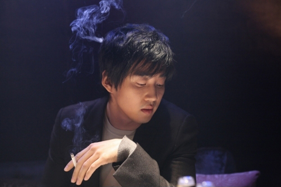
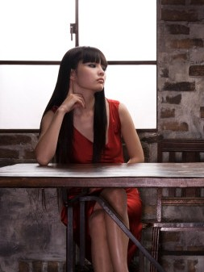
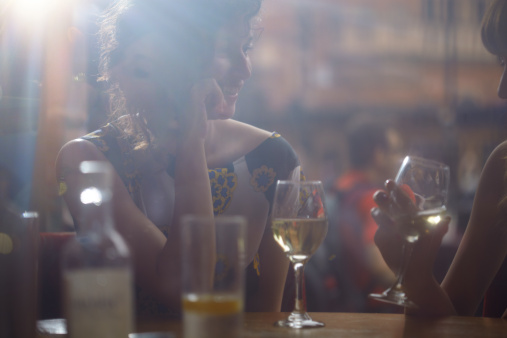

# 七十一先生（一）:思乐冰小姐

** **

每次在酒吧里有女孩问我名字时，我都会喝一小口酒，微微停顿，然后说“叫我Mr. Seven-Eleven.”她们似乎都觉得这样的神态和名字很有吸引力，多半会扑扇沾着闪粉的假眼睫毛继续问，“为什么？”其实世界上哪来这么多为什么。为什么有种生物叫做人？为什么人要生活下去？本来就没有为什么。

如果她长得还行，我通常会负责任地回答下去，“因为我只抽mild seven，喜欢搭11路车。”这时她会适时地笑上几声，然后转到她最关心的问题上，“你经常走路？不开车吗？”这时候我会再喝一小口酒，漫不经心地说，“车子撞了送修，最近走走路。”

Mr. Seven-Eleven的魅力瞬间液化氧化汽化，她们转身就消失得和我的吸引力一样无影无踪。我只是喜欢在酒吧里看这些年轻女孩们，她们的浓妆、高声的粗话和嬉笑、缭绕的果味烟雾、不同色泽的美瞳、带着体味的香水气，和她们的青春一同生猛地扑面而来。她们天真又世故，像是虚张声势的红翅膀小鸟，扑棱棱地在物质与欲望里飞来飞去。

不过，我不常去酒吧，因为我常常要上夜班。是的，你猜对了。我不抽贵价的mild seven，买不起车，我叫自己做七十一先生实际上是因为我的工作是7-11便利店店员。我常常用商品的牌子来称呼一个人，包括我自己。为什么？没有为什么。

比如我高中时的同桌刘红，她总是用辉柏嘉牌圆珠笔，于是我叫她做辉柏嘉小姐。这样的好处是，现在我只要看见这个牌子的圆珠笔，她和关于她的中学时代马上就能一股脑地从天而降灌入我的脑子里。以前我和她说过这事，她说这就好像是你把一块叫玛什么的点心泡在茶里，所有与之相关的记忆就会重新浮现，她还说了什么追寻失去的时间，超越永恒之类的句子。不过我始终没有搞懂她在说什么，同时认为那种神奇的点心是不存在的。不过我和她都赞成一点：通过物品来回忆人和事是很容易的，反过来却很难。

我每天最大的乐趣是给7-11的顾客取不同的名字，猜测他们身上发生的不同故事。我的工作和我的人生差不多一样无聊，除此以外我简直不知道要怎样打发才好。

思乐冰小姐

她第一次来，什么也没有买，径直走过来说，“我要最大杯的思乐冰。”那时正是湿冷的春天，我一边想，她不冷吗，一边把26安士的纸杯递给她。

当我回过神来，她已经走了。我想，她肯定家境不错，不然也不会喜欢填不饱肚子的冰沙。高中时爸妈闹离婚，我常常因为从两边都拿不到钱而饿肚子，后来我再也不喜欢任何不能填饱肚子的东西了。那时候刘红真好，她喜欢在课间吃番薯干，我抢她的来吃。番薯干至今仍是我的最爱，它让我觉得饱，饱让我觉得快乐。

思乐冰小姐第二次来时，天气已经回暖了些，买思乐冰的人多了起来，不过始终只有她会买26安士的超大杯装。她把杯子装得很满，结果一拿起冰沙就溢了出来，她连忙猛吸了几口，又吮了下沾上冰沙的手指，再偷偷把粘乎乎的手在衣角上擦了几下，像恶作剧成功的孩子一样自得其乐地傻笑起来，然后若无其事地走了出去。她的牙齿真白，笑起来很好看。

第三次看见她时，她还是装了满满一大杯，还是弄洒一些在手上，吮了吮手指、偷偷擦在衣角上。我想她应该还是个学生，周末就回家喝妈妈煲的汤水，无忧无虑。我看着她专心地犹豫着要选哪种颜色的吸管，简直要嫉妒她了。

以前我为嫉妒感到羞愧，这是软弱无能的表现。不过当我发现很多人生活的唯一乐趣就是享受被嫉妒时，我心安理得地重拾了我的嫉妒。高中时我嫉妒坐在我后面的王东，一个差不多两百斤的胖子，成绩很烂，最后和全级第一的刘红一样去了北大，听说是作为体育特长生保送的。当时我觉得不可思议，后来我对更多的这种事不再感到惊奇，我只是嫉妒。世界本就没有什么公平，它给予一些人金钱与权力，另一些人智力和美貌，而有些人什么也没有。这无法改变。

“我要……”“最大杯的思乐冰？”又听见她的声音，我条件反射地取出26安士的纸杯递给她。她朝我笑，夏初亮烈的太阳光从落地玻璃外投到她的脸上，非常灿烂。我一下子想起刘红以前念叨的某句诗：“她自身就像是那光彩夺目的苹果花瓣。”以前刘红反复跟我强调她觉得这个句子有多么美，我说我只吃过苹果没见过苹果花。我敢肯定她也没有见过，但这正是我最怀念刘红的地方：她一直是个用审美来生活的人。

思乐冰小姐来得越来越频繁，我想她一定常常逃课。她有种漫不经心的表情，好像对什么都不在乎，对自己也不在乎。她总是穿着人字拖和宽松的T恤短裤，笑容像那种棉花糖形状的云朵，洁白蓬松没有半分阴影。我认定她还是个女孩。女孩与女人的差别，不在于性，不在于年纪。这差别是女孩对自身的美无知无觉，像山花一样兀自烂漫着。而女人懂得如何利用她的美丽，她们是捕猎者。不过死党乔马说，这是个狗屁理论，他说，女孩和女人的差别，就是“一日之间的事”。

乔马是我念大专时的室友，不过我读了一年就退了学，而他一直呆到毕业。现在他在网游里打装备卖钱，手气不顺的时候就做点兼职，手气顺的时候差不多隔天就要来买点卡。这天他又过来，“连续打了十三个小时都没打出什么好装备，丢那妈。”他点起一支烟，指了指收银台玻璃下压着的三十元点卡。但是我没理他，因为思乐冰小姐在这个时候走了进来。她竟然化了妆，踩着高跟鞋。我第一次看见她这个样子，她像戴上了和别的女人没什么差别的面具，让我觉得很陌生。她的高跟鞋还不是踩得很稳，但那微微的晃荡流露出一种初次成形的风情，乔马盯着她的背影，挤眉弄眼地笑，“正啊，如果穿黑丝就更好了。”

我有点沮丧地自我安慰着，她本质上还是个女孩子，会穿短裤、人字拖，露齿大笑的女孩子。不过我想，她大概恋爱了。

下次她再来的时候，依然化着妆。“我要最大杯的思乐冰。”“小姐，最近在做活动，22安士的思乐冰原价五蚊，现在七蚊两杯，要不要试试呢？”她买了两杯，脸上还带着一点活泼的神气，但是眼妆有点晕开了，像倦怠的黑眼圈。我想，恋爱真是一件让人面目全非的事情。

不过，也许恋爱是女人的本能，和妆扮、矫揉做作一样。晚上我在家里看《本能》的时候，这么想着。我妈走过来把电视关了，说：“你不要成天看电视。今天我遇到刘红她妈，她女儿保送了北大的研究生。你看看人家！你要不要报个成人高考，起码拿个文凭吧。”我又把电视打开，淡然道：“考上了又怎么样？你有钱让我读吗？”她一下子怔住，表情黯淡下来。我毫不内疚，不是她，我也不至于落到一个无名大专去，后来也不至于因为交不起罚金而被迫退学。最后她说，“她妈说刘红想暑假回来和你见个面，你定个时间。”我目不转睛地盯着荧幕，“你帮我找个借口推掉吧，我不想见她。”她嘲讽地笑了一声，“想你也没脸见人家！”

我妈从来就没有明白过我。我不想见刘红，是怕我再也见不到刘红了。人总是要变的，这我知道，但我始终无法想象刘红成了另外一个人。她开始化妆、穿高跟鞋和咄咄逼人的职业套装了吗？她被潜规则了吗？她也开始喜欢LV、Chanel和BMW了吗？她还读那些不知所云的诗歌和什么新小说吗？这些鬼问题我一个也不想知道。对我来说，刘红永远是那个圆脸、戴一副有点掉漆的黑框眼镜的十七岁女孩，她永远那么不切实际。

如果那天我没有值夜班，那么思乐冰小姐也将永远是一个像苹果花瓣一样简单好看的女孩子。那时已经接近凌晨一点，这个时分通常只有在旁边医院门前等客的的士司机会来买包烟抽。但是，思乐冰小姐来了。她的妆还是完好的，只是唇上的颜色褪了，一张脸显得很苍白。她没有买思乐冰，拿了一盒冈本的暖粒粒，匆匆付了钱然后离开。我突然觉得有点失望。

第二天补完觉以后，我又在家里看《本能》。看着莎朗斯通美丽的香槟色肉体在床上与男人纠缠时，我忽然想，她是不是也有着这样漂亮的身体，在家里无人时偷偷把年轻的男友带回家，拉上睡房里的粉红色窗帘，生涩地诱惑他？不过无论如何，她驾轻就熟地买了冈本的暖粒粒，她必然早就不是乔马所定义的女孩子了。

这段时间乔马手头比较松动，要请我去酒吧，我说不去，最后我们在他租的小单间里一起喝啤酒。我讲了思乐冰小姐的故事，他一副专家的神气，说，“外表斯文，内里open嘛，这种女的多得是。”他又拍了拍我的肩膀，“喝酒！”我们常常一起谈论AV、网游、NBA、英超，也谈论身边的女人。不过我们从不问对方是不是爱上了某人，我们不谈论爱情，那是个荒唐可笑的词。不同的是，对于乔马来说，女人是用来做饭和做爱的，爱情不过是个幌子。而对我来说，爱情是种异常美丽，但纯属虚构的事情。

再一次见到思乐冰小姐时，我已经很淡然了，埋头点算着零钞。她还是在打着电话，“你不乖，不乖妈妈不买糖给你吃，不送你去幼儿园，晚上不给你讲故事了。”她一口气地恫吓着，脸上仍然是微笑的，最后买了一大包牛奶软糖和她的最大杯思乐冰。我想继续清点，但是各种各样的想象不断涌上来，搅得我头皮发麻。

思乐冰小姐是个重返大学进修的未婚妈妈，还是说年纪轻轻已经辍学结婚，抑或是个为富商生下私生子的小情人？不得不承认，当我发现她和大部分人，和我并没有什么不同，都热衷于沉浸在世俗的快乐当中时，我有些失望。而现在我简直有些恨她了，这就像是有朝一日我在街上撞见了刘红，她右手提着个菜篮子，左手牵着个胖儿子，她还蹲下来给他擦脏兮兮的鼻涕。我无法接受这些事实：人都是要结婚生子、买菜做饭、交水电费、变老变丑、躺在病房里死去的。

谜底逐渐逼近。这天思乐冰小姐挽了一个男人进来。那个男人高大，皮肤白净，一副温和的表情。她一直热烈地和他说着什么，像只吱吱喳喳的小鸟。她还是拿了大杯的思乐冰，他买了包湿纸巾，轻声说，“看你说得满头大汗的。”他看起来对女人无微不至。我想他大概是个年轻的富二代。但是他们看起来并不像一对寻常夫妻，他们为什么不结婚？

不过也许像我常常说的，很多事情本就没有为什么。

而夏天也差不多完全过去了。

初秋一个格外干爽的早晨，思乐冰小姐背着一个巨大的登山包出现了。她看起来和以往任何一次都不同，脸上泛着晒伤的红斑，眼睛里有种灼灼的神采，非常美。她以前是好看、漂亮，这些都和美不一样。美是凛冽的、伤人的，不折中也没有任何妥协。我呆在那里，直到她重复了一遍，“我要最大杯的思乐冰。”我才把22安士的纸杯递过去，“多谢，五蚊。”她有些错愕，“我要最大杯的，六蚊那种。”我解释：“小姐，26安士那种纸杯没有再生产了。”她追问原因，我耸耸肩，“不太清楚，这是公司的决定。听说是因为买的人不多，和生产厂家的合同又到了期。”她似乎有些出神，低低地重复，“合同到了期……”过了一阵，她说，“谢谢，我不要了。”表情十分坚定。

那天以后，我再也没有见到思乐冰小姐。

（未完待续）

 

（采编：何凌昊 ；责编：尹桑）

 
