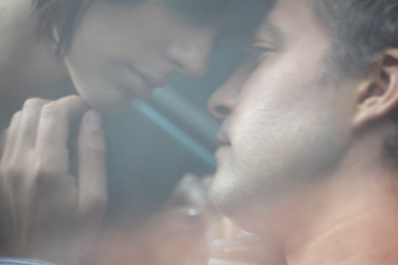

# 七十一先生（二）：EC2先生和杜蕾斯太太

** **

EC2先生 

EC2先生每次来只做一件事：买EC2牌子的西柚味湿纸巾。在思乐冰小姐消失以后，我开始留意他。我想从他身上找到我一直想不通的答案——事实上，他就是那次思乐冰小姐挽着的男人。

这段时间似乎是秋天了，阳光松脆得像饼干渣一样，天空难得地透出一种干净的深蓝，天气好得简直连尘埃掉落在皮肤上都会飞舞，我实在不明白他为什么还要用湿纸巾擦脸。

他常常和不同的女孩来，神色亲密。这次的女孩站在外面等他，隐约看着有几分像我们从前的级花沈雨桐，那个近乎全班男生都递过情书的漂亮女孩。不过不可能了，沈雨桐早早就嫁了人。我这么想着，一边找钱给他。第一次注意到他的皮肤好得出奇，像女人一样细致得看不见毛孔，很符合他那温存中流露出来的女性气的软弱神情。

我想他大概是要继承家业的，明知无法逃避，只能年纪轻轻便游戏花丛。不过这也不关我的事，我一直觉得世界不是圆的，而是狭长如同榄核，他在离我非常遥远的另一个顶端。

这天他又过来，一个人，拿了包柠檬味的湿纸巾，犹疑了一下，说：“我要这种游戏点卡。”我记起乔马的嘱咐，扮作一副他乡遇故知的样子，“你也玩这个网游吗？不如加入我们的QQ群，一群朋友有个照应。”他迟疑了一下，“我才刚…好吧。”

当晚我极力向乔马鼓吹发掘了一个大买主，为此他请我到海珠饭店吃了一顿。这名字听起来和什么清平饭店一样的排场十足，实际上它是间破破烂烂的大排档。就像乔马这个名字听起来挺气派，其实只不过因为他爸姓乔，他妈姓马，随便凑到了一块。我和他说起我觉得世界像榄核一样，他皱了皱眉，“果肉还不是他妈的叫这些人吃光啃净的。”我们喝着最便宜的啤酒，一时间找不到什么话。过了一阵子，他又一副宽慰的口吻，给我把酒满上，“算了，生出来，活下去。喝酒，喝酒。”是了，生活，生出来，活下去，还能怎样？我举起酒杯一仰脖。

没过几天乔马又眉开眼笑地来找我说要请吃饭。“来半打纯生。我跟你说，那人出手好大方，买多贵的装备，眼都不眨。”他一副志得意满的样子。我喝了一口纯生，涩味没那么重罢了，也没什么不一样的。我们还是没车没房没姑娘，未来都是他们的，我们什么也没有。不过看着乔马的兴奋劲，我什么也没说。

最近没有排夜班的晚上我多了个消遣：留意常常挂在线上的EC2先生。他的签名换得很勤快，虽然从那唧唧歪歪的繁体字句子里什么也看不出来，什么“深情即是一桩悲剧”之类。以前刘红从不摘抄这种故作姿态的东西，她说她要的爱情是要把自己做成一个陶杯来装殓爱人的骨灰，把无名指割下来送给爱人，让自己再没法为别人戴上戒指，云云。当时听得我毛骨悚然，到现在还记忆犹新。不过无论如何，我还是想从他身上找到一些关于思乐冰小姐的讯息。可惜他的空间、博客都是加密的，什么也看不到。我这才发现原来我对思乐冰小姐一无所知，总之，她就像呼出来的一口烟一样，彻底从我的生活里蒸发了。

我很少抽烟。乔马抽得很凶，他说他要保持清醒，好在半夜网速最顺畅的时候刷装备。不过对于我这种人来说，要是再清醒点，生活可就真他妈的没半点意思了。不过有时候我还是会坐下来陪乔马抽，拿他的烟，这多半是我去他家拷毛片，带着几瓶啤酒的时候。以前有个什么词来着，围炉夜话?差不多就这意思，我们管这叫“煲烟”。

这晚我俩在他家阳台上有一口没一口地吞吐着烟雾。他又开始兴致勃勃地讲起他的买卖，我装作在听，想起小时候父亲逼我和他一起去教堂听布道，牧师连续几小时不间断的话差点没把我弄疯掉，出来以后我问父亲他是怎么熬过去的，他说，你想自己的事情就好了。从那时起我就知道，绝大多数人的绝大多数话语，都是没有意义的。

大约是见我没有反应，乔马又加重语气地重复了一遍，“告诉你，你介绍那个大买主，原来是个gay佬。”“什么？！！”一口烟卡在喉咙里，我猛地咳了好一阵。乔马对我的反应很是满意，得意洋洋地继续说。“我就说，这种天气哪有男人天天来买湿纸巾的。我本来只想看看他空间里有什么好加密的，你知道，那种密码对我来说是小意思。结果一看，不得了，都是跟个男生的合影，看得我起了一身鸡皮。”我不由又想起思乐冰小姐和她的孩子，抽了口烟，闷声说，“说不定是他和他弟弟。”

话虽这样说，我开始格外留意起EC2先生来，其实只要稍加注意，就能看出许多不寻常的地方——比如藏在他发脚下的钻石耳钉，牛仔裤脚反卷起来是一圈红色的格子边，露出一小段的脚链，球鞋是突兀的大红色，衬着荧光黄的袜子。比如他说话的声音总是很温柔，简直是阴柔，一副慢吞吞的腔调，似乎极有耐心。这种种女性化的特征令我不得不开始相信乔马。

回想起来，思乐冰小姐似乎并没有和EC2先生有过什么特别亲密的动作。也许他们只是普通朋友？也许他们是姐弟？我猛然想起思乐冰小姐说过的最后一句话，“合同到了期”。甚至，也许他已经向家里坦白，而他富有的家庭逼迫他找一个代孕妈妈，以合同的方式来保证香火有继？

我顿时觉得这想法无比荒唐。但这世界本来就更加疯狂、荒唐，不可思议也无法解释。

杜蕾斯太太 

一盒大包装的杜蕾斯放在我和她之间，收银台上面。

我没有想过和沈雨桐的重遇会是这情景。但她看来并没有认出我，从包里摸出一支女式烟来点上，等着我找零。早几年她派过请帖给我，听说是嫁了个富商，我没去。这么算来我们应该是从高中毕业后就再没见过，也难免她认不出我。我没有说什么，她像任何一个来去匆匆的顾客一样离开了，留下来的烟雾里有淡淡的柠檬味道。

我不可能忘记沈雨桐，她看起来比以前更漂亮了。她属于那种皮肤白皙，眉毛睫毛颜色却很浓，五官像画出来一样好看的女孩子。高中时候的她虽然整天只扎个马尾，穿着样式难看的校服，虽然没有发育良好的胸部，但依然无疑是全年级男生的梦想。重遇她的那天我去乔马家拷了几部新的毛片。

让我始料未及的是，没过几天她又来了。这次买的仍然是十二只装的大盒杜蕾斯。她付钱的时候我注意到她的指甲，修得很美。我想，也许有钱人就是没别的事可干了，胃口大些也不足为奇。

但是当我第三次看见她的时候，我终于没能沉住气，叫住了她。“等等，你是不是沈雨桐？”其实我更希望她木无表情地说，你认错人了。那样的话我可能还会偶然地想起她，顺带追忆一下我那看姑娘只看脸蛋的纯真年代。她僵住了，马上把杜蕾斯塞进包里，然后仔细地端详我。想了好一阵，“啊！是你！好久不见。”她的表情放松下来，有点兴奋，简直有种顾盼生辉的美丽。“是啊，好久不见。”我一边欣赏着她的美貌，一边又感到淡淡的失望，好似看着一个七彩的肥皂泡卜的一声破灭掉。

“有空喝杯茶叙叙旧。”“好啊。”我漫不经心地答应着，客套话谁都会说，我想她大概再也不会来了。“择日不如撞日了，你几点下班？”她竟然认真地提议着。 “还有二十分钟。”我吃了一惊，看看表，今天上的是早上六点到下午两点的班。“这附近有家叫小荷的cafe，去那里好吧？”我点点头，虽然我一次也没进去过。“等下见。”

两点刚过，我赶去小荷，视线范围里的木头吧台和桌椅却空无一人。“是约了沈小姐吧？”女服务生迎上来，微笑里有点含混不清的暧昧，领着我走到里面去。深处的角落里有三两个小包厢，都用落地竹帘严实地隔开来，竹帘外还罩了一层深红色的纱幔，看得人心神飘荡。是个双人包厢，空间有点窄小，沈雨桐倚在低矮的沙发上，显得比那底子上的碎花还要娇艳。“前面是咖啡和花茶，后面有鸡尾酒，想喝什么？你自己来吧。”她已经点了一壶玫瑰茶，微笑着把餐牌递给我。美色当前，加上我很清楚她的手袋里放着她两个礼拜内买的第三盒杜蕾斯，我决定保持清醒，胡乱点了杯咖啡。

一坐下来，沈雨桐就说，“其实我对你的名字很有印象，只是隔了那么久，和你的样子对不上号。”我也懒得问原因，场面话拆穿了没意思。反正这么多年来，我对她除了那漂亮脸蛋以外也一无所知。她却接着说，“因为当年全班男生里只有你没给我写过情书。后来我觉得吧，你早喜欢上了刘红。”“那时候的事，谁还记得。”我敷衍着，决定还是不把真相告诉她。事实上在那种充斥着过剩的荷尔蒙和青春痘的年纪里，谁没喜欢过级花。不过刘红说她就像小本的台湾言情小说封面的女主角。我犹豫再三以后还是担心被刘红取笑，就没有跟风递情书。“对了，刘红现在怎么样了？”她问，很关切地看着我。“大一的时候我们见过一次，后来就没联系了。老同学，很多都没了来往。”“是吗。”她点点头，一瞬间好像有些黯然。不过大概是我的错觉，她看起来过着富贵闲适的日子，也许只是想知道大部分人过得并不如意。她望向窗外的庭院，转着手上的戒指。实在找不到什么话题，于是我说，“你的戒指真漂亮。”她又露出了她一贯甜美的笑容，“嗯，他知道我特别喜欢粉色的玫瑰花，就订做了这只粉钻的求婚戒指。”那花团锦簇的戒指好似把光投到她的脸上，稳当地打出“幸福美满”四个大字。我也不知道能给什么回应她，幸好服务生送咖啡过来，我马上喝了一口再想摆出个既羡慕又祝福，表情到位的微笑，却差点没一口把咖啡喷了出来。操，真他妈的苦。幸福美满太太适时地提醒我，“你点的是Espresso。”谢天谢地，我终于找到了一个能概括我生活的好词。

她又转了一阵她的戒指，一种必然却又难堪的沉默隔在我们之间。我突然又找到了话题，“对了，有天我在店里上班的时候好像看见你了，在外面等人，那个是你先生吧？他常常来买湿纸巾。”她一下子神色很尴尬，含糊地说：“啊…不是…只是个朋友…”此时此刻我不禁觉得刘红当初的判断无比正确，美貌确实会影响智力。其实我也没说那就一定是她，她怎么搪塞我都不为过。我想起女服务生暧昧的笑容。但是，EC2先生不是同性恋吗？沈雨桐看了看表，最后说：“你再坐一会，我约了牙医，差不多到时间了，我先走了。”她起身穿上那看起来很名贵的大衣，笑容有点勉强，拿起账单走了。

虽然我很感激她拿走了账单，但还是忍不住推测起来。也许EC2先生根本不是什么富二代，而是个被阔太太包养的双性恋美男子。也许这只是她众多情人中的一个，毕竟她来买过三大盒的杜蕾斯。也许还有她的牙医，也许还将有我…不知为何这想法并没有让我兴奋起来。外面开始下雨，初冬的阵雨总是格外阴冷，一丝丝刮到脸上来。放冷了的咖啡叫人没胃口，我呆坐着，嗓子发干，想着刘红那并不漂亮的脸。这么多年来她从未成为过我的性幻想对象，或许她对我来说确实和别的女人有那么一点不同。

之后我没有再继续想这件事，毕竟临近圣诞，店里有很多布置和促销要做，而杜蕾斯太太也没再来过了。

平安夜那天我上两点到晚上十点的班，和乔马说定了下班就到酒吧去。差不多十点钟，乔马就来了店里，说是等上我才一起过去。他难得地没有重色轻友，看来最近是交不上什么桃花运。偏偏他还兴致勃勃地哼着“平安夜，失身夜”的调子，摆出一脸志在必得的表情。我笑他，我们都很愉快，毕竟今天是平安夜，节日总是欢乐的借口——虽然交班的大婶还没有来，虽然我加薪的圣诞愿望应该也不会实现。

自动门铃响起来，推门而入的却并不是大婶。是沈雨桐。我几乎认不出她来，她化了个浓妆，反而显得老了。暗淡的眼影和烟熏妆并没有多少节日的兴味，却让她看起来很疲惫。她走过来说，“陪陪我可以吗？”，有一点恳求的神色。

“啊？”事出突然，我有些意外，犹疑着。乔马一脸“有好事竟然不和我说”的表情，却迅速地装成和我毫无关系的普通顾客往外走，边走还边哼着“平安夜…”后半句没有哼出来，但是临出门前他转身给了我一个意味深长的笑容。

大约是街上的风太大，她不怎么愿意说话。我只好先问，“想去倒数吗？还是想去酒吧？”她却摇了摇头，戴着毛线帽子、围着厚厚围巾的她，侧面轮廓看起来和当年一样的明净。错杂着飞蛾影子的路灯光线投到她的脸上，她确实是老了。浓妆显然只适合青春。放在她的脸上却只因为那不甘老去的艳丽而显得更沧桑。“你不化妆也挺好看。”我终于还是没忍心说出后面的话。“我不化妆没办法见人了，这几天。”这一般都是女人假惺惺的自谦，但她的话语里听来却没有丝毫得意的口吻。“怎么了？”问她她却又并不开口，只是漫无目的地在夜晚的街上走着。我感到很烦躁，一个常来买杜蕾斯的有夫之妇在平安夜把我拉出来陪她在街上乱晃荡，是要谈情还是做爱，女人难道就不能直截了当些吗？

于是在马路中央，高架桥下的安全岛里等绿灯的时候，我忍不住又问了她一遍，“你究竟怎么了？”“他一定在别的女人那里。”她低声说，嘴唇抿得很紧。“什么？”我一下子没明白过来。“平安夜，他和鬼佬客户谈生意？他真的以为我不知道？”她像在自言自语，嘴唇却颤动着，眼泪已经掉了下来。我才反应过来，大概是她丈夫有了外遇，只好说些谁都会的安慰话：“可能有什么误会，他可能真去谈生意了。”心里想着能随便找个什么借口脱身，我不想把平安夜浪费在一个怨妇身上。

但她愈发哭得失控起来，绿灯亮了，来来往往的路人谴责地看了我许多眼，我只好陪着她停在那里。“我买杜蕾斯回去…他看都不看，无动于衷…我以为是他年龄大了…我继续买，塞在柜子里…有一天发现少了一盒…后来，又少了..他以为我不知道？”她从哭声里挣扎着断断续续地讲述着，我装作同情地点着头，瞥见她肩上相当于我几年薪水的LV包，感到一丝卑鄙的快意：这世上本来就没什么没有代价的事情。“上两个月我找过他前妻的儿子，就是你看见的那个男人。才知道他是向我求婚以后才离婚的，他向来是这样的人…但是…但是我以为我是不一样的…”她说到后面却又开始抽泣。我顾不上理她，只是默默地想着，原来杜蕾斯只是她测试丈夫的道具，而EC2先生也不过是她的继子，并没有什么杜蕾斯太太和她的情人的故事。我有些闷闷不乐，平淡无奇的现实严重地剥夺了我猜想中的故事带给我的乐趣。

“我们走吧，去倒数？”大概是发现了我的无动于衷，而哭诉又全淹没在来往车流的呼啸声中，她终于平静下来。买了几罐啤酒以后我们一直走到了中华广场，满眼都是黑压压的人群。广场中央无比巨大的圣诞树不断闪烁着，却依然明亮非凡。前面似乎有接吻比赛，上空的大屏幕里放着圣诞歌，到处都是被呼出来的和暖空气，热烈的情话。我们被挤在人群里寸步难移，喝着闷酒，等待着可有可无的倒数。

这个平安夜似乎有些不同。临近倒数的时候，大屏幕上放出一段求婚的视频。广场的人群沸腾起来，声嘶力竭地喊着，嫁给他、嫁给他。虽然人们由始至终也没有看见那个他和她。情侣们乘机在接吻，而我和她在一片难熬的缠绵气氛里终于等到了圣诞。大束的气球涌向天空，一切都毫无疑问地洋溢着节日的欢乐，而唯一不合时宜的是我身边的杜蕾斯太太，她看着那些飘飞的气球，说：“两年前的现在，我在这里答应他的求婚。那时候的心形气球把天空塞成了粉红色。这算得了什么。”不得不说，命运总是惊人的相似，无声无息地不断重演。

她大概也察觉到了这当中一些悲哀的东西，轻声说，“我的圣诞愿望是一个吻。”她闭起眼睛，眼泪流了下来。她的嘴唇还是饱满的，但是里面某种有生命的东西已经泯灭了，也许是她的爱情，或者是青春。我不知道。我没法同情她，她答应了那场奢华的求婚，就早该预料到今天的结果。于是我笑着说，“圣诞愿望说出来就不会实现的了。”她睁开眼来，有种遭到打击之后的错愕。但沈雨桐终归是沈雨桐，她淡淡地微笑道，“我也是说笑的。刚刚喝了酒，嘴里的溃疡又疼得厉害，哪里有什么接吻的心思。明天我大概还得去找一下牙医。”

“然后呢？”乔马迫切地追问着，要印证一下他的牺牲是否有价值。“然后，就没有然后了。她说让她的司机来接她。”临走前我问她打算怎么办，她轻笑说，我还能怎么办，我什么也没有。“唉！吻她一下会死啊！我跟你说，你要是吻了，一切就不一样了。”乔马最后一拍大腿，一脸懊悔他没有留下来进行指导。

也许乔马的话是对的，谁知道那是一个纯粹的吻，还是另一个故事的开始呢？谁知道她会不会在圣诞节的晚上，和她的牙医说同样的话，做同样的事呢？

无论如何，这些假设再没有得到证实，因为杜蕾斯太太再也没有来过。 

（未完待续）

 

（采编：何凌昊 ；责编：尹桑）

 
