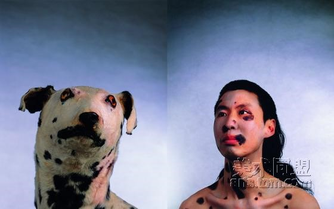
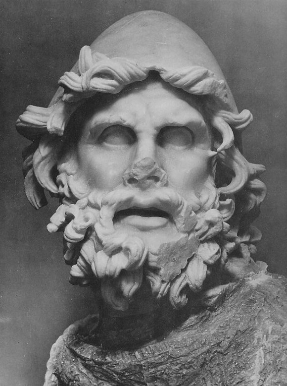

# 七星百科：犬儒主义

#### 本词条在以下文章中被使用

 <1> <开阳>: [新型批评者：谈谈屌丝眼里的“屌丝](http://rrurl.cn/66oQmm) <2> <天权>：[不朽的荷尔蒙:小论冯唐](http://rrurl.cn/tNQi5O) <3> <天玑>: [哲学十二钗（八）：丐帮哲学家：犬儒学派](http://rrurl.cn/bMxTdm) <4> <摇光>: [哈维尔先生，你好](http://rrurl.cn/q24uj1)  

### 词条简介

**犬儒主义（Cynicism）**是个外来词，中文里本来没有现成的对应词汇，通常将他理解为讥诮嘲讽，愤世嫉俗，玩世不恭。**【1】**

 

### 目录

 历史渊源 发展与演变 在各国中的影响 参考资料 延伸阅读  

### 1 历史渊源

综合来看，犬儒主义者或称犬儒派是希腊城邦制度的现实产物，也是希腊城邦文化的叛逆。希腊的城邦制度的繁荣孕育了犬儒主义这个极端化的产儿，城邦制度的衰落催生了他。

希腊城邦制度从公元前8世纪开始萌芽，到公元前6世纪时基本形成。城邦制度在古希腊是普遍存在的，即使有的城邦如斯巴达保留了国王的职位，但也仅仅是形式而已，并无多少实权，国家大事仍由公民大会于公民选出的监察官、长老会来决定。公民是这个城邦的主人，城邦的政权掌握在作为公民的人们的手中。公民是政治动物，是潜在的政治家。只要有闲暇，有兴趣。他们可以直接参与城邦事务的管理与决策，城邦也会为他们的参与给与一定的公职津贴，作为生活的必需。在这样的城邦中，就公民的集体而言，其中只有被选举的管理者，而无世袭的专制君主与寄生的官僚；只有拥有不同程度的政治权利的公民，而无俯首听命的臣民。

也正是因为如此，城邦的公民制度也具有二重性，既把城邦看得高于一切，具有集体主义精神，同时又十分注重个性的自由发展。事物的发展总会出现极端化，城邦制度也不例外。城邦制度在保证公民的个性发展的同时，公民的个人自由和个性的张扬与发展也越来越走向了极端。各个城邦中充满了党派间的斗争，公民大会感情用事议而不决。城邦事务动荡不安，政客间相互攻击、斗争、诽谤甚至是谩骂。理想化的民主的弊端暴露了出来，人类幼年时期的理想受到了挑战。这种弊端和挑战在后来的伯罗奔尼撒战争后期几乎到达了极点。人们从雅典在伯罗奔尼撒战争中一再惨败。在苏格拉底的受害及柏拉图的出走西西里等事件中，感受到了这种弊端给社会带来的危害和对人们心灵的冲击，简单的理想主义的民主和公民权利受到了怀疑。

正是在这样的背景下，一些特立独行的人，把反叛城邦制度的理想民主以极端的形式表达出来。并且认为使众多愚蠢的人的愚蠢念头把社会、城邦搞糟了，他们行为上以怪异和反常的行为向现有的秩序、制度、观念、习俗挑战，精神上则躲进个人的心灵深处寻求宁静和快乐。犬儒主义作为这股向社会发起抗议的力量的代表，也就自然的产生了。因此说，为公民发展提供了广大的空间的城邦制度是犬儒主义出现并走向极端化的温床。**【2】**

 

### 2 发展与演变

犬儒学派的奠基人叫安提斯泰尼，他是苏格拉底的学生，这个人在跟着苏格拉底学习的时候并没有表现出犬儒的特征，即使在苏格拉底死后，他也还是和苏格拉底的那些贵族子弟在一起生活。但是后来他放弃了这种生活。他开始和工人生活在一起，进行露天讲演，他所用的方式是没有受过教育的人也都能理解的。一切精致的哲学，他都认为毫无价值，凡是一个人所能知道的，普通的人也都能知道。他信仰“返于自然”，并把这种信仰贯彻得非常彻底。他主张不要政府，不要私有财产，不要婚姻，不要确定的宗教。

说安提斯泰尼是犬儒学派的奠基人而不是创始人，是因为他的弟子的名气远远超过了他。他最著名的学生锡诺普的狄奥根尼将犬儒学派发扬光大。而他个人的出名主要是因为他生活在一个桶里，并且在亚历山大去看他的时候，让亚历山大让开，不要挡住他的阳光。**狄奥根尼决心像狗一样生活下去，这就是犬儒的由来。**他拒绝接受一切的习俗——无论是宗教的、风尚的、服装的、居室的、饮食的、或者礼貌的。他对“德行”具有一种热烈的感情，他认为和德行比较起来，俗世的财富是无足计较的。

和玩世不恭恰恰相反，早期的犬儒是极其严肃的，狄奥根尼是一个激烈的社会批评家。他立志要揭穿世间的一切伪善，热烈地追求真正的德行，追求从物欲之下解放出来的心灵自由。狄奥根尼确实愤世嫉俗，他曾经提着一个灯笼在城里游走，说：“我在找一个真正诚实的人。”

随着犬儒哲学的流行，其内涵开始发生了微妙的变化。后来的犬儒派们发表宏论，竭力鼓吹清贫生活的无比美好，甚至把人们正常的感情也讥为愚蠢。一位名叫德勒斯的犬儒派就说：“我的儿子或妻子死了，那难道就有任何理由应该不顾仍然还在活着的我自己，并且不再照顾我的财产了么。”这使人想起庄子死了老婆鼓盆而歌的故事，超脱到了这一步，未免就有些矫情，就和冷酷分不清界限了。早期的犬儒派是依据一种道德原则去蔑视世俗的观念,后期的犬儒派依然在蔑视世俗的观念但却失去了依据的道德原则。这就引出了一个始料不及的后果.既然无所谓高尚,也就无所谓下贱。既然没有什么东西是了不得的,因而也就没有什么东西是要不得的。不难想象基于这种无可无不可的立场,一个人可以很方便地一方面对世俗观念做出满不在乎的姿态,另一方面又毫无顾忌地去获取他想要获取的任何世俗的东西。于是,对世俗的全盘否定就变成了对世俗的照单全收,而且还往往是对世俗中最坏的部分的不知羞耻的照单全收。于是,愤世嫉俗就变成了玩世不恭。

狄奥根尼坚持真善,揭穿伪善,这种批评精神被后来者扭曲得面目全非。犬儒一词后来的含义就是把人们一切行为的动机都归结为纯粹的自私自利。犬儒派既嘲讽有权有势者,也嘲讽无权无势者。但前者并不在乎你的嘲讽“笑骂由人笑骂，好坏我自为之。”后者却必须赢得人们的同情支持。所以，犬儒派客观上是有利于强势者不利于弱势者。这样，犬儒派就从现存秩序的激进批评家变成了既得利益者的某种共犯合谋。

犬儒一词的演变证明从愤世嫉俗到玩世不恭其间只有一步之差。一般来说，愤世嫉俗总是理想主义的，而且是十分激烈的理想主义。玩世不恭则是彻底的非理想主义，彻底的无理想主义。偏偏是那些看上去最激烈的理想主义反倒很容易转变为彻底的无理想主义，其间原因何在？因为，许多愤世嫉俗的理想主义者在看待世界时缺少程度意识或曰分寸感，对他人缺少设身处地的同情的理解，不承认各种价值之间的紧张与冲突。这样，他们很容易把世界看成一片漆黑，由此便使自己陷入悲观失望，再进而怀疑和否认美好价值的存在，最终则是放弃理想放弃追求。“世界既是一场大荒谬、大玩笑，我亦唯有以荒谬和玩笑对待之。”一个理想主义者总是在现实中屡屡碰壁之后才变成犬儒的，但正如哈里斯所言：“犬儒不只是在过去饱尝辛酸，犬儒是对未来过早地失去希望。”

说来颇具讽刺意味，早期的犬儒是坚持内在的美德和价值，鄙视外在的世俗的功利。可是到后来，犬儒一词正好变成了它的反面，只认外在的世俗的功利，否认内在的德性与价值。王尔德说：“犬儒主义者对各种事物的价钱一清二楚，但是对它们的价值一无所知。**【3】**

 

### 3 在各国中的影响

犬儒主义不是中国特有的现象。在西方，犬儒主义同样引起人们的忧虑。戴维·马哲拉( David Mazella) 在 《现代犬儒主义的形成》中追溯犬儒主义在美国公共和政治生活中的 影响。1960年代美国康狄涅克州参议员威廉·本顿( William Benton) 报怨说:“美国人民面临的最严重问题之一是对政治和政府的犬儒主义，我们已经为这样一种无根据的犬儒主义付出高昂的代价。许多正派的———包括许多杰出的———公民羞于承担公职因为他们错误地相信政治和政府是普遍腐败和邪恶的。”1991 年代杰夫里·戈尔屯法伯 ( Jeffery Goldfarb) 在 《犬儒社会》中指出:“今天美国民主面临着独一无二的最迫切的挑战是广泛流行的公共犬儒主义。”在克林顿时代有人指出，美国 “已陷入了犬儒主义的网络，它使我们怀疑除了物质利益外和照料单个的我外还有更高的目的。”

提摩太·贝维斯根据英国的经验，在《犬儒主义与后现代性》也做了类似的判断。他认为，犬儒主义既是当代政治道德批判的对象，也是主流政治哲学的隐性逻辑。当代犬儒主义起源于1960 年代大规模反抗运动失败留下的幻灭感。从那以后，韦伯意义上的 “有信念的政治”衰落了，政治变成了将 “应然世界”调校为 “实然世界”的欲望。集体政治的退 场导致两方面结果: 一是政治的市场化，政治过程被抽离掉了信念和使命等内在价值，成了供求关系逻辑支配的消费对象; 二是政治的重新形而上学化，后现代主义从形而上学的本真性出发把政治的世界判定为肮脏和无意义的世界。两种倾向使得 “犬儒主义似乎占据了由大众文化从政治本身的退却留下的空间。政治的介入已别无选择，在这样的社会只能作为一个犬儒。”

1981 年，**德国**哲学家斯洛特戴克在康德的《纯粹理性批判》200周年之际出版了《犬儒理性批判》。该书一出版就抓住德国人的眼球，短短数月就销了40000册，被称为德语世界后现代主义的伟大著作。安德鲁斯·赫休指出，该书的成功并非偶然，“虽然近年来西方国家出现了新保守主义的回潮，然而，旧的二元对立，如左与右、进步与保守、理性与非理性等等，很大程度上已经失去解释力、道德感召力和政治说服力。面对着对意识形态批判的传统形式具有免疫力的新的后启蒙的精神分裂式犬儒主义( schizocynicalism) ，虽然在地域性传统和政治领域存在着差别，斯洛特戴克的书解释的当代文化中普遍盛行的麻痹症和不满正是今天的现实，不论是在美国还是德国抑或法国皆是如此。” **【4】**

 

### 4 参考资料

 （1） [李银河：关于犬儒主义](http://rrurl.cn/jlAIqz) （2）[千里夫：犬儒主义的起源](http://rrurl.cn/e7N1ji) （3）[狄奥根尼带给犬儒主义的伟大发展](http://rrurl.cn/64oQ1M) （4）汪行福，《理性的病变---对作为“启蒙的虚假意识”的犬儒主义的批判》，《现代哲学》2012年7月号  

### 5 延伸阅读

 （1）汪行福，《理性的病变---对作为“启蒙的虚假意识”的犬儒主义的批判》，《现代哲学》2012年7月号 （2）孔明安，《犬儒主义为什么是一种意识形态？》，《现代哲学》，2012年04期，  

（编辑：高丽；责编：海舰）

 
