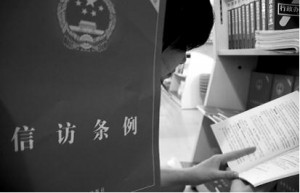
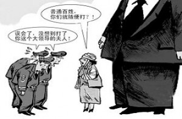

# 七星说法：信访有多难？

** **

### **前世今生**

清末杨乃武与小白菜案，杨乃武胞姐杨淑英两次千里进京，滚钉板为其弟鸣冤，终于在这落寞将倾的王朝中使冤情得以昭雪。进京“京控”在古代历史中逐渐发展为了一种独特的权利救济手段，而新中国成立之后，我们又建立起了中国所特有的现代新“京控”——信访。一个“根正苗红”的中国机制，衍生出了货真价实的中国问题。

你也许并不清楚什么叫“信访”，但你一定常常听到“上访”这个词。实际上，上访就包含在信访的概念之中。信访，在语源上就是“来信来访”的简称，一般所称“上访”即为走访形式的信访或来访。1972年，中共中央在转发《关于加强信访工作和维护首都治安的报告》一文批语中正式使用了“信访”一词。然而信访制度并非与“信访”这个词同日而生，在此之前，“信访”就以“来信来访”、“请愿”等形式存在于政治运作之中。

中共十六大报告中指出：“我们党的最大政治优势是密切联系群众，党执政后的最大危险是脱离群众。”群众路线，与群众密切联系，这正是执政党引以为傲的优良传统。于是乎，亲手打开群众一字一句写下的信件，亲身接待来访的群众正与群众路线的逻辑保持了一致。**建国之初，中央书记处政治秘书室就主要为中央领导人处理来信来访问题。在当时，来信来访的也并不仅仅是寻求权利救济的人民，有人写信向毛主席谈个人思想，有人表达了自己对于干部任用“庸才”化的不满，还有人要求中央解答工人阶级是否是领导阶级的问题。**

1953年底，鞍钢全体职工写信给毛泽东汇报他们提前完成建设工程并开始生产的喜讯，毛泽东在回信中表达了祝贺和感谢。内容广泛、直接联系，执政党在这样的过程中慢慢认识到了信访的潜在能量。很快，新中国陆续成立了政务院秘书厅“群众信件组”、中办信访局（中共中央办公厅信访局）、国办信访局（国务院办公厅信访局）等机关、部门专职处理信访事务。1986年中办信访局、国办信访局合并为中办国办信访局，直到2000年就改为了国家信访局。

与此同时，地方信访体系也逐渐建立。根据2005年发布的《信访条例》第六条第一款：“县级以上人民政府应当设立信访工作机构；县级以上人民政府工作部门及乡、镇人民政府应当按照有利工作、方便信访人的原则，确定负责信访工作的机构（以下简称信访工作机构）或者人员，具体负责信访工作。”此外，法院、检察院也建立起了自己的信访体系，承担一定的信访任务。

再回到一个基本的问题，什么是信访？**广义的信访是指“社会成员通过写信、走访等形式向公共管理者反映个人或集体意愿并由后者予以处理的一种社会政治交往活动”。**而2005年颁布的新《信访条例》囿于法律位阶的有限，对信访做了狭义的定义，将信访限定在了针对各级政府以及县级以上人民政府工作部门之内。《条例》第二条第一款规定：“本条例所称信访，是指**公民、法人或者其他组织采用书信、电子邮件、传真、电话、走访等形式，向各级人民政府、县级以上人民政府工作部门反映情况，提出建议、意见或者投诉请求，依法由有关行政机关处理的活动。”**

 

### **乱象丛生**

2011年7月4日，从江苏赴京办事的周女士刚走出某部门大门，就被几名陌生男子强行拉入一辆面包车。这辆车最终开进了昌平区的一个偏僻院落，陌生男子下了车，推开一扇大铁门，粗暴地把周女士拖入了院中。疑惑又恐惧的周女士在那里看见了一个个狭小而又没有床的房间，里面却满满的都是人，有被关了几个月的八十岁老太，还有更多脸上、身上带着莫名淤青的男男女女。周女士回过头去，一个男子把守在那早已关闭的铁门边上，这时她发觉：自己竟置身于一座“黑监狱”。4天后，“表现良好”的周女士才走出这座诡异的院落。

同年9月15日，洛阳小伙赵志斐告假坐车来到北京，想看看向往已久的首都。当晚，他碰巧住进了国家信访局附近的一家小旅店，和几个个洛阳老乡住在同一屋中。几句闲聊，有些疲惫的他不一会便沉沉睡去。十二时许，房门却被“砰砰”地敲响，小赵揉揉眼睛，让老乡去开门。门打开了，十几个人彪形大汉鱼贯而入，面色凶狠，要求所有人交出身份证和手机。小赵迷迷糊糊地爬起来，疑惑地问：“你们是干什么的？”次日下午，他的家人竟在八百公里外的洛阳街头发现了重伤昏迷的他。

这两段匪夷所思的遭遇，再次牵出那同一个关键词，那就是——上访。

一如臭名昭著的北京“安元鼎”，周女士这次遇到的同样是一个针对上访的“黑监狱”，令人感到可怕的是，这座“黑监狱”竟然和五个省市的政府签订了协议，专门帮助地方政府拦截上访人员，并对上访人员进行非法羁押。根据新华社《瞭望》新闻周刊引述的一份权威调查，相关省市在京设立临时劝返场所73处，其中46处为非经营性场所，例如农民的出租屋等；其余27处则为经营的宾馆、旅店、招待所。这些临时劝返场所或亲力亲为或以协议的方式与“黑监狱”联系，严重侵犯了上访人的人身自由和安全。

而和洛阳小伙赵志斐同住的那5名洛阳老乡其实都是进京的上访者，当他们一进入旅店登记之后，旅店老板就立刻通知了洛阳驻京部门，驻京部门十万火急回报洛阳洛龙区领导，洛龙区领导果断指示古城乡“必须摆平”，古城乡则迅速联系了北京黑保安公司抓人。因为没有乡干部随行，误打误撞和几位老乡同住的赵志斐也被黑保安带走。于是，一行人被强行带上面包车，一夜狂奔八百公里，回到了洛阳。这时的赵志斐已经被打得小便失禁、完全昏迷，黑保安又把不醒人事的他抛弃在路边，扬长而去。

事后，古城乡信访办主任杨启对受害者父亲说：“你儿子也要吸取教训，不要到北京去，这次是被误抓还找到了，下次找不到咋办。”当地派出所民警再解释为何小赵被打伤时，竟说：”可能是抓错了。”

 

### **抓错了？**

抓错了吗？媒体报道也大量使用了“误抓”的字眼，其潜在逻辑是否是：**如果周女士、小赵真是上访者，就应该被关进黑监狱、被暴力遣返？上访违法吗？上访者应当受到这样的待遇吗？上访到底是公民的合法权利，还是扰乱治安的违法行为？**

**《中华人民共和国宪法》第41条规定了我国公民对国家机关和工作人员提出批评建议和申诉、控告的权利。这一宪法条文，被学界普遍认为是信访成为公民权利的宪法依据。**事实上，早在我国1963年发布的关于信访问题的第二个行政法规《关于加强人民来信来访工作的通知》中就指出：“在我们国家里，人民群众通过向政府机关写信和要求见面接谈，提出各种要求，表达各种医院，对各项工作提出意见，对一些工作人员提出批评，这是人民的一种民主权利，是人民监督政府工作的一种方法。”

基于此，种种上访就能够获得法律上的保障吗？情况却并非如此简单。《条例》第二十条规定了一系列禁止上访人实施的“扰乱公共秩序、妨害国家和公共安全的其他行为”，并且设立了兜底条款。《信访条例》第二十七条规定：“对于可能造成社会影响的重大、紧急信访事项和信访信息，有关行政机关应当在职责范围内依法及时采取措施，防止不良影响的产生、扩大。”如何认定“可能造成社会影响”？在条例以及相关规定中并未明确规定，很显然，在中央确立的逐级上访的土壤上，认定“扰乱公共秩序、妨害国家和公共安全”的行为以及是否“可能造成社会影响”的权力又落回了地方信访机构。

**一旦信访工作机构认定上访者的行为“扰乱公共秩序、妨害国家和公共安全”“可能造成社会影响”，即可适用《条例》第四十七条，“进行劝阻、批评或者教育”，“经劝阻、批评和教育无效的，由公安机关予以警告、训诫或者制止”，甚至可以“采取必要的现场处置措施、给予治安管理处罚”。**正是基于此，地方对入京上访者进行拦截、监禁才有了一些法律遮蔽，有学者为此疾呼“上访者的权利随时有可能被侵犯”。

不过追问不应止于此处，我们还应问：地方对上访者事实暴力拦截、非法监禁的真正动机是什么呢？

 

### **难言之隐**

《信访条例》第七条确立了信访工作责任制，并且在第二款规定“各级人民政府应当将信访工作绩效纳入公务员考核体制。”

这个信访工作责任制，实在是耐人寻味。

在新中国成立初期，中央对于地方政府的控制有限，地方政府的一些官僚主义做法使得一些公民的基本权利无处伸张，在一些案件中地方政府偏听偏信甚至徇私枉法，即使是面对来自中央的催办、催促也依然只是相互推诿。而信访，作为一剂针对地方官僚主义的猛药，能够起到打击地方官僚作风、巩固政权合法性的作用。

然而，随着信访量的迅速增加，接待能力有限的中央政府很快就感受到了重重压力。1953年，经毛泽东批准，中央要求地方对上访群众采取“劝阻”措施和一定的司法制裁及一定的管制措施或人身限制。1956-1957年，新中国最终迎来了第一次信访浪潮，信访量激增，大量的信访工作将干部配备不够、分工尚不明确的中央压得更加喘不过气。就在这两年，毛泽东已经开始把集体上访称为“闹事”了，然而也许是因为信访与群众路线的逻辑一致和打击官僚主义的积极作用，他仍然说：“对于闹事，如果闹得对，闹得有道理，就是应当闹的。”

尽管如此，信访任务的向下分担已是势在必行，**在1957年的《国务院关于加强处理人民来信和接待人民来访工作的指示》中以行政法规的形式确认了县级以上行政机关所属信访机构的专职化。此后，一个自下而上科层制的信访体系逐渐形成。**

那么，既然信访下放到地方，实行逐级信访，又如何避免地方官员的官僚主义作风，防止他们相互推诿呢？答案已经呼之欲出。

11年12月7日的《焦点访谈》题为《信访如何不再难》，讲述了山东省德州市陵县所推广的一票否决制。在这样的否决制下，信访局对于干部的提拔有一票否决制，对于信访处理情况、各部门相关的信访量加强督促。于是乎，大妈的田地被大树挡住的问题解决了，她拉着记者高高兴兴地看着她地里长势旺盛的小麦。这就是新的法宝——信访工作责任制的威力。而这样一个为中央所认同的杀手锏，在05年《信访条例》第五条之后，乘热打铁，在各种法规、文件的铁锤下被磨砺得更加寒气逼人。

2008年6月底、7月初，经国务院批准，以监察部、人社部、国家信访局三部委命令的形式发布的《关于违反信访工作纪律处分暂行规定》以及中纪委发布的《关于违反信访工作纪律适用若干问题的解释》，继续加强信访工作责任制。**信访工作责任制策马扬鞭，一路向西，它越来越成为地方政府特别是信访工作机构工作人员头上的达摩克拉斯之剑，又或者说成为了他们的难言之隐。**也正是由于信访工作责任制，信访才真正展现出了它的多面和复杂。

 

### **多面信访**

在信访工作责任制的不断强化下，信访工作的一票否决制逐渐成为常态。政府工作人员乃至法检系统工作人员，无论其日常工作、审判工作做得再好，一旦在信访问题上出了岔子，或者是在信访量排名上名列前茅，其政治前途就很有可能打了水漂。

怎么办？有的人选择了不择手段地压制，于是有了黑监狱、暴力截访、被精神病，于是才会有周女士和赵志斐的不幸遭遇。但与此同时，颇为讽刺的事，有的人却因此可以免费乘着飞机游山玩水、拿到额外的好处。是的，如果你不再用正义维权的单一视角去审视信访，你甚至会发现：有的人，以信访为武器，占的是地方政府的便宜。

学者陈柏峰的《无理上访与基层法治》中就记载了这样一个人的事迹，他，甚至可以以信访为生。湖北荆门市桥镇的57岁居民杨云发2004年患上慢性肾功能衰竭，从而每月获得每月10元的低保，但在2005年由于考虑到其他困难户，村里没有再继续发放他的低保。自此，杨云发走上了上访的道路。他不断要求低保、特困救助、大病救助和过年补助，2006至2009年他已经成功地为家人要到了3个农村低保、2个城镇低保、补助资金1.7万元。即使在村级债务被国家锁定的情况下，他也居然可以要来一万多元的补助款。2009年4月，杨云发曾与政府签订协议，答应“永远不再上访”。然而两个月过后，全国道德模范评比开展，他竟然又上访要求被上报为道德模范！而就在这个湖北桥镇，2003年以来相继出现11名“上访专业户”以信访谋利谋生！豫北某县一个老上访户声称其几次上访都是县政府接回来的，县政府官员带着他在北京玩遍了他才愿意回来，一切费用均由县里出。上访人到了北京，说要坐飞机才回来，基层干部也只好答应。

外地旅游、金钱“买通”、签订协议乃至于喝茶、吃饭、打麻将、钓鱼，基层政府承担着必须完成维稳重任，这与他的政治前途息息相关，因此面对一些无理上访、谋利上访，他们也顾不得上方请求是否合理、能否可以在法律政策框架内解决了。

在司法领域，2001年《人民法院报》就刊登了题为《肖扬要求各级法院高度重视人民群众来信来访》的报道，报道指出肖扬要求各级人民法院“要有紧迫感和责任感，要把信访工作与审判工作摆到同等重要的位置来抓。”此言一出，又引起巨大争议。作为审判机关的人民法院，为何需要将信访工作摆到如此高的位置？2005年，北京市高级人民法院发布《北京市高级人民法院关于加强涉诉信访工作的实施意见》（试行），其中指出**“各级法院要把信访工作机构定期统计的涉诉信访问题的数量和解决涉诉信访问题的数量与本院年度年结案数及个人年结案数的比例作为评价一个单位的干警工作水平和工作业绩的客观标准”。**

一般来说，正处于司法程序中的案件信访工作机构并不受理，然而不受理并不能使得当事人不闹腾，在法律程序进行的过程中，当事人能够通过“闹访”不断施加压力，展现出其不断上访的“决心”。对于审判人员来说，又何尝不是巨大的压力？很有可能，为了避免一方当事人情绪激烈、不断上访，在判决中加入法律之外的因素。

在法学学界中，诟病信访制度蚕食司法权威的声音占据了主导。不过很有趣的是，即使是呼声最为强烈的学者如于建嵘，也并不主张彻底取消信访制度。许多学者在研究中发现了信访制度的重重矛盾，发现了其难以想象的复杂性，他们中的许多都在思索：信访制度，应该何去何从？

 

### **绝对难题**

学者张丽霞在《民事涉诉信访制度研究》一书中，说出了她所发现的矛盾：“一方面，国家一直强调要破除官僚主义，不能对正常上访的群众搞拦、堵、卡、截，而要保证信访渠道的畅通，充分保障人民的民主权利；另一方面，国家又一再要求把各种问题在基层解决，要尽量减少越级上访、集体上访和重复上访。”

于建嵘在他的《抗争性政治：中国政治社会学基本问题》一书中，提出了所谓的“信访悖论”。他指出，《党政机关信访工作暂行条例》规定信访工作是“各级党委和政府的一项经常性的政治任务”，而另一方面“一些政府把信访看成不稳定因素，是影响其政绩的对抗行为，把如何减少信访量作为重要工作目标之一”。

渠道畅通、群众联系与基层解决、缓解中央压力的矛盾，中央与地方就信访工作责任制的博弈，凡此种种，令人迷惑。我们还需要信访制度吗？在当代，信访制度存在的价值是什么？**有一种较为普遍的观点认为，在当下司法腐败、审判能力不高的现状下，信访制度应当作为司法救济的重要补充而存在。如果一旦取消了信访制度，大量的纠纷涌向司法渠道，当下的司法系统将会不堪重负。**

可是，已经有学者对其“补充”的能力大加怀疑。04年期间， 于建嵘发表了有关信访工作的调查报告《信访的制度性缺乏及其政治后果》，调查的结论令人大吃一惊。依据他的报告，55.4%的上访人因上访被抄家或者被没收财物；53.6%的上访人因上访被干部指使黑社会的人打击报复，而通过上访解决的问题只有2%。不得不承认，这份报告的科学性、准确性受到了调查范围的限制，其所针对的调查对象是信访负面效应重灾区的“信访村”，不过，这样的报告也越来越让人认识到信访改革的势在必行。

改革，又往哪里改呢？有一种呼声较高的观点认为，应当使信访机关这个“理论上”的传声筒成为真正的实权部门，建立高效的信访监督监察机制，也就是所谓的探索“大信访”格局；而于建嵘认为，当下之策应当是取消信访责任追究制，给各级党政部门减压，降低群众对信访的预期，强化司法职能，逐渐把信访案件过渡给司法机关，最终取消各级政府职能部门的信访机构，把信访集中到各级人大中去，作为民众的利益表达渠道。

改革路径的争论至今仍然在进行中，各种不同的声音在试图探索这个根正苗红的中国制度的发展进路。对于信访制度，本文也只是尝试着在其法律定位、现实乱象和矛盾上作一些基本介绍，无力提出一个完善的解决方法。信访这样一个无比复杂、多面的大问题必然需要更多的探索和研究。最后，放上2009年五四青年节温家宝总理到中国政法大学时说起的一段话：

“我统计了一下，在我住的周边，经常来上访的47%都和司法有关，而且很多都是为自己亲属或者本人判决是否公正上访的，好多是多年上访。你们都是学法律的，我有时在想，什么时候我们的法律，从立法的完备到执法的公正，到诉讼法的健全，使人们不必跑这么远，能够就地解决这些问题，那时我们的社会就更进步了。**因为所谓上访，它所体现的不是法律的程序，还是寄托在人，寄托在领导人的批示，应该说在某种意义上还带有人治的封建色彩。在一个现代化的国家，应该依靠法，应该依据法律来解决这些问题。”**

 

### **【深入阅读】**

 [信访条例（全文）](http://www.gov.cn/zwgk/2005-05/23/content_271.htm) [ 于建嵘：中国信访制度批判](http://www.aisixiang.com/data/4726.html) [ 陈柏峰：无理上访与基层法治](http://www.110.com/ziliao/article-260335.html) 李秋学：中国信访史论 张丽霞：民事涉诉信访制度研究 P.S. 致亲爱的七星说法读者们： 

“七星说法读者群”业已上线，群号：262980026。在这里，你可以去和你喜欢的编辑搭讪，可以咨询法律问题，可以认识许多学法律的孩纸，可以问问怎么考华政的研究生或者司法考试的复习方法，可以探讨法律高深的理论或者有意思的故事，可以和一群有意思的人一起组织法律项目研究，最重要的是，可以深入了解一个有着专业知识但又很有趣的团队——七星说法团队。**毕竟，结识朋友，永远是我们来北斗最欣喜的一件事儿。**

 

（编辑：陈澜鑫，石味诗）

 
