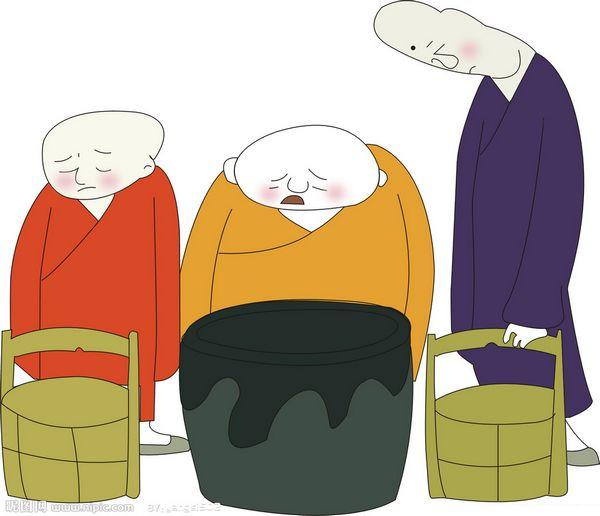
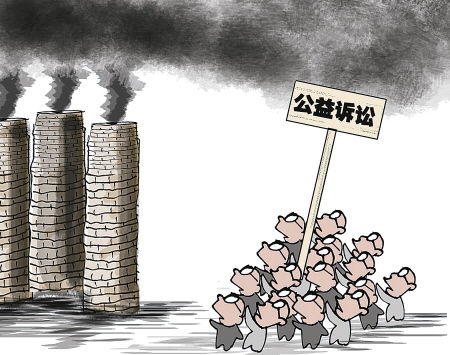
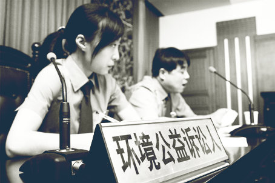

# 七星说法：关于公益诉讼，你知道哪些？

** **

### 为什么需要公益诉讼

小时候听故事，听到“三个和尚”总是疑惑满腹：为什么三个和尚，反而会没有水喝？那么，和尚多了，怎样才能有水喝？直至长大，才发现，原来人人心中有笔大帐，每遇事物，必先分清是自己的还是公家的；自己的便加倍爱惜呵护，公家的便听之任之。于是，公家的东西往往坏得最快，也往往没人愿意打理，最终沦为一堆角落里的破烂，大家都用不成。

——大概扩张自己利益、给自己行方便是所有正常人类的天性。这也就是我们需要公益诉讼的原因。

只要利益联系的紧密性越来越弱、弱到由“私益”变为“公益”，即使公共利益与公众仍然相关，也会陷入无人管理、无人保护的危险境地。于是，尽管最后没水喝的是和尚们自己，他们也大义凛然地不管不顾。喝水这件事涉及生存，触动生命个体的根本利益，逼急了大家也会起来想办法找水喝。用法律术语来说，这样的行为就是救济。为了让受侵害者们有序地救济和维权，人类发明了一个引导和规制公众对公共利益的救济行为的制度，即——公益诉讼。

当然，这个例子只是为了讲清楚“公益会造成悲剧”，与公益诉讼的内涵不太贴切。**因为公益诉讼，作为一种救济方式，必须以公共利益受到外界的不法侵害为前提；**而和尚们没水喝完全是自己偷懒，既不是因为有人往河里撒尿污染水源，也不是因为有人在上游拦坝建库截去水流。

 

### 什么是公益诉讼

这就涉及到一个定义问题：究竟什么叫公益诉讼？

于是我们要讲清楚两个词汇：“公益”，和“诉讼”。诉讼，上文已经说过，是一种针对不法侵害的救济方式，具体操作方式就是去法院打官司告状。假设和尚们没水喝真的是由于受到不法侵害，要去法院维权，他们该告谁呢？连告的对象都没有，从何告起？

这一点看似十分显而易见，却往往容易被公益诉讼的热衷者们忽视。既然能侵害到公共利益，撇开政治问题和伟大领袖不算，这样的侵害者必然很难是明确特定的个人，而往往是某个机构组织、甚至是连结成利益集团的某群机构组织。这种对象被抽象化之后，便容易变成一个模糊泛化的概念，从而淡化了“诉讼”的内涵。**但请牢记：既然是诉讼，就一定要有明确的原告和被告。**

下面该对“公益”进行解释了：“益”即利益，很好理解；那么“公益”呢？何谓“公”？

一般来说，“公”即是“不特定的他人、多人”，“公益”即为“不特定的他人、多人利益”。而在公益诉讼的制度要求中，为了做出区分，梁慧星教授强调其为“没有直接损害”起诉人。这一论调被称为“救济对象狭义说”。

有人会问，既然有狭义，一定有广义吧？广义的公益诉讼制度，就是解决多数人群体争端的救济制度，以多数人的共同利害关系为前提（注1）。在美国，发展并完善为集团诉讼制度体系；在德日，制定出选定当事人制度；而在中国的传统民事诉讼法体系中，也以共同诉讼制度为基础，吸收借鉴出了诉讼代表人制度。

所谓共同诉讼，就是在当事人人数众多，同时利益诉求一致的情况下的一种诉讼方式。诉讼代表人制度与之的异处，就在于狭义的共同诉讼一般是全部当事人可以一起上，而诉讼代表人则是从当事人中选出三五个作为代表。

同样是解决多数人的利益诉求，狭义的公益诉讼其独特之处就在于起诉人“没有直接损害”。这意味着对起诉人条件放宽，起诉人与利益之间的联系较之传统的共同诉讼可以不那么紧密。如何界定这样一种“不紧密”呢？理论界至今未能在于实务界达成一致的基础上解决问题。作为一种新型的（至少在国内）制度，我觉得大家可以这样进行简单的划分：凡对某些社会群体有重大意义，也很有必要，对围观群众或甚至起诉人自己略嫌蛋疼但是高端洋气的，皆属于这样一种“不紧密”。

看当年被《经济日报》成为“中国公益诉讼创始人”的邱建东是何以获此殊荣的吧——1996年，他因为当地电信部门没有执行夜间长途电话半价收费的规定，状告电话局，官司打赢后获得了一块两毛钱的电话费返还——这也被称为我国“公益诉讼第一案”。而今，打开中国公益诉讼网的“2011年中国十大公益诉讼推荐案例”，依然充斥着张女士诉北京移动按分钟计费收费不合法案，刘家辉诉南方航空公司打折票不能退改签案，中华环保联合会诉修文县环保局政府信息公开案，等等等等。

上述划分辨识方法虽然含混不清，但是总算比较便于理解操作。当然，含混不清并非我本意。聪明理智的读者恐怕已经从中揣摩出来其暗含的两个逻辑维度：主观利益标准和客观利益标准。传统诉讼模式下，主要采用主观标准，以当事人的利益为诉求。而公益诉讼之所以“新”，还在于其加入了客观标准：起诉人并非唯一的利益相关方，围观群众社会群体都将随着起诉人一起蛋疼并高端洋气地快乐着。

好了，到这里有必要强调另一个问题：我们在解释法律事项的时候，往往会把“应然”和“实然”掺在一起。这对于那些以挑刺为所能的明眼人当然不存在困难，但是对于诚心求科普的实心眼好孩子来说，未免热闹太多容易昏头。于是本人在这里特此声明：以上对“公益诉讼”的解释基本属于“应然”。包括上文列举的案例，都发生在今年《民事诉讼法》修改之前。而修改后的《民事诉讼法》中，只用了一句话明确建立公益诉讼制度，即第五十五条：**“对污染环境、侵害众多消费者合法权益等损害社会公共利益的行为，法律规定的机关和有关组织可以向人民法院提起诉讼。”**

 

### 谁能提起公益诉讼

实然地说，依据上文法条中的规定，适格的起诉人限于“法律规定的机关和有关组织”，也就是说，新民诉法把个人排除在了起诉主体范围之外。

暂且不论其他，我们可以仰仗的“机关”和“组织”都有哪些？

既然用语如此含糊，先从中国都有哪些“机关”着手吧。党机关、人大机关、审判机关，这些显然都是不合适的。那么行政机关呢？大家不要小看了我们的公仆，尽管可能侵害公共利益最多的就他们，但人家还真发起过公益诉讼。

2010年12月13日，云南嵩明县七里湾大龙潭水质污染环境公益诉讼案在昆明市中级人民法院公开审理，昆明市环保局起诉云南省内当前规模最大的生猪养殖基地对其周边的大龙潭的水质造成了污染，要求停止污染，索赔费用430多万元。不仅环保局亲自披挂上阵当原告，昆明市人民检察院也以支持起诉人身份出庭。

这出戏演得当真热闹好看，社会反响巨大。人人评说“行政机关终于干了自己该干的事”。但是，抛开这件个案，行政机关真的是公益诉讼的理想原告吗？再次提醒大家“实然”与“应然”的差别——“应然”中的行政机关自然是必须以为人民服务为己任的。而“实然”什么样呢？尽管相信各位心知肚明，笔者仍然愿意分享某律师朋友外出办案在当地遇到的真实故事，权当看这篇枯燥科普文中间的一点乐子：

某河流有一条泄洪支流正值枯水期，没多少水量，于是某县政府以其流经自己所辖村落为由，认定其在自己下属地域，归本县国土局管。将该支流其据为县政府所有之后，迅速买给房地产开发商，在原河上盖起了房子。

“机关”这条路，似乎走不通。那么“组织”呢？行业组织，首先就指望不住。三聚氰胺奶粉，原本就属于行业内部的灰色潜规则，奶业协会就由各大奶业巨头组成产生，是要多幼稚的人，才依然相信“灭亲”的娃们都是出于“大义”？

这一点，相比之下消协就做得不错。今年三月份，江苏无锡的消费者协会打赢全国首例消费公益诉讼。三名消协调查者在某家餐饮店消费之后，均被收取每人一元的餐具费，由于饭店未提前告知，并且在三人拒绝使用时明确表示没有其他餐具，根据《消费者权益保护法》第八、九条，三人状告饭店侵犯消费者的“知情权”和“选择权”。别看案子小，而且调解结案，消协总算替广大消费者赢了三块钱。

其他组织，最可期待的大概算是NGO，民诉法的这次修订也算是为夹缝中苟活的NGO送进一缕新鲜空气。然而，除了少数“官办”NGO能够获得注册、取得合法身份之外，大多数“草根”NGO很难获得审批。很多公益组织因此而背负“非法”的标签，亦很难成为公益诉讼的主体。

当然，除了上述之外，还存在着工会、妇联、共青团等团体组织。如果你信赖它们的实际代表能力、利益出发点和工作效率，也不妨一试。

**由此，应该也不难理解，为何“将公民列为公益诉讼的主体”会成为法律人对新民诉所增第55条发出的最大呼声。**公民个人利益原本就与公共利益密不可分，保护公共利益的最终还是为了公民个人。公民比其他机关组织都更加切身地受到侵害，更加有动力发起诉讼，也更有利益诉求。一个号称为了公益的制度，为何却将公民排除在外？

当然，立法者也有其自己的考虑。比如和方舟子一样声名远扬的职业打假人王海，专挑大企业打假，借着这个他就能养家糊口。可是你真的以为这些大企业就会任你打、还边挨打边掉得满地金币吗？除此之外，还有诸如“臭名昭著”的一块二电话费案，三元钱停车费案等案件，难以想象忙得焦头烂额寝食难安的法官们碰到这样的一毛钱官司会做何感想。在立法者眼里，这些都叫做“滥诉”。我不知道我们的人大代表都代表哪类人，可以肯定的是不会是这样的“滥诉”者。

 

### 公益诉讼的范围

究竟什么样的案件能归为“公益诉讼”？从上文举出的例子可以看出，在民诉法修订、将公益诉讼明文写就之前，其不仅包括环境污染、消费者权益等等民事案件，更有诉求政府信息公开等行政案件，而且绝对不在少数。这应该不难理解——在中国特色社会主义的国情下，能够侵害公众利益的，除了一些垄断或疑似垄断的大企业大集团，恐怕只有我们可爱可畏的公仆管家难以克制伸得太长的手臂了。

也就是说，应然的公益诉讼既包括民事公益诉讼，也包括行政公益诉讼。如美国的集团诉讼制度，即是如此。但由于目前我国行政法并未涉及公益诉讼方面，所以行政公益诉讼形式在国内尚未被立法者所承认。

不知是否会有人问：为什么应然的公益诉讼包括民事行政，却不包括刑事？这里权作解答：首先，从公益诉讼的出发点上讲，其要旨首先在于停止侵害、弥补损失，意欲保护、恢复受损的公共利益。而刑事更加侧重惩罚；其次，从被诉对象上讲，刑事制裁主要针对的是自然人犯罪，而公益诉讼的被诉对象往往是企业或机关，上文已经提到，个人很难对公共利益造成侵害。

以上解释了公益诉讼的案件形式。至于案件内容，随着诉讼资格的放宽，不仅要视“公益”而定，而且还有理论认为提起公益诉讼的范围不能仅限于公共利益的受损。公益诉讼制度，这个满含时代感的制度，也与时俱进地包含了各种充斥大众视线的案件内容：诉强制拆迁，网络侵权，食品药品安全，高速公路收费，银行项目收费，就业招生歧视等等。细心的读者会发现，有些已经不止是行政案件，而涉及到立法者们不敢染指的违宪审查了。

应然永远只是一种理想状态。我国实然的公益诉讼制度建设虽然语句短小，却是煞费苦心，采用了列举的方式圈定了案件的范围：“污染环境、侵害众多消费者合法权益等”。（题外扯一句：关于“等”这一字的用法，大多数人都存在误解。其实它不仅能用于开区间，也可以用于闭区间。详情请自己查阅权威字典。）可见，为了防止“滥诉”，也为了防止波及更多的机关和利益团体，立法者也算是挖空了心思。这一招如同给孙悟空安排的唐僧，偏不让你舒服取经，不老实就紧箍咒念死你。总之一句话：BEHAVE YOURSELF!

 

### 结语

作为一个群体性纠纷解决制度，公益诉讼在国内实践中会遇到种种困难，几乎完全可以预见的：首先，集体行动的最大危机可能要归于成员的“搭便车”：每个和尚都想喝水但是每个和尚都懒得动，于是都倾向于坐享其成；其次，侵害方既然有胆子侵害公共利益，必然是“上头有人”，即使有“公益诉讼”这样的制度存在，如此规模的利益共同体也相当难以击破，何况司法体制原本就是一个薄弱环节，宪法明文的“司法独立”等美好词汇也不过是纸上一个油光发亮的大饼。而对于这个限制好条条框框的中国特色的新生制度，我更愿意采取观望的态度：但愿这张连芝麻粒都不愿多画几粒的油饼，并非仅能让人望梅止渴，望峰息心而已。

 

### 【深入阅读】

 ·中国公益诉讼网 www.pli.org.cn ·韩志红、阮大强，新型诉讼——经济公益诉讼的理论与实践，法律出版社，1999年。 ·颜运秋，公益诉讼理念研究，中国检察出版，2002年。 ·徐卉，通向社会正义之路：公益诉讼理论研究，法律出版社，2009年。 ·陈阳，检察机关环境公益诉讼原告资格及其限制，山东人民出版社，2009年。 ·徐祥民、胡中华、梅宏，环境公益诉讼研究——以制度建设为中心，中国法制出版社，2009年。 ·黄家亮，通过集团诉讼的环境维权：多重困境与行动逻辑，《中国乡村研究》第六辑 ·林莉红、马立群，作为客观诉讼的行政公益诉讼，《行政法学研究》，2011年第4期  

### 【注】

 1.（日）谷口安平，程序的正义与诉讼，王亚新 刘荣军 译，第138页，中国政法大学出版社，1996年版。  

（编辑：王卜玄，陈蓉）

 
